# Modelo entidad–relación — Persistencia de Torres

Modelo definitivo, derivado de `Documento-Base-Consolidada-Torres.md` y de las descripciones
de casos de uso, e implementado en [`schema.sql`](schema.sql).

**La justificación de cada entidad, cada relación y cada restricción está en
`Analisis-Base-de-Datos-Torres.md`**, en la raíz del proyecto. Este documento es el diagrama; aquel
es el porqué. El mismo modelo en PlantUML: [`Modelo-BD-Torres.puml`](Modelo-BD-Torres.puml).

**Diez entidades**, una vista derivada y **cinco catálogos** de parámetros de reglas.

> **Cómo verlo en Rider.** Este archivo se lee con la vista previa de Markdown (requiere
> el plugin *Mermaid*). Para el diagrama ER nativo, con notación de pata de gallo y
> navegación por claves, sigue el apartado 6.

---

## 1. Diagrama

```mermaid
erDiagram
    PLAYER ||--o{ FRIENDSHIP        : "solicita o recibe"
    PLAYER ||--o{ ROOM_INVITATION   : "envía o recibe"
    ROOM    ||--o{ ROOM_INVITATION   : "se comparte mediante"
    ROOM    ||--o{ MATCH             : "alberga"
    MATCH   ||--o{ MATCH_PARTICIPANT : "se compone de"
    PLAYER ||--o{ MATCH_PARTICIPANT : "juega en"
    MATCH   ||--o| MATCH_STATE       : "mientras está en curso"
    PLAYER ||--o| PASSWORD_RECOVERY : "pide recuperar"
    PLAYER ||--o{ REPORT            : "reporta o es reportada"
    ROOM    ||--o{ REPORT            : "donde se dijo"
    MATCH   ||--o{ REPORT            : "durante"
    PLAYER ||--o{ SANCTION          : "acumula"
    SANCTION_LEVEL ||--o{ SANCTION   : "fija la duración de"

    PLAYER {
        integer     player_id        PK "identidad persistente"
        varchar_20  username         UK "único sin distinguir mayúsculas"
        varchar_254 email            UK "recuperación de acceso e invitaciones"
        varchar_255 password_hash       "BCrypt, sal incluida"
        varchar_255 avatar_reference    "dónde guardó el servidor la imagen"
        timestamptz created_at
    }

    FRIENDSHIP {
        integer     requester_id PK "FK a PLAYER, quien solicita"
        integer     addressee_id PK "FK a PLAYER, quien responde"
        varchar_8   status          "pending | accepted"
        timestamptz requested_at
        timestamptz responded_at    "vacío mientras está pendiente"
    }

    ROOM {
        integer     room_id    PK
        varchar_4   code          "4 alfanuméricos sin confundibles, único entre salas abiertas"
        varchar_8   visibility    "public | private, solo decide si sale en el listado"
        timestamptz created_at
        timestamptz closed_at     "vacío mientras la sala está abierta"
    }

    ROOM_INVITATION {
        integer     room_id            PK "FK a ROOM, muere con la sala"
        integer     inviter_player_id  FK
        integer     invited_player_id  PK "FK a PLAYER, siempre una cuenta"
        varchar_8   channel               "email | in_game; el correo lleva el código de la sala"
        timestamptz created_at
    }

    MATCH {
        integer     match_id     PK
        integer     room_id      FK "toda partida nace en una sala"
        varchar_12  status          "in_progress | finished"
        smallint    player_count    "cuántos jugaron, 2 a 4"
        timestamptz started_at
        timestamptz finished_at     "vacío mientras está en curso"
        varchar_12  end_reason      "completed | abandoned | interrupted"
    }

    MATCH_PARTICIPANT {
        integer  match_id       PK "FK a MATCH"
        smallint seat_number    PK "identificador del jugador dentro de la partida"
        integer  player_id     FK "obligatorio: los invitados no dejan fila"
        integer  final_score       "vacío hasta que termina"
        smallint final_position    "1 = ganador; vacío hasta que termina"
        boolean  was_withdrawn     "retirado por no reconectar"
    }

    MATCH_STATE {
        integer     match_id           PK "FK a MATCH"
        smallint    round_number          "ronda que va a jugarse"
        smallint    turn_number
        smallint    active_seat_number    "a quién le toca"
        jsonb       state_document        "tablero, piezas, cartas, puntuación, invitados"
        timestamptz saved_at              "último cierre de turno"
    }
```



Los tres catálogos de parámetros de reglas —`TURN_LAYOUT`, `BUILD_ALLOWANCE` y
`ACTION_COST`— no se dibujan junto a los anteriores porque no se relacionan con ninguna
entidad: son tablas de solo lectura que la capa de servicios consulta al iniciar una
partida.

```mermaid
erDiagram
    TURN_LAYOUT ||--|{ BUILD_ALLOWANCE : "detalla"

    TURN_LAYOUT {
        smallint player_count PK
        smallint round_number PK
        smallint turn_count      "reglas 1.3"
    }
    BUILD_ALLOWANCE {
        smallint player_count   PK
        smallint round_number   PK
        smallint turn_number    PK
        smallint building_count    "reglas 1.3"
    }
    ACTION_COST {
        varchar_32 action_code       PK
        smallint   action_point_cost    "reglas 3.2"
    }

    PASSWORD_RECOVERY {
        integer     player_id PK "FK a PLAYER, una sola vigente por cuenta"
        varchar_16  code          "enviado al correo; nunca se registra"
        timestamptz created_at    "vale 5 minutos desde aquí"
    }

    REPORT {
        integer      report_id           PK
        integer      reporter_player_id FK "solo reportan las cuentas"
        integer      reported_player_id FK "solo se reporta a cuentas"
        integer      room_id             FK "dónde se dijo"
        integer      match_id            FK "vacío si fue en la sala fuera de partida"
        varchar_200  reported_text          "copia del mensaje: el chat no se guarda"
        timestamptz  created_at
    }

    SANCTION {
        integer     sanction_id     PK
        integer     player_id      FK
        smallint    level           FK "1 a 3; vacío si es permanente"
        boolean     is_permanent       "el cuarto cruce del umbral"
        timestamptz threshold_at       "cuándo se alcanzó la quinta ocasión"
        timestamptz effective_from     "cuándo entra en vigor y empieza a contar"
        timestamptz effective_until    "vacío si es permanente"
    }

    SANCTION_LEVEL {
        smallint level        PK "1, 2 y 3"
        interval ban_duration    "5 horas, 1 día, 3 días"
    }

    SYSTEM_PARAMETER {
        varchar_48 parameter_code  PK
        varchar_32 parameter_value    "umbrales, límites y plazos"
    }
```



---

## 2. Las entidades

| Entidad | Qué representa | Permanencia |
|---|---|---|
| `player` | Identidad del jugador. Incluye el perfil: username y avatar | Permanente |
| `friendship` | Solicitud o amistad entre dos cuentas | Pendiente → temporal · aceptada → permanente |
| `room` | Sala donde se reúnen los jugadores. Se cierra, no se borra | Permanente mínima |
| `room_invitation` | Invitación **pendiente** a una sala, por correo o dentro del juego | Temporal |
| `match` | Partida, en curso o archivada | Permanente al terminar |
| `match_participant` | Un jugador **con cuenta** dentro de una partida, con su resultado | Permanente |
| `match_state` | Estado vivo de una partida en curso, para reanudarla tras una caída. Guarda también el alias y el **pase de asiento** de cada invitado | Temporal |
| `password_recovery` | Código de un solo uso enviado al correo. **Caduca a los 5 minutos** | Temporal |
| `report` | Mensaje ofensivo reportado, con **copia del texto** porque el chat no se guarda | Permanente hasta que se borre una de las dos cuentas |
| `sanction` | Prohibición sobre una cuenta, temporal o permanente. **Automática por umbral** | Permanente hasta que se borre la cuenta |
| `player_ranking` | Vista: ranking global. No almacena nada | Derivada |

---

## 3. Cardinalidades

| Relación | Cardinalidad | Lectura |
|---|---|---|
| `PLAYER` — `FRIENDSHIP` | 1 : 0..N (dos veces) | Una cuenta aparece como solicitante y como destinataria. La pareja invertida es la misma pareja |
| `PLAYER` — `ROOM_INVITATION` | 1 : 0..N (dos veces) | Como quien invita y como invitada. Nunca se invita a quien no tiene cuenta |
| `ROOM` — `ROOM_INVITATION` | 1 : 0..N | Ninguna invitación sobrevive a su sala |
| `ROOM` — `MATCH` | 1 : 0..N | Una sala juega varias partidas; toda partida tiene sala |
| `MATCH` — `MATCH_PARTICIPANT` | 1 : 0..4 | Jugaron entre 2 y 4, pero solo los que tienen cuenta dejan fila |
| `PLAYER` — `MATCH_PARTICIPANT` | 1 : 0..N | Una cuenta ocupa un solo puesto por partida |
| `MATCH` — `MATCH_STATE` | 1 : 0..1 | Existe solo mientras la partida está en curso |
| `TURN_LAYOUT` — `BUILD_ALLOWANCE` | 1 : 1..N | Una fila de construcciones por turno de esa ronda. **Las construcciones se reciben por turno**, no al cerrar la ronda |
| `PLAYER` — `PASSWORD_RECOVERY` | 1 : 0..1 | Un solo código vigente por cuenta; se borra al usarse |
| `PLAYER` — `REPORT` | 1 : 0..N (dos veces) | Como quien reporta y como reportada. **Nunca alcanza a un invitado** |
| `ROOM` — `REPORT` · `MATCH` — `REPORT` | 1 : 0..N | La sala es obligatoria y la partida no: la pareja identifica la **ocasión**, que es lo que se acumula |
| `PLAYER` — `SANCTION` | 1 : 0..N | Las prohibiciones previas se cuentan sobre estas filas; el contador no se guarda |
| `SANCTION_LEVEL` — `SANCTION` | 1 : 0..N | La permanente no tiene nivel: no tiene duración |

`MATCH_PARTICIPANT` es una **entidad asociativa débil**: no existe fuera de una partida y
su clave primaria la incluye. `MATCH_STATE` es una **extensión opcional** de la partida:
comparte su clave y desaparece cuando la partida termina.

---

## 4. Lo que no está en el diagrama, y por qué

| Ausente | Motivo |
|---|---|
| **Invitados** | De un invitado no se guarda nada. Existe dentro de `state_document` mientras la partida se juega, y desaparece con ella |
| **Miembros de la sala y anfitrión** | Un invitado puede ser miembro y anfitrión, así que la tabla nunca sabría si la sala está vacía, que es la condición que decide si la sala sigue existiendo. Vive en memoria del servidor |
| **Ranking de la sala** | Incluye a los invitados, que no existen en ninguna tabla, y muere con la sala. Lo mantiene el servidor en memoria |
| **Secuencia de jugadas** | Nadie la consume: reanudar necesita el estado, no la historia |
| **Sesiones y tokens de sesión** | El estándar prohíbe incluso registrarlos |
| **Desglose de puntos por ronda** | El historial muestra puesto y puntos, nada más |
| **Los mensajes de chat** | Viven en memoria, en ventana deslizante de 200 por sala, y mueren con la sala. De un mensaje reportado solo sobrevive la copia que guarda `report` |
| **El contador de ocasiones y el de prohibiciones** | Se cuentan sobre `report` y sobre `sanction`; guardarlos sería duplicar el dato |

---

## 5. Consultas que el modelo debe responder

**Historial de un jugador** — fecha, cuántos jugaron, puesto y puntos:

```sql
SELECT m.finished_at, m.player_count, m.end_reason, p.final_position, p.final_score
FROM torres.match_participant p
         JOIN torres.match m ON m.match_id = p.match_id
WHERE p.player_id = @playerId
  AND m.status = 'finished'
ORDER BY m.finished_at DESC;
```

**Ranking global**, ordenado por partidas ganadas:

```sql
SELECT * FROM torres.player_ranking
ORDER BY wins DESC, total_score DESC, matches_played ASC
LIMIT 50;
```

**Partidas por reanudar tras un reinicio**, con su estado y quién jugaba:

```sql
SELECT m.match_id, s.round_number, s.turn_number, s.active_seat_number, s.state_document
FROM torres.match m
         JOIN torres.match_state s ON s.match_id = m.match_id
WHERE m.status = 'in_progress';
```

**Invitaciones que esperan a un jugador**, incluidas las recibidas mientras estaba
desconectado:

```sql
SELECT r.code, i.channel, i.inviter_player_id
FROM torres.room_invitation i
         JOIN torres.room r ON r.room_id = i.room_id
WHERE i.invited_player_id = @playerId
  AND r.closed_at IS NULL;
```

**Amigos de un jugador** — la amistad se guarda una sola vez, así que se mira en los dos
sentidos:

```sql
SELECT CASE WHEN f.requester_id = @playerId THEN f.addressee_id ELSE f.requester_id END AS friend_id
FROM torres.friendship f
WHERE f.status = 'accepted'
  AND @playerId IN (f.requester_id, f.addressee_id);
```

---

## 6. Diagrama ER nativo de Rider

Sin necesidad de una base de datos en ejecución:

1. `View → Tool Windows → Database`.
2. Botón **+** → `Data Source` → **DDL Data Source**.
3. Nombre: `Torres`. Dialecto SQL: **PostgreSQL**.
4. En *DDL Files*, botón **+**, selecciona `code/database/schema.sql`. Aceptar.
5. En el árbol, despliega `Torres → schemas → torres`, clic derecho sobre el esquema →
   `Diagrams → Show Visualisation…` (`Ctrl+Alt+Shift+U`, en macOS `⌥⇧⌘U`).

El diagrama se abre en una pestaña y se exporta con clic derecho →
`Export Diagram → Export to File`.

Con una base real: crea la base, conéctala como *Data Source* normal, ejecuta los dos
scripts y usa el mismo atajo sobre el esquema `torres`.

> Las herramientas de base de datos vienen incluidas en Rider. Si el botón `Database` no
> aparece, actívalas en `Settings → Plugins → Database Tools and SQL`.

---

## 7. Ejecución

```bash
psql -U postgres -d torres -f code/database/schema.sql
```

```bash
psql -U postgres -d torres -f code/database/seed-configuration.sql
```

`schema.sql` empieza con `DROP SCHEMA IF EXISTS torres CASCADE`: al ejecutarlo se borra y
se vuelve a crear todo el esquema.

Ambos scripts se han ejecutado sobre PostgreSQL 18 y cargan sin errores. Se han probado
además las veinte restricciones provocando su violación, y el borrado en cascada de una
cuenta.
