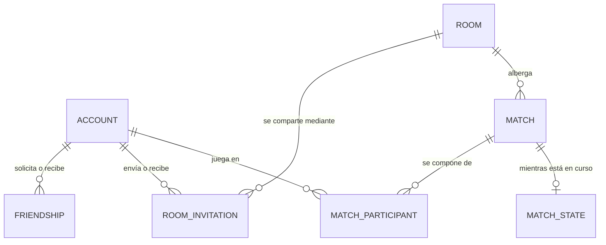

# Análisis de persistencia — Juego de Torres

**Versión 4** — integra la segunda ronda de respuestas del equipo (P-11, P-12, P-37 a
P-46). Sustituye a las versiones anteriores; el apartado 0 resume qué cambia.

Con estas respuestas **el modelo queda cerrado**: siete entidades, ninguna cuestión
pendiente que afecte a qué se guarda. Lo que queda abierto son ratificaciones y
decisiones de consulta o de configuración, listadas en §10.

**Fuentes:**
- **R** — `Reglas_del_Juego_de_Torres.docx` v3.0 · **E** — `Estandar-de-codificacion-v7.docx`
- **C** — contexto previo, en `Analisis-Stakeholders-Concerns-Torres.md`
- **N1/N2** — requisitos de las fases 1 y 2 · **N3/N4** — respuestas del equipo, primera
  y segunda ronda

| Marca | Significado |
|---|---|
| `[R x]` `[E x]` `[C]` | Reglas · estándar · contexto previo |
| `[N1]`…`[N4]` | Requisito o respuesta del equipo, por ronda |
| `[DECISIÓN]` | Elección de diseño, con justificación y coste |
| `[PROPUESTA]` | Falta una regla y se propone una, a ratificar por el equipo |
| `[PENDIENTE]` | Falta información. Se señala, no se inventa |

---

## 0. Qué cambia respecto a la versión 3

### Una respuesta corrige a otra anterior

**P-40** `[N4]`: «ambos rankings contemplan partidas con invitados; los invitados no
pueden aparecer en el ranking global».

Esto **corrige la lectura de P-08** que sostenía la versión 3. Allí se entendió que una
partida jugada con invitados no contaba para el ranking. Ahora queda claro que sí cuenta
para los jugadores con cuenta, y que lo único que no existe en el ranking es el invitado,
porque de él no se guarda nada.

**Consecuencia:** desaparece el atributo *hubo invitados* de la partida, que solo existía
para excluirla del ranking. La versión 3 lo justificaba con cuidado; ya no hace falta y
se retira. **Sí se conserva el número de jugadores**, por el otro motivo que lo
justificaba: los invitados no dejan fila y una cuenta borrada se lleva la suya, así que
contar participaciones ya no dice cuántos jugaron.

### Respuestas que confirman decisiones ya tomadas

| Respuesta | Confirma |
|---|---|
| **P-41** — un invitado puede crear una sala y ser anfitrión | **D-26**: ni los miembros ni el anfitrión pueden guardarse. Si el anfitrión puede ser un invitado, una columna que apuntara a una cuenta estaría vacía la mitad de las veces |
| **P-39** — la invitación vive mientras viva la sala | **D-24**: la invitación no necesita columna de caducidad; muere con la sala |
| **P-42** — no se puede borrar una cuenta que está en una partida en curso | Acota **D-28**: el borrado en cascada sigue, pero la operación lo rechaza mientras haya una partida en curso |
| **P-37** — se acepta el motivo de fin *interrumpida* | Deja de ser propuesta y pasa a decisión |

### Respuestas nuevas ya integradas

P-43 (avatar: archivo en el servidor, 5 MB, PNG y JPG, la base solo guarda la
referencia), P-44 (el ranking de sala se ordena por puntos), P-11 (parámetros de reglas,
explicados en el **anexo A**), P-12 (rol de administración, analizado en el **anexo B**),
P-46 (factor de coste de BCrypt, explicado en §3.1) y P-38 (propuesta de reconexión de
invitados en §6.5).

---

## 1. Trazabilidad de los requisitos

| # | Requisito | Qué obliga a conservar | Dónde vive |
|---|---|---|---|
| 1 | Cuentas `[N1]` | Username, correo, credencial, referencia del avatar | Permanente |
| 2 | Historial por jugador `[N1]` `[N3 P-05]` | De cada partida terminada: puesto y puntos obtenidos | Permanente |
| 3 | Ranking global `[N1]` `[N3 P-01]` | Nada propio: se cuenta sobre las partidas ganadas | Derivado |
| 4 y 5 | Salas y entrada por código `[N2]` | Identidad de la sala y código único entre las abiertas | Permanente mínima |
| 6 | Invitación por correo con enlace único `[N2]` `[N3 P-20, P-22]` | La invitación pendiente y su enlace, siempre a una cuenta | Temporal |
| 7 | La sala sobrevive al creador; muere vacía `[N2]` `[N3 P-36, P-41]` | Nada: miembros y anfitrión son estado del servidor | Memoria |
| 8 | Amigos `[N2]` `[N3 P-15, P-16]` | Amistad aceptada y solicitud pendiente | Permanente |
| 9 | Invitar a un amigo `[N2]` `[N3 P-21]` | La invitación pendiente, aunque el amigo esté desconectado | Temporal |
| 10 | Perfil con avatar `[N2]` `[N3 P-13, P-14, P-43]` | Username único y referencia al archivo | Permanente |
| 11 | Ranking de sala `[N2]` `[N3 P-23, P-24, P-40, P-44]` | Nada: incluye invitados y muere con la sala | Memoria |
| 12 | Reconexión tras caída `[N2]` `[N3 P-27…P-32]` | El estado de la partida al cerrar el último turno | Temporal |

---

## 2. Clasificación de la información

**Permanente.** Cuenta (username, correo, hash, referencia del avatar), amistades, salas
(identidad, código y fechas), partidas terminadas y la participación de cada jugador con
cuenta.

**Temporal en la base de datos.** Invitaciones pendientes —mueren con la sala o al
responderse—, solicitudes de amistad pendientes, y el estado de la partida en curso, que
se elimina al terminar la partida.

**En memoria del servidor, nunca en la base de datos.**

| Información | Por qué |
|---|---|
| Quién está dentro de cada sala | Incluye invitados, de los que no se guarda nada `[N3 P-08]`; y las salas no se reanudan tras una caída `[N3 P-32]` |
| Quién es el anfitrión | Se hereda al salir el anterior `[N3 P-36]` y **puede ser un invitado** `[N4 P-41]` |
| **El ranking de la sala** | Incluye a los invitados `[N4 P-40]`, que no existen en la base de datos, y muere con la sala `[N3 P-24]` |
| Estado de conexión, reloj del turno, puntos de acción restantes | El estado guardado es siempre una frontera de turno `[N3 P-27, P-28]` |

**Derivado, se calcula.** Ranking global, número de jugadores de una sala, duración de
una partida.

**No se guarda en absoluto.** Secuencia de jugadas, sesiones y tokens `[E 9.4]`, desglose
de puntos por ronda —el historial muestra puesto y puntos `[N3 P-05]`—, chat,
espectadores, logros, temporadas, bloqueos.

---

## 3. Entidades permanentes

### 3.1 `Cuenta`

Absorbe el perfil `[DECISIÓN D-22]`: el perfil es username y avatar `[N3 P-13]`, y el
username ya vivía aquí porque es la credencial y el único criterio de búsqueda de
jugadores `[N3 P-16]`.

| Atributo | Comentario |
|---|---|
| Identificador | Clave interna; la única que puede aparecer en el registro `[E 9.4]` |
| Username | Único, sin distinguir mayúsculas. Credencial, nombre visible y criterio de búsqueda |
| Correo | Único. Recuperación de acceso y destino de las invitaciones |
| Hash de la contraseña | Ver recuadro |
| Referencia del avatar | Vacía mientras no suba ninguno |
| Fecha de alta | |

**El avatar** `[N4 P-43]`: el archivo lo guarda **el servidor**, con un máximo de 5 MB y
en PNG o JPG; **la base de datos guarda solo la referencia** al lugar donde el servidor
lo dejó. Consecuencias:

- La base de datos **no crece** con las imágenes; crece el disco del servidor.
- El límite de 5 MB y los formatos admitidos se validan **antes** de guardar el archivo,
  en la capa de servicios. No son restricciones de la base de datos, que solo ve una
  cadena de texto.
- **Borrar la cuenta no borra el archivo.** La base de datos no puede tocar el disco: la
  misma operación que borra la cuenta debe borrar la imagen (§7.5).
- Si el archivo desaparece del disco, la referencia queda apuntando a nada. La aplicación
  debe tolerarlo mostrando el avatar por defecto; no es un fallo de integridad que el
  motor pueda evitar.

> **P-04 y P-46 · La contraseña, y qué es el «factor de coste»** `[N3 P-04]` `[N4 P-46]`
>
> **BCrypt** convierte la contraseña en una cadena de la que no se puede volver atrás.
> Al iniciar sesión no se compara la contraseña con nada: se vuelve a calcular y se
> comprueba que coincida. En C# se usa el paquete **`BCrypt.Net-Next`** de NuGet, con
> `HashPassword` y `Verify`.
>
> **El factor de coste** —lo que preguntabas— es **cuántas veces repite BCrypt su
> cálculo**, expresado como potencia de dos: coste 10 son 1024 repeticiones, coste 11 son
> 2048, coste 12 son 4096. Cada punto **duplica** el tiempo. Sirve para que verificar una
> contraseña sea deliberadamente lento: al jugador le cuesta una fracción de segundo que
> no nota, y a quien robara la base de datos e intentara adivinar contraseñas a la fuerza
> le multiplica el trabajo por millones.
>
> **Recomendación: coste 11**, y que sea un valor de configuración, no una constante en
> el código. El coste queda escrito **dentro del propio hash**, así que subirlo más
> adelante no invalida las contraseñas ya guardadas: las viejas se siguen verificando con
> el coste con el que se crearon.
>
> Para la base de datos nada de esto importa: es **una columna de texto**. La sal va
> dentro del hash, así que no hay columna de sal; el resultado ocupa 60 caracteres, y
> conviene declarar la columna más ancha (255) por si algún día se cambia de algoritmo.
> Un detalle a validar en el registro: **BCrypt ignora lo que exceda de 72 bytes** de
> contraseña.

### 3.2 `Amistad`

Una fila por pareja, con dirección mientras está pendiente y estado *pendiente* o
*aceptada*. La solicitud **rechazada se borra** y **no existe el bloqueo** `[N3 P-15]`.
La búsqueda para agregar es **solo por username** `[N3 P-16]`, que ya es único.

Restricciones: la pareja invertida es la misma pareja —no pueden coexistir A→B y B→A— y
nadie es amigo de sí mismo.

### 3.3 `Sala`

`[DECISIÓN D-23]` — **la sala vacía se cierra, no se borra**. Se guarda lo mínimo:
identificador, código, creación y cierre.

El razonamiento sale de las respuestas: toda partida nace en una sala `[N3 P-17]`, así
que la partida guarda a qué sala pertenece; si la fila se borrara al quedar vacía, ese
vínculo apuntaría a algo inexistente. Cerrarla cumple lo que el requisito pide de verdad
—deja de admitir jugadores y **su código queda libre**— y, como el ranking de sala no
sobrevive al cierre `[N3 P-24]`, la sala cerrada no presta más servicio que ser la
referencia de sus partidas.

**No guarda miembros, ni anfitrión, ni creador.** `[N4 P-41]` lo confirma: si un invitado
puede crear la sala y ser anfitrión, una columna que apuntara a una cuenta estaría vacía
siempre que el anfitrión fuera un invitado. El anfitrión, además, cambia al salir el
anterior `[N3 P-36]`: es estado del servidor, no un hecho archivable.

**El código es único solo entre las salas abiertas**, para que pueda ser corto y
reutilizarse.

`[PROPUESTA]` — **al arrancar el servidor se cierran todas las salas que quedaran
abiertas**. Se sigue de que las salas no se reanudan `[N3 P-32]`: sin ese cierre, cada
caída dejaría salas abiertas para siempre, con su código ocupado y sin nadie dentro.

### 3.4 `Invitación a sala`

Una sola entidad para los dos canales `[DECISIÓN D-19]`, y muy simple gracias a las
respuestas:

- **Siempre va dirigida a una cuenta** `[N3 P-22]`: no se puede invitar a quien no la
  tiene. Así el sistema nunca guarda el correo de alguien ajeno `[C, CON-06]`.
- **Existe solo mientras está pendiente** `[DECISIÓN D-24]`: se borra al aceptarse, al
  rechazarse o al cerrarse la sala. Eso es lo que hace que **el enlace del correo sirva
  una sola vez**.
- **No tiene fecha de caducidad** `[N4 P-39]`: vive mientras viva la sala, y la sala se
  cierra cuando se queda vacía o cuando arranca el servidor.

Atributos: sala, quién invita, a quién se invita, canal (correo o dentro del juego),
enlace único —solo para el canal correo `[N3 P-20]`, único en todo el sistema— y fecha de
creación.

Una invitación a un amigo desconectado **se conserva hasta que entre** `[N3 P-21]`: por
eso está en la base de datos y no en memoria.

### 3.5 `Partida`

| Atributo | Comentario |
|---|---|
| Identificador | |
| Sala | Obligatorio `[N3 P-17]` |
| Estado | *en curso* / *terminada* |
| Número de jugadores | Cuántos jugaron, de 2 a 4 `[R 1.1]`. Ver D-25 |
| Inicio | |
| Fin | Vacío mientras está en curso |
| Motivo de fin | *completada* · *abandonada* `[C]` · *interrumpida* `[N4 P-37]` |

`[DECISIÓN D-25, ajustada]` — **la partida guarda cuántos jugaron**, aunque la versión 1
lo rechazara por deducible. Ya no lo es: los invitados no dejan fila `[N3 P-08]` y una
cuenta borrada se lleva la suya `[N3 P-02]`, así que contar participaciones no dice
cuántos había en la mesa. El historial lo necesita para decir contra cuántos se jugó.

*Lo que se retira respecto a la versión 3:* la marca **hubo invitados**. Existía para
excluir la partida del ranking, y `[N4 P-40]` establece que no debe excluirse.

### 3.6 `Participación`

Un jugador **con cuenta** dentro de una partida. Los invitados no generan fila
`[N3 P-08]`.

| Atributo | Comentario |
|---|---|
| Partida y puesto en la mesa | Clave. El puesto es el identificador del jugador dentro de la partida `[C, TEN-A]` |
| Cuenta | Obligatoria |
| Puntuación final | Vacía hasta que la partida termina |
| Puesto final | Vacío hasta que termina. Es lo que muestra el historial `[N3 P-05]` |
| Retirado | Se marca durante la partida `[R 5.2]`; sigue contando para el ranking `[N3 P-07]` |

Los puestos guardados pueden tener huecos: si ganó un invitado, ninguna fila tendrá el
puesto 1. Es consecuencia directa de no guardar nada de los invitados y no rompe nada.

---

## 4. Lo temporal y lo que vive en memoria

### 4.1 `Estado de la partida en curso`

Una fila por partida en curso, escrita **al cerrar cada turno** `[N3 P-27]` y eliminada
cuando la partida termina.

| Atributo | Comentario |
|---|---|
| Partida | Clave: una sola fila por partida |
| Ronda y turno | El que va a empezar |
| A quién le toca | Puesto de mesa |
| Estado del tablero | Documento serializado (ver abajo) |
| Guardado en | Momento de la última escritura |

El **documento** contiene: torres y castillos, caballeros, rey, cartas obtenidas y usadas
por cada jugador, puntuación acumulada, y los puestos de mesa con el alias de los
invitados que están jugando —dato temporal que muere con la partida, así que no
contradice que de los invitados no se guarde nada `[N3 P-08]`—.

`[DECISIÓN D-20]` — lo que se consulta va en columnas (qué partidas quedaron en curso, en
qué ronda, a quién le tocaba) y el tablero va serializado, porque solo el servidor lo lee
y lo lee entero. Siguen abiertas las preguntas de reglas que impedirían normalizarlo sin
inventar: altura máxima de torre, permanencia de las piezas entre rondas, entrada inicial
de los caballeros y alcance de la carta 7.

**Gracias a P-27 y P-28 no hace falta guardar** puntos de acción restantes,
construcciones pendientes ni tiempo consumido: el estado guardado es siempre una frontera
de turno y, al reanudar, el turno empieza con 90 s completos `[N3 P-28]` y con los puntos
de acción que la regla asigna al empezar `[R 3.1]`.

**Consecuencia a comunicar al jugador:** el turno interrumpido **se descarta entero**,
incluidas las cartas obtenidas o usadas en él. Al volver, se juega de nuevo desde cero.

`[PROPUESTA]` — **el estado se escribe también al empezar la partida.** Sin esa primera
escritura, una caída durante el primer turno dejaría una partida en curso sin nada que
reanudar.

### 4.2 Lo que se queda en memoria del servidor

`[DECISIÓN D-26]` — **la pertenencia a las salas, el anfitrión y el ranking de la sala no
se persisten.** Las tres se apoyan en lo mismo:

- Un invitado puede estar en una sala, crearla y ser su anfitrión `[N3 P-19]` `[N4 P-41]`,
  y de él no se guarda nada `[N3 P-08]`. Una tabla de miembros solo contendría a los que
  tienen cuenta, y **nunca sabría si la sala está vacía**, que es la condición que decide
  si la sala sigue existiendo `[N2]`.
- El ranking de la sala **incluye a los invitados** `[N4 P-40]` y **muere con la sala**
  `[N3 P-24]`. No hay nada que archivar: el servidor lo va acumulando con cada partida que
  termina en esa sala, y lo descarta al cerrarla.
- Nada de esto tiene que sobrevivir a un reinicio, porque las salas no se reanudan
  `[N3 P-32]`.

Con ellos se quedan en memoria las reglas de sala: máximo de cuatro jugadores
`[N3 P-34]`, una sala por jugador `[N3 P-33]`, y no se puede salir de la sala mientras se
juega `[N3 P-35]`.

*Coste:* estas reglas no las garantiza el motor, sino el servidor, que es su único dueño.
*Ganancia:* no se guarda información que sería incompleta y con la que no se podría
decidir nada.

---

## 5. Los rankings

### 5.1 Ranking global

**Se ordena por partidas ganadas** `[N3 P-01]`. Entran **todas las partidas terminadas
con resultado**, incluidas las jugadas con invitados `[N4 P-40]` y aquellas en las que el
jugador fue retirado `[N3 P-07]`. Quedan fuera las partidas *interrumpidas*, que no
tienen resultado, y los invitados, que no existen en la base de datos.

`[PROPUESTA]` — para los empates en victorias: más puntos acumulados y, si persiste,
menos partidas jugadas. Sin un segundo criterio el orden entre iguales cambia de una
consulta a otra. Afecta solo a la consulta.

### 5.2 Ranking de sala

**Se ordena por puntos totales** `[N4 P-44]` y muestra también las victorias `[N3 P-23]`.
**Incluye a los invitados** `[N4 P-40]` y **desaparece al cerrarse la sala** `[N3 P-24]`.

`[DECISIÓN D-29]` — **lo calcula y lo mantiene el servidor en memoria**, no la base de
datos. No es una preferencia: los invitados forman parte de este ranking y no existen en
ninguna tabla, de modo que ninguna consulta podría producirlo completo. El servidor
acumula el resultado de cada partida que termina en la sala y lo descarta al cerrarla,
que es exactamente lo que P-24 pide.

*Coste:* si el servidor cae, el ranking de la sala se pierde —igual que la sala—.
*Comprobación:* es coherente con todo lo anterior; nada en el requisito pide que ese
ranking sobreviva.

---

## 6. Reconexión tras la caída del servidor

### 6.1 Qué se guarda
El estado de §4.1, escrito al cerrar cada turno `[N3 P-27]`. Ni el reloj, ni quién estaba
conectado, ni las salas.

### 6.2 Cómo se reanuda
1. Al arrancar, el servidor busca las partidas *en curso*.
2. Cada una tiene su estado y sus participaciones, que dicen quién jugaba y en qué puesto;
   los invitados están en el documento del estado.
3. **Se reanuda cuando han vuelto al menos 2 jugadores** `[N3 P-30]`.
4. El turno interrumpido se juega de nuevo, con 90 s completos `[N3 P-28]`.
5. **Las salas no se reanudan** `[N3 P-32]`: al terminar la partida, los jugadores no
   vuelven a ninguna sala.

### 6.3 La ventana de reconexión durante la caída (P-29)
`[PROPUESTA]` — **los 90 s de `[R 5.2]` no corren mientras el servidor está caído.** Esa
regla está escrita para cuando falla la conexión *de un jugador* con el servidor en pie;
aplicada a una caída del servidor retiraría a los cuatro jugadores antes de que nadie
pudiera volver, y no quedaría a quién reconectar. Al arrancar empieza a contar el plazo de
reanudación de P-31. No obliga a guardar nada: el plazo se cuenta desde el arranque.

### 6.4 Partidas a las que nadie vuelve
Se conservan **3 minutos** —valor de pruebas `[N3 P-31]`— contados desde que el servidor
arranca. Pasado el plazo sin reunir 2 jugadores, la partida se cierra.

`[DECISIÓN D-27]` — ese plazo es **configuración de la aplicación**, no un dato de la base
de datos: el propio equipo lo marca como valor de pruebas y tiene que poder cambiarse sin
tocar datos.

Cómo termina `[N4 P-37]`:
- Vuelve **un solo jugador** → se aplica la regla ya acordada: con menos de 2 la partida
  termina y gana el que queda `[C]` → motivo *abandonada*, con su puesto 1.
- **No vuelve nadie** → motivo *interrumpida*: sin puestos ni puntuaciones, no cuenta para
  ningún ranking y aparece en el historial como interrumpida.

### 6.5 P-38 · Cómo vuelve un invitado a una partida reanudada

El problema: de un invitado no se guarda nada `[N3 P-08]`, así que tras el reinicio el
servidor no tiene forma de comprobar que quien dice llamarse «Pepe» es el mismo que
jugaba. Y hacen falta 2 jugadores para reanudar `[N3 P-30]`: en una partida de un jugador
con cuenta y tres invitados, si ningún invitado puede volver, la partida no se reanuda
nunca.

`[PROPUESTA]` — **un vale de asiento**. Al entrar a la partida, el servidor genera para
cada invitado un identificador aleatorio y se lo entrega a su cliente, que lo conserva.
Ese identificador se guarda **dentro del documento del estado de la partida**, junto al
puesto de mesa y al alias. Al reanudar, el invitado presenta su vale y recupera su puesto;
quien no lo tenga no puede ocuparlo.

Por qué encaja: el vale es **dato temporal** —vive en el estado de la partida y se borra
con ella—, así que no contradice que de los invitados no se guarde nada; no hay cuenta, ni
contraseña, ni rastro después de la partida. Y no añade ninguna entidad: es un campo más
del documento que ya se guarda.

*Coste:* si el jugador cierra la aplicación, pierde el vale y con él su puesto. Es
aceptable: un invitado no tiene identidad que recuperar por otra vía.
*Alternativa más simple, si el equipo prefiere no tocar el cliente:* que el invitado
reclame su puesto solo por el alias, asumiendo que cualquiera que conozca ese alias podría
ocuparlo.

---

## 7. Ciclo de vida de cada dato

**7.1 Sala.** Nace al crearla un jugador —con cuenta o invitado `[N4 P-41]`—. Vive
mientras haya alguien dentro (dato en memoria). Se cierra al quedarse vacía `[N2]` y
también al arrancar el servidor si quedó abierta. Al cerrarse se liberan su código y sus
invitaciones pendientes; sus partidas terminadas permanecen y su ranking desaparece.
Mientras hay una partida en curso la sala no puede vaciarse, porque no se puede salir
jugando `[N3 P-35]`; la única excepción es la caída del servidor `[N3 P-32]`.

**7.2 Invitación.** Nace al invitar, muere al responderse o al cerrarse la sala. No deja
rastro `[N4 P-39]`.

**7.3 Amistad.** Nace pendiente. Aceptada es permanente; rechazada se borra `[N3 P-15]`.

**7.4 Partida.** Nace *en curso*, con sus participaciones y su primer estado guardado. Al
terminar se escriben puntuación y puesto, se marca *terminada* con su motivo y **se
elimina su estado vivo**. Después es permanente e inmutable.

*Caso particular:* una partida jugada **solo por invitados** no tendrá ninguna
participación guardada. Debe existir mientras está en curso, porque también tiene que poder
reanudarse, pero al terminar no la puede consultar nadie: se elimina, junto con su estado.

**7.5 Cuenta.** Puede eliminarse, y con ella se va en cascada todo lo suyo `[N3 P-02]`:
participaciones, amistades pendientes y aceptadas, invitaciones enviadas y recibidas.

`[N4 P-42]` acota la operación: **no se puede borrar una cuenta que está en una partida en
curso**. La comprobación la hace la operación de borrado, no el motor: mientras exista una
participación en una partida *en curso*, el borrado se rechaza.

Lo que ocurre al borrar, y no es reversible `[DECISIÓN D-28]`:

- **El historial de los demás pierde a ese rival**: una partida de cuatro pasa a mostrar
  tres participantes. El número de jugadores sigue siendo correcto porque se guarda en la
  partida (D-25): el historial puede seguir diciendo «jugaron 4» aunque solo nombre a tres.
- **Los resultados de los demás no cambian.** Cada jugador guarda el suyo en su propia
  fila. El modelo absorbe bien este borrado precisamente por eso.
- **Una partida que quede sin ninguna participación** ya no la puede consultar nadie: se
  elimina en la misma operación.
- **El archivo del avatar lo borra el servidor, no la base de datos** `[N4 P-43]`.

---

## 8. Entidades y relaciones

| Relación | Cardinalidad | Lectura |
|---|---|---|
| Cuenta — Amistad | 1 : 0..N (dos veces) | Como solicitante y como destinataria |
| Cuenta — Invitación | 1 : 0..N (dos veces) | Como quien invita y como invitada `[N3 P-22]` |
| Sala — Invitación | 1 : 0..N | Ninguna invitación sobrevive a su sala |
| Sala — Partida | 1 : 0..N | Una sala juega varias partidas `[N3 P-26]`; toda partida tiene sala `[N3 P-17]` |
| Partida — Participación | 1 : 0..4 | Jugaron entre 2 y 4 `[R 1.1]`, pero solo los que tienen cuenta dejan fila `[N3 P-08]` |
| Cuenta — Participación | 1 : 0..N | Una cuenta ocupa un solo puesto por partida |
| Partida — Estado | 1 : 0..1 | Solo mientras está en curso |

Siete entidades. No aparecen los rankings —el global se calcula, el de sala vive en
memoria— ni los miembros de la sala, que no se guardan.

---

## 9. Restricciones e integridad

| # | Restricción | Qué impide |
|---|---|---|
| 1 | Username único sin distinguir mayúsculas | Que `Ana` y `ana` sean dos cuentas |
| 2 | Correo único sin distinguir mayúsculas | Dos cuentas con el mismo correo |
| 3 | Formato de username | Nombres vacíos o con espacios |
| 4 | Código de sala único **entre salas abiertas** | Dos salas abiertas con el mismo código, sin condenar el código |
| 5 | Enlace de invitación único en todo el sistema | Que un enlace sirva para dos salas |
| 6 | Solo el canal correo lleva enlace | Invitaciones por correo no verificables |
| 7 | Una sola invitación pendiente por sala y destinatario | Invitar diez veces a la misma persona |
| 8 | Una sola solicitud de amistad por pareja, en cualquier sentido | Que A→B y B→A coexistan |
| 9 | Nadie es amigo de sí mismo | |
| 10 | Toda partida pertenece a una sala | `[N3 P-17]` |
| 11 | Número de jugadores entre 2 y 4 | `[R 1.1]` |
| 12 | Una cuenta ocupa un solo puesto por partida | Jugar dos veces en la misma mesa |
| 13 | Puesto de mesa y puesto final entre 1 y 4 | |
| 14 | Puestos finales distintos dentro de una partida | Dos ganadores; no hay empates `[N3 P-09]` |
| 15 | Puntuación no negativa | Nada en las reglas resta puntos `[R 4.1–4.3]` |
| 16 | Fin no anterior al inicio | Duraciones negativas |
| 17 | Motivo de fin acotado a *completada*, *abandonada* e *interrumpida* | `[N4 P-37]` |
| 18 | Estado vivo solo para partidas en curso | Estado de una partida ya archivada |
| 19 | Borrar una cuenta borra en cascada lo suyo | `[N3 P-02]` |
| 20 | Borrar una sala o una partida borra lo que cuelga de ella | Invitaciones y estados huérfanos |

**Lo que el motor no puede garantizar** y queda en la operación, dentro de una transacción
`[E 2.1]`: que una partida terminada tenga puntuación y puesto en todas sus
participaciones; que al terminar se elimine el estado vivo; que **no se borre una cuenta
con una partida en curso** `[N4 P-42]`; que la sala se cierre al quedar vacía —la condición
vive en memoria—; y las reglas de sala de §4.2.

### Empates en el puesto final (P-09)
El equipo pidió una propuesta y no debe haber empates. `[PROPUESTA]` — **1)** mayor
puntuación total; **2)** si empatan, más castillos en los que el jugador puntuó `[R 4.1]`,
dato que el dominio ya calcula; **3)** si aún empatan, el puesto de mesa más bajo. El
tercero es arbitrario pero determinista y evita meter azar en el resultado: las reglas solo
usan el azar para decidir quién coloca al rey `[R 2.3]`, nunca quién gana. **Pertenece a
las reglas del juego**, así que conviene escribirlo en el documento de reglas.

---

## 10. Lo que queda abierto

Ninguna afecta a qué entidades existen ni a qué se guarda.

**Ratificaciones de propuestas de este documento**

| Dónde | Propuesta |
|---|---|
| §9 | Desempate del puesto final: puntos → castillos puntuados → puesto de mesa |
| §5.1 | Desempate del ranking global: victorias → puntos → menos partidas |
| §6.3 | La ventana de `[R 5.2]` no corre con el servidor caído |
| §6.5 | Vale de asiento para que un invitado recupere su puesto al reanudar |
| §3.3 | Cerrar al arrancar las salas que quedaran abiertas |
| §4.1 | Escribir el estado también al empezar la partida |

**Decisiones menores, de consulta o configuración**

| # | Cuestión |
|---|---|
| P-12 | Si finalmente habrá rol de administración (anexo B) |
| P-46 | Factor de coste de BCrypt: se recomienda 11, configurable |
| — | Dónde deja el servidor los archivos de avatar (carpeta, nombre) `[N4 P-43]` |

**Preguntas de reglas, todavía abiertas del análisis anterior**, que no bloquean el
modelo porque el tablero se guarda serializado: altura máxima de torre, permanencia de las
piezas entre rondas, entrada inicial de los caballeros y alcance de la carta 7.

---

## 11. Decisiones vigentes

| # | Decisión | Coste asumido |
|---|---|---|
| D-03 | Hash de la contraseña con BCrypt, nunca la contraseña | Ninguno |
| D-04 | Marcas de tiempo con zona horaria | Ninguno |
| D-05 | Se guarda el puesto final, no solo la puntuación | Un dato más; el historial es correcto aunque cambie el criterio de desempate |
| D-13 | El correo sirve para recuperar el acceso y para invitar | Único dato personal obligatorio |
| D-16 | Partida en curso y terminada son la misma entidad con un estado | Toda consulta debe filtrar por estado |
| D-17 | Las participaciones se crean al empezar la partida | Puntuación y puesto vacíos hasta el final |
| D-19 | Una sola entidad de invitación para los dos canales | Necesita distinguir el canal |
| D-20 | Estado vivo: lo consultable en columnas, el tablero serializado | El motor no valida el tablero |
| D-21 | El estado vivo se elimina al terminar la partida | Una partida terminada no puede reproducirse |
| D-22 | El perfil se integra en la cuenta | Ninguno |
| D-23 | La sala vacía se cierra, no se borra | Se acumulan filas de salas cerradas, sin miembros ni invitaciones |
| D-24 | Solo existen invitaciones pendientes, sin caducidad propia | No hay historial de invitaciones; el enlace del correo es de un solo uso |
| D-25 | La partida guarda cuántos jugaron; **ya no guarda si hubo invitados** | Una columna; sin ella el historial no sabría contra cuántos se jugó |
| D-26 | Miembros, anfitrión y ranking de la sala viven en memoria | Esas reglas las garantiza el servidor, no el motor |
| D-27 | El plazo de reanudación es configuración | Ninguno |
| D-28 | Borrado de cuenta en cascada, prohibido con partida en curso | El historial de los demás pierde a ese rival; sus resultados no cambian |
| **D-29** | El ranking de sala lo mantiene el servidor en memoria `[N4 P-40, P-24]` | Se pierde si el servidor cae, igual que la sala |
| **D-30** | Los parámetros de reglas se quedan en la base de datos (anexo A) `[N4 P-11]` | Tres tablas de solo lectura, ya escritas |
| **D-31** | No se modela ningún rol de administración (anexo B) `[N4 P-12]` | Si más adelante se define, es una columna |

---

## 12. Fuera de alcance

No se modela nada que no se desprenda de los requisitos y las respuestas: chat,
espectadores, notificaciones más allá de las invitaciones, logros, temporadas, bloqueo de
jugadores `[N3 P-15]`, salas públicas listadas, historial de invitaciones, estadísticas
distintas de las que el ranking calcula, ni registro de auditoría.

---

## Anexo A · P-11, los «parámetros de reglas»

La pregunta se refería a **dos tablas concretas del documento de reglas**, las únicas
donde las propias reglas declaran que los números pueden variar:

**1. Turnos por ronda** `[R 1.3]` — cuántos turnos tiene cada ronda según cuántos jueguen:

| Jugadores | Ronda 1 | Ronda 2 | Ronda 3 |
|---|---|---|---|
| 2 | 4 | 4 | 4 |
| 3 | 4 | 3 | 3 |
| 4 | 4 | 3 | 3 |

**2. Construcciones por jugador y turno** `[R 1.3]` — con 2 jugadores siempre 3; con 3
jugadores, 3 en los dos primeros turnos de cada ronda y 2 en los siguientes; con 4
jugadores, 1 en todos.

**3. Coste de las acciones** `[R 3.2]` — colocar caballero 2 PA, mover caballero 1, subir
un nivel 1, colocar una construcción 1, obtener una carta 1, usar una carta ya obtenida 0.

La pregunta era **si esos números viven en la base de datos o en un archivo de
configuración**.

`[DECISIÓN D-30]` — **en la base de datos**, en tres tablas pequeñas de solo lectura que
ya están escritas y cargadas en `code/database/seed-configuration.sql`. Motivos:

1. El análisis arquitectónico ya recomendó sacarlos del código `[C, TEN-D]`: son los
   únicos valores que el propio documento de reglas presenta como variables, y el escenario
   de modificabilidad del proyecto se apoya en poder cambiarlos **sin tocar `Game.Domain`
   ni recompilar**.
2. Ya existe una base de datos. Añadir además un archivo de configuración sería un segundo
   mecanismo para lo mismo.
3. Cuestan tres tablas sin relaciones con el resto y con menos de 50 filas en total.

*Cómo se usan, para no romper el estándar:* los lee la **capa de servicios** y se los pasa
al dominio como argumentos. El dominio no llama a un repositorio `[E 2.2]`.

*Alternativa igual de válida:* un archivo JSON leído al arrancar. Lo único que **no** debe
hacerse es dejar esos números escritos dentro del dominio, porque es justo lo que el
escenario de modificabilidad quiere evitar.

---

## Anexo B · P-12, el rol de administración

La respuesta fue «puede que exista». Analizado con lo que hay hoy:

**Primero, hay que separar dos figuras distintas:**

- **El operador del servidor** — el propio equipo, que ya opera el servidor `[C]`. Para
  revisar datos, corregir una fila o diagnosticar un fallo **no necesita ninguna entidad
  nueva**: entra a PostgreSQL directamente y consulta el registro de eventos `[E 9]`. Esto
  ya funciona hoy y no se modela.
- **Un administrador *dentro del juego*** — una cuenta con atribuciones que las demás no
  tienen. Esto sí necesitaría modelo, pero solo cuando se sepa **qué puede hacer**.

**Lo que se necesitaría definir antes de modelar nada:** qué acciones tendría (¿suspender
una cuenta? ¿cerrar una sala? ¿anular una partida? ¿borrar un avatar inapropiado?), cómo
se concede el rol, y si esas acciones deben quedar registradas. Cada respuesta añade
entidades distintas: suspender cuentas exige un estado en la cuenta; anular partidas exige
un motivo de anulación; registrar lo que hace el administrador exige una tabla de auditoría
que hoy nadie ha pedido.

`[DECISIÓN D-31]` — **no se modela**. Un administrador sin atribuciones definidas sería
una columna que nadie lee. Cuando el equipo decida qué puede hacer, el cambio mínimo es
**una columna en la cuenta** que la marque como administradora; solo si aparecen
suspensiones o auditoría harán falta entidades nuevas.

*Si el equipo quiere dejarlo preparado desde ya*, esa columna es lo único que conviene
añadir: no presupone ninguna atribución concreta y no cuesta nada.

---

## 13. Estado de los archivos

| Archivo | Estado |
|---|---|
| `Analisis-Persistencia-Torres.md` | Este documento, versión 4, vigente |
| `code/database/schema.sql` | **Vigente**: DDL definitivo derivado de este análisis, ejecutado y probado sobre PostgreSQL |
| `code/database/seed-configuration.sql` | **Vigente y confirmado** por D-30 |
| `code/database/Modelo-ER-Torres.md` | **Vigente**: modelo entidad–relación definitivo y consultas de referencia |

El modelo está cerrado: siete entidades, sus atributos, sus relaciones y sus
restricciones. Nada de lo que queda abierto en §10 cambia la estructura.
