# Actividad 1 — Análisis, modelado e implementación inicial de la base de datos del proyecto final

### Juego de Torres — *Las flipantes aventuras de Manolo la mariposa*

| | |
|---|---|
| **Proyecto** | Adaptación multijugador en red del juego de mesa **Torres** |
| **Actividad** | Actividad 1 · Análisis, modelado e implementación inicial de la base de datos |
| **Motor de base de datos** | **PostgreSQL 18** |
| **Documento** | `Documento-Actividad-1-Base-de-Datos-Torres.md` · 12 de septiembre de 2026 |
| **Scripts entregados** | `crear_base_datos.sql` · `crear_tablas.sql` · `insertar_datos_prueba.sql` · `crear_usuario_permisos.sql` |
| **Fuentes del contenido** | `Documento-Base-Consolidada-Torres.md`, `Documento-Casos-de-Uso-Torres.md`, `Analisis-CRUD-y-Modelo-de-Datos-Torres.md`, `Analisis-Base-de-Datos-Torres.md` y el documento de reglas del juego |

---

## Nota preliminar: PostgreSQL en lugar de SQL Server

La consigna de la actividad está redactada sobre **SQL Server**. El proyecto final **utiliza
PostgreSQL**, decisión ya tomada y registrada como `DR-33` en la base consolidada del sistema, de
modo que **toda la propuesta de base de datos de este documento está diseñada e implementada para
PostgreSQL** y conserva íntegro el propósito de cada punto solicitado.

En consecuencia:

| La consigna pide | En este documento se entrega |
|---|---|
| Script de creación de base de datos en SQL Server | `crear_base_datos.sql` con `CREATE DATABASE` de PostgreSQL |
| Tipos y sintaxis de SQL Server | Tipos y sintaxis de PostgreSQL: `timestamptz`, `jsonb`, `interval`, `smallint`, `varchar(n)`, `boolean` |
| Columnas `IDENTITY` | `integer GENERATED ALWAYS AS IDENTITY` |
| Separadores `GO` | No existen: los scripts son SQL estándar ejecutable con `psql` |
| `GETDATE()` | `now()` |
| Usuario de base de datos con autenticación y permisos | Rol de PostgreSQL con `LOGIN` y privilegios otorgados con `GRANT` |

**No se utiliza ninguna construcción exclusiva de SQL Server.** Los cuatro scripts se ejecutaron
sobre PostgreSQL 18.3 antes de entregarlos, y el apartado 13 indica qué evidencia debe capturarse
de esa ejecución.

**Los archivos `.sql` no contienen comentarios de ninguna clase**, tal como se solicita: ni `--`,
ni `/* */`, ni sentencias `COMMENT ON`. Toda la explicación vive en este documento.

---

## Advertencia sobre el alcance del contenido

Este documento **no inventa funcionalidades, entidades ni reglas**. Todo lo que aparece procede del
análisis ya realizado y acordado del proyecto: las 44 funcionalidades `FC-01`…`FC-44`, los 28 casos
de uso `CU-01`…`CU-28`, las 8 historias de usuario `HU-01`…`HU-08`, las reglas del juego y las
decisiones de persistencia ya cerradas.

**Lo que no está definido se declara como pendiente**, no se rellena. El apartado 14.2 reúne los
tres puntos que siguen abiertos.

**Sobre el actor «Administrador»:** en este proyecto **no existe**. No hay rol de administración
(`D-31`), las sanciones son automáticas por umbral, nadie las revisa ni las levanta, y los
catálogos de parámetros son de solo lectura y se cargan por script. Por eso ninguna operación de
este documento tiene ese actor.

---

# 1. Índice

1. Índice
2. Descripción breve del proyecto
3. Análisis de funcionalidades CRUD
4. Casos de uso detallados
5. Identificación y análisis de entidades
6. Modelo Entidad-Relación
7. Modelo relacional
8. Normalización a Tercera Forma Normal
9. Reglas de integridad y restricciones
10. Implementación en PostgreSQL
11. Datos de prueba
12. Usuario de PostgreSQL y permisos
13. Evidencia de implementación
14. Conclusiones
15. Anexos: los scripts SQL

---

# 2. Descripción breve del proyecto

El proyecto consiste en una **adaptación multijugador en red del juego de mesa Torres**, con
cliente de escritorio y servidor propio. El sistema permite que **de dos a cuatro personas** jueguen
una partida completa a través de la red, conversen mientras juegan, conserven el resultado de lo
que han jugado y compitan en una clasificación global.

**Identidad.** Una persona puede usar el sistema de dos maneras. Con **cuenta**, registrándose con
nombre de usuario, correo y contraseña, lo que le da perfil, amigos, invitaciones, historial y
presencia en el ranking global. O como **invitado**, eligiendo un alias temporal: juega, crea salas
y puede ser anfitrión, pero **no tiene historial, ranking, amigos ni invitaciones, y de él no queda
ninguna fila almacenada**. Esta segunda decisión es la que más condiciona el diseño de la base de
datos, y su efecto se explica en el apartado 5.

**Salas.** Antes de jugar, los participantes se reúnen en una **sala** de hasta cuatro personas,
identificada por un **código alfanumérico de cuatro caracteres**. La sala puede ser **pública** —
aparece en el listado— o **privada** — solo se entra por código o por invitación. Quien la crea es
el **anfitrión**, y solo él expulsa jugadores e inicia la partida. Una sala **juega varias
partidas**, y al terminar cada una los jugadores vuelven a ella.

**La partida.** Se juega en un tablero de **8 × 8 con distribución fija**, a lo largo de **tres
rondas**, con el número de turnos por ronda que fija la carta resumen del juego: con dos jugadores
4/4/4 y con tres o cuatro jugadores 4/3/3. **Cada turno dura como máximo 90 segundos** y otorga
**5 puntos de acción** que no se acumulan. Los jugadores colocan construcciones, mueven caballeros
entre niveles de torre y obtienen cartas de acción; la puntuación se calcula al cerrar cada ronda y
otra vez al final. Gana quien más puntúa; el desempate lo resuelve el número de castillos en los que
se puntuó y, si persiste, el puesto de mesa más bajo.

**Temática.** La interfaz presenta los elementos del juego con nombres propios del proyecto:
**oruga** = caballero · **mariposa** = rey · **flor** = torre · **jardinera** = castillo · **el
jardín** = el tablero entero. Las reglas no cambian al cambiar el nombre.

**Convivencia.** Cada sala tiene un **chat** que se conserva durante sus partidas y que **no se
almacena**: vive en memoria y muere con la sala. Un jugador con cuenta puede **reportar** a otro por
un mensaje ofensivo, y el reporte guarda **una copia del texto**, porque el chat no se conserva. Lo
que se acumula hacia una sanción son **ocasiones**, no reportes sueltos: cada partida distinta en la
que a alguien se le reporta cuenta una, y todos los reportes hechos en una sala fuera de partida
cuentan también una. **A las cinco ocasiones se aplica una prohibición temporal** —5 horas, 1 día y
3 días, en ese orden— y **el cuarto cruce del umbral es el baneo permanente**. Todo el régimen es
automático: **no hay rol de administración**.

**Continuidad.** El servidor es la única autoridad sobre el estado de la partida. Si un jugador
pierde la conexión dispone de una ventana de reconexión; si la agota, queda retirado y la partida
sigue. Si cae el servidor, **la partida en curso se reanuda** cuando vuelven al menos dos jugadores,
porque su estado se guarda al empezar y al cerrar cada turno. **Las salas no se reanudan.**

## 2.1 Marco técnico que condiciona la base de datos

| Restricción | Efecto sobre la persistencia |
|---|---|
| `DR-33` El motor de base de datos es **PostgreSQL** | Todo el diseño y los scripts de este documento |
| `RES-01` El sistema se escribe en **C#**, sobre .NET 10 | La capa de persistencia es la única que habla con la base |
| `RES-05` **Cuatro capas**: cliente → servicios → dominio + persistencia | El dominio no depende de la base; los parámetros de reglas se le pasan como argumentos |
| `RES-03` **Prohibido el stack web** | La recuperación de acceso usa un **código** enviado por correo, no un enlace: un cliente de escritorio no tiene con qué canjear un enlace |
| `RES-06` Registro de eventos **solo con log4net**, prohibido registrar contraseñas, tokens y datos personales | Ni el hash, ni el código de recuperación, ni el correo se escriben en el registro; el identificador que sí puede aparecer es `player_id` |
| `D-31` **No existe rol de administración** | Ninguna tabla tiene CRUD de mantenimiento, y los catálogos son de solo lectura |

## 2.2 Qué queda fuera del sistema

No pertenecen al proyecto y **no deben aparecer en el modelo**: espectadores, notificaciones más
allá de las invitaciones, logros, temporadas, bloqueo de jugadores, historial de invitaciones, rol
de administración, cartas maestras y cualquier estadística distinta de las que calculan los
rankings.

---

# 3. Análisis de funcionalidades CRUD

Este apartado recorre las **44 funcionalidades del sistema** y separa las que son realmente
operaciones CRUD sobre información persistente de las que no lo son. **No se fuerza ninguna
funcionalidad dentro del molde CRUD.**

El resultado tiene tres cifras que conviene leer antes de las tablas:

1. **De las 44 funcionalidades, solo 26 tocan la base de datos.** Las otras 18 operan sobre el
   estado en memoria del servidor o sobre el cliente. No es una carencia: es la consecuencia directa
   de que **de los invitados no se guarda ninguna fila**, y de que todo lo que puede contener
   invitados —sala, anfitrión, colores, chat y ranking de sala— no pueda vivir en una tabla sin
   quedar incompleto.
2. **Ninguna entidad tiene las cuatro operaciones salvo `player`.** Y aun en ella, el borrado es el
   único borrado físico que un actor provoca directamente.
3. **Seis de las dieciséis entidades solo se consultan**: los cinco catálogos de parámetros y la
   vista del ranking. No tienen pantalla de mantenimiento porque **no hay administrador**.

Las 26 funcionalidades que tocan la base se descomponen en **39 operaciones CRUD identificadas**,
`CR-01`…`CR-39`, porque una misma funcionalidad puede exigir varias operaciones —crear una cuenta,
por ejemplo, consulta dos veces antes de insertar—.

**Los actores son los de los casos de uso, y no hay otros:** `Jugador` —equivale a la entidad
`player`—, `Invitado`, `Usuario sin cuenta` y `El sistema`, que no es un actor humano: dispara por
sí solo o por el vencimiento de un plazo.

## 3.1 Listado de operaciones CRUD

| ID | Operación | Entidad | Tipo | Actor |
|---|---|---|---|---|
| **CR-01** | Crear cuenta | `player` | Crear | Usuario sin cuenta |
| **CR-02** | Comprobar credenciales | `player` | Consultar | Jugador |
| **CR-03** | Buscar jugador por nombre de usuario | `player` | Consultar | Jugador |
| **CR-04** | Consultar el perfil propio | `player` | Consultar | Jugador |
| **CR-05** | Actualizar el perfil | `player` | Actualizar | Jugador |
| **CR-06** | Actualizar la contraseña | `player` | Actualizar | Jugador |
| **CR-07** | Eliminar la cuenta | `player` | Eliminar | Jugador |
| **CR-08** | Crear una solicitud de amistad | `friendship` | Crear | Jugador |
| **CR-09** | Consultar amigos y solicitudes | `friendship` | Consultar | Jugador |
| **CR-10** | Aceptar una solicitud | `friendship` | Actualizar | Jugador |
| **CR-11** | Eliminar una solicitud o una amistad | `friendship` | Eliminar | Jugador |
| **CR-12** | Crear una sala | `room` | Crear | Jugador · Invitado |
| **CR-13** | Consultar una sala por su código | `room` | Consultar | Jugador · Invitado |
| **CR-14** | Cerrar una sala | `room` | Actualizar | Jugador · Invitado · El sistema |
| **CR-15** | Crear una invitación a sala | `room_invitation` | Crear | Jugador |
| **CR-16** | Consultar las invitaciones recibidas | `room_invitation` | Consultar | Jugador |
| **CR-17** | Eliminar una invitación | `room_invitation` | Eliminar | Jugador · El sistema |
| **CR-18** | Crear la partida | `match` | Crear | Jugador · Invitado |
| **CR-19** | Consultar el historial de partidas | `match` + `match_participant` | Consultar | Jugador |
| **CR-20** | Consultar el detalle de una partida | `match` + `match_participant` | Consultar | Jugador |
| **CR-21** | Consultar las partidas en curso | `match` | Consultar | El sistema |
| **CR-22** | Terminar la partida | `match` | Actualizar | El sistema |
| **CR-23** | Eliminar una partida sin participaciones | `match` | Eliminar | El sistema |
| **CR-24** | Crear las participaciones | `match_participant` | Crear | Jugador · Invitado |
| **CR-25** | Escribir el resultado de cada participante | `match_participant` | Actualizar | El sistema |
| **CR-26** | Marcar a un participante como retirado | `match_participant` | Actualizar | El sistema · Jugador · Invitado |
| **CR-27** | Crear el primer estado de la partida | `match_state` | Crear | Jugador · Invitado |
| **CR-28** | Actualizar el estado al cerrar el turno | `match_state` | Actualizar | Jugador · Invitado · El sistema |
| **CR-29** | Consultar el estado para reanudar | `match_state` | Consultar | El sistema |
| **CR-30** | Eliminar el estado al terminar | `match_state` | Eliminar | El sistema |
| **CR-31** | Crear un código de recuperación | `password_recovery` | Crear | Jugador |
| **CR-32** | Comprobar un código de recuperación | `password_recovery` | Consultar | Jugador |
| **CR-33** | Eliminar el código usado | `password_recovery` | Eliminar | El sistema |
| **CR-34** | Crear un reporte | `report` | Crear | Jugador |
| **CR-35** | Contar las ocasiones acumuladas | `report` | Consultar | El sistema |
| **CR-36** | Crear una sanción | `sanction` | Crear | El sistema |
| **CR-37** | Comprobar la sanción vigente | `sanction` | Consultar | El sistema |
| **CR-38** | Consultar el ranking global | `player_ranking` | Consultar | Jugador · Invitado |
| **CR-39** | Consultar los catálogos de parámetros | catálogos | Consultar | El sistema |

## 3.2 Funcionalidades que NO son CRUD sobre la base de datos

Dieciocho de las cuarenta y cuatro. **Esto es un resultado del análisis, no una omisión.**

| Funcionalidad | Dónde vive | Por qué no puede ser una tabla |
|---|---|---|
| `FC-06` Obtener identidad de invitado | Memoria | **De un invitado no se guarda ninguna fila.** Es la decisión que ordena todo el modelo |
| `FC-07` Cambiar el idioma | Cliente | Es preferencia del equipo, no de la cuenta. No se guarda en ningún sitio |
| `FC-13` Consultar las salas disponibles | Memoria | El listado necesita **la ocupación**, y la ocupación incluye invitados |
| `FC-14` Entrar a una sala | Memoria | La lista de participantes de la sala incluye invitados |
| `FC-15` Salir de una sala | Memoria | Igual. Solo su **efecto colateral** —cerrar la sala vacía— toca la base: es `CR-14` |
| `FC-35` Expulsar a un jugador | Memoria | Retira de una lista que vive en memoria |
| `FC-22` Consultar el ranking de la sala | Memoria | **Incluye a los invitados**, así que ninguna consulta podría producirlo |
| `FC-23` Actualizar el ranking de la sala | Memoria | Lo mismo, y muere con la sala |
| `FC-25` Colocar la oruga inicial | Memoria y `match_state` | Es una jugada; queda dentro del documento de estado al cerrar el turno |
| `FC-26` Colocar la mariposa | Memoria y `match_state` | Igual |
| `FC-27` Jugar un turno | Memoria y `match_state` | Igual. Ni el reloj ni los puntos restantes se guardan |
| `FC-29` Cerrar la ronda | Memoria | La puntuación parcial no se persiste: solo la final |
| `FC-31` Reconectar | Memoria | El estado de conexión es volátil por definición |
| `FC-36` Enviar un mensaje al chat | Memoria | **El chat no se guarda.** Lo único que sobrevive de un mensaje es la copia dentro de un reporte |
| `FC-37` Consultar el chat | Memoria | Igual |
| `FC-41` Asignar y mostrar el color | Memoria | Se asigna en la sala, y la sala es memoria |
| `FC-42` Marcar inactivo y traspasar el anfitrión | Memoria | El anfitrión es memoria |
| `FC-43` Retirar de la sala al inactivo | Memoria | Igual. Solo su efecto colateral —cerrar la sala vacía— toca la base |

## 3.3 Fichas de análisis de cada operación CRUD

Cada operación con los siete apartados pedidos por la actividad: nombre, actor, datos de entrada,
datos que se consultan, crean, modifican o eliminan, reglas de negocio, resultado esperado y el caso
de uso del que procede. **`[O]`** marca el dato obligatorio, **`[opc]`** el opcional y **`[auto]`**
el que genera el sistema sin que nadie lo teclee.

---

### `player` — la cuenta del jugador

#### CR-01 · Crear cuenta

| | |
|---|---|
| **Qué gestiona** | La cuenta con la que un jugador tendrá identidad persistente: credenciales, perfil, historial y ranking |
| **Actor** | **Usuario sin cuenta** — todavía no es un Jugador; lo será al terminar esta operación |
| **Operación** | **Crear** |
| **Entrada** | `username` **[O]** · `email` **[O]** · contraseña **[O]** · `player_id` **[auto]** · `created_at` **[auto]** · `password_hash` **[auto]**, calculado a partir de la contraseña |
| **Datos afectados** | **Se crea** una fila de `player`. **Se consulta** `player` dos veces antes, para comprobar que el nombre de usuario y el correo no estén tomados |
| **Reglas** | Nombre de usuario de **3 a 20** caracteres entre letras, dígitos y guion bajo, **único sin distinguir mayúsculas** · correo **único sin distinguir mayúsculas** · contraseña de 8 a 20 con mayúsculas, minúsculas, números y caracteres especiales · **la contraseña se guarda solo como hash BCrypt y nunca se registra** |
| **Resultado** | La cuenta queda registrada y **la sesión se inicia con ella**. Si el nombre o el correo ya existen, no se crea nada y el campo correspondiente queda marcado como no disponible; si falla la conexión, no se crea nada |
| **Caso de uso** | `CU-02` |

#### CR-02 · Comprobar credenciales

| | |
|---|---|
| **Qué gestiona** | La comprobación de que quien dice ser el titular de una cuenta lo es |
| **Actor** | **Jugador** |
| **Operación** | **Consultar** |
| **Entrada** | `username` **[O]** · contraseña **[O]** |
| **Datos afectados** | **Se consulta** `player` —`username` y `password_hash`— y `sanction`, para el baneo permanente. **No se escribe nada**: las sesiones no se guardan |
| **Reglas** | La comparación del nombre de usuario **no distingue mayúsculas** · la contraseña se comprueba contra el hash, nunca en claro · **un baneo permanente impide iniciar sesión; una prohibición temporal no** |
| **Resultado** | El jugador queda identificado durante la sesión. Si las credenciales no coinciden, el sistema no dice cuál de las dos falló; si hay baneo permanente, el acceso se rechaza y se dice por qué |
| **Caso de uso** | `CU-01` |

#### CR-03 · Buscar jugador por nombre de usuario

| | |
|---|---|
| **Qué gestiona** | La localización de otra cuenta para enviarle una solicitud de amistad o una invitación a sala |
| **Actor** | **Jugador** |
| **Operación** | **Consultar** |
| **Entrada** | `username` completo **[O]** |
| **Datos afectados** | **Se consulta** `player` —`username` y `avatar_reference`—. Según desde dónde se busque, se consulta además `friendship` o `room_invitation` para saber qué ofrecer sobre esa fila |
| **Reglas** | **El nombre de usuario es el único criterio de búsqueda**: no se busca por correo · la coincidencia es **exacta**, sin distinguir mayúsculas · **el propio jugador no aparece en los resultados** |
| **Resultado** | Se muestra la fila del jugador encontrado con la acción que corresponda, o la búsqueda sin resultados |
| **Casos de uso** | `CU-08`, `CU-16` |

#### CR-04 · Consultar el perfil propio

| | |
|---|---|
| **Qué gestiona** | Los dos datos que los demás ven de un jugador, y su correo, que solo ve él |
| **Actor** | **Jugador** |
| **Operación** | **Consultar** |
| **Entrada** | Ninguna: el perfil es el de la sesión iniciada |
| **Datos afectados** | **Se consulta** `player`. El archivo del avatar **no está en la base**: se lee del disco con la ruta que guarda `avatar_reference` |
| **Reglas** | El correo se muestra **solo para consulta** y no puede modificarse · si el archivo del avatar no existe en el disco, se muestra el avatar por defecto y **la referencia no se toca** |
| **Resultado** | El jugador ve su nombre de usuario, su avatar y su correo |
| **Caso de uso** | `CU-06` |

#### CR-05 · Actualizar el perfil

| | |
|---|---|
| **Qué gestiona** | El nombre de usuario y el avatar |
| **Actor** | **Jugador** |
| **Operación** | **Actualizar** |
| **Entrada** | `username` nuevo **[opc]** · archivo de imagen **[opc]** · `avatar_reference` **[auto]**, la ruta donde el servidor dejó el archivo |
| **Datos afectados** | **Se modifican** `player.username` y `player.avatar_reference`. **Se consulta** `player` antes, para la disponibilidad del nombre. **Se escribe un archivo** en el disco del servidor |
| **Reglas** | Mismo formato y misma unicidad que al crear la cuenta · el avatar es **PNG o JPG de hasta 5 MB**, validado en la capa de servicios · **la base solo guarda la referencia**, nunca la imagen |
| **Resultado** | El perfil queda actualizado y los demás jugadores lo ven así, también en las salas donde esté. Si el nombre está tomado o el archivo no se admite, no se modifica nada |
| **Caso de uso** | `CU-06` |

#### CR-06 · Actualizar la contraseña

| | |
|---|---|
| **Qué gestiona** | La credencial de acceso, cuando el jugador no puede entrar |
| **Actor** | **Jugador** |
| **Operación** | **Actualizar** |
| **Entrada** | Código de recuperación **[O]** · contraseña nueva y su repetición **[O]** · `password_hash` **[auto]** |
| **Datos afectados** | **Se modifica** `player.password_hash`. **Se elimina** la fila de `password_recovery` usada |
| **Reglas** | El código debe corresponder a la cuenta y **no haber caducado: vale cinco minutos** · las dos contraseñas deben coincidir y cumplir el formato · **se guarda como hash BCrypt** |
| **Resultado** | La contraseña queda cambiada y el código deja de existir. La sesión **no** se inicia: el jugador vuelve a la ventana de acceso |
| **Caso de uso** | `CU-03` |

#### CR-07 · Eliminar la cuenta

| | |
|---|---|
| **Qué gestiona** | La cuenta y absolutamente todo lo asociado a ella |
| **Actor** | **Jugador** |
| **Operación** | **Eliminar** — es el **único borrado físico que un actor provoca directamente** |
| **Entrada** | Confirmación explícita **[O]** |
| **Datos afectados** | **Se elimina** la fila de `player` y, en cascada, sus `friendship`, `room_invitation` —enviadas y recibidas—, `match_participant`, `report` —hechos y recibidos—, `sanction` y `password_recovery`. **Se elimina** el archivo del avatar del disco. **Se eliminan** las `match` que queden sin ninguna participación. **Se consulta** antes `match` y `match_participant`, para comprobar que no haya partida en curso |
| **Reglas** | **No puede eliminarse una cuenta que participa en una partida en curso** · las partidas terminadas conservan `player_count`, así que **siguen sabiendo cuántos jugaron** aunque desaparezca un resultado · **las sanciones se van con la cuenta**, de modo que un baneo permanente es evitable borrándose |
| **Resultado** | La cuenta y sus datos desaparecen sin posibilidad de recuperarlos, y el jugador queda sin sesión. Si está jugando, no se elimina nada y se le dice por qué |
| **Caso de uso** | `CU-07` |

---

### `friendship` — la relación entre dos cuentas

#### CR-08 · Crear una solicitud de amistad

| | |
|---|---|
| **Qué gestiona** | La petición de amistad de una cuenta a otra, mientras está sin responder |
| **Actor** | **Jugador** |
| **Operación** | **Crear** |
| **Entrada** | Jugador destinatario, elegido de la búsqueda **[O]** · `status` = *pending* **[auto]** · `requested_at` **[auto]** |
| **Datos afectados** | **Se crea** una fila de `friendship`. **Se consulta** antes `friendship` para descartar que ya exista algo entre los dos |
| **Reglas** | **Entre dos cuentas solo puede existir una relación**, y la pareja invertida es la misma pareja: no pueden coexistir A→B y B→A · **nadie es amigo de sí mismo** · la solicitud **se conserva aunque el destinatario esté desconectado** y **no caduca** |
| **Resultado** | La solicitud aparece en las «Enviadas» del solicitante y en las «Recibidas» del destinatario. Si ya eran amigos o ya había una solicitud en cualquier sentido, no se crea nada y la fila muestra la situación real |
| **Caso de uso** | `CU-08` |

#### CR-09 · Consultar amigos y solicitudes

| | |
|---|---|
| **Qué gestiona** | Las tres listas de la ventana de amigos: amistades aceptadas, recibidas pendientes y enviadas pendientes |
| **Actor** | **Jugador** |
| **Operación** | **Consultar** |
| **Entrada** | Ninguna: son las relaciones de la cuenta de la sesión |
| **Datos afectados** | **Se consulta** `friendship` unida a `player`, para el nombre y el avatar del otro |
| **Reglas** | **La dirección solo importa mientras está pendiente**: una vez aceptada, la misma fila alimenta las dos listas de amigos · **las rechazadas no aparecen en ninguna parte**, porque el rechazo las borra |
| **Resultado** | El jugador ve sus amigos y sus solicitudes en los dos sentidos. Si no tiene ninguna, la lista se muestra vacía con su indicación |
| **Casos de uso** | `CU-08`, `CU-09`, y `CU-16` para la pestaña «Mis amigos» |

#### CR-10 · Aceptar una solicitud de amistad

| | |
|---|---|
| **Qué gestiona** | El paso de solicitud pendiente a amistad |
| **Actor** | **Jugador** |
| **Operación** | **Actualizar** — no se crea una fila nueva: **la solicitud se convierte en la amistad** |
| **Entrada** | Solicitud elegida de la lista **[O]** · `status` = *accepted* **[auto]** · `responded_at` **[auto]** |
| **Datos afectados** | **Se modifican** `friendship.status` y `friendship.responded_at` |
| **Reglas** | Solo puede aceptarla el destinatario · **aceptar no crea ninguna invitación a sala**: amistad e invitación son cosas distintas |
| **Resultado** | Cada uno aparece en la lista de amigos del otro, con una sola fila para la pareja |
| **Caso de uso** | `CU-09` |

#### CR-11 · Eliminar una solicitud o una amistad

| | |
|---|---|
| **Qué gestiona** | El rechazo de una solicitud y la eliminación de una amistad ya aceptada. **Es la misma operación**: las dos borran la única fila de la pareja |
| **Actor** | **Jugador** |
| **Operación** | **Eliminar** |
| **Entrada** | Solicitud o amigo elegido de la lista **[O]** · confirmación **[O]** al eliminar un amigo |
| **Datos afectados** | **Se elimina** la fila de `friendship` |
| **Reglas** | **La solicitud rechazada se borra y no deja registro** · **eliminar una amistad es simétrico** y **al eliminado no se le avisa** · **no existe el bloqueo**: nada impide volver a enviar una solicitud después · las invitaciones a sala entre los dos **no se ven afectadas**, porque dependen de la sala |
| **Resultado** | La relación deja de existir para los dos. Rechazar no avisa a quien la envió |
| **Casos de uso** | `CU-09` para el rechazo, `CU-20` para la eliminación |

---

### `room` — la sala

#### CR-12 · Crear una sala

| | |
|---|---|
| **Qué gestiona** | La sala como identidad persistente: su código y su visibilidad. **No sus miembros**, que son memoria |
| **Actor** | **Jugador** o **Invitado** — un invitado también crea salas y es su anfitrión |
| **Operación** | **Crear** |
| **Entrada** | Visibilidad, pública o privada **[O]** · `room_id` **[auto]** · `code` **[auto]** · `created_at` **[auto]** · `closed_at` vacío **[auto]** |
| **Datos afectados** | **Se crea** una fila de `room`. **Se consulta** `room` antes, para comprobar que el código no lo esté usando ninguna sala abierta |
| **Reglas** | Código de **cuatro caracteres**, de un alfabeto que **excluye la O y el 0, y la I, la L y el 1**, porque se copia a mano de un correo · **único solo entre las salas abiertas**, lo que permite que sea tan corto y que se reutilice · la visibilidad **se fija al crearla y no cambia nunca** · la sala nace **abierta** |
| **Resultado** | La sala existe y quien la creó está dentro como anfitrión. Si el código sorteado ya está en uso, se genera otro sin que el jugador se entere |
| **Caso de uso** | `CU-15` |

#### CR-13 · Consultar una sala por su código

| | |
|---|---|
| **Qué gestiona** | La localización de una sala abierta a partir del código que alguien tecleó |
| **Actor** | **Jugador** o **Invitado** |
| **Operación** | **Consultar** |
| **Entrada** | `code` **[O]** |
| **Datos afectados** | **Se consulta** `room` entre las que tienen `closed_at` vacío. La **ocupación** no sale de aquí: sale de la memoria, porque incluye invitados |
| **Reglas** | La búsqueda **no distingue mayúsculas** · solo se buscan **salas abiertas**: el código de una cerrada puede estar libre o pertenecer ya a otra · **el código es la credencial**: quien lo tenga entra, tenga o no invitación, sea la sala pública o privada |
| **Resultado** | Se localiza la sala y se pasa a admitir al jugador. Si no hay ninguna abierta con ese código, se avisa de que no se encontró |
| **Casos de uso** | `CU-14`, `CU-17` |

#### CR-14 · Cerrar una sala

| | |
|---|---|
| **Qué gestiona** | El fin de vida de una sala. **No es un borrado**: la sala se cierra y la fila se conserva |
| **Actor** | **Jugador** o **Invitado** al salir siendo el último; **El sistema** al retirar al último inactivo o al arrancar el servidor |
| **Operación** | **Actualizar** |
| **Entrada** | Ninguna del actor: el cierre es consecuencia de que la sala se quede vacía · `closed_at` **[auto]** |
| **Datos afectados** | **Se modifica** `room.closed_at`. **Se eliminan** las `room_invitation` pendientes de esa sala. **Se descarta** de la memoria su lista de participantes, colores, ranking y chat |
| **Reglas** | **La sala vacía se cierra, no se borra**: sus partidas terminadas la referencian y siguen apareciendo en el historial · al cerrarse **libera su código** para otra sala · **al arrancar el servidor se cierran todas las que quedaran abiertas**, porque el estado de memoria no se reanuda |
| **Resultado** | La sala deja de admitir a nadie, su código queda libre y sus invitaciones desaparecen. Su chat y su ranking se pierden, porque nunca estuvieron guardados |
| **Casos de uso** | `CU-18`, y las historias `HU-01` y `HU-03` |

---

### `room_invitation` — la invitación pendiente

#### CR-15 · Crear una invitación a sala

| | |
|---|---|
| **Qué gestiona** | La invitación mientras está pendiente. **Es lo único de una sala que tiene que sobrevivir a que el destinatario esté desconectado** |
| **Actor** | **Jugador** — **un invitado no puede invitar** |
| **Operación** | **Crear** |
| **Entrada** | Jugador destinatario **[O]**, de la lista de amigos o de la búsqueda · canal, dentro del juego o por correo **[O]** · `room_id` **[auto]**, la sala donde está quien invita · `created_at` **[auto]** |
| **Datos afectados** | **Se crea** una fila de `room_invitation`. **Se consulta** antes para descartar que ya haya una pendiente para ese jugador en esa sala. Si el canal es el correo, **se lee** `player.email` del destinatario |
| **Reglas** | **Siempre dirigida a una cuenta**: no se puede invitar a quien no la tiene · **una sola invitación pendiente por sala y destinatario** · **no caduca**: vive mientras viva la sala · **no hace falta ser amigo** para invitar · el correo lleva **el código de la sala y quién invita**, y **ningún enlace** |
| **Resultado** | La invitación aparece en la bandeja del destinatario, esté o no conectado. Si el envío del correo falla, **la invitación queda igualmente** y se informa a quien invitó |
| **Caso de uso** | `CU-16` |

#### CR-16 · Consultar las invitaciones recibidas

| | |
|---|---|
| **Qué gestiona** | La bandeja de invitaciones a sala pendientes de una cuenta |
| **Actor** | **Jugador** |
| **Operación** | **Consultar** |
| **Entrada** | Ninguna: son las dirigidas a la cuenta de la sesión |
| **Datos afectados** | **Se consulta** `room_invitation` unida a `player`, para saber quién invita, y a `room`, para el código |
| **Reglas** | Solo existen las **pendientes**: responder una la borra · **incluye las que llegaron con el jugador desconectado** · las de una sala que se cerró **ya no están**, porque el cierre las elimina |
| **Resultado** | El jugador ve quién le invitó y a qué sala. Si no tiene ninguna, la bandeja se muestra vacía |
| **Caso de uso** | `CU-17` |

#### CR-17 · Eliminar una invitación

| | |
|---|---|
| **Qué gestiona** | El fin de la invitación, que ocurre por tres caminos distintos |
| **Actor** | **Jugador** al aceptarla o rechazarla; **El sistema** al cerrarse la sala |
| **Operación** | **Eliminar** |
| **Entrada** | Invitación elegida de la bandeja **[O]**, cuando la borra el jugador |
| **Datos afectados** | **Se elimina** la fila de `room_invitation` |
| **Reglas** | **Responderla la borra, se acepte o se rechace**, y eso es lo que la hace de un solo uso · **cerrar la sala borra todas las suyas** · **eliminar cualquiera de las dos cuentas la borra** · **no hay historial de invitaciones**: nadie lo consulta · entrar tecleando el código **no la consume**: sigue pendiente hasta que se responda o la sala cierre |
| **Resultado** | La invitación deja de existir. Rechazarla no avisa a quien la envió |
| **Casos de uso** | `CU-17`, `CU-18` |

---

### `match` — la partida

#### CR-18 · Crear la partida

| | |
|---|---|
| **Qué gestiona** | El registro de que una partida empezó, con cuántos y en qué sala |
| **Actor** | **Jugador** o **Invitado**, el que sea anfitrión de la sala |
| **Operación** | **Crear** |
| **Entrada** | Ninguna que se teclee: la partida se arma con quienes están activos en la sala · `match_id` **[auto]** · `room_id` **[auto]** · `status` = *en curso* **[auto]** · `player_count` **[auto]** · `started_at` **[auto]** |
| **Datos afectados** | **Se crea** una fila de `match`, en la misma transacción que las participaciones y el primer estado. **Se consulta** `sanction`, para comprobar que ninguno esté sancionado, y los catálogos, para los turnos y las construcciones |
| **Reglas** | **De 2 a 4 jugadores, y solo cuentan los activos**: un inactivo sigue en la sala pero no entra a la partida · **toda partida nace en una sala** · **nadie puede incorporarse una vez iniciada** · **ningún jugador activo puede tener una prohibición temporal vigente** |
| **Resultado** | La partida queda en curso y empieza la colocación inicial. Si alguien está sancionado o queda un solo activo, no se crea nada |
| **Caso de uso** | `CU-19` |

#### CR-19 · Consultar el historial de partidas

| | |
|---|---|
| **Qué gestiona** | Las partidas terminadas en las que participó una cuenta |
| **Actor** | **Jugador** |
| **Operación** | **Consultar** |
| **Entrada** | Ninguna: son las de la cuenta de la sesión |
| **Datos afectados** | **Se consulta** `match_participant` unida a `match`, ordenada por fecha de fin |
| **Reglas** | Solo aparecen las **terminadas**: las que están en curso no · las **interrumpidas** se muestran **sin puesto ni puntos**, porque no tienen resultado · **`player_count` dice cuántos jugaron aunque no todos dejen fila** · una partida en la que el jugador fue retirado o se rindió **sigue apareciendo y sigue contando** |
| **Resultado** | El jugador ve su fecha, contra quién jugó, su puesto, sus puntos y cómo terminó cada partida. Los invitados se cuentan pero no se nombran |
| **Caso de uso** | `CU-10` |

#### CR-20 · Consultar el detalle de una partida

| | |
|---|---|
| **Qué gestiona** | El resultado de todos los participantes de una partida concreta |
| **Actor** | **Jugador** |
| **Operación** | **Consultar** |
| **Entrada** | Partida elegida del historial **[O]** |
| **Datos afectados** | **Se consulta** `match` y todas sus `match_participant`, unidas a `player` para los nombres. La **duración** se calcula con `started_at` y `finished_at`: no se guarda |
| **Reglas** | **La tabla puede no incluir todos los puestos**: si ganó un invitado, ninguna fila tendrá el puesto 1, y eso es correcto · **no hay desglose por rondas ni secuencia de jugadas**, porque no se guardan |
| **Resultado** | El jugador ve el puesto y los puntos de cada participante del que el sistema conserva datos |
| **Caso de uso** | `CU-11` |

#### CR-21 · Consultar las partidas en curso

| | |
|---|---|
| **Qué gestiona** | La búsqueda, al arrancar el servidor, de las partidas que quedaron a medias |
| **Actor** | **El sistema** |
| **Operación** | **Consultar** |
| **Entrada** | Ninguna: la dispara el arranque |
| **Datos afectados** | **Se consulta** `match` con `status` = *en curso*, y para cada una su `match_state` y sus `match_participant` |
| **Reglas** | **Es la única prueba de que una partida quedó a medias**: el estado de memoria no sobrevive · la partida espera el **plazo de reanudación** contado desde el arranque · **se reanuda cuando han vuelto al menos dos**, y los invitados cuentan presentando su pase |
| **Resultado** | Las partidas quedan a la espera. Al vencer el plazo: con un jugador, termina como *abandonada*; sin ninguno, como *interrumpida* |
| **Caso de uso** | `CU-27` |

#### CR-22 · Terminar la partida

| | |
|---|---|
| **Qué gestiona** | El cierre de la partida y el motivo por el que terminó |
| **Actor** | **El sistema** |
| **Operación** | **Actualizar** |
| **Entrada** | Ninguna: la dispara jugarse la tercera ronda, quedar menos de dos jugadores o vencer el plazo de reanudación · `status` = *terminada* **[auto]** · `finished_at` **[auto]** · `end_reason` **[auto]** |
| **Datos afectados** | **Se modifican** `match.status`, `match.finished_at` y `match.end_reason`. En la misma transacción **se escribe** el resultado de cada participante y **se elimina** el estado |
| **Reglas** | **Una partida en curso no tiene fin ni motivo; una terminada tiene los dos** · *completada* si se jugaron las tres rondas, *abandonada* si quedaron menos de dos, *interrumpida* si tras una caída no volvió nadie · **la interrumpida no tiene puestos ni puntuaciones** y no cuenta para ningún ranking |
| **Resultado** | La partida pasa al historial y al ranking global. El ranking de la sala se actualiza en memoria |
| **Casos de uso** | `CU-25`, `CU-27`, `CU-28`, y la historia `HU-04` |

#### CR-23 · Eliminar una partida sin participaciones

| | |
|---|---|
| **Qué gestiona** | La partida que ya no puede consultar nadie |
| **Actor** | **El sistema** |
| **Operación** | **Eliminar** |
| **Entrada** | Ninguna: la dispara terminar una partida sin cuentas, o eliminar la última cuenta que participaba |
| **Datos afectados** | **Se elimina** la fila de `match` y, en cascada, su `match_state` si aún lo tuviera |
| **Reglas** | **Una partida jugada solo por invitados no deja ninguna participación**: existe mientras está en curso, para poder reanudarse, y se elimina al terminar · al eliminar una cuenta se eliminan también las partidas que se queden sin ninguna participación |
| **Resultado** | La partida deja de existir. Ninguna consulta la echa de menos, porque no había nadie que pudiera pedirla |
| **Casos de uso** | `CU-07`, `CU-19` FA04 |

---

### `match_participant` — el jugador con cuenta dentro de una partida

#### CR-24 · Crear las participaciones

| | |
|---|---|
| **Qué gestiona** | El asiento de cada jugador **con cuenta** dentro de la partida |
| **Actor** | **Jugador** o **Invitado**, el que sea anfitrión: es parte de iniciar la partida |
| **Operación** | **Crear** |
| **Entrada** | Ninguna que se teclee · `seat_number` **[auto]**, según el orden en que están acomodados en la sala · `player_id` **[auto]** · `was_withdrawn` = falso **[auto]** |
| **Datos afectados** | **Se crea** una fila por cada jugador con cuenta que se sienta. **Los invitados no generan fila**: su alias y su pase van dentro de `match_state` |
| **Reglas** | **El puesto de mesa es el identificador del jugador dentro de la partida**, y el único que se escribe en el registro de eventos junto al de la cuenta · **una cuenta ocupa un solo puesto por partida** · **los puestos guardados pueden tener huecos**, porque los invitados no dejan fila |
| **Resultado** | Cada jugador con cuenta tiene su asiento registrado, sin resultado todavía. Una partida de solo invitados **no crea ninguna fila** |
| **Caso de uso** | `CU-19` |

#### CR-25 · Escribir el resultado de cada participante

| | |
|---|---|
| **Qué gestiona** | La puntuación final y el puesto final, que son lo que alimenta el historial y el ranking |
| **Actor** | **El sistema** |
| **Operación** | **Actualizar** |
| **Entrada** | Ninguna: se calcula al terminar la partida · `final_score` **[auto]** · `final_position` **[auto]** |
| **Datos afectados** | **Se modifican** `final_score` y `final_position` de cada participación, en la misma transacción que cierra la partida |
| **Reglas** | La puntuación suma **las jardineras donde el jugador tiene una única oruga propia**, los puntos de la mariposa y **1 punto por cada carta obtenida y no usada** · **el puesto final se guarda, no se deriva**: el desempate usa el número de jardineras puntuadas, que **no se guarda** · **una participación tiene los dos resultados o ninguno** · **dos jugadores no pueden quedar en el mismo puesto** · una partida *interrumpida* **no escribe ninguno de los dos** |
| **Resultado** | El historial y el ranking pueden calcularse. Los invitados no reciben fila, así que su resultado se pierde al terminar |
| **Casos de uso** | `CU-25`, `CU-27`, y la historia `HU-04` |

#### CR-26 · Marcar a un participante como retirado

| | |
|---|---|
| **Qué gestiona** | Que un jugador dejó la partida antes de que terminara |
| **Actor** | **El sistema** cuando vence la ventana de reconexión; **Jugador** o **Invitado** cuando se rinde |
| **Operación** | **Actualizar** |
| **Entrada** | Confirmación **[O]** cuando es una rendición; ninguna cuando lo dispara el vencimiento del plazo · `was_withdrawn` = verdadero **[auto]** |
| **Datos afectados** | **Se modifica** `was_withdrawn`. **En memoria** se retiran sus orugas del tablero y se dejan sus construcciones |
| **Reglas** | **Agotar la ventana y rendirse tienen el mismo efecto**, y por eso son **un solo booleano y no dos**: ningún caso de uso pregunta cuál de los dos fue · el retirado **deja de contar para el resultado y para «el de menor puntuación»** · **la partida sigue contando para su ranking** · si quedan menos de dos, la partida termina como *abandonada* · **un invitado que se rinde no deja rastro**, porque no tiene fila |
| **Resultado** | El jugador queda fuera de la partida sin poder volver. La partida continúa con la configuración del número inicial de jugadores |
| **Casos de uso** | `CU-26`, `CU-28` |

---

### `match_state` — el estado vivo de la partida

#### CR-27 · Crear el primer estado de la partida

| | |
|---|---|
| **Qué gestiona** | El tablero en el instante en que la partida arranca, para que una caída durante el primer turno no la deje sin nada que reanudar |
| **Actor** | **Jugador** o **Invitado**, el que sea anfitrión |
| **Operación** | **Crear** |
| **Entrada** | Ninguna que se teclee · `round_number` = 1, `turn_number` = 1 y `active_seat_number` **[auto]** · `state_document` **[auto]**, con el tablero inicial y, **de cada invitado, su alias, su puesto y su pase de asiento** |
| **Datos afectados** | **Se crea** la fila de `match_state` |
| **Reglas** | **El pase de asiento del invitado es el mismo identificador temporal que el servidor le dio**, copiado aquí: es lo único que le permitirá recuperar su puesto tras una caída · **no se guarda el reloj ni los puntos de acción**: el estado es siempre una frontera de turno |
| **Resultado** | La partida puede reanudarse desde el principio si el servidor cae antes del primer cierre de turno |
| **Caso de uso** | `CU-19` |

#### CR-28 · Actualizar el estado al cerrar el turno

| | |
|---|---|
| **Qué gestiona** | El avance de la partida: dónde está el tablero y a quién le toca |
| **Actor** | **Jugador** o **Invitado** al terminar su turno; **El sistema** cuando se le agota el tiempo |
| **Operación** | **Actualizar** |
| **Entrada** | Ninguna que se teclee: es el resultado de las jugadas del turno · `round_number`, `turn_number`, `active_seat_number`, `state_document` y `saved_at` **[auto]** |
| **Datos afectados** | **Se modifica** la fila de `match_state`, entera |
| **Reglas** | **Se escribe al cerrar cada turno, y solo entonces**: el estado guardado es siempre una **frontera de turno** · **no guarda el reloj, ni los puntos restantes, ni las construcciones pendientes**, porque el turno interrumpido se rejuega entero con noventa segundos completos · las jugadas del turno **no se guardan una a una**: no hay secuencia de jugadas |
| **Resultado** | Una caída del servidor pierde como mucho el turno en juego, que se repetirá completo |
| **Caso de uso** | `CU-25` |

#### CR-29 · Consultar el estado para reanudar

| | |
|---|---|
| **Qué gestiona** | La recuperación del tablero tras una caída del servidor |
| **Actor** | **El sistema** |
| **Operación** | **Consultar** |
| **Entrada** | Ninguna: la dispara el arranque · el **pase de asiento** que presenta cada invitado **[O]** para recuperar su puesto |
| **Datos afectados** | **Se consulta** `match_state` de cada partida que quedó en curso |
| **Reglas** | **El turno interrumpido se descarta entero**, incluidas las cartas obtenidas o usadas en él · se reanuda con **noventa segundos completos** · **el pase prueba que se ocupaba ese asiento, no quién es esa persona**: quien no presente uno válido no puede ocuparlo |
| **Resultado** | La partida continúa desde el último cierre de turno. Un invitado que cerró su cliente perdió el pase y no recupera su puesto |
| **Caso de uso** | `CU-27` |

#### CR-30 · Eliminar el estado al terminar

| | |
|---|---|
| **Qué gestiona** | La retirada del tablero cuando ya no hace falta |
| **Actor** | **El sistema** |
| **Operación** | **Eliminar** |
| **Entrada** | Ninguna: la dispara el fin de la partida |
| **Datos afectados** | **Se elimina** la fila de `match_state`, en la misma transacción que cierra la partida |
| **Reglas** | **El estado existe solo mientras la partida está en curso.** Que sea así **lo garantiza la operación, no el motor**: es la misma transacción la que escribe el resultado y borra el estado |
| **Resultado** | De la partida solo queda su resultado. El tablero no se conserva en ninguna parte |
| **Casos de uso** | `CU-25`, `CU-27`, `CU-28` |

---

### `password_recovery` — el código de recuperación

#### CR-31 · Crear un código de recuperación

| | |
|---|---|
| **Qué gestiona** | La prueba de que quien pide cambiar la contraseña es el titular del correo |
| **Actor** | **Jugador** |
| **Operación** | **Crear** — y **sustituye al anterior** si la cuenta ya tenía uno |
| **Entrada** | `email` **[O]** · `code` **[auto]** · `created_at` **[auto]** |
| **Datos afectados** | **Se crea** la fila de `password_recovery`. **Se consulta** `player` para localizar la cuenta del correo |
| **Reglas** | **Un jugador tiene como mucho un código vigente**: pedir otro sustituye al anterior · **el código no se registra nunca en el log**: es una credencial · si el correo no pertenece a ninguna cuenta, **no se crea nada y el sistema muestra lo mismo**, para no revelar qué correos existen |
| **Resultado** | El código llega al correo de la cuenta. Si el envío falla, se informa y no se reintenta |
| **Caso de uso** | `CU-03` |

#### CR-32 · Comprobar un código de recuperación

| | |
|---|---|
| **Qué gestiona** | La validación del código que el jugador teclea |
| **Actor** | **Jugador** |
| **Operación** | **Consultar** |
| **Entrada** | `code` **[O]** |
| **Datos afectados** | **Se consulta** `password_recovery` de esa cuenta, y `created_at` para la caducidad |
| **Reglas** | **El código se comprueba contra la cuenta, no por sí solo**: no existe ninguna operación que reciba un código y averigüe de quién es · **caduca a los cinco minutos** de haberse generado · **la caducidad se calcula, no se guarda**: guardar el vencimiento sería guardar la suma de dos datos que ya están |
| **Resultado** | Se permite establecer la contraseña nueva. Si el código no es de esa cuenta, ya se usó o caducó, se rechaza y puede pedirse otro |
| **Caso de uso** | `CU-03` |

#### CR-33 · Eliminar el código usado

| | |
|---|---|
| **Qué gestiona** | Que un código sirva **una sola vez** |
| **Actor** | **El sistema** |
| **Operación** | **Eliminar** |
| **Entrada** | Ninguna: la dispara el cambio de contraseña |
| **Datos afectados** | **Se elimina** la fila, en la misma transacción que actualiza `password_hash` |
| **Reglas** | **Se elimina al usarse** · se elimina también **con la cuenta**, en cascada |
| **Resultado** | El código deja de valer. Quien quiera cambiar otra vez la contraseña tendrá que pedir uno nuevo |
| **Caso de uso** | `CU-03` |

---

### `report` y `sanction` — la convivencia

#### CR-34 · Crear un reporte

| | |
|---|---|
| **Qué gestiona** | La constancia de que alguien escribió un mensaje ofensivo, **con copia del mensaje** |
| **Actor** | **Jugador** — **un invitado no reporta y no puede ser reportado** |
| **Operación** | **Crear** |
| **Entrada** | Mensaje elegido del chat **[O]** · `reported_text` **[auto]**, copiado del mensaje · `room_id` **[auto]** · `match_id` **[auto]** si hay partida en curso, vacío si no · `created_at` **[auto]** |
| **Datos afectados** | **Se crea** la fila de `report` |
| **Reglas** | **Solo las cuentas reportan y solo se reporta a cuentas** · **el texto se copia porque el chat no se guarda**: sin esa copia el reporte se quedaría sin sustento en el mismo instante en que se hace · **nadie avisa al reportado**, ni se le dice quién fue · el texto cabe en **200 caracteres**, que es el límite del chat |
| **Resultado** | El reporte queda registrado y se recuenta cuántas ocasiones acumula el reportado |
| **Caso de uso** | `CU-23` |

#### CR-35 · Contar las ocasiones acumuladas

| | |
|---|---|
| **Qué gestiona** | El recuento que decide si se cruza el umbral. **Es la consulta menos evidente del sistema** |
| **Actor** | **El sistema** |
| **Operación** | **Consultar** |
| **Entrada** | Ninguna: se dispara al registrarse un reporte |
| **Datos afectados** | **Se consulta** `report` del jugador reportado y `sanction`, para saber desde cuándo contar |
| **Reglas** | **Lo que se acumula son ocasiones, no reportes sueltos**: cada partida distinta cuenta una, y **todos los reportes de una sala fuera de partida cuentan una entre todos** · la pareja `(room_id, match_id)` **es** la ocasión: contar ocasiones es **contar parejas distintas** · **el contador se reinicia tras cada prohibición**, y eso se implementa contando solo los reportes **posteriores al instante del umbral de la última sanción** · el umbral es **cinco** |
| **Resultado** | Si se llega a cinco, se crea la sanción. Si no, no ocurre nada visible para nadie |
| **Caso de uso** | `CU-23` |

#### CR-36 · Crear una sanción

| | |
|---|---|
| **Qué gestiona** | La prohibición sobre una cuenta. **Automática: no hay quien la revise ni quien la levante** |
| **Actor** | **El sistema** |
| **Operación** | **Crear** |
| **Entrada** | Ninguna: la dispara cruzar el umbral · `level` **[auto]**, según cuántas prohibiciones previas tenga · `is_permanent` **[auto]** · `threshold_at` **[auto]** · `effective_from` **[auto]** · `effective_until` **[auto]**, calculado con la duración del catálogo |
| **Datos afectados** | **Se crea** la fila de `sanction`. **Se consulta** antes `sanction` para contar las previas y `sanction_level` para la duración |
| **Reglas** | Escalera **5 horas, 1 día y 3 días**; **el cuarto cruce es permanente** · **el contador de prohibiciones no se reinicia nunca**, y por eso las previas se cuentan sobre las filas de la cuenta en vez de guardarse aparte · **la temporal impide entrar a salas y jugar, pero no iniciar sesión; la permanente impide también iniciar sesión** · **si el umbral se cruza durante una partida, la sanción entra en vigor al terminarla, y su duración empieza a contar entonces** |
| **Resultado** | La cuenta queda sancionada. **Este es el punto donde el modelo tiene un hueco**: ver el apartado 14.2.1 |
| **Caso de uso** | `CU-23` |

#### CR-37 · Comprobar la sanción vigente

| | |
|---|---|
| **Qué gestiona** | La comprobación que se hace en los tres sitios donde una prohibición tiene efecto |
| **Actor** | **El sistema** |
| **Operación** | **Consultar** |
| **Entrada** | Ninguna: se dispara al iniciar sesión, al entrar a una sala y al iniciar una partida |
| **Datos afectados** | **Se consulta** `sanction` de la cuenta |
| **Reglas** | Al **iniciar sesión** solo cuenta el baneo permanente · al **entrar a una sala** y al **iniciar una partida** cuentan también las temporales · **la temporal deja de aplicarse sola** al pasar su fecha de fin, sin que nadie haga nada, y **la fila se conserva** porque el contador de prohibiciones no se reinicia |
| **Resultado** | Se permite o se rechaza la operación, diciendo hasta cuándo dura la prohibición |
| **Casos de uso** | `CU-01`, `CU-13`, `CU-19` |

---

### Consultas sin entidad propia

#### CR-38 · Consultar el ranking global

| | |
|---|---|
| **Qué gestiona** | La clasificación general. **No almacena nada: se calcula** |
| **Actor** | **Jugador** o **Invitado** — un invitado puede consultarlo, pero **nunca aparecerá en él** |
| **Operación** | **Consultar** |
| **Entrada** | Ninguna |
| **Datos afectados** | **Se consulta** la vista `player_ranking`, que agrega `match_participant` y `match` sobre `player` |
| **Reglas** | Ordena por **victorias**, después por **puntos acumulados** y después por **menos partidas jugadas** · entran las partidas jugadas con invitados y aquellas en las que el jugador fue retirado · **quedan fuera las interrumpidas y los invitados** |
| **Resultado** | Se muestra la clasificación vigente, con la fila propia resaltada si aparece |
| **Caso de uso** | `CU-12` |

#### CR-39 · Consultar los catálogos de parámetros

| | |
|---|---|
| **Qué gestiona** | Los números que las reglas declaran variables y los valores que el proyecto fijó |
| **Actor** | **El sistema** |
| **Operación** | **Consultar** — **y nada más: no hay crear, actualizar ni eliminar** |
| **Entrada** | Ninguna |
| **Datos afectados** | **Se consultan** `turn_layout`, `build_allowance`, `action_cost`, `sanction_level` y `system_parameter` |
| **Reglas** | **Son de solo lectura y se cargan por script** · **no existe rol de administración**, así que ninguna pantalla los edita y ningún caso de uso los mantiene · existen para poder cambiar números **sin tocar el dominio ni recompilar** |
| **Resultado** | El dominio recibe los valores como argumentos desde la capa de servicios |
| **Casos de uso** | `CU-19`, `CU-23`, `CU-25` |

## 3.4 Matriz general CRUD

**C** crear · **R** consultar · **U** actualizar · **D** eliminar · **—** no existe, y la columna
«Por qué falta» dice el motivo.

| Entidad | C | R | U | D | Quién la gestiona | Por qué falta lo que falta |
|---|:-:|:-:|:-:|:-:|---|---|
| `player` | **C** | **R** | **U** | **D** | Usuario sin cuenta crea · Jugador consulta, actualiza y elimina | Es la única entidad con las cuatro |
| `friendship` | **C** | **R** | **U** | **D** | Jugador | La actualización es una sola: pasar de pendiente a aceptada |
| `room` | **C** | **R** | **U** | **—** | Jugador · Invitado · El sistema | **Nunca se borra.** Se cierra, porque sus partidas la referencian |
| `room_invitation` | **C** | **R** | **—** | **D** | Jugador · El sistema | **No se actualiza nunca:** una invitación no cambia, se responde y desaparece |
| `match` | **C** | **R** | **U** | **D** | Jugador · Invitado crean · El sistema actualiza y elimina | El borrado solo alcanza a la partida **sin ninguna participación** |
| `match_participant` | **C** | **R** | **U** | **—** | Jugador · Invitado crean · El sistema actualiza | **No se borra directamente:** solo en cascada con su partida o su jugador |
| `match_state` | **C** | **R** | **U** | **D** | Jugador · Invitado · El sistema | Las cuatro, pero ninguna la pide un actor como objetivo: son efectos de jugar |
| `password_recovery` | **C** | **R** | **—** | **D** | Jugador · El sistema | **No se actualiza:** pedir otro código sustituye la fila entera |
| `report` | **C** | **R** | **—** | **—** | Jugador crea · El sistema consulta | **No se corrige ni se retira.** Es constancia de un hecho; solo desaparece con una de las dos cuentas |
| `sanction` | **C** | **R** | **—** | **—** | El sistema | **No se levanta ni se modifica:** caduca sola. Solo desaparece con la cuenta |
| `turn_layout` | **—** | **R** | **—** | **—** | El sistema | **Solo lectura.** No hay rol de administración; se carga por script |
| `build_allowance` | **—** | **R** | **—** | **—** | El sistema | Igual |
| `action_cost` | **—** | **R** | **—** | **—** | El sistema | Igual |
| `sanction_level` | **—** | **R** | **—** | **—** | El sistema | Igual |
| `system_parameter` | **—** | **R** | **—** | **—** | El sistema | Igual |
| `player_ranking` | **—** | **R** | **—** | **—** | Jugador · Invitado | **Es una vista: no almacena nada.** Se calcula sobre partidas terminadas |

### 3.4.1 Lo que la matriz deja ver

**Entidades que solo se consultan:** los cinco catálogos y la vista del ranking. Seis de las
dieciséis. Ninguna tiene pantalla de mantenimiento, y no es un olvido: **no hay administrador**.

**Entidades que se crean como consecuencia de otra operación, no porque alguien las pida:**

| Entidad | La crea | A raíz de |
|---|---|---|
| `match_participant` | El anfitrión, sin elegir nada | Crear la partida |
| `match_state` | El anfitrión, sin elegir nada | Crear la partida |
| `sanction` | El sistema | Que un reporte cruce el umbral |

**Entidades con borrado físico y entidades que se conservan:**

| Entidad | Qué le pasa al final | Por qué |
|---|---|---|
| `player` | **Borrado físico en cascada** | La eliminación es irreversible por decisión del proyecto, y arrastra todo lo suyo |
| `friendship`, `room_invitation`, `password_recovery` | **Borrado físico** | Son estados pendientes: fuera del estado pendiente no tienen sentido, y nadie consulta su historia |
| `room` | **Se conserva, cerrada** | Sus partidas la referencian. El borrado está impedido por la clave ajena de `match` |
| `match`, `match_participant` | **Se conservan** | Son el historial y el ranking. Solo se borra la partida que se queda sin ningún participante con cuenta |
| `match_state` | **Borrado físico al terminar** | Es estado de ejecución: fuera de la partida en curso no significa nada |
| `report`, `sanction` | **Se conservan mientras exista la cuenta** | El contador de prohibiciones se cuenta sobre las filas, así que borrarlas falsearía la escalera |

**Información que debe persistirse:** cuentas, amistades, salas, partidas terminadas,
participaciones, reportes y sanciones. **Temporal en la base:** invitaciones pendientes,
solicitudes pendientes, códigos de recuperación y el estado de la partida en curso — tienen que
sobrevivir a una caída, pero se borran cuando dejan de tener sentido.

**Información que es estado de ejecución y no se almacena:** quién está en cada sala, quién es el
anfitrión, los colores, el chat, el ranking de la sala, el estado de conexión, el reloj del turno y
los puntos de acción restantes. **Todo lo de esta lista puede contener invitados, o muere con la
sala.** Y tres cosas más que tampoco se guardan aunque podrían: la secuencia de jugadas, el
desglose de puntos por ronda y las sesiones —nadie las consulta, y el estándar prohíbe registrar
las últimas—.

---

# 4. Casos de uso detallados

Los **28 casos de uso** que siguen son los ya identificados y acordados para el proyecto. **No se
ha inventado ninguno para esta actividad, ni se ha añadido ningún flujo alterno artificial**: los
caminos alternos que aparecen son los que se derivan de reglas reales del sistema, y por eso su
número varía de un caso a otro.

**Veintidós de los veintiocho tienen cuatro o más flujos alternos**, y `CU-25 Jugar un turno` llega
a dieciséis, porque cada acción del turno y cada forma de cerrarlo es un camino distinto. Los seis
restantes tienen menos, y la razón es que **el sistema no produce más bifurcaciones en ellos**:

| Caso de uso | Flujos alternos | Por qué no hay más |
|---|:-:|---|
| `CU-04` Jugar como invitado | 3 | Cancelar, alias vacío y alias repetido. El alias es libre, así que no hay validación de formato que pueda fallar |
| `CU-05` Cambiar el idioma | 2 | Salir sin cambiar y elegir el idioma que ya está puesto. Es una preferencia del cliente: no consulta nada ni puede fallar |
| `CU-11` Detalle de una partida | 2 | Partida interrumpida y partida con jugadores de los que no se conservan datos. Es una consulta de solo lectura sobre una fila ya elegida |
| `CU-12` Ranking global | 2 | Ranking vacío y jugador que no aparece. También es una consulta de solo lectura |
| `CU-15` Crear una sala | 3 | Cancelar, código sorteado ya en uso, y creador invitado. La sala no tiene más parámetros que su visibilidad |
| `CU-18` Salir de la sala | 3 | Último en salir, el que sale era el anfitrión, y la sala se queda con uno |

**Añadir un cuarto camino a cualquiera de estos seis exigiría inventar una regla que el proyecto no
tiene**, y por eso no se hace.

## 4.1 Plantilla y criterios

Cada caso de uso se describe con **trece apartados y en este orden**: ID · Nombre · Descripción ·
Autor · Actores · Precondición · Disparador · Flujo Normal · Flujo Alterno · Excepciones ·
Postcondiciones · Extensiones · Inclusiones. Los apartados que la actividad pide —actor principal,
objetivo, precondiciones, flujo normal, flujos alternos, flujos de excepción y postcondiciones—
quedan cubiertos por esta plantilla: el **objetivo** es el apartado «Descripción» y el **actor
principal** el apartado «Actores».

**Cómo se escriben los pasos.** El flujo normal es un solo camino numerado que **alterna quién
actúa** —el sistema o el actor—, **nombra la ventana** donde ocurre cada paso y **entrecomilla**
campos, opciones y mensajes tal como aparecen en pantalla. Las bifurcaciones se señalan al final del
paso con `(FA0x)` y `(EX0x)`. El **flujo alterno** recoge todo camino que se separa del normal, con
el retorno explícito al paso donde se reanuda. Las **excepciones** recogen solo lo que impide
continuar.

**Los tres actores, y no hay más:**

| Actor | Quién es |
|---|---|
| **Jugador** | Quien tiene una cuenta y ha iniciado sesión. **Es el equivalente de la entidad `player`** del modelo de datos |
| **Invitado** | Quien entró con un alias temporal, sin cuenta |
| **Usuario sin cuenta** | Quien todavía no se ha identificado de ninguna de las dos maneras |

**Ser anfitrión, estar en turno o estar dentro de una partida no son actores: son condiciones**, y
por eso viven en las precondiciones.

**Relaciones `include` y `extend`,** conservadas exactamente como se establecieron:

- **`<<extend>>`** cuando el caso base **se completa sin el otro**, y el otro solo ocurre si el actor
  elige una opción concreta durante el caso base. Se declara en los dos casos.
- **`<<include>>`** solo cuando el comportamiento del otro caso de uso **se ejecuta siempre** como
  parte del flujo normal del base.

**Hay exactamente dos inclusiones en todo el conjunto:** `CU-13 Entrar a la sala`, ineludible en las
tres formas de llegar a una sala, y `CU-24 Preparar la partida`, ineludible antes del primer turno.

## 4.2 Relación entre los casos de uso y la base de datos

Cuatro de los veintiocho casos de uso **no generan ninguna operación sobre la base**, y eso es un
resultado del análisis, no una omisión:

| Caso de uso | Por qué no toca la base |
|---|---|
| `CU-04` Jugar como invitado | **De un invitado no se guarda nada.** Es la decisión que ordena todo el modelo |
| `CU-05` Cambiar el idioma de la interfaz | Es preferencia del equipo, no de la cuenta: no se guarda en ningún sitio |
| `CU-21` Expulsar a un jugador de la sala | Retira de una lista que vive en memoria del servidor |
| `CU-22` Enviar un mensaje al chat | **El chat no se guarda.** Lo único que sobrevive de un mensaje es la copia dentro de un reporte |

La correspondencia completa de los otros veinticuatro con las operaciones `CR-` y con las tablas que
necesitan está en el apartado 14.1.

## 4.3 Descripciones

## CU-01 Iniciar sesión

| | |
|---|---|
| **ID** | CU-01 |
| **Nombre** | Iniciar sesión |
| **Descripción** | Permite a un usuario que ya tiene una cuenta identificarse en el sistema con su nombre de usuario y su contraseña, para poder jugar con su identidad, conservar su historial, aparecer en el ranking global y disponer de sus amigos y de sus invitaciones. El sistema comprueba la contraseña contra el hash almacenado y rechaza el acceso a las cuentas con baneo permanente. |
| **Autor** | Equipo de desarrollo |
| **Actores** | Jugador |
| **Precondición** | PRE-1. El sistema debe estar conectado al servidor.<br>PRE-2. El jugador no debe tener una sesión iniciada.<br>PRE-3. El jugador debe tener una cuenta registrada en el sistema. |
| **Disparador** | El jugador selecciona la opción "Iniciar sesión" desde la ventana GUIMainMenu. |

**Flujo Normal**

1. El sistema muestra la ventana GUILogIn con el título "Iniciar sesión", la indicación "Entra con tu cuenta para jugar y guardar tus resultados.", los campos "Username" y "Contraseña", y las opciones "Entrar", "Crear cuenta", "¿Olvidaste tu acceso?" y "Jugar como invitado". (FA04) (FA05) (FA06) (FA07)
2. El jugador ingresa su nombre de usuario en el campo "Username".
3. El jugador ingresa su contraseña en el campo "Contraseña".
4. El jugador selecciona la opción "Entrar".
5. El sistema valida que los campos "Username" y "Contraseña" no estén vacíos. (FA01)
6. El sistema busca la cuenta cuyo nombre de usuario coincida con el valor ingresado, sin distinguir mayúsculas de minúsculas, y comprueba la contraseña contra el hash almacenado de esa cuenta. (FA02) (EX01)
7. El sistema comprueba que la cuenta no tenga un baneo permanente vigente. (FA03)
8. El sistema da por iniciada la sesión del jugador con su cuenta.
9. El sistema cierra GUILogIn y muestra la ventana GUIMainMenu con el nombre de usuario y el avatar de la cuenta en la esquina superior derecha, y con las opciones "Salas", "Invitaciones", "Amigos", "Historial", "Ranking" y "Salir" habilitadas.

**Flujo Alterno**

FA01 - Campos vacíos
1. El jugador selecciona la opción "Entrar" habiendo dejado vacío el campo "Username", el campo "Contraseña" o los dos.
2. El sistema muestra junto al campo vacío un mensaje indicando que debe completarlo.
3. El sistema no consulta la cuenta.
4. El flujo regresa al paso 2 del flujo normal.

FA02 - Credenciales incorrectas
1. El sistema no encuentra ninguna cuenta con ese nombre de usuario, o la contraseña ingresada no corresponde al hash almacenado de esa cuenta.
2. El sistema muestra bajo el campo "Contraseña" el mensaje "Username o contraseña incorrectos.", **sin indicar cuál de los dos falló**.
3. El sistema no inicia ninguna sesión.
4. El flujo regresa al paso 2 del flujo normal.

FA03 - La cuenta tiene un baneo permanente
1. El sistema detecta que la cuenta acumuló el cuarto cruce del umbral de reportes y quedó baneada de forma permanente.
2. El sistema no inicia la sesión.
3. El sistema muestra en GUILogIn el aviso "Esta cuenta no puede iniciar sesión." con el texto "Su acceso quedó bloqueado de forma permanente tras acumular tres prohibiciones temporales.".
4. Termina el caso de uso.

FA04 - El jugador no tiene cuenta y decide crear una
1. El jugador selecciona la opción "Crear cuenta".
2. Se ejercita el caso de uso CU-02 Crear cuenta.
3. Termina el caso de uso.

FA05 - El jugador no recuerda su contraseña
1. El jugador selecciona la opción "¿Olvidaste tu acceso?".
2. Se ejercita el caso de uso CU-03 Recuperar acceso.
3. Termina el caso de uso.

FA06 - El jugador prefiere jugar sin cuenta
1. El jugador selecciona la opción "Jugar como invitado".
2. Se ejercita el caso de uso CU-04 Jugar como invitado.
3. Termina el caso de uso.

FA07 - Volver sin iniciar sesión
1. El jugador abandona la ventana sin completar el formulario.
2. El sistema cierra GUILogIn y regresa a la ventana GUIMainMenu sin identidad, con las opciones "Amigos", "Historial" e "Invitaciones" no disponibles.
3. Termina el caso de uso.

**Excepciones**

EX01 - Error de conexión con el servidor
1. El sistema detecta que no es posible conectarse al servidor.
2. El sistema muestra el mensaje "No se pudo establecer una conexión con el servidor. Revisa tu conexión e inténtalo de nuevo" y no inicia ninguna sesión.

| | |
|---|---|
| **Postcondiciones** | POST-1. El jugador queda identificado con su cuenta durante la sesión, y el sistema lo reconoce como Jugador en todas las operaciones posteriores.<br>POST-2. La contraseña no se guarda ni se registra en ningún momento: solo se comprueba contra el hash almacenado.<br>POST-3. Una **prohibición temporal** vigente **no impide** iniciar sesión: se comprueba al entrar a una sala y al iniciar una partida. Solo el **baneo permanente** impide el acceso.<br>POST-4. Si el inicio de sesión no se completó, el jugador sigue sin identidad y ninguna cuenta queda abierta. |
| **Extensiones** | CU-02 Crear cuenta, CU-03 Recuperar acceso y CU-04 Jugar como invitado, las tres alcanzables como salidas opcionales de la ventana GUILogIn |
| **Inclusiones** | Ninguna |

---

## CU-02 Crear cuenta

| | |
|---|---|
| **ID** | CU-02 |
| **Nombre** | Crear cuenta |
| **Descripción** | Permite a un usuario sin cuenta registrarse en el sistema mediante un nombre de usuario, un correo electrónico y una contraseña, con el fin de obtener una cuenta persistente que le permita jugar, agregar amigos, acumular historial de partidas y permanecer en el ranking. |
| **Autor** | Equipo de desarrollo |
| **Actores** | Usuario sin cuenta |
| **Precondición** | PRE-1. El sistema debe estar conectado al servidor.<br>PRE-2. El usuario sin cuenta no debe tener una sesión iniciada. |
| **Disparador** | El usuario sin cuenta selecciona la opción "Crear cuenta" desde la ventana GUILogIn. |

**Flujo Normal**

1. El sistema muestra la ventana GUISignIn con el título "Crear cuenta", la indicación "Con esto podrás jugar, tener amigos y aparecer en el ranking.", los campos "Username", "Correo" y "Contraseña", y las opciones "Crear cuenta" y "Volver". (FA01)
2. El usuario sin cuenta ingresa un nombre de usuario en el campo "Username", que debe cumplir el formato de **3 a 20 caracteres** compuestos por letras, números y guion bajo.
3. El sistema valida que el nombre de usuario no esté registrado por otra cuenta, sin distinguir mayúsculas de minúsculas, y muestra el mensaje de confirmación "Disponible. De 3 a 20 caracteres: letras, números y guion bajo.". (FA02)
4. El usuario sin cuenta ingresa un valor en el campo "Correo" con formato de correo electrónico válido.
5. El sistema valida que el correo no esté asociado a una cuenta existente, sin distinguir mayúsculas de minúsculas. (FA03)
6. El usuario sin cuenta ingresa una contraseña válida en el campo "Contraseña", de 8 a 20 caracteres, incluyendo letras mayúsculas y minúsculas, números y caracteres especiales.
7. El usuario sin cuenta selecciona la opción "Crear cuenta".
8. El sistema valida que los tres campos estén completos. (FA04)
9. El sistema valida que los tres campos cumplan el formato correspondiente. (FA05)
10. El sistema registra la nueva cuenta en la base de datos con su nombre de usuario, su correo, **el hash BCrypt de la contraseña** y su fecha de alta, asignándole un identificador único. (EX01)
11. El sistema inicia sesión con la cuenta recién creada y muestra la ventana GUIMainMenu, donde quien acaba de registrarse **ya es un Jugador**.

**Flujo Alterno**

FA01 - Cancelar el registro
1. El usuario sin cuenta presiona el botón "Volver".
2. El sistema cierra GUISignIn y regresa a la ventana GUILogIn.
3. Termina el caso de uso.

FA02 - Nombre de usuario no disponible
1. El usuario sin cuenta ingresa un nombre de usuario que ya pertenece a otra cuenta registrada.
2. El sistema muestra el mensaje "No disponible, ya existe una cuenta con ese nombre.".
3. El sistema deshabilita la opción "Crear cuenta" mientras el campo "Username" mantenga un valor no disponible.
4. El usuario sin cuenta modifica el valor del campo "Username".
5. El flujo regresa al paso 3 del flujo normal para validar nuevamente la disponibilidad.

FA03 - Correo ya registrado
1. El usuario sin cuenta ingresa un correo que ya está registrado.
2. El sistema muestra el mensaje "Ya hay una cuenta con este correo.".
3. El sistema deshabilita la opción "Crear cuenta" mientras el campo "Correo" mantenga un valor ya registrado.
4. El usuario sin cuenta modifica el valor del campo "Correo".
5. El flujo regresa al paso 5 del flujo normal para validar nuevamente la disponibilidad.

FA04 - Campos vacíos
1. El usuario sin cuenta selecciona la opción "Crear cuenta" habiendo dejado vacío alguno de los campos "Username", "Correo" o "Contraseña".
2. El sistema muestra junto a cada campo vacío un mensaje indicando que debe completarlo, sin comprobar el formato de los que sí tienen valor.
3. El sistema mantiene deshabilitada la opción "Crear cuenta" y **no consulta la base de datos**: con un campo vacío no hay nada que validar ni que registrar.
4. El usuario sin cuenta completa los campos que faltan.
5. El flujo regresa al paso del flujo normal en el que se ingresa el primer campo que estaba vacío.

FA05 - Formato de campo incorrecto
1. El usuario sin cuenta ingresa en algún campo un valor que **sí tiene contenido** pero que no cumple el formato requerido: un "Username" fuera de 3 a 20 caracteres o con caracteres distintos de letras, números y guion bajo; un "Correo" sin forma de dirección electrónica; o una "Contraseña" que no llega a los 8 caracteres o no incluye mayúsculas, minúsculas, números y caracteres especiales.
2. El sistema muestra junto al campo un mensaje indicando **qué regla de formato incumple**, que es distinto de indicar que el campo está vacío.
3. El sistema no registra ninguna cuenta y no comprueba la disponibilidad de ese valor: un valor mal formado no se busca en la base de datos.
4. El usuario sin cuenta corrige el valor del campo.
5. El flujo regresa al paso del flujo normal en el que se ingresa ese campo.

**Excepciones**

EX01 - Error de conexión con el servidor
1. El sistema detecta que no es posible conectarse al servidor.
2. El sistema muestra el mensaje "No se pudo establecer una conexión con el servidor. Revisa tu conexión e inténtalo de nuevo" y cierra GUISignIn.

| | |
|---|---|
| **Postcondiciones** | POST-1. La nueva cuenta queda registrada en la base de datos, con nombre de usuario y correo únicos.<br>POST-2. La contraseña queda registrada en la base de datos **únicamente como hash BCrypt**, y nunca se guarda ni se registra en claro.<br>POST-3. El usuario sin cuenta queda identificado con sesión iniciada.<br>POST-4. La cuenta recién creada no tiene amigos, ni historial, ni sanciones, y aún no aparece en el ranking global, que se calcula sobre partidas terminadas. |
| **Extensiones** | Extiende a CU-01 Iniciar sesión, como comportamiento opcional desde la opción "Crear cuenta" de la ventana GUILogIn |
| **Inclusiones** | Ninguna |

---

## CU-03 Recuperar acceso

| | |
|---|---|
| **ID** | CU-03 |
| **Nombre** | Recuperar acceso |
| **Descripción** | Permite a un jugador que no recuerda su contraseña o no puede iniciar sesión solicitar el restablecimiento de su acceso a través del correo electrónico asociado a su cuenta. El sistema envía un **código** a ese correo; el jugador lo introduce dentro de la aplicación y establece una contraseña nueva. |
| **Autor** | Equipo de desarrollo |
| **Actores** | Jugador |
| **Precondición** | PRE-1. El sistema debe estar conectado al servidor.<br>PRE-2. El jugador no debe tener una sesión iniciada. |
| **Disparador** | El jugador selecciona la opción "¿Olvidaste tu acceso?" desde la ventana GUILogIn. |

**Flujo Normal**

1. El sistema muestra la ventana GUIRecoverAccess en su primer paso, "1 · Tu correo", con la indicación "Te enviaremos un código.", el campo "Correo" y las opciones "Enviar código" y "Volver". (FA01)
2. El jugador ingresa en el campo "Correo" la dirección de correo electrónico asociada a su cuenta.
3. El jugador selecciona la opción "Enviar código".
4. El sistema valida que el campo "Correo" tenga un formato de correo electrónico válido. (FA02)
5. El sistema verifica internamente si el correo ingresado corresponde a una cuenta registrada. (FA03)
6. El sistema genera un **código de recuperación de un solo uso**, lo asocia a esa cuenta con su fecha de creación y lo envía a esa dirección de correo. **El código caduca a los cinco minutos** de haberse generado. (EX02)
7. El sistema muestra el segundo paso, "2 · El código", con la indicación "Escribe el que has recibido.", el campo "Código" y la opción "Comprobar".
8. El jugador abre el mensaje recibido en su correo, ingresa el código en el campo "Código" y selecciona la opción "Comprobar".
9. El sistema comprueba que el código corresponda a la cuenta, que no se haya utilizado y que **no hayan pasado más de cinco minutos** desde que se generó. (FA04)
10. El sistema muestra el tercer paso, "3 · Contraseña nueva", con la indicación "Con esto vuelves a entrar.", los campos "Nueva contraseña" y "Repítela", y las opciones "Guardar" y "Volver".
11. El jugador ingresa la contraseña nueva y la repite, con el mismo formato exigido al crear la cuenta.
12. El jugador selecciona la opción "Guardar".
13. El sistema valida que las dos contraseñas coincidan y cumplan el formato. (FA05)
14. El sistema **guarda la contraseña nueva como hash BCrypt**, elimina el código de recuperación utilizado y regresa a la ventana GUILogIn con un mensaje de confirmación. (EX01)

**Flujo Alterno**

FA01 - Cancelar el proceso de recuperación
1. El jugador presiona el botón "Volver" antes de completar el proceso.
2. El sistema cierra GUIRecoverAccess y regresa a la ventana GUILogIn.
3. La contraseña de la cuenta no se modifica.
4. Termina el caso de uso.

FA02 - Formato de correo incorrecto
1. El jugador deja vacío el campo "Correo" o ingresa un valor que no cumple el formato de correo electrónico.
2. El sistema muestra junto al campo el mensaje "Ingresa un correo electrónico válido.".
3. El sistema mantiene deshabilitada la opción "Enviar código" mientras el campo no cumpla el formato.
4. El jugador corrige el valor del campo "Correo".
5. El flujo regresa al paso 4 del flujo normal para validar nuevamente el correo.

FA03 - El correo ingresado no corresponde a ninguna cuenta registrada
1. El sistema verifica que el correo ingresado no está asociado a ninguna cuenta.
2. El sistema no genera ningún código ni envía correo alguno.
3. El sistema muestra, **de igual manera que en el flujo normal**, el paso "2 · El código", para no revelar si ese correo pertenece o no a una cuenta.
4. Cualquier código que el jugador introduzca será rechazado por FA04.
5. Termina el caso de uso sin que se haya iniciado ningún proceso de recuperación real.

FA04 - El código es incorrecto, ya fue utilizado o caducó
1. El jugador ingresa un código que no corresponde a su cuenta, que ya se utilizó, o que se generó **hace más de cinco minutos**.
2. El sistema muestra junto al campo el mensaje "Ese código no es el de tu cuenta." y no permite continuar al tercer paso.
3. El jugador puede corregir el código, o volver al primer paso y solicitar uno nuevo.
4. El flujo regresa al paso 8 del flujo normal, o al paso 2 si el jugador solicita un código nuevo.

FA05 - Las contraseñas no coinciden o no cumplen el formato
1. El jugador ingresa dos contraseñas distintas en "Nueva contraseña" y "Repítela", o una que no cumple el formato.
2. El sistema muestra junto al campo un mensaje indicando el error.
3. El sistema no modifica la contraseña de la cuenta y mantiene el código sin consumir.
4. El flujo regresa al paso 11 del flujo normal.

**Excepciones**

EX01 - Error de conexión con el servidor
1. El sistema detecta que no es posible conectarse al servidor.
2. El sistema muestra el mensaje "No se pudo establecer una conexión con el servidor. Revisa tu conexión e inténtalo de nuevo" y cierra GUIRecoverAccess.

EX02 - Falla en el envío del correo de recuperación
1. El sistema detecta que el servicio de envío de correos no pudo entregar el mensaje de recuperación.
2. El sistema muestra el mensaje "No pudimos enviar el correo en este momento. Inténtalo más tarde" y permanece en GUIRecoverAccess.
3. El sistema **no reintenta** el envío por su cuenta: el jugador puede volver a solicitar el código.

| | |
|---|---|
| **Postcondiciones** | POST-1. Si el correo pertenece a una cuenta registrada, queda generado un código de recuperación de un solo uso vinculado a esa cuenta, **válido durante cinco minutos** desde que se generó.<br>POST-2. Si el jugador completó el restablecimiento, la contraseña de la cuenta queda actualizada y almacenada como hash BCrypt, y el código utilizado queda eliminado.<br>POST-3. El sistema no ha revelado en ningún momento si un correo pertenece o no a una cuenta.<br>POST-4. La sesión no se inicia por este caso de uso: el jugador vuelve a GUILogIn para entrar con su contraseña nueva. |
| **Extensiones** | Extiende a CU-01 Iniciar sesión, como comportamiento opcional desde la opción "¿Olvidaste tu acceso?" de la ventana GUILogIn |
| **Inclusiones** | Ninguna |

---

## CU-04 Jugar como invitado

| | |
|---|---|
| **ID** | CU-04 |
| **Nombre** | Jugar como invitado |
| **Descripción** | Permite a un usuario sin cuenta obtener una identidad temporal mediante un alias, con la que puede crear salas, unirse a ellas, ser anfitrión y jugar. El alias es libre y el sistema le asigna un identificador temporal con el que lo distingue internamente y que, si llega a jugar, será también su pase de asiento para recuperar su puesto en una partida reanudada. El sistema no conserva ningún dato del invitado: no tiene historial, no aparece en el ranking global, no tiene amigos, no envía ni recibe invitaciones a sala, y no puede reportar ni ser reportado. |
| **Autor** | Equipo de desarrollo |
| **Actores** | Usuario sin cuenta |
| **Precondición** | PRE-1. El sistema debe estar conectado al servidor.<br>PRE-2. El usuario sin cuenta no debe tener una sesión iniciada. |
| **Disparador** | El usuario sin cuenta selecciona la opción "Jugar como invitado" desde la ventana GUILogIn. |

**Flujo Normal**

1. El sistema muestra la ventana GUIGuestAccess con el título "Jugar como invitado", la indicación "Sin cuenta, solo para esta sesión.", el campo "Tu nombre en la partida", el aviso "Como invitado no se guarda tu progreso: no tendrás historial ni ranking, no podrás tener amigos ni enviar invitaciones, y no podrás reportar ni ser reportado." y las opciones "Entrar" y "Volver". (FA01)
2. El usuario sin cuenta ingresa un alias en el campo "Tu nombre en la partida".
3. El sistema muestra junto al campo la indicación "Puede repetirse: en la sala se te distinguirá por tu color.". (FA03)
4. El usuario sin cuenta selecciona la opción "Entrar".
5. El sistema valida que el campo "Tu nombre en la partida" no esté vacío. (FA02)
6. El sistema registra al invitado únicamente en la memoria del servidor, asociado a la sesión actual, **sin crear ninguna cuenta ni ninguna fila en la base de datos**. (EX01)
7. El sistema genera para el invitado un identificador temporal y lo entrega a su cliente, que lo conserva **en memoria** mientras la aplicación siga abierta.
8. El sistema cierra GUIGuestAccess y muestra la ventana GUIMainMenu con el alias del invitado y su marca de invitado, con las opciones "Amigos" e "Historial" no disponibles, sin ofrecer la opción "Invitaciones", y con "Salas", "Ranking" y "Salir" habilitadas.

**Flujo Alterno**

FA01 - Cancelar el acceso como invitado
1. El usuario sin cuenta presiona el botón "Volver".
2. El sistema cierra GUIGuestAccess y regresa a la ventana GUILogIn.
3. No se genera ninguna identidad temporal.
4. Termina el caso de uso.

FA02 - Alias vacío
1. El usuario sin cuenta selecciona la opción "Entrar" habiendo dejado vacío el campo "Tu nombre en la partida".
2. El sistema muestra junto al campo un mensaje indicando que debe ingresar un nombre.
3. El sistema no genera ninguna identidad temporal.
4. El flujo regresa al paso 2 del flujo normal.

FA03 - El alias elegido ya lo usa otro invitado
1. El usuario sin cuenta ingresa un alias que ya está usando otro invitado conectado.
2. El sistema **lo acepta igualmente**, porque el alias es libre y no tiene que ser único ni cumplir ningún formato.
3. El sistema distingue a los dos invitados por su identificador temporal, y dentro de una sala los distinguirá además por el color que asigne a cada uno.
4. El flujo continúa en el paso 4 del flujo normal.

**Excepciones**

EX01 - Error de conexión con el servidor
1. El sistema detecta que no es posible conectarse al servidor.
2. El sistema muestra el mensaje "No se pudo establecer una conexión con el servidor. Revisa tu conexión e inténtalo de nuevo" y cierra GUIGuestAccess.

| | |
|---|---|
| **Postcondiciones** | POST-1. El usuario sin cuenta queda identificado como invitado únicamente durante la sesión actual, con su alias y su identificador temporal.<br>POST-2. No queda registrado ningún dato del invitado en la base de datos.<br>POST-3. La identidad de invitado **no sobrevive al cierre del cliente**. Sí sobrevive a una caída del servidor mientras el cliente conserve su identificador temporal, que es lo que le permite recuperar su puesto en una partida reanudada.<br>POST-4. El invitado puede crear salas, entrar a ellas y ser anfitrión, pero queda fuera del régimen de amistades, invitaciones, reportes y ranking global. |
| **Extensiones** | Extiende a CU-01 Iniciar sesión, como comportamiento opcional desde la opción "Jugar como invitado" de la ventana GUILogIn |
| **Inclusiones** | Ninguna |

---

## CU-05 Cambiar el idioma de la interfaz

| | |
|---|---|
| **ID** | CU-05 |
| **Nombre** | Cambiar el idioma de la interfaz |
| **Descripción** | Permite a cualquiera que tenga la aplicación en ejecución cambiar el idioma en el que muestra sus textos, entre español e inglés, aplicándolo de inmediato a todas las pantallas. **La preferencia es del equipo, no de la cuenta**: no se guarda en la base de datos y no viaja con el jugador cuando inicia sesión en otro equipo. Por eso este caso de uso no forma parte de la configuración de la cuenta. |
| **Autor** | Equipo de desarrollo |
| **Actores** | Usuario sin cuenta, Jugador, Invitado |
| **Precondición** | PRE-1. Quien usa la aplicación debe tener la aplicación en ejecución. |
| **Disparador** | Quien usa la aplicación selecciona la opción "Idioma · Español" desde la ventana GUIMainMenu. |

**Flujo Normal**

1. El sistema muestra la ventana GUIChangeLanguage con el título "Idioma de la interfaz", la indicación "Se aplica de inmediato a todas las pantallas.", la lista con los dos idiomas disponibles, "Español" e "English", con una marca sobre el idioma en uso, la nota "La preferencia se guarda en este equipo, no en tu cuenta." y la opción "Volver". (FA01)
2. Quien usa la aplicación selecciona de la lista un idioma distinto del que está en uso. (FA02)
3. El sistema aplica el idioma seleccionado a los textos de todas las pantallas de la aplicación, incluida la que está abierta.
4. El sistema traslada la marca de idioma en uso al idioma seleccionado.
5. Quien usa la aplicación selecciona la opción "Volver".
6. El sistema cierra GUIChangeLanguage y regresa a la ventana GUIMainMenu, ya con los textos en el idioma elegido.

**Flujo Alterno**

FA01 - Salir sin cambiar el idioma
1. Quien usa la aplicación presiona el botón "Volver" sin seleccionar ningún idioma.
2. El sistema cierra GUIChangeLanguage y regresa a la ventana desde la que se abrió, conservando el idioma en uso.
3. Termina el caso de uso.

FA02 - Quien usa la aplicación selecciona el idioma que ya está en uso
1. Quien usa la aplicación selecciona de la lista el idioma que ya está marcado como en uso.
2. El sistema no modifica los textos de la interfaz ni traslada la marca.
3. El flujo continúa en el paso 5 del flujo normal.

**Excepciones**

Ninguna. El cambio de idioma **no requiere conexión con el servidor**: es una preferencia del cliente.

| | |
|---|---|
| **Postcondiciones** | POST-1. La interfaz queda mostrada en el idioma seleccionado en todas sus pantallas.<br>POST-2. La preferencia queda asociada al equipo en el que se ejecuta la aplicación y **no se guarda en ninguna cuenta**.<br>POST-3. El cambio no afecta a ningún otro jugador ni a lo que los demás ven de este. |
| **Extensiones** | Ninguna. **El idioma no cuelga de ningún otro caso de uso:** no es un dato de la cuenta ni del perfil, sino una preferencia del equipo en el que se ejecuta la aplicación, y se alcanza directamente desde la ventana GUIMainMenu |
| **Inclusiones** | Ninguna |

---

## CU-06 Modificar el perfil

| | |
|---|---|
| **ID** | CU-06 |
| **Nombre** | Modificar el perfil |
| **Descripción** | Permite a un jugador consultar su perfil y modificar los dos datos que lo componen, su nombre de usuario y su avatar, que son los que ven los demás jugadores. El correo se muestra únicamente para consulta y no puede modificarse. El archivo del avatar lo guarda el servidor; la base de datos solo conserva su referencia. |
| **Autor** | Equipo de desarrollo |
| **Actores** | Jugador |
| **Precondición** | PRE-1. El sistema debe estar conectado al servidor.<br>PRE-2. El jugador debe tener una sesión iniciada con su cuenta. |
| **Disparador** | El jugador selecciona su avatar, en la esquina superior derecha de la ventana GUIMainMenu, y elige la opción "Perfil". |

**Flujo Normal**

1. El sistema muestra la ventana GUIProfile con el avatar actual de la cuenta, la opción "Cambiar avatar" acompañada de la indicación "PNG o JPG · hasta 5 MB", el título "Tu cuenta" con la indicación "Así te ven los demás jugadores.", el campo "Username" con el nombre de usuario actual, el campo "Correo" en modo de solo lectura, y las opciones "Guardar", "Configurar cuenta" y "Volver". (FA01) (FA05) (FA06)
2. El jugador modifica el valor del campo "Username" con un valor que cumpla el formato de 3 a 20 caracteres compuestos por letras, números y guion bajo.
3. El sistema valida que el nombre de usuario no esté registrado por otra cuenta, sin distinguir mayúsculas de minúsculas. (FA02)
4. El jugador selecciona la opción "Cambiar avatar" y elige un archivo de imagen de su equipo. (FA03)
5. El sistema valida que el archivo elegido sea PNG o JPG y que no supere los 5 MB. (FA04)
6. El sistema muestra el archivo elegido como vista previa del avatar.
7. El jugador selecciona la opción "Guardar".
8. El sistema guarda el archivo del avatar en el disco del servidor y actualiza en la base de datos el nombre de usuario de la cuenta y la referencia a su avatar. (EX01)
9. El sistema muestra el perfil ya actualizado en GUIProfile y el nuevo avatar en la esquina superior derecha de GUIMainMenu.

**Flujo Alterno**

FA01 - Salir del perfil sin guardar
1. El jugador presiona el botón "Volver".
2. El sistema cierra GUIProfile sin aplicar ningún cambio y regresa a la ventana GUIMainMenu.
3. Termina el caso de uso.

FA02 - Nombre de usuario no disponible
1. El jugador ingresa un nombre de usuario que ya pertenece a otra cuenta registrada.
2. El sistema muestra junto al campo el mensaje "No disponible: ya existe una cuenta con ese nombre.".
3. El sistema deshabilita la opción "Guardar" mientras el campo "Username" mantenga un valor no disponible.
4. El jugador modifica el valor del campo "Username".
5. El flujo regresa al paso 3 del flujo normal para validar nuevamente la disponibilidad.

FA03 - El jugador no cambia el avatar
1. El jugador cierra el selector de archivos sin elegir ninguno, o no selecciona la opción "Cambiar avatar".
2. El sistema conserva el avatar actual de la cuenta y su referencia.
3. El flujo continúa en el paso 7 del flujo normal.

FA04 - Archivo de avatar no admitido
1. El jugador elige un archivo que supera los 5 MB o que no es PNG ni JPG.
2. El sistema muestra junto a la opción "Cambiar avatar" un mensaje indicando el motivo del rechazo, como "El archivo pesa 7.4 MB.".
3. El sistema no sustituye el avatar actual ni guarda el archivo en el servidor.
4. El flujo regresa al paso 4 del flujo normal.

FA05 - El archivo del avatar ya no está en el servidor
1. El sistema detecta que la referencia del avatar guardada en la base de datos no corresponde a ningún archivo existente en el disco.
2. El sistema muestra el avatar por defecto en lugar del avatar de la cuenta, con el mensaje "Tu imagen ya no está en el servidor: se muestra el avatar por defecto.".
3. El sistema no modifica la referencia guardada ni impide continuar con el resto del caso de uso.
4. El flujo continúa en el paso 2 del flujo normal.

FA06 - El jugador entra a la configuración de la cuenta
1. El jugador selecciona la opción "Configurar cuenta".
2. El sistema muestra la ventana GUIAccountConfiguration con el apartado "Eliminar la cuenta", su advertencia "Se borran tu perfil, tus amistades y tus partidas. No se puede deshacer.", la opción "Eliminar cuenta" y la opción "Volver".
3. Si el jugador selecciona "Eliminar cuenta", se ejercita el caso de uso CU-07 Eliminar la cuenta.
4. Al terminar, el sistema regresa a la ventana GUIProfile y el flujo regresa al paso 1 del flujo normal, **salvo que la cuenta haya sido eliminada**, en cuyo caso termina el caso de uso.

**Excepciones**

EX01 - Error de conexión con el servidor
1. El sistema detecta que no es posible conectarse al servidor.
2. El sistema muestra el mensaje "No se pudo establecer una conexión con el servidor. Revisa tu conexión e inténtalo de nuevo" y no aplica ningún cambio al perfil.

| | |
|---|---|
| **Postcondiciones** | POST-1. El nombre de usuario de la cuenta queda actualizado y sigue siendo único entre todas las cuentas, sin distinguir mayúsculas.<br>POST-2. El archivo del avatar queda almacenado en el disco del servidor y la base de datos conserva únicamente su referencia.<br>POST-3. Los demás jugadores ven el nombre de usuario y el avatar actualizados, también en las salas en las que esté.<br>POST-4. El correo de la cuenta no ha cambiado. |
| **Extensiones** | CU-07 Eliminar la cuenta, alcanzable desde la opción "Configurar cuenta". **El idioma no es una extensión de este caso de uso:** no es un dato de la cuenta, sino una preferencia del equipo, y se cambia desde la ventana GUIMainMenu mediante CU-05 |
| **Inclusiones** | Ninguna |

---

## CU-07 Eliminar la cuenta

| | |
|---|---|
| **ID** | CU-07 |
| **Nombre** | Eliminar la cuenta |
| **Descripción** | Permite a un jugador eliminar definitivamente su cuenta del sistema, junto con su perfil, sus amistades, sus solicitudes, sus invitaciones pendientes, sus participaciones en partidas y sus reportes y sanciones. La acción es irreversible y no se permite mientras el jugador esté participando en una partida en curso. |
| **Autor** | Equipo de desarrollo |
| **Actores** | Jugador |
| **Precondición** | PRE-1. El sistema debe estar conectado al servidor.<br>PRE-2. El jugador debe tener una sesión iniciada con su cuenta.<br>PRE-3. El jugador debe encontrarse en la ventana GUIAccountConfiguration. |
| **Disparador** | El jugador selecciona la opción "Eliminar cuenta" desde la ventana GUIAccountConfiguration. |

**Flujo Normal**

1. El sistema muestra la ventana GUIAccountConfiguration con el apartado "Eliminar la cuenta", la advertencia "Se borran tu perfil, tus amistades y tus partidas. No se puede deshacer.", la opción "Eliminar cuenta" y la opción "Volver". (FA01)
2. El jugador selecciona la opción "Eliminar cuenta".
3. El sistema muestra el aviso de confirmación "Eliminar la cuenta", con el texto "Se borrarán tu perfil, tus amistades y tus partidas. Esta acción no se puede deshacer." y las opciones "Eliminar" y "Cancelar". (FA02)
4. El jugador selecciona la opción "Eliminar".
5. El sistema verifica que el jugador no esté participando en una partida en curso. (FA03)
6. El sistema elimina de la base de datos la cuenta y, en cascada, su perfil, sus amistades y solicitudes, sus invitaciones enviadas y recibidas, sus participaciones en partidas, su código de recuperación si lo tuviera, y los reportes y las sanciones asociados a ella. (EX01)
7. El sistema elimina del disco del servidor el archivo del avatar de la cuenta, si lo tenía.
8. El sistema elimina las partidas que hayan quedado sin ninguna participación tras el borrado, junto con su estado si aún lo tuvieran. (FA04)
9. El sistema **saca al jugador de la sala** en la que estuviera, aplicando las mismas reglas que rigen cualquier salida de una sala. (FA05)
10. El sistema cierra la sesión del jugador y lo redirige a la ventana GUIMainMenu sin identidad.

**Flujo Alterno**

FA01 - Salir de la configuración sin eliminar la cuenta
1. El jugador presiona el botón "Volver".
2. El sistema cierra GUIAccountConfiguration y regresa a la ventana GUIProfile.
3. Termina el caso de uso.

FA02 - Cancelar la eliminación
1. El jugador selecciona la opción "Cancelar" en el aviso de confirmación.
2. El sistema cierra el aviso sin eliminar nada y permanece en GUIAccountConfiguration.
3. Termina el caso de uso.

FA03 - El jugador está participando en una partida en curso
1. El sistema detecta que el jugador participa en una partida que todavía no ha terminado.
2. El sistema no elimina la cuenta ni ninguno de sus datos.
3. El sistema muestra un mensaje indicando que no puede eliminarse la cuenta mientras haya una partida en curso.
4. El flujo regresa al paso 1 del flujo normal.

FA04 - Alguna partida queda sin ningún participante registrado
1. El sistema detecta que, tras el borrado, una partida terminada en la que participó el jugador ya no conserva ninguna participación, porque los demás jugadores eran invitados o sus cuentas ya se habían eliminado.
2. El sistema elimina esa partida, que ya no puede consultar nadie.
3. El flujo continúa en el paso 9 del flujo normal.

FA05 - El jugador está dentro de una sala sin partida en curso
1. El sistema detecta que el jugador forma parte de una sala en la que no se está jugando.
2. El sistema lo **retira de la lista de jugadores** de esa sala y libera el color que tenía asignado, que vuelve al conjunto de colores disponibles.
3. Si el jugador era el **anfitrión** y quedan jugadores dentro, la condición de anfitrión pasa al siguiente jugador en el orden en que están guardados.
4. Si el jugador era el **único** jugador de la sala, la sala queda vacía y **se cierra**: el sistema escribe su fecha de cierre, con lo que su código queda libre, elimina sus invitaciones pendientes y borra de la memoria su lista de jugadores, sus colores, su ranking y su chat.
5. El sistema actualiza la lista de jugadores en la ventana GUIRoom de los que permanecen dentro.
6. El flujo continúa en el paso 10 del flujo normal.

**Excepciones**

EX01 - Error de conexión con el servidor
1. El sistema detecta que no es posible conectarse al servidor.
2. El sistema muestra el mensaje "No se pudo establecer una conexión con el servidor. Revisa tu conexión e inténtalo de nuevo" y no elimina la cuenta.

| | |
|---|---|
| **Postcondiciones** | POST-1. La cuenta y todos sus datos asociados quedan eliminados de la base de datos y no pueden recuperarse.<br>POST-2. El archivo del avatar queda eliminado del disco del servidor.<br>POST-3. El jugador queda sin sesión iniciada y **fuera de cualquier sala**, que sigue rigiéndose por sus propias reglas: hereda anfitrión si hacía falta, y se cierra si se quedó vacía.<br>POST-4. Las partidas ya terminadas conservan cuántos jugadores participaron en ellas, aunque el resultado del jugador eliminado desaparece y su puesto quede vacío.<br>POST-5. Las partidas que quedaron sin ninguna participación dejan de existir.<br>POST-6. Al eliminarse la cuenta se van con ella sus sanciones, incluido un baneo permanente. |
| **Extensiones** | Extiende a CU-06 Modificar el perfil, como comportamiento opcional desde la opción "Configurar cuenta" de la ventana GUIProfile |
| **Inclusiones** | Ninguna |

---

## CU-08 Enviar una solicitud de amistad

| | |
|---|---|
| **ID** | CU-08 |
| **Nombre** | Enviar una solicitud de amistad |
| **Descripción** | Permite a un jugador buscar a otro jugador por su nombre de usuario y enviarle una solicitud de amistad, que queda pendiente hasta que el destinatario la responda, aunque este no esté conectado. Entre dos cuentas solo puede existir una relación: no pueden coexistir una solicitud en un sentido y otra en el sentido contrario. |
| **Autor** | Equipo de desarrollo |
| **Actores** | Jugador |
| **Precondición** | PRE-1. El sistema debe estar conectado al servidor.<br>PRE-2. El jugador debe tener una sesión iniciada con su cuenta. |
| **Disparador** | El jugador selecciona la opción "Amigos" desde la ventana GUIMainMenu. |

**Flujo Normal**

1. El sistema muestra la ventana GUIFriends con las pestañas "Amigos", "Recibidas", "Enviadas" y "Buscar", abierta en la pestaña "Amigos" con la lista de sus amigos actuales, indicando de cada uno su nombre de usuario y su avatar. (FA01) (FA06) (FA07) (FA08)
2. El jugador selecciona la pestaña "Buscar".
3. El jugador ingresa el nombre de usuario del jugador que busca y acciona la búsqueda.
4. El sistema busca en la base de datos la cuenta cuyo nombre de usuario coincida con el valor ingresado, sin distinguir mayúsculas de minúsculas. **El nombre de usuario es el único criterio de búsqueda**: no se busca por correo, y la coincidencia es exacta. (FA02)
5. El sistema muestra el jugador encontrado con su nombre de usuario, su avatar y la opción para enviarle una solicitud de amistad. (FA05)
6. El jugador acciona la opción de enviar la solicitud.
7. El sistema valida que no exista ya una amistad ni una solicitud pendiente entre ambos jugadores, en ninguno de los dos sentidos. (FA03) (FA04)
8. El sistema registra la solicitud en la base de datos con estado pendiente, dirigida a la cuenta encontrada, con la fecha de la solicitud y sin fecha de respuesta. (EX01)
9. El sistema muestra la solicitud en la pestaña "Enviadas" del jugador.

**Flujo Alterno**

FA01 - El jugador todavía no tiene amigos
1. El sistema detecta que la cuenta no tiene ninguna amistad aceptada.
2. El sistema muestra en la pestaña "Amigos" el mensaje "Todavía no tienes amigos" junto con la indicación "Busca a alguien por su username para enviarle una solicitud.".
3. El flujo continúa en el paso 2 del flujo normal.

FA02 - La búsqueda no encuentra ninguna cuenta con ese nombre de usuario
1. El jugador ingresa un nombre de usuario que no pertenece a ninguna cuenta registrada, porque lo escribió mal o porque ese jugador no existe.
2. El sistema no encuentra ninguna coincidencia. **La búsqueda es por coincidencia exacta del nombre de usuario, sin distinguir mayúsculas**, no por fragmentos: buscar "ana" no devuelve "ana_torres".
3. El sistema muestra la pestaña "Buscar" **sin ninguna fila de resultado**, de modo que el jugador no tiene sobre qué accionar la opción de enviar la solicitud.
4. El jugador corrige el valor de la búsqueda y vuelve a accionarla.
5. El flujo regresa al paso 3 del flujo normal.

FA03 - El jugador encontrado ya es su amigo
1. El jugador busca a alguien con quien **ya tiene una amistad aceptada**.
2. El sistema muestra la fila de ese jugador con su nombre de usuario y su avatar, pero **en lugar de la opción de enviar una solicitud indica que ya es su amigo**.
3. El sistema no registra ninguna solicitud: entre dos cuentas solo puede existir una relación, y esa relación ya existe.
4. El jugador puede buscar a otro jugador. El flujo regresa al paso 3 del flujo normal.

FA04 - Ya hay una solicitud pendiente entre los dos, en cualquiera de los dos sentidos
1. El jugador busca a alguien a quien **ya le envió una solicitud** que sigue sin responder, o que **le envió una solicitud a él** y todavía no ha respondido.
2. El sistema muestra la fila de ese jugador indicando que la solicitud ya está enviada, si la envió él, o que tiene una solicitud suya esperando respuesta, si fue el otro quien la envió; **en ninguno de los dos casos ofrece la opción de enviar una solicitud**.
3. El sistema no registra una segunda solicitud: si lo hiciera, los dos jugadores quedarían con una solicitud cruzada y al aceptarlas ambos aparecerían dos veces como amigos.
4. Si la solicitud pendiente es una que él recibió, puede responderla desde la pestaña "Recibidas", con lo que se ejercita el caso de uso CU-09 Responder una solicitud de amistad.
5. El flujo regresa al paso 3 del flujo normal.

FA05 - El jugador busca su propio nombre de usuario
1. El jugador ingresa en la búsqueda su propio nombre de usuario.
2. **El sistema no muestra ningún resultado para el propio jugador**, igual que si ese nombre no existiera, porque un jugador no puede agregarse a sí mismo como amigo.
3. Como no hay fila, no hay ninguna opción de enviar una solicitud que el jugador pueda accionar, y el sistema no llega a comprobar ni a registrar nada.
4. El flujo regresa al paso 3 del flujo normal.

FA06 - El jugador consulta las solicitudes que ya envió
1. El jugador selecciona la pestaña "Enviadas".
2. El sistema muestra las solicitudes que él envió y **siguen sin respuesta**, indicando de cada una el nombre de usuario y el avatar del destinatario.
3. El sistema **no ofrece ninguna acción sobre ellas**: cancelar una solicitud ya enviada no es una operación definida del sistema.
4. Las que ya fueron aceptadas no aparecen aquí, sino en la pestaña "Amigos"; las que fueron rechazadas **no aparecen en ninguna parte**, porque el rechazo las borra sin dejar registro y sin avisar a quien las envió.
5. El flujo regresa al paso 1 del flujo normal.

FA07 - El jugador responde una solicitud recibida
1. El jugador selecciona la pestaña "Recibidas".
2. Se ejercita el caso de uso CU-09 Responder una solicitud de amistad.
3. Al terminar, el flujo regresa al paso 1 del flujo normal.

FA08 - Salir de la ventana de amigos
1. El jugador presiona el botón "Volver".
2. El sistema cierra GUIFriends y regresa a la ventana GUIMainMenu, conservando las solicitudes pendientes en los dos sentidos.
3. Termina el caso de uso.

**Excepciones**

EX01 - Error de conexión con el servidor
1. El sistema detecta que no es posible conectarse al servidor.
2. El sistema muestra el mensaje "No se pudo establecer una conexión con el servidor. Revisa tu conexión e inténtalo de nuevo" y no registra la solicitud.

| | |
|---|---|
| **Postcondiciones** | POST-1. La solicitud de amistad queda registrada en la base de datos con estado pendiente y aparece en la pestaña "Enviadas" del solicitante.<br>POST-2. La solicitud aparece en la pestaña "Recibidas" del destinatario, **aunque este no estuviera conectado** cuando se envió.<br>POST-3. Entre dos cuentas solo existe una amistad o una solicitud pendiente, nunca las dos ni una en cada sentido.<br>POST-4. La solicitud no caduca: se conserva hasta que el destinatario la responda o hasta que se elimine alguna de las dos cuentas. |
| **Extensiones** | CU-09 Responder una solicitud de amistad y CU-20 Eliminar un amigo, alcanzables desde las pestañas "Recibidas" y "Amigos" de la ventana GUIFriends |
| **Inclusiones** | Ninguna |

---

## CU-09 Responder una solicitud de amistad

| | |
|---|---|
| **ID** | CU-09 |
| **Nombre** | Responder una solicitud de amistad |
| **Descripción** | Permite a un jugador aceptar o rechazar las **solicitudes de amistad** que ha recibido. Al aceptarla queda registrada la amistad entre las dos cuentas y cada una aparece en la lista de amigos de la otra; al rechazarla la solicitud se elimina y no queda ningún registro de ella, de modo que el solicitante puede volver a enviarla más adelante. **No debe confundirse con la invitación a una sala**, que es otra cosa: vive en otra entidad, llega a otra ventana —GUIInvitationsReceived, desde la opción "Invitaciones" del menú principal— y se responde en el caso de uso CU-17. La pestaña "Recibidas" de la ventana de amigos contiene **solo solicitudes de amistad**. |
| **Autor** | Equipo de desarrollo |
| **Actores** | Jugador |
| **Precondición** | PRE-1. El sistema debe estar conectado al servidor.<br>PRE-2. El jugador debe tener una sesión iniciada con su cuenta. |
| **Disparador** | El jugador selecciona la pestaña "Recibidas" de la ventana GUIFriends. |

**Flujo Normal**

1. El sistema muestra la ventana GUIFriends en la pestaña "Recibidas", bajo el título "Solicitudes recibidas", con las solicitudes de amistad pendientes dirigidas a la cuenta, indicando de cada una el nombre de usuario y el avatar de quien la envió, y las opciones de aceptar y de rechazar. (FA01) (FA03) (FA04)
2. El jugador acciona la opción de aceptar sobre la solicitud que quiere responder. (FA02)
3. El sistema registra la amistad entre las dos cuentas como aceptada y guarda la fecha de la respuesta. (EX01)
4. El sistema retira la solicitud de la pestaña "Recibidas".
5. El sistema muestra al nuevo amigo en la pestaña "Amigos", con la opción de eliminarlo de la lista.
6. El sistema muestra al solicitante, la próxima vez que consulte sus amigos, al jugador en su propia lista de amigos, porque la amistad es una sola para la pareja.
7. El sistema **no envía ninguna invitación a sala** al aceptar la amistad, ni crea ninguna: la amistad y la invitación a una sala son dos cosas distintas. (FA05)

**Flujo Alterno**

FA01 - El jugador no tiene solicitudes recibidas
1. El sistema detecta que no hay ninguna solicitud pendiente dirigida a la cuenta.
2. El sistema muestra la pestaña "Recibidas" sin ninguna solicitud.
3. Termina el caso de uso.

FA02 - Rechazar la solicitud
1. El jugador acciona la opción de rechazar sobre la solicitud.
2. El sistema **elimina** la solicitud de la base de datos, sin conservar ningún registro de ella: la solicitud rechazada no se guarda.
3. El sistema retira la solicitud de la pestaña "Recibidas" y no agrega ningún amigo.
4. El sistema no avisa al solicitante del rechazo, y nada le impide volver a enviar una solicitud más adelante, porque no existe el bloqueo.
5. El flujo regresa al paso 1 del flujo normal.

FA03 - Salir sin responder ninguna solicitud
1. El jugador presiona el botón "Volver".
2. El sistema cierra GUIFriends y regresa a la ventana GUIMainMenu, **conservando** las solicitudes pendientes.
3. Termina el caso de uso.

FA04 - La cuenta que envió la solicitud ya no existe
1. El sistema detecta que la cuenta solicitante fue eliminada después de enviar la solicitud.
2. La solicitud desapareció con ella, en cascada, así que ya no figura en la lista.
3. El flujo continúa en el paso 1 del flujo normal.

FA05 - El jugador quiere invitar a su nuevo amigo a una sala
1. El jugador, ya con la amistad aceptada, quiere que ese amigo entre a una sala con él.
2. **La pestaña "Amigos" no es el sitio donde eso ocurre.** Para invitar hay que estar dentro de una sala: se ejercita el caso de uso CU-16 Invitar jugadores a la sala, que se dispara desde la ventana GUIRoom y ofrece la pestaña "Mis amigos" precisamente para elegir entre ellos.
3. **La amistad no es requisito para invitar**, ni la invitación requiere amistad: CU-16 también permite invitar buscando por nombre de usuario a quien no es amigo. Lo único que aporta la amistad es tener a ese jugador a mano en la primera pestaña.
4. Termina el caso de uso.

**Excepciones**

EX01 - Error de conexión con el servidor
1. El sistema detecta que no es posible conectarse al servidor.
2. El sistema muestra el mensaje "No se pudo establecer una conexión con el servidor. Revisa tu conexión e inténtalo de nuevo" y no registra la respuesta a la solicitud.

| | |
|---|---|
| **Postcondiciones** | POST-1. Si el jugador aceptó, la amistad queda registrada entre las dos cuentas, con su fecha de respuesta, y cada una aparece en la lista de amigos de la otra.<br>POST-2. Si el jugador rechazó, la solicitud queda eliminada y no queda ningún registro de ella.<br>POST-3. Las solicitudes que el jugador no respondió siguen pendientes.<br>POST-4. **No se ha creado ninguna invitación a sala.** Una amistad aceptada solo añade al jugador a la lista de amigos; lo único que cambia respecto de las salas es que ese amigo aparecerá en la pestaña "Mis amigos" de la ventana GUIInvitePlayers cuando el jugador esté dentro de una sala e invite desde ella. |
| **Extensiones** | Extiende a CU-08 Enviar una solicitud de amistad, como comportamiento opcional desde la pestaña "Recibidas" de la ventana GUIFriends |
| **Inclusiones** | Ninguna |

---

## CU-10 Consultar el historial de partidas

| | |
|---|---|
| **ID** | CU-10 |
| **Nombre** | Consultar el historial de partidas |
| **Descripción** | Permite a un jugador consultar las partidas que ya han terminado y en las que participó, con su fecha, cuántos jugaron, contra quién jugó, el puesto y los puntos que obtuvo y cómo terminó cada partida. Los invitados no dejan rastro, así que se cuentan pero no se nombran. |
| **Autor** | Equipo de desarrollo |
| **Actores** | Jugador |
| **Precondición** | PRE-1. El sistema debe estar conectado al servidor.<br>PRE-2. El jugador debe tener una sesión iniciada con su cuenta. |
| **Disparador** | El jugador selecciona la opción "Historial" desde la ventana GUIMainMenu. |

**Flujo Normal**

1. El sistema consulta en la base de datos las partidas terminadas en las que participó la cuenta. (EX01)
2. El sistema muestra la ventana GUIHistory con una tabla de columnas "Fecha", "Jugaron", "Rivales", "Puesto", "Puntos" y "Resultado", ordenada de la partida más reciente a la más antigua. (FA01)
3. El sistema muestra en la columna "Resultado" de cada fila cómo terminó la partida, con la marca "Terminada", "Abandonada" o "Interrumpida".
4. El sistema muestra en la columna "Jugaron" cuántos jugadores se sentaron en esa partida, y en la columna "Rivales" los nombres de los jugadores con cuenta de los que conserva el dato. (FA02)
5. El sistema muestra sin puesto ni puntos las partidas cuyo resultado es "Interrumpida", porque esas partidas no tienen resultado que mostrar. (FA03)
6. El jugador consulta la información y selecciona la opción "Volver". (FA04)
7. El sistema cierra GUIHistory y regresa a la ventana GUIMainMenu.

**Flujo Alterno**

FA01 - El jugador no tiene ninguna partida terminada
1. El sistema no encuentra partidas terminadas en las que haya participado la cuenta.
2. El sistema muestra el mensaje "Todavía no has terminado ninguna partida" junto con la indicación "Aquí aparecerán tus resultados.".
3. El flujo continúa en el paso 6 del flujo normal.

FA02 - La partida incluyó jugadores de los que el sistema no conserva datos
1. En la partida participaron invitados, o participó una cuenta que después fue eliminada.
2. El sistema muestra en la columna "Rivales" únicamente a los jugadores con cuenta que conserva, indicando a los demás por su número, como "1 invitado".
3. La columna "Jugaron" sigue indicando cuántos jugaron realmente, porque ese dato se guardó al iniciar la partida y no se deduce de las participaciones.
4. El flujo continúa en el paso 5 del flujo normal.

FA03 - El jugador fue retirado de la partida
1. El sistema detecta que en esa partida el jugador quedó retirado por haber agotado su ventana de reconexión.
2. El sistema muestra igualmente su puesto y sus puntos, porque **la partida sigue contando** para él y para el ranking.
3. El flujo continúa en el paso 6 del flujo normal.

FA04 - El jugador consulta el detalle de una partida
1. El jugador selecciona una de las partidas de la tabla.
2. Se ejercita el caso de uso CU-11 Consultar el detalle de una partida.
3. Al terminar, el flujo regresa al paso 2 del flujo normal.

**Excepciones**

EX01 - Error de conexión con el servidor
1. El sistema detecta que no es posible conectarse al servidor.
2. El sistema muestra el mensaje "No se pudo establecer una conexión con el servidor. Revisa tu conexión e inténtalo de nuevo" y cierra GUIHistory.

| | |
|---|---|
| **Postcondiciones** | POST-1. El jugador conoce el resultado de sus partidas terminadas.<br>POST-2. El historial no se modifica: la consulta no altera ningún dato del sistema.<br>POST-3. El historial no incluye partidas en curso: solo aparecen las que ya terminaron. |
| **Extensiones** | CU-11 Consultar el detalle de una partida, alcanzable al seleccionar una partida de la tabla |
| **Inclusiones** | Ninguna |

---

## CU-11 Consultar el detalle de una partida

| | |
|---|---|
| **ID** | CU-11 |
| **Nombre** | Consultar el detalle de una partida |
| **Descripción** | Permite a un jugador consultar el resultado completo de una de las partidas de su historial: cuándo se jugó, cuántos jugaron, cuánto duró y el puesto y los puntos de cada participante de los que el sistema conserva datos. |
| **Autor** | Equipo de desarrollo |
| **Actores** | Jugador |
| **Precondición** | PRE-1. El sistema debe estar conectado al servidor.<br>PRE-2. El jugador debe tener una sesión iniciada con su cuenta.<br>PRE-3. El jugador debe estar consultando su historial de partidas en la ventana GUIHistory. |
| **Disparador** | El jugador selecciona una de las partidas de la tabla de la ventana GUIHistory. |

**Flujo Normal**

1. El sistema consulta en la base de datos el resultado de la partida seleccionada. (EX01)
2. El sistema muestra la ventana GUIGameDetails encabezada por la fecha de la partida y la indicación del número de jugadores y su duración, como "4 jugadores · 38 minutos". (FA01)
3. El sistema muestra una tabla de columnas "Puesto", "Jugador" y "Puntos" con el resultado de cada participante, ordenada por puesto. (FA02)
4. El sistema resalta en la tabla la fila del propio jugador.
5. El jugador selecciona la opción "Volver al historial".
6. El sistema cierra GUIGameDetails y regresa a la ventana GUIHistory.

**Flujo Alterno**

FA01 - La partida seleccionada quedó interrumpida
1. El sistema detecta que la partida terminó como "Interrumpida" y que, por tanto, no tiene puestos ni puntuaciones.
2. El sistema muestra la partida sin resultados, indicando únicamente su fecha y cuántos jugaron.
3. El flujo continúa en el paso 5 del flujo normal.

FA02 - La partida incluyó jugadores de los que el sistema no conserva datos
1. En la partida participaron invitados, o participó una cuenta que después fue eliminada.
2. El sistema muestra únicamente las filas de resultado que conserva, por lo que **la tabla puede no incluir todos los puestos** de la partida: si ganó un invitado, ninguna fila tendrá el puesto 1.
3. La duración y el número de jugadores se muestran igualmente, porque son datos de la partida y no de sus participantes.
4. El flujo continúa en el paso 5 del flujo normal.

**Excepciones**

EX01 - Error de conexión con el servidor
1. El sistema detecta que no es posible conectarse al servidor.
2. El sistema muestra el mensaje "No se pudo establecer una conexión con el servidor. Revisa tu conexión e inténtalo de nuevo" y regresa a la ventana GUIHistory.

| | |
|---|---|
| **Postcondiciones** | POST-1. El jugador conoce el resultado de todos los participantes de esa partida de los que el sistema conserva datos.<br>POST-2. La consulta no altera ningún dato del sistema.<br>POST-3. El detalle no muestra la secuencia de jugadas ni el desglose de puntos por ronda, porque esos datos no se guardan. |
| **Extensiones** | Extiende a CU-10 Consultar el historial de partidas, como comportamiento opcional al seleccionar una partida de la tabla |
| **Inclusiones** | Ninguna |

---

## CU-12 Consultar el ranking global

| | |
|---|---|
| **ID** | CU-12 |
| **Nombre** | Consultar el ranking global |
| **Descripción** | Permite a un jugador consultar la clasificación general de las cuentas del sistema, ordenada por partidas ganadas, con las victorias, los puntos acumulados y las partidas jugadas de cada una. La clasificación se calcula sobre las partidas terminadas y no incluye a los invitados, de los que no se guarda ningún dato. |
| **Autor** | Equipo de desarrollo |
| **Actores** | Jugador, Invitado |
| **Precondición** | PRE-1. El sistema debe estar conectado al servidor.<br>PRE-2. El jugador o el invitado debe estar identificado, con una cuenta o como invitado. |
| **Disparador** | El jugador o el invitado selecciona la opción "Ranking" desde la ventana GUIMainMenu. |

**Flujo Normal**

1. El sistema calcula la clasificación a partir de los resultados de las partidas terminadas. (EX01)
2. El sistema ordena la clasificación por número de **victorias**; en caso de empate, por **puntos acumulados** y, si el empate persiste, por **menos partidas jugadas**.
3. El sistema muestra la ventana GUIGlobalRanking con una tabla de columnas "#", "Jugador", "Victorias", "Puntos" y "Partidas". (FA01)
4. El sistema deja fuera de la clasificación a los invitados y los resultados de las partidas interrumpidas; **sí incluye** las partidas jugadas con invitados y aquellas en las que el jugador o el invitado fue retirado.
5. El sistema resalta la fila del propio jugador cuando este aparece en la clasificación. (FA02)
6. El jugador o el invitado consulta la información y selecciona la opción "Volver".
7. El sistema cierra GUIGlobalRanking y regresa a la ventana GUIMainMenu.

**Flujo Alterno**

FA01 - No hay partidas terminadas
1. El sistema no encuentra ninguna partida terminada con la que calcular la clasificación.
2. El sistema muestra el mensaje "Aún no hay partidas terminadas" junto con la indicación "El ranking se calcula con los resultados de las partidas jugadas.".
3. El flujo continúa en el paso 6 del flujo normal.

FA02 - El jugador o el invitado no aparece en la clasificación
1. El jugador o el invitado está identificado como invitado, o su cuenta no tiene ninguna partida terminada con resultado.
2. El sistema muestra la clasificación sin resaltar ninguna fila.
3. El flujo continúa en el paso 6 del flujo normal.

**Excepciones**

EX01 - Error de conexión con el servidor
1. El sistema detecta que no es posible conectarse al servidor.
2. El sistema muestra el mensaje "No se pudo establecer una conexión con el servidor. Revisa tu conexión e inténtalo de nuevo" y cierra GUIGlobalRanking.

| | |
|---|---|
| **Postcondiciones** | POST-1. El jugador o el invitado conoce la clasificación general vigente.<br>POST-2. La consulta no altera ningún dato del sistema: el ranking global no se almacena, se calcula.<br>POST-3. Un invitado puede consultar el ranking, pero nunca aparecerá en él. |
| **Extensiones** | Ninguna |
| **Inclusiones** | Ninguna |

---

## CU-13 Entrar a la sala

| | |
|---|---|
| **ID** | CU-13 |
| **Nombre** | Entrar a la sala |
| **Descripción** | Comportamiento común por el que el sistema admite a un jugador en una sala: comprueba que no tenga una sanción vigente, le asigna un color, lo agrega a la lista de jugadores que mantiene en memoria, avisa a los jugadores que ya están dentro y le muestra la sala con su código, su tipo, sus jugadores, su ranking, su chat y las acciones disponibles. **Se ejecuta siempre** como parte de crear una sala, de unirse a una sala y de aceptar una invitación a una sala, y por eso se describe una vez y los tres casos la incluyen. |
| **Autor** | Equipo de desarrollo |
| **Actores** | Jugador, Invitado |
| **Precondición** | PRE-1. El sistema debe estar conectado al servidor.<br>PRE-2. El jugador o el invitado debe estar identificado, con una cuenta o como invitado.<br>PRE-3. El jugador o el invitado no debe encontrarse dentro de otra sala.<br>PRE-4. La sala debe estar abierta y tener menos de cuatro jugadores, contando también a los que estén marcados como inactivos. |
| **Disparador** | El sistema ejecuta este caso de uso como parte de CU-14 Unirse a una sala, CU-15 Crear una sala o CU-17 Responder una invitación a una sala. |

**Flujo Normal**

1. El sistema comprueba que, si el jugador o el invitado tiene cuenta, no tenga una sanción temporal vigente. (FA04)
2. El sistema asigna al jugador o al invitado uno de los cuatro colores que no esté en uso en esa sala, que será el que identifique sus piezas si se juega una partida.
3. El sistema agrega al jugador o al invitado al final de la lista ordenada de jugadores de la sala, que mantiene en la memoria del servidor. (EX01)
4. El sistema muestra la ventana GUIRoom con el código de la sala y la opción "Copiar", la etiqueta del tipo de sala, "Pública" o "Privada", y las opciones "Invitar jugadores", "Salir" e "Iniciar partida".
5. El sistema muestra el apartado "Jugadores" con la lista de quienes están dentro y la indicación de cuántos son sobre el máximo, como "3 de 4", mostrando el color de cada uno y señalando con la marca "Anfitrión" a quien lo sea, con la marca "Invitado" a quienes no tengan cuenta y con la marca "Sin conexión" a quienes estén inactivos. (FA01) (FA05)
6. El sistema muestra la opción "Iniciar partida" **únicamente al anfitrión**, deshabilitada mientras haya un solo jugador activo y habilitada cuando haya de dos a cuatro; a los demás jugadores les muestra la nota "Solo el anfitrión puede iniciar la partida y expulsar jugadores.". (FA02)
7. El sistema muestra el apartado "Ranking de la sala" con los puntos y las victorias de cada jugador en las partidas jugadas en esa sala, ordenado por puntos, **incluidos los invitados**. (FA03)
8. El sistema muestra el apartado de chat de la sala con los mensajes que ya se hayan escrito en ella, **incluidos los anteriores a la llegada del jugador o del invitado**, y el recuadro de escritura con la indicación "Pulsa Enter para escribir". (FA06)
9. El sistema actualiza la lista de jugadores en la ventana GUIRoom de los demás jugadores de la sala, que ven aparecer al recién llegado con su color.

**Flujo Alterno**

FA01 - El jugador o el invitado entra como anfitrión de la sala
1. El jugador o el invitado es quien acaba de crear la sala.
2. El sistema lo registra como anfitrión y lo señala con la marca "Anfitrión" en la lista de jugadores.
3. El flujo continúa en el paso 6 del flujo normal.

FA02 - El jugador o el invitado es el único de la sala
1. El sistema detecta que el jugador o el invitado que entra es el único que hay dentro.
2. El sistema muestra la opción "Iniciar partida" **deshabilitada**, porque una partida necesita al menos dos jugadores activos.
3. El flujo continúa en el paso 7 del flujo normal.

FA03 - Todavía no ha terminado ninguna partida en esa sala
1. El sistema detecta que en la sala no ha terminado ninguna partida.
2. El sistema muestra el apartado "Ranking de la sala" con el mensaje "Aún sin partidas" y la indicación "Cuando terminen partidas en esta sala, verás aquí los puntos de cada jugador.".
3. El flujo continúa en el paso 8 del flujo normal.

FA04 - El jugador o el invitado tiene una sanción temporal vigente
1. El sistema detecta que la cuenta del jugador o el invitado tiene una prohibición temporal que todavía no ha vencido.
2. El sistema **no lo admite** en la sala y no le asigna ningún color.
3. El sistema muestra el aviso "No puedes entrar a salas" con el texto "Tienes una prohibición temporal por mensajes reportados." y el tiempo que le queda de prohibición, con la opción "Entendido".
4. Termina el caso de uso.

FA05 - Hay jugadores inactivos en la sala
1. El sistema detecta que alguno de los jugadores de la sala perdió la conexión y está marcado como inactivo.
2. El sistema lo muestra igualmente en la lista, con la marca "Sin conexión", porque **sigue ocupando su plaza**, y añade a la indicación de ocupación cuántos están activos, como "4 de 4 · 3 activos".
3. El flujo continúa en el paso 6 del flujo normal.

FA06 - El chat de la sala todavía no tiene mensajes
1. El sistema detecta que en la sala no se ha escrito ningún mensaje.
2. El sistema muestra el apartado de chat con la indicación "Todavía nadie ha escrito.".
3. El flujo continúa en el paso 9 del flujo normal.

**Excepciones**

EX01 - Error de conexión con el servidor
1. El sistema detecta que no es posible conectarse al servidor.
2. El sistema muestra el mensaje "No se pudo establecer una conexión con el servidor. Revisa tu conexión e inténtalo de nuevo" y el jugador o el invitado no queda dentro de la sala.

| | |
|---|---|
| **Postcondiciones** | POST-1. El jugador o el invitado forma parte de la sala, con su color asignado, y aparece en su lista de jugadores para todos los que están dentro.<br>POST-2. El jugador o el invitado no se encuentra en ninguna otra sala.<br>POST-3. La lista de jugadores, el anfitrión, los colores, el ranking y el chat de la sala existen **únicamente en la memoria del servidor**: ninguna de esas cosas se guarda en la base de datos.<br>POST-4. La sala tiene como máximo cuatro jugadores, contando a los inactivos.<br>POST-5. El jugador o el invitado ve el chat completo que la sala conserva, aunque los mensajes sean anteriores a su llegada. |
| **Extensiones** | CU-16 Invitar jugadores a la sala, CU-18 Salir de la sala, CU-19 Iniciar la partida, CU-21 Expulsar a un jugador de la sala y CU-22 Enviar un mensaje al chat, todos alcanzables desde las opciones de la ventana GUIRoom y ninguno obligatorio |
| **Inclusiones** | Ninguna. Este caso de uso **es incluido por** CU-14, CU-15 y CU-17 |

---

## CU-14 Unirse a una sala

| | |
|---|---|
| **ID** | CU-14 |
| **Nombre** | Unirse a una sala |
| **Descripción** | Permite a un jugador entrar a una sala ya abierta, ingresando su código de cuatro caracteres o eligiéndola de la lista de salas disponibles, que muestra únicamente las salas públicas. Una sala privada no aparece en esa lista: solo se entra a ella con su código o aceptando una invitación. |
| **Autor** | Equipo de desarrollo |
| **Actores** | Jugador, Invitado |
| **Precondición** | PRE-1. El sistema debe estar conectado al servidor.<br>PRE-2. El jugador o el invitado debe estar identificado, con una cuenta o como invitado.<br>PRE-3. El jugador o el invitado no debe encontrarse dentro de otra sala. |
| **Disparador** | El jugador o el invitado selecciona la opción "Salas" desde la ventana GUIMainMenu. |

**Flujo Normal**

1. El sistema muestra la ventana GUISearchRooms con el campo de búsqueda "CÓDIGO DE SALA" y las opciones "Buscar" y "Crear sala". (FA05)
2. El sistema muestra debajo el apartado "Salas disponibles" con la marca "Solo públicas", la opción "Actualizar" y la lista de las salas **públicas** abiertas, mostrando de cada una su código, su anfitrión y cuántos jugadores tiene sobre el máximo, como "2/4"; y al pie la nota "Las salas privadas no aparecen aquí: se entra a ellas con su código o aceptando una invitación.". (FA01) (FA04) (FA06)
3. El jugador o el invitado ingresa el código de la sala a la que quiere entrar en el campo "CÓDIGO DE SALA".
4. El jugador o el invitado selecciona la opción "Buscar".
5. El sistema busca entre las salas **abiertas** la que tenga ese código, sin distinguir mayúsculas de minúsculas. El campo admite únicamente los caracteres del alfabeto del código, que **excluye la O y el 0, y la I, la L y el 1** por ser los que se confunden al copiarlos de un correo. (FA02)
6. El sistema valida que la sala tenga menos de cuatro jugadores, contando también a los marcados como inactivos. (FA03)
7. Se ejecuta el caso de uso CU-13 Entrar a la sala. (EX01)

**Flujo Alterno**

FA01 - No hay salas disponibles
1. El sistema detecta que no hay ninguna sala pública abierta que mostrar en la lista.
2. El sistema muestra el mensaje "No hay salas disponibles ahora" junto con la indicación "Crea una sala e invita a tus amigos.".
3. El flujo continúa en el paso 3 del flujo normal, porque el jugador o el invitado todavía puede entrar por código a una sala privada.

FA02 - El código no corresponde a ninguna sala abierta
1. El sistema no encuentra ninguna sala abierta con el código ingresado, ya sea porque el código no existe, porque la sala se cerró o porque quedó libre y todavía no lo ha tomado ninguna otra.
2. El sistema muestra el aviso "No encontramos esa sala" con el texto "Revisa el código e inténtalo otra vez." y la opción "Entendido".
3. El jugador o el invitado selecciona la opción "Entendido".
4. El flujo regresa al paso 3 del flujo normal.

FA03 - La sala está llena
1. El sistema detecta que la sala ya tiene cuatro jugadores, **contando también a los marcados como inactivos**, que siguen ocupando su plaza.
2. El sistema muestra el aviso "La sala está llena" con el texto "Ya hay cuatro jugadores dentro. Puedes unirte a otra sala o crear la tuya." y las opciones "Ver salas" y "Cancelar".
3. Si el jugador o el invitado selecciona "Ver salas", el flujo regresa al paso 2 del flujo normal.
4. Si el jugador o el invitado selecciona "Cancelar", termina el caso de uso.

FA04 - El jugador o el invitado se une desde la lista de salas disponibles
1. El jugador o el invitado selecciona la opción "Unirse" de una de las salas de la lista, que se muestra habilitada solo cuando la sala tiene menos de cuatro jugadores contando a los inactivos; las salas con cuatro jugadores se muestran con la marca "Llena".
2. El sistema valida que la sala siga abierta y con lugar disponible, porque la lista pudo quedar desactualizada desde que se mostró. (FA02) (FA03)
3. El flujo continúa en el paso 7 del flujo normal.

FA05 - El jugador o el invitado crea una sala en lugar de unirse a una existente
1. El jugador o el invitado selecciona la opción "Crear sala".
2. Se ejercita el caso de uso CU-15 Crear una sala.
3. Termina el caso de uso.

FA06 - El jugador o el invitado actualiza la lista de salas disponibles
1. El jugador o el invitado selecciona la opción "Actualizar".
2. El sistema vuelve a consultar las salas públicas abiertas y muestra la lista con su ocupación al momento.
3. El flujo regresa al paso 2 del flujo normal.

**Excepciones**

EX01 - Error de conexión con el servidor
1. El sistema detecta que no es posible conectarse al servidor.
2. El sistema muestra el mensaje "No se pudo establecer una conexión con el servidor. Revisa tu conexión e inténtalo de nuevo" y el jugador o el invitado no queda dentro de ninguna sala.

| | |
|---|---|
| **Postcondiciones** | POST-1. El jugador o el invitado queda dentro de la sala elegida y aparece en su lista de jugadores.<br>POST-2. La sala tiene como máximo cuatro jugadores, contando a los inactivos.<br>POST-3. La lista de salas disponibles nunca ha mostrado salas privadas ni salas cerradas. |
| **Extensiones** | CU-15 Crear una sala, alcanzable desde la opción "Crear sala" de la ventana GUISearchRooms |
| **Inclusiones** | CU-13 Entrar a la sala |

---

## CU-15 Crear una sala

| | |
|---|---|
| **ID** | CU-15 |
| **Nombre** | Crear una sala |
| **Descripción** | Permite a un jugador o a un invitado abrir una sala nueva, eligiendo si es pública o privada, y quedar dentro de ella como su anfitrión. El sistema le asigna un **código de cuatro caracteres** con el que otros pueden entrar, tomado de un alfabeto **sin caracteres confundibles**. La sala nace **abierta** y con una visibilidad que ya no cambia. Un invitado también puede crear salas y ser anfitrión. |
| **Autor** | Equipo de desarrollo |
| **Actores** | Jugador, Invitado |
| **Precondición** | PRE-1. El sistema debe estar conectado al servidor.<br>PRE-2. El jugador o el invitado debe estar identificado, con una cuenta o como invitado.<br>PRE-3. El jugador o el invitado no debe encontrarse dentro de otra sala. |
| **Disparador** | El jugador o el invitado selecciona la opción "Crear sala" desde la ventana GUISearchRooms. |

**Flujo Normal**

1. El sistema muestra la ventana GUICreateRoom con el título "Nueva sala", la indicación "Elige cómo quieres que sea tu sala.", las dos opciones de tipo de sala —"Pública", con la nota "Aparece en el listado de salas.", y "Privada", con la nota "No aparece: se entra con el código."—, la aclaración "En lo demás son iguales: mismo máximo de cuatro jugadores y mismo código de cuatro caracteres." y las opciones "Crear sala" y "Volver". (FA01)
2. El jugador o el invitado selecciona el tipo de sala, "Pública" o "Privada".
3. El jugador o el invitado selecciona la opción "Crear sala".
4. El sistema genera un código de **cuatro caracteres**, tomados de un alfabeto que **excluye cinco caracteres confundibles: la letra O y el dígito 0, y la letra I, la letra L y el dígito 1**. El alfabeto que queda es, por tanto, A B C D E F G H J K M N P Q R S T U V W X Y Z y los dígitos 2 a 9. **La exclusión se aplica al código de sala y solo a él**, porque es el único dato del sistema que un jugador copia a mano de un correo o de un mensaje, donde no puede preguntar si lo que ve es una O o un cero. (FA02)
5. El sistema registra la sala en la base de datos con su código, su tipo, su fecha de creación y **sin fecha de cierre, que es lo que la deja en estado abierta**. (EX01)
6. El sistema crea en la memoria del servidor el estado de la sala: su lista ordenada de jugadores, su anfitrión, sus cuatro colores disponibles, su ranking y su chat, todos vacíos.
7. El sistema registra al jugador o al invitado que la creó como **anfitrión** de la sala. (FA03)
8. Se ejecuta el caso de uso CU-13 Entrar a la sala.

**Flujo Alterno**

FA01 - Cancelar la creación de la sala
1. El jugador o el invitado presiona el botón "Volver".
2. El sistema cierra GUICreateRoom sin crear ninguna sala y regresa a la ventana GUISearchRooms.
3. Termina el caso de uso.

FA02 - El código generado ya lo usa una sala abierta
1. El sistema detecta que el código de cuatro caracteres que ha generado coincide con el de una sala que sigue abierta.
2. El sistema descarta ese código y genera otro, porque el código solo tiene que ser único **entre las salas abiertas**: el de una sala ya cerrada puede volver a usarse, y es lo que permite que el código sea tan corto.
3. El flujo regresa al paso 4 del flujo normal.

FA03 - El jugador o el invitado que crea la sala es un invitado
1. El sistema detecta que quien crea la sala no tiene cuenta.
2. El sistema lo registra igualmente como anfitrión, porque un invitado puede crear salas y mandar en ellas.
3. La sala queda registrada en la base de datos, pero **de su anfitrión no se guarda ninguna fila**: el anfitrión es estado de memoria.
4. El flujo continúa en el paso 8 del flujo normal.

**Excepciones**

EX01 - Error de conexión con el servidor
1. El sistema detecta que no es posible conectarse al servidor.
2. El sistema muestra el mensaje "No se pudo establecer una conexión con el servidor. Revisa tu conexión e inténtalo de nuevo" y no crea la sala.

| | |
|---|---|
| **Postcondiciones** | POST-1. La sala queda registrada en la base de datos con su código y su tipo, **en estado abierta**. Una sala solo tiene dos estados —**abierta** y **cerrada**— y este caso de uso solo produce el primero: cerrarla corresponde a CU-18 cuando se queda vacía, a la retirada del último inactivo o al arranque del servidor.<br>POST-2. El código es único **entre las salas abiertas**; cuando la sala se cierre, quedará libre para que otra lo tome.<br>POST-3. El jugador o el invitado queda dentro de la sala como su anfitrión, con su color asignado.<br>POST-4. Los jugadores, el anfitrión, los colores, el ranking y el chat de la sala existen únicamente en la memoria del servidor.<br>POST-5. La sala queda con **una de sus dos visibilidades**: si es pública aparece en la lista de salas disponibles y si es privada no, y esa es la **única** diferencia entre las dos. **La visibilidad se fija al crearla y no cambia nunca**, así que no existe ninguna operación para convertir una sala pública en privada ni al revés. |
| **Extensiones** | Extiende a CU-14 Unirse a una sala, como comportamiento opcional desde la opción "Crear sala" de la ventana GUISearchRooms |
| **Inclusiones** | CU-13 Entrar a la sala |

---

## CU-16 Invitar jugadores a la sala

| | |
|---|---|
| **ID** | CU-16 |
| **Nombre** | Invitar jugadores a la sala |
| **Descripción** | Permite a un jugador que está dentro de una sala invitar a ella a sus amigos o a cualquier jugador con cuenta que encuentre por su nombre de usuario, avisándole dentro del juego o por correo. La invitación va siempre dirigida a una cuenta y queda pendiente hasta que el destinatario la responda, aunque no esté conectado. **Un invitado no puede invitar a nadie.** |
| **Autor** | Equipo de desarrollo |
| **Actores** | Jugador |
| **Precondición** | PRE-1. El sistema debe estar conectado al servidor.<br>PRE-2. El jugador debe tener una sesión iniciada con su cuenta.<br>PRE-3. El jugador debe encontrarse dentro de una sala abierta. |
| **Disparador** | El jugador selecciona la opción "Invitar jugadores" desde la ventana GUIRoom. |

**Flujo Normal**

1. El sistema muestra la ventana GUIInvitePlayers, encabezada por el código de la sala a la que se invita, con las pestañas "Mis amigos" y "Buscar por username", la lista de sus amigos con la opción "Invitar" en cada uno, y la opción "Volver a la sala". (FA01)
2. El sistema muestra con la marca "Invitado", en lugar de la opción "Invitar", a los jugadores que ya tienen una invitación pendiente a esa sala.
3. El jugador selecciona la opción "Invitar" del amigo al que quiere invitar. (FA02)
4. El sistema valida que no exista ya una invitación pendiente de esa sala para ese jugador. (FA03)
5. El sistema registra la invitación en la base de datos como pendiente, asociada a la sala, dirigida a la cuenta del jugador elegido, con el canal "dentro del juego" y su fecha de creación. (FA05) (EX01)
6. El sistema sustituye la opción "Invitar" de ese jugador por la marca "Invitado".
7. El sistema muestra la invitación en la ventana GUIInvitationsReceived del destinatario, si está conectado; si no lo está, la encontrará ahí la próxima vez que entre. (FA06)
8. El jugador selecciona la opción "Volver a la sala".
9. El sistema cierra GUIInvitePlayers y regresa a la ventana GUIRoom.

**Flujo Alterno**

FA01 - Volver a la sala sin invitar a nadie
1. El jugador selecciona la opción "Volver a la sala" sin haber invitado a ningún jugador.
2. El sistema cierra GUIInvitePlayers y regresa a la ventana GUIRoom sin registrar ninguna invitación.
3. Termina el caso de uso.

FA02 - Invitar a un jugador que no es amigo
1. El jugador selecciona la pestaña "Buscar por username".
2. El jugador ingresa el nombre de usuario del jugador al que quiere invitar y acciona la búsqueda.
3. El sistema busca en la base de datos la cuenta cuyo nombre de usuario coincida con el valor ingresado, sin distinguir mayúsculas de minúsculas. (FA04)
4. El sistema muestra el jugador encontrado con la opción "Invitar".
5. El jugador selecciona la opción "Invitar".
6. El flujo continúa en el paso 4 del flujo normal. **No hace falta ser amigo para invitar**: la amistad solo sirve para tenerlo a mano en la primera pestaña.

FA03 - El jugador ya tiene una invitación pendiente a esa sala
1. El sistema detecta que ya existe una invitación pendiente de esa sala dirigida a ese jugador.
2. El sistema no registra una segunda invitación, porque solo puede haber una pendiente por sala y destinatario.
3. El sistema muestra a ese jugador con la marca "Invitado".
4. El flujo regresa al paso 3 del flujo normal.

FA04 - No existe ninguna cuenta con ese nombre de usuario
1. El sistema no encuentra ninguna cuenta cuyo nombre de usuario coincida con el valor ingresado.
2. El sistema muestra la búsqueda sin resultados.
3. El jugador modifica el valor de la búsqueda.
4. El flujo regresa al paso 3 del flujo alterno FA02.

FA05 - El jugador invita por correo
1. El jugador, que está dentro de la sala, elige enviar la invitación **por correo** en lugar de avisar solo dentro del juego. **Un invitado no llega nunca a este flujo**, porque no puede invitar.
2. El sistema registra la invitación exactamente igual que en el flujo normal —pendiente, asociada a la sala y dirigida a la cuenta elegida—, pero con el canal "correo".
3. El sistema envía un mensaje **al correo registrado en esa cuenta**, no a una dirección que escriba quien invita: no existe ninguna forma de invitar a alguien que no tenga cuenta en el sistema.
4. El mensaje lleva **el código de cuatro caracteres de la sala** y quién invita. No lleva ningún enlace ni ningún token: el cliente es una aplicación de escritorio sin navegador, así que no habría nada que canjeara un enlace. (EX02)
5. El destinatario, al abrir el correo, tiene **dos caminos y los dos existían ya**: responder la invitación desde la ventana GUIInvitationsReceived, que es CU-17, o teclear el código en la ventana GUISearchRooms, que es CU-14. El correo **no abre un tercer camino**: es un aviso de que la invitación está esperándole.
6. La invitación **sigue pendiente hasta que la responda desde su bandeja**. Si entra tecleando el código, entra en la sala pero su invitación no se consume: seguirá ahí hasta que la responda o hasta que la sala se cierre.
7. El flujo continúa en el paso 6 del flujo normal.

FA06 - La sala se llena mientras hay invitaciones pendientes
1. El sistema detecta que la sala alcanzó los cuatro jugadores y todavía hay invitaciones pendientes a ella.
2. El sistema **conserva** las invitaciones, que no caducan: quien las acepte encontrará la sala llena y lo sabrá en ese momento.
3. El flujo continúa en el paso 8 del flujo normal.

**Excepciones**

EX01 - Error de conexión con el servidor
1. El sistema detecta que no es posible conectarse al servidor.
2. El sistema muestra el mensaje "No se pudo establecer una conexión con el servidor. Revisa tu conexión e inténtalo de nuevo" y no registra la invitación.

EX02 - Fallo del canal de correo
1. El sistema no consigue enviar el mensaje al correo de la cuenta destinataria.
2. La invitación **queda registrada igualmente**, porque el destinatario la verá en su bandeja de invitaciones al entrar: el aviso falla, la invitación no se pierde.
3. El sistema muestra al remitente el mensaje "No pudimos enviar el correo en este momento. Inténtalo más tarde" y permanece en GUIInvitePlayers.
4. El sistema **no reintenta** el envío por su cuenta, igual que en CU-03: el remitente puede volver a invitar por correo, y el destinatario ya tiene la invitación en su bandeja.
5. El flujo continúa en el paso 6 del flujo normal, porque la invitación existe aunque el aviso no llegara.

| | |
|---|---|
| **Postcondiciones** | POST-1. La invitación queda registrada como pendiente, asociada a la sala, a la cuenta destinataria y al canal por el que se avisó.<br>POST-2. La invitación se conserva aunque el destinatario no esté conectado, y **no caduca**: vive mientras viva la sala.<br>POST-3. Solo existe una invitación pendiente por sala y destinatario.<br>POST-4. Si el canal fue el correo y el envío funcionó, el destinatario ha recibido, en el correo de su cuenta, el código de la sala y quién le invita; si el envío falló, la invitación existe igualmente y el remitente ha sido informado.<br>POST-5. La invitación se borrará al responderse o al cerrarse la sala, y eso es lo que la hace de un solo uso.<br>POST-6. **La invitación por correo no concede ningún permiso que el código no conceda ya.** Entrar tecleando el código es una vía de acceso por sí misma, también en las salas privadas, así que quien tenga ese código puede entrar aunque no sea el destinatario de la invitación. Es el comportamiento buscado, no un descuido: ver «El código de sala es la credencial de la sala» en «Observaciones». |
| **Extensiones** | Extiende a CU-13 Entrar a la sala, como comportamiento opcional desde la opción "Invitar jugadores" de la ventana GUIRoom |
| **Inclusiones** | Ninguna |

---

## CU-17 Responder una invitación a una sala

| | |
|---|---|
| **ID** | CU-17 |
| **Nombre** | Responder una invitación a una sala |
| **Descripción** | Permite a un jugador consultar las invitaciones a sala que ha recibido, incluidas las que le llegaron mientras no estaba conectado, y aceptarlas para entrar a la sala o rechazarlas. Responder una invitación la elimina, tanto si se acepta como si se rechaza. |
| **Autor** | Equipo de desarrollo |
| **Actores** | Jugador |
| **Precondición** | PRE-1. El sistema debe estar conectado al servidor.<br>PRE-2. El jugador debe tener una sesión iniciada con su cuenta.<br>PRE-3. El jugador no debe encontrarse dentro de otra sala. |
| **Disparador** | El jugador selecciona la opción "Invitaciones" desde la ventana GUIMainMenu. |

**Flujo Normal**

1. El sistema muestra la ventana GUIInvitationsReceived con las invitaciones pendientes dirigidas a su cuenta, indicando de cada una quién lo invitó —"luis_m te invitó a su sala"— y el código de la sala, con las opciones "Entrar" y de rechazo. (FA01) (FA04)
2. El jugador selecciona la opción "Entrar" de la invitación que quiere aceptar. (FA02)
3. El sistema valida que la sala de esa invitación siga abierta. (FA03)
4. El sistema valida que la sala tenga menos de cuatro jugadores, contando también a los marcados como inactivos. (FA05)
5. El sistema elimina la invitación de la base de datos, porque queda respondida.
6. Se ejecuta el caso de uso CU-13 Entrar a la sala. (EX01)

**Flujo Alterno**

FA01 - El jugador no tiene invitaciones
1. El sistema detecta que no hay ninguna invitación pendiente dirigida a la cuenta.
2. El sistema muestra el mensaje "No tienes invitaciones" junto con la indicación "Aquí verás las invitaciones a sala que te envíen tus amigos.".
3. Termina el caso de uso.

FA02 - Rechazar la invitación
1. El jugador acciona la opción de rechazo sobre la invitación.
2. El sistema elimina la invitación de la base de datos, sin conservar ningún registro de ella.
3. El sistema retira la invitación de la lista y el jugador no entra a ninguna sala.
4. El sistema no avisa al remitente del rechazo, porque no existe historial de invitaciones.
5. El flujo regresa al paso 1 del flujo normal.

FA03 - La sala ya no existe
1. El sistema detecta que la sala de la invitación se cerró, por haberse quedado vacía o porque el servidor se reinició.
2. El sistema muestra un mensaje indicando que esa sala ya no está disponible.
3. La invitación ya no figura en la lista, porque las invitaciones pendientes se eliminan al cerrarse su sala.
4. El flujo regresa al paso 1 del flujo normal.

FA04 - Salir sin responder ninguna invitación
1. El jugador presiona el botón "Volver".
2. El sistema cierra GUIInvitationsReceived y regresa a la ventana GUIMainMenu, **conservando** las invitaciones pendientes.
3. Termina el caso de uso.

FA05 - La sala está llena
1. El sistema detecta que la sala ya tiene cuatro jugadores, contando también a los marcados como inactivos.
2. El sistema muestra el aviso "La sala está llena" con el texto "Ya hay cuatro jugadores dentro. Puedes unirte a otra sala o crear la tuya." y las opciones "Ver salas" y "Cancelar".
3. El sistema **conserva** la invitación, que sigue pendiente, porque no llegó a responderse.
4. Si el jugador selecciona "Ver salas", el sistema muestra la ventana GUISearchRooms y termina el caso de uso.
5. Si el jugador selecciona "Cancelar", el flujo regresa al paso 1 del flujo normal.

**Excepciones**

EX01 - Error de conexión con el servidor
1. El sistema detecta que no es posible conectarse al servidor.
2. El sistema muestra el mensaje "No se pudo establecer una conexión con el servidor. Revisa tu conexión e inténtalo de nuevo" y el jugador no queda dentro de ninguna sala.

| | |
|---|---|
| **Postcondiciones** | POST-1. Si el jugador aceptó la invitación, queda dentro de la sala y la invitación deja de existir.<br>POST-2. Si el jugador rechazó la invitación, esta queda eliminada y no queda ningún registro de ella.<br>POST-3. Las invitaciones que el jugador no respondió siguen pendientes.<br>POST-4. Aceptar una invitación es la única vía de entrada a una sala privada además del código; quien recibió el aviso por correo puede entrar tecleando ese código, y entonces su invitación **sigue pendiente** hasta que la responda o hasta que la sala se cierre. |
| **Extensiones** | Ninguna |
| **Inclusiones** | CU-13 Entrar a la sala, que se ejecuta en el flujo normal al aceptar la invitación |

---

## CU-18 Salir de la sala

| | |
|---|---|
| **ID** | CU-18 |
| **Nombre** | Salir de la sala |
| **Descripción** | Permite a un jugador abandonar la sala en la que se encuentra. Si era el anfitrión, la condición de anfitrión pasa al siguiente jugador en el orden en que están guardados; si era el único que quedaba, la sala se cierra junto con sus invitaciones pendientes, su ranking y su chat. No se puede salir de la sala mientras se está jugando una partida. |
| **Autor** | Equipo de desarrollo |
| **Actores** | Jugador, Invitado |
| **Precondición** | PRE-1. El sistema debe estar conectado al servidor.<br>PRE-2. El jugador o el invitado debe encontrarse dentro de una sala.<br>PRE-3. La sala no debe tener una partida en curso: mientras se juega, la opción "Salir" no se ofrece. |
| **Disparador** | El jugador o el invitado selecciona la opción "Salir" desde la ventana GUIRoom. |

**Flujo Normal**

1. El sistema comprueba cuántos jugadores hay dentro de la sala. (FA01)
2. El sistema retira al jugador o al invitado de la lista de jugadores de la sala y libera el color que tenía asignado, que vuelve al conjunto de colores disponibles. (EX01)
3. El sistema comprueba si el jugador o el invitado que sale era el anfitrión de la sala. (FA02)
4. El sistema actualiza la lista de jugadores en la ventana GUIRoom de los jugadores que permanecen dentro, que ven desaparecer al que salió.
5. El sistema muestra al jugador o al invitado que salió la ventana GUIMainMenu.
6. El sistema conserva las invitaciones pendientes de la sala, que sigue abierta. (FA03)

**Flujo Alterno**

FA01 - El jugador o el invitado es el único que queda en la sala
1. El sistema detecta que el jugador o el invitado es la única persona dentro de la sala.
2. El sistema muestra el aviso "Salir de la sala" con el texto "Eres la única persona dentro. Si sales, la sala se cerrará." y las opciones "Salir" y "Quedarme".
3. Si el jugador o el invitado selecciona "Quedarme", el sistema cierra el aviso, el jugador o el invitado permanece en GUIRoom y termina el caso de uso.
4. Si el jugador o el invitado selecciona "Salir", el sistema escribe la fecha de cierre de la sala en la base de datos, con lo que su código queda libre; elimina de la memoria del servidor su lista de jugadores, sus colores, su ranking y su chat; y elimina las invitaciones pendientes a esa sala.
5. El sistema muestra al jugador o al invitado la ventana GUIMainMenu.
6. Termina el caso de uso.

FA02 - El jugador o el invitado que sale era el anfitrión
1. El sistema detecta que el jugador o el invitado que sale era el anfitrión de la sala y que quedan jugadores dentro.
2. El sistema asigna la condición de anfitrión **al siguiente jugador en el orden en que están guardados** los que permanecen en la sala, sin más criterio y sin preguntar a nadie.
3. El sistema muestra la marca "Anfitrión" sobre el nuevo anfitrión en la ventana GUIRoom de todos los jugadores que permanecen dentro, y le habilita las opciones "Iniciar partida" y la de expulsar.
4. El nuevo anfitrión puede ser un invitado, porque la condición de anfitrión no exige tener cuenta.
5. El flujo regresa al paso 4 del flujo normal.

FA03 - La sala se queda con un solo jugador
1. El sistema detecta que, tras la salida, en la sala queda un único jugador.
2. La sala **sigue abierta**: solo se cierra cuando se queda vacía.
3. El sistema muestra a ese jugador la opción "Iniciar partida" deshabilitada, porque hacen falta al menos dos jugadores activos.
4. Termina el caso de uso.

**Excepciones**

EX01 - Error de conexión con el servidor
1. El sistema detecta que no es posible conectarse al servidor.
2. El sistema muestra el mensaje "No se pudo establecer una conexión con el servidor. Revisa tu conexión e inténtalo de nuevo".
3. Si la pérdida de conexión persiste, el jugador o el invitado **no sale de la sala**: queda marcado como inactivo, que es un camino distinto y no equivale a salir.

| | |
|---|---|
| **Postcondiciones** | POST-1. El jugador o el invitado deja de formar parte de la sala, no aparece en su lista de jugadores y su color vuelve a estar disponible.<br>POST-2. Si quedaron jugadores dentro, la sala sigue abierta y tiene anfitrión.<br>POST-3. Si el jugador o el invitado era el último, la sala queda cerrada con su fecha de cierre, su código queda libre, sus invitaciones pendientes quedan eliminadas y su ranking y su chat desaparecen. **La fila de la sala se conserva**, porque sus partidas terminadas la referencian.<br>POST-4. El jugador o el invitado que salió puede volver a entrar: salir no veta el acceso. |
| **Extensiones** | Extiende a CU-13 Entrar a la sala, como comportamiento opcional desde la opción "Salir" de la ventana GUIRoom |
| **Inclusiones** | Ninguna |

---

## CU-19 Iniciar la partida

| | |
|---|---|
| **ID** | CU-19 |
| **Nombre** | Iniciar la partida |
| **Descripción** | Permite al anfitrión iniciar una partida con los jugadores **activos** que se encuentran en la sala, siempre que sean entre dos y cuatro. El sistema registra la partida, asigna los puestos de mesa según el orden en que están acomodados, conserva el color de cada uno, copia el pase de asiento de los invitados al estado de la partida y guarda el primer estado. Una vez iniciada, ningún jugador puede incorporarse a ella. |
| **Autor** | Equipo de desarrollo |
| **Actores** | Jugador, Invitado |
| **Precondición** | PRE-1. El sistema debe estar conectado al servidor.<br>PRE-2. El jugador o el invitado debe encontrarse dentro de una sala y ser su anfitrión.<br>PRE-3. La sala no debe tener una partida en curso.<br><br>*El número de jugadores activos y la ausencia de sanciones vigentes no son precondiciones: el sistema los comprueba dentro del flujo, en los pasos 3 y 4, y los resuelve con FA01 y FA03.* |
| **Disparador** | El anfitrión selecciona la opción "Iniciar partida" desde la ventana GUIRoom. |

**Flujo Normal**

1. El sistema muestra al anfitrión la opción "Iniciar partida" habilitada, porque la sala tiene entre dos y cuatro jugadores activos. (FA01)
2. El anfitrión selecciona la opción "Iniciar partida".
3. El sistema valida que la sala siga teniendo entre dos y cuatro jugadores activos en ese instante. (FA01) (FA02)
4. El sistema comprueba que ninguno de esos jugadores tenga una sanción temporal vigente. (FA03)
5. El sistema registra la partida en la base de datos como "en curso", asociada a la sala, con la cantidad de jugadores que se sientan y su fecha de inicio, sin fecha de fin ni motivo. (FA05) (EX01)
6. El sistema asigna a cada jugador su **puesto de mesa**, del 1 al 4, según el orden en que están acomodados en la sala, y conserva el color que cada uno tenía en ella.
7. El sistema registra una **participación** por cada jugador **con cuenta**, con su puesto de mesa y sin resultado. (FA04)
8. El sistema copia el identificador temporal de cada invitado —que es su **pase de asiento**, el mismo que el servidor le entregó al obtener su identidad— dentro del estado de la partida, junto con su alias y su puesto.
9. El sistema consulta los catálogos de parámetros para determinar cuántos turnos tiene cada ronda y cuántas construcciones recibe cada jugador en cada turno, **según la cantidad de jugadores**.
10. El sistema guarda el primer estado de la partida, con la ronda 1, el turno 1, el puesto al que le toca y el tablero inicial.
11. El sistema deja de admitir nuevos jugadores en esa partida y retira la opción "Salir" de la sala mientras dure.
12. El sistema muestra a todos los jugadores que entran a la partida la ventana GUILoadingGame con el mensaje "Preparando la partida", la indicación del número de jugadores y de rondas —"3 jugadores · 3 rondas"— y el apartado "Puestos de mesa" con el orden asignado.
13. Se ejecuta el caso de uso CU-24 Preparar la partida.

**Flujo Alterno**

FA01 - La sala no tiene los jugadores activos suficientes
1. El sistema detecta que en la sala hay un solo jugador activo, porque no ha entrado nadie más o porque los demás están marcados como inactivos.
2. El sistema muestra la opción "Iniciar partida" **deshabilitada**.
3. El anfitrión no puede iniciar la partida hasta que haya al menos dos jugadores activos.
4. Termina el caso de uso.

FA02 - Hay jugadores inactivos en la sala
1. El sistema detecta que uno o más jugadores de la sala están marcados como inactivos.
2. El sistema **no los cuenta** para el mínimo ni para el máximo y **no los incluye en la partida**.
3. Esos jugadores permanecen en la sala, ocupando su plaza, mientras los demás juegan: una sala de cuatro con un inactivo juega una partida de tres.
4. El flujo continúa en el paso 4 del flujo normal.

FA03 - Un jugador de la sala tiene una sanción temporal vigente
1. El sistema detecta que alguno de los jugadores activos tiene una prohibición temporal que todavía no ha vencido.
2. El sistema **no inicia** la partida.
3. El sistema muestra un mensaje indicando que ese jugador no puede jugar mientras dure la prohibición, y hasta cuándo dura.
4. El flujo regresa al paso 1 del flujo normal.

FA04 - En la partida solo hay invitados
1. El sistema detecta que ninguno de los jugadores que se sientan tiene cuenta.
2. El sistema **no registra ninguna participación**: solo la partida y su estado.
3. Esa partida existe mientras está en curso, para poder reanudarse, y **se eliminará al terminar**, porque no podría consultarla nadie.
4. El flujo continúa en el paso 8 del flujo normal.

FA05 - Un jugador pierde la conexión entre la comprobación y el arranque
1. El sistema detecta que un jugador que iba a sentarse ha perdido la conexión justo antes de registrarse la partida.
2. El sistema lo marca como inactivo y vuelve a contar los jugadores activos.
3. Si siguen siendo al menos dos, el flujo regresa al paso 5 del flujo normal con un jugador menos; si queda uno solo, el flujo regresa al paso 1 y la opción vuelve a deshabilitarse.

**Excepciones**

EX01 - Error de conexión con el servidor
1. El sistema detecta que no es posible conectarse al servidor.
2. El sistema muestra el mensaje "No se pudo establecer una conexión con el servidor. Revisa tu conexión e inténtalo de nuevo" y la partida no se inicia.

| | |
|---|---|
| **Postcondiciones** | POST-1. La partida queda registrada como "en curso", con su sala, su cantidad de jugadores y su fecha de inicio.<br>POST-2. Cada jugador con cuenta tiene su participación registrada, con su puesto de mesa y sin resultado.<br>POST-3. El identificador temporal de cada invitado, que es su pase de asiento, queda guardado dentro del estado de la partida junto con su alias y su puesto, de modo que pueda recuperar su puesto si el servidor se cae.<br>POST-4. El primer estado de la partida está guardado, de modo que una caída durante el primer turno no deja la partida sin nada que reanudar.<br>POST-5. Ningún jugador puede incorporarse a esa partida.<br>POST-6. Los jugadores inactivos siguen en la sala, ocupando su plaza, y no forman parte de la partida.<br>POST-7. La sala sigue abierta y su chat sigue vivo: la partida lo muestra. |
| **Extensiones** | Extiende a CU-13 Entrar a la sala, como comportamiento opcional desde la opción "Iniciar partida" de la ventana GUIRoom |
| **Inclusiones** | CU-24 Preparar la partida, que se ejecuta siempre antes del primer turno |

---

## CU-20 Eliminar un amigo

| | |
|---|---|
| **ID** | CU-20 |
| **Nombre** | Eliminar un amigo |
| **Descripción** | Permite a un jugador deshacer una amistad ya aceptada. La amistad desaparece de las listas de los dos jugadores, no queda ningún registro de ella y el jugador eliminado no recibe ningún aviso. Como no existe el bloqueo, nada impide volver a enviarle una solicitud más adelante. |
| **Autor** | Equipo de desarrollo |
| **Actores** | Jugador |
| **Precondición** | PRE-1. El sistema debe estar conectado al servidor.<br>PRE-2. El jugador debe tener una sesión iniciada con su cuenta.<br>PRE-3. El jugador debe encontrarse en la pestaña "Amigos" de la ventana GUIFriends. |
| **Disparador** | El jugador acciona la opción de eliminar, rotulada "Eliminar de mis amigos", sobre uno de los jugadores de la pestaña "Amigos" de la ventana GUIFriends. |

**Flujo Normal**

1. El sistema muestra la ventana GUIFriends en la pestaña "Amigos" con la lista de sus amigos, indicando de cada uno su nombre de usuario y su avatar, y ofreciendo sobre cada uno la opción "Eliminar". **Esta pestaña no ofrece ninguna opción de invitar a una sala**: invitar exige estar dentro de una sala y ocurre en CU-16. (FA01) (FA02)
2. El jugador acciona la opción de eliminar sobre el amigo que quiere quitar de su lista.
3. El sistema muestra el aviso de confirmación "Eliminar amigo", con el texto "Dejará de estar en tu lista de amigos y tú en la suya. No se le avisará." y las opciones "Eliminar" y "Cancelar". (FA04)
4. El jugador selecciona la opción "Eliminar".
5. El sistema elimina de la base de datos la amistad entre las dos cuentas, sin conservar ningún registro de ella. (EX01)
6. El sistema retira a ese jugador de la lista de amigos del jugador.
7. El sistema retira también al jugador de la lista de amigos del otro jugador, porque **la amistad era una sola para la pareja**. (FA03)
8. El sistema **no envía ningún aviso** al jugador eliminado.

**Flujo Alterno**

FA01 - El jugador no tiene amigos
1. El sistema detecta que la cuenta no tiene ninguna amistad aceptada.
2. El sistema muestra el mensaje "Todavía no tienes amigos" junto con la indicación "Busca a alguien por su username para enviarle una solicitud.", y no ofrece ninguna opción de eliminar ni ningún aviso de confirmación.
3. Termina el caso de uso.

FA02 - Salir sin eliminar a nadie
1. El jugador presiona el botón "Volver".
2. El sistema cierra GUIFriends y regresa a la ventana GUIMainMenu, conservando la lista de amigos tal como estaba.
3. Termina el caso de uso.

FA03 - El jugador eliminado está conectado
1. El sistema detecta que el otro jugador tiene sesión iniciada en ese momento.
2. El sistema deja de mostrarle al jugador en su lista de amigos, **sin acompañarlo de ningún aviso**.
3. Si los dos estaban dentro de la misma sala, **ninguno sale de ella**: la amistad y la sala son cosas distintas.
4. El flujo continúa en el paso 8 del flujo normal.

FA04 - Cancelar la eliminación
1. El jugador selecciona la opción "Cancelar" en el aviso de confirmación.
2. El sistema cierra el aviso **sin eliminar la amistad** y permanece en la pestaña "Amigos" de GUIFriends.
3. El otro jugador sigue en la lista de amigos del jugador y el jugador en la suya.
4. Termina el caso de uso.

**Excepciones**

EX01 - Error de conexión con el servidor
1. El sistema detecta que no es posible conectarse al servidor.
2. El sistema muestra el mensaje "No se pudo establecer una conexión con el servidor. Revisa tu conexión e inténtalo de nuevo" y no elimina la amistad.

| | |
|---|---|
| **Postcondiciones** | POST-1. La amistad deja de existir y no queda ningún registro de ella.<br>POST-2. Ninguno de los dos jugadores aparece en la lista de amigos del otro.<br>POST-3. El jugador eliminado no ha recibido ningún aviso.<br>POST-4. Cualquiera de los dos puede volver a enviar una solicitud de amistad al otro, porque no existe el bloqueo.<br>POST-5. Las invitaciones a sala ya enviadas entre ambos, si las había, **no se ven afectadas**: dependen de la sala, no de la amistad. |
| **Extensiones** | Extiende a CU-08 Enviar una solicitud de amistad, como comportamiento opcional desde la lista de la pestaña "Amigos" |
| **Inclusiones** | Ninguna |

---

## CU-21 Expulsar a un jugador de la sala

| | |
|---|---|
| **ID** | CU-21 |
| **Nombre** | Expulsar a un jugador de la sala |
| **Descripción** | Permite al anfitrión sacar de la sala a otro de los jugadores que están dentro. El expulsado recibe un aviso y **puede volver a entrar** con el código de la sala, porque la expulsión no le veta el acceso; su efecto real es dejarlo fuera de la partida que se inicie después, ya que una vez iniciada nadie puede incorporarse. No puede expulsarse a nadie mientras haya una partida en curso. |
| **Autor** | Equipo de desarrollo |
| **Actores** | Jugador, Invitado |
| **Precondición** | PRE-1. El sistema debe estar conectado al servidor.<br>PRE-2. El jugador o el invitado debe encontrarse dentro de una sala y ser su anfitrión.<br><br>*Que haya otro jugador dentro y que no haya partida en curso no son precondiciones: el sistema los comprueba dentro del flujo, en los pasos 1 y 4, y los resuelve con FA01 y FA02.* |
| **Disparador** | El anfitrión acciona la opción de expulsar, rotulada "Expulsar de la sala", sobre uno de los jugadores del apartado "Jugadores" de la ventana GUIRoom. |

**Flujo Normal**

1. El sistema muestra la ventana GUIRoom con el apartado "Jugadores" y, **únicamente al anfitrión**, la opción de expulsar junto a cada uno de los demás jugadores. (FA01)
2. El anfitrión acciona la opción de expulsar sobre el jugador o el invitado que quiere sacar de la sala.
3. El sistema muestra el aviso de confirmación "Expulsar a", seguido del nombre del jugador o del invitado, con el texto "Dejará de estar en la sala y se le avisará. Podrá volver a entrar con el código." y las opciones "Expulsar" y "Cancelar". (FA04)
4. El anfitrión selecciona la opción "Expulsar". (FA05)
5. El sistema comprueba que la sala no tenga una partida en curso. (FA02)
6. El sistema retira al jugador o al invitado de la lista de jugadores de la sala y libera el color que tenía asignado. (EX01)
7. El sistema muestra al jugador o al invitado expulsado el aviso "Te han sacado de la sala" con el texto "El anfitrión te ha expulsado de la sala", seguido del código, y la opción "Entendido", y lo devuelve a la ventana GUIMainMenu. (FA03)
8. El sistema actualiza la lista de jugadores en la ventana GUIRoom de los jugadores que permanecen dentro.

**Flujo Alterno**

FA01 - El anfitrión es el único jugador de la sala
1. El sistema detecta que no hay ningún otro jugador dentro.
2. El sistema no muestra ninguna opción de expulsar, porque **el anfitrión no puede expulsarse a sí mismo**.
3. Termina el caso de uso.

FA02 - La sala tiene una partida en curso
1. El sistema detecta que los jugadores de la sala están jugando una partida.
2. El sistema **no expulsa a nadie**.
3. El sistema muestra un mensaje indicando que no puede expulsarse a un jugador mientras haya una partida en curso.
4. El flujo regresa al paso 1 del flujo normal.

FA03 - El jugador o el invitado expulsado está marcado como inactivo
1. El sistema detecta que el jugador o el invitado al que se expulsa había perdido la conexión.
2. El sistema lo retira igualmente de la sala y libera su color, liberando también su plaza.
3. El aviso **no le llega en ese momento**; al recuperar la conexión encontrará que ya no está en la sala.
4. El flujo continúa en el paso 8 del flujo normal.

FA04 - Cancelar la expulsión
1. El anfitrión selecciona la opción "Cancelar" en el aviso de confirmación.
2. El sistema cierra el aviso sin expulsar a nadie y permanece en GUIRoom.
3. Termina el caso de uso.

FA05 - El anfitrión deja de serlo antes de confirmar
1. El sistema detecta que quien accionó la opción de expulsar ya no es el anfitrión, porque perdió la conexión y la condición pasó a otro jugador.
2. El sistema no ejecuta la expulsión, porque **solo el anfitrión expulsa**.
3. Termina el caso de uso.

**Excepciones**

EX01 - Error de conexión con el servidor
1. El sistema detecta que no es posible conectarse al servidor.
2. El sistema muestra el mensaje "No se pudo establecer una conexión con el servidor. Revisa tu conexión e inténtalo de nuevo" y no expulsa al jugador o al invitado.

| | |
|---|---|
| **Postcondiciones** | POST-1. El jugador o el invitado expulsado deja de formar parte de la sala, su color vuelve a estar disponible y su plaza queda libre.<br>POST-2. El jugador o el invitado expulsado ha sido avisado, salvo que estuviera desconectado.<br>POST-3. La sala sigue abierta y conserva a su anfitrión: **una expulsión nunca deja la sala vacía**.<br>POST-4. El jugador o el invitado expulsado **puede volver a entrar** a la sala, con su código o desde el listado si es pública: no hay veto.<br>POST-5. La expulsión no genera ningún reporte ni ninguna sanción: son mecanismos distintos. |
| **Extensiones** | Extiende a CU-13 Entrar a la sala, como comportamiento opcional desde la lista de jugadores de la ventana GUIRoom |
| **Inclusiones** | Ninguna |

---

## CU-22 Enviar un mensaje al chat

| | |
|---|---|
| **ID** | CU-22 |
| **Nombre** | Enviar un mensaje al chat |
| **Descripción** | Permite a cualquier jugador que está dentro de una sala escribir un mensaje que ven todos los demás, tanto en la sala como durante las partidas que se juegan en ella. **El chat es uno solo, el de la sala**, y no se guarda en la base de datos: vive en la memoria del servidor mientras viva la sala. Escribir durante el propio turno consume el tiempo de ese turno, porque el reloj no se detiene. |
| **Autor** | Equipo de desarrollo |
| **Actores** | Jugador, Invitado |
| **Precondición** | PRE-1. El sistema debe estar conectado al servidor.<br>PRE-2. El jugador o el invitado debe encontrarse dentro de una sala, o jugando una partida de esa sala. |
| **Disparador** | El jugador o el invitado escribe en el recuadro del apartado de chat, rotulado "Pulsa Enter para escribir", de la ventana GUIRoom o del mismo apartado mostrado en la ventana de la partida. |

**Flujo Normal**

1. El sistema muestra el apartado de chat con los mensajes que la sala conserva, cada uno con el nombre de su autor, **incluidos los escritos antes de que el jugador o el invitado llegara**. (FA01) (FA05)
2. El jugador o el invitado escribe un mensaje en el recuadro de escritura. (FA02)
3. El jugador o el invitado envía el mensaje. (FA03)
4. El sistema valida que el mensaje no supere la longitud máxima de doscientos caracteres. (FA02)
5. El sistema añade el mensaje al chat de la sala, con su autor y el instante en que se envió. (FA06) (EX01)
6. El sistema muestra el mensaje a todos los que están en la sala **y** a todos los que están jugando una partida de esa sala, sin distinguir entre unos y otros. (FA04)
7. Si el chat ya conservaba los doscientos mensajes que guarda, el sistema **descarta el más antiguo**, porque la ventana es deslizante.

**Flujo Alterno**

FA01 - El chat todavía no tiene mensajes
1. El sistema detecta que en la sala no se ha escrito ningún mensaje.
2. El sistema muestra el apartado de chat con la indicación "Todavía nadie ha escrito.".
3. El flujo continúa en el paso 2 del flujo normal.

FA02 - El mensaje supera la longitud máxima
1. El jugador o el invitado escribe más caracteres de los que admite un mensaje.
2. El sistema no admite los caracteres que exceden el máximo.
3. El flujo regresa al paso 2 del flujo normal.

FA03 - El jugador o el invitado envía un mensaje vacío
1. El jugador o el invitado acciona el envío sin haber escrito nada.
2. El sistema no añade ningún mensaje al chat y no avisa a nadie.
3. El flujo regresa al paso 2 del flujo normal.

FA04 - El jugador o el invitado escribe durante su propio turno
1. El jugador o el invitado está jugando su turno cuando escribe y envía el mensaje.
2. El reloj del turno **no se detiene**: el tiempo que emplea en escribir se descuenta de sus noventa segundos.
3. El sistema no descuenta ningún punto de acción, porque escribir no es una acción del juego.
4. El flujo continúa en el paso 5 del flujo normal.

FA05 - El jugador o el invitado reporta un mensaje ofensivo
1. El jugador o el invitado considera ofensivo un mensaje escrito por otro jugador **con cuenta**.
2. Se ejercita el caso de uso CU-23 Reportar a un jugador.
3. El flujo regresa al paso 1 del flujo normal.

FA06 - El jugador o el invitado que escribe es un invitado
1. El sistema detecta que el autor del mensaje no tiene cuenta.
2. El sistema publica el mensaje igualmente, porque **los invitados participan en el chat como cualquier otro jugador**.
3. El sistema no ofrece sobre ese mensaje la opción de reportar, porque a un invitado no se le puede reportar.
4. El flujo continúa en el paso 7 del flujo normal.

**Excepciones**

EX01 - Error de conexión con el servidor
1. El sistema detecta que no es posible conectarse al servidor.
2. El sistema muestra el mensaje "No se pudo establecer una conexión con el servidor. Revisa tu conexión e inténtalo de nuevo" y el mensaje no se envía ni lo ve nadie.

| | |
|---|---|
| **Postcondiciones** | POST-1. El mensaje forma parte del chat de la sala y lo han visto todos los que estaban en ella o en su partida.<br>POST-2. El mensaje **no queda registrado en la base de datos** y desaparecerá cuando la sala se cierre o el servidor caiga.<br>POST-3. El chat conserva como mucho doscientos mensajes por sala.<br>POST-4. El chat se conserva de la sala a las partidas que se jueguen en ella: no hay un chat por partida. |
| **Extensiones** | CU-23 Reportar a un jugador. Y extiende a CU-13 Entrar a la sala, desde el apartado de chat de la ventana GUIRoom, y a CU-25 Jugar un turno, desde el mismo apartado mostrado en la ventana de la partida; en los dos casos como comportamiento opcional |
| **Inclusiones** | Ninguna |

---

## CU-23 Reportar a un jugador

| | |
|---|---|
| **ID** | CU-23 |
| **Nombre** | Reportar a un jugador |
| **Descripción** | Permite a un jugador dejar constancia de que otro jugador con cuenta ha escrito un mensaje ofensivo. El reporte guarda **una copia del mensaje**, porque el chat no se conserva. Lo que se acumula son **ocasiones**, no reportes sueltos, y al llegar a la quinta el sistema aplica una prohibición temporal. No se puede reportar a un invitado, ni un invitado puede reportar. No hay revisión humana: las sanciones son automáticas por umbral. |
| **Autor** | Equipo de desarrollo |
| **Actores** | Jugador |
| **Precondición** | PRE-1. El sistema debe estar conectado al servidor.<br>PRE-2. El jugador debe tener una sesión iniciada con su cuenta.<br>PRE-3. El jugador debe encontrarse dentro de una sala, o jugando una partida de esa sala. |
| **Disparador** | El jugador acciona la opción de reportar, rotulada "Reportar", sobre un mensaje del apartado de chat. |

**Flujo Normal**

1. El sistema muestra la opción de reportar en cada mensaje del chat escrito por **otro jugador con cuenta**. (FA01) (FA05)
2. El jugador acciona la opción de reportar sobre el mensaje que considera ofensivo.
3. El sistema registra el reporte en la base de datos con la cuenta que reporta, la cuenta reportada, la sala, la partida en curso si la hay, la fecha, y **una copia del texto del mensaje**. (EX01)
4. El sistema cuenta cuántas **ocasiones distintas** con reporte acumula la cuenta reportada, entendiendo por ocasión cada partida distinta en la que se le reportó, y todos los reportes de una misma sala fuera de partida como una sola. (FA02) (FA03) (FA04)
5. El sistema confirma al jugador que el reporte ha quedado registrado.
6. El sistema **no avisa** al jugador reportado de que lo han reportado, ni le dice quién.

**Flujo Alterno**

FA01 - El mensaje lo escribió un invitado
1. El sistema detecta que el autor del mensaje no tiene cuenta.
2. El sistema no ofrece la opción de reportar sobre ese mensaje, porque **a un invitado no se le puede reportar**: de él no queda ninguna fila a la que asociar el reporte.
3. El flujo regresa al paso 1 del flujo normal, donde el jugador puede reportar otro mensaje; si no hay ninguno de una cuenta, termina el caso de uso.

FA02 - El jugador ya había reportado a ese jugador en la misma ocasión
1. El sistema detecta que ya existe un reporte de esa misma cuenta contra ese mismo jugador **en la misma partida**, o en la misma sala fuera de toda partida.
2. El sistema registra el reporte igualmente, pero **no incrementa el número de ocasiones**, porque lo que se acumula son ocasiones y no reportes sueltos.
3. El flujo continúa en el paso 5 del flujo normal.

FA03 - El mensaje se escribió en la sala fuera de toda partida
1. El sistema detecta que en la sala no hay ninguna partida en curso.
2. El sistema registra el reporte **sin partida asociada**.
3. El sistema cuenta **una sola ocasión** por todos los reportes hechos en esa sala fuera de partida, vengan de uno o de varios jugadores.
4. El flujo continúa en el paso 5 del flujo normal.

FA04 - La cuenta reportada alcanza la quinta ocasión
1. El sistema detecta que la cuenta reportada acumula **cinco ocasiones** con reporte.
2. El sistema le aplica una prohibición con la duración que corresponda a las que ya haya tenido: **cinco horas** la primera, **un día** la segunda y **tres días** la tercera; **al cuarto cruce del umbral, el baneo es permanente**.
3. El sistema registra la sanción con su nivel, su instante del umbral y su entrada en vigor, y **pone a cero el contador de ocasiones** de esa cuenta; el contador de prohibiciones **no** se reinicia.
4. Si la cuenta reportada está jugando esa misma partida, la prohibición **no la interrumpe**: entra en vigor cuando la partida termina, y su duración empieza a contar **desde ese momento**, no desde que se cruzó el umbral.
5. El flujo continúa en el paso 5 del flujo normal.

FA05 - No hay ningún mensaje reportable en el chat
1. El sistema detecta que el chat está vacío, o que todos sus mensajes son del propio jugador o de invitados.
2. El sistema no muestra ninguna opción de reportar.
3. Termina el caso de uso.

**Excepciones**

EX01 - Error de conexión con el servidor
1. El sistema detecta que no es posible conectarse al servidor.
2. El sistema muestra el mensaje "No se pudo establecer una conexión con el servidor. Revisa tu conexión e inténtalo de nuevo" y no registra el reporte.

| | |
|---|---|
| **Postcondiciones** | POST-1. El reporte queda registrado con la copia del mensaje, la sala y, si la había, la partida.<br>POST-2. El número de ocasiones con reporte de la cuenta reportada queda actualizado.<br>POST-3. Si se alcanzó el umbral, la cuenta reportada tiene una sanción registrada, con su nivel y su instante de entrada en vigor.<br>POST-4. El reporte desaparecerá si se elimina cualquiera de las dos cuentas.<br>POST-5. Ni el reportado ni nadie más recibe aviso del reporte: no existe rol de administración que lo revise. |
| **Extensiones** | Extiende a CU-22 Enviar un mensaje al chat, como comportamiento opcional desde cualquier mensaje del chat escrito por otra cuenta |
| **Inclusiones** | Ninguna |

---

## CU-24 Preparar la partida

| | |
|---|---|
| **ID** | CU-24 |
| **Nombre** | Preparar la partida |
| **Descripción** | Comportamiento por el que cada jugador coloca sobre una flor una de sus orugas y un jugador designado por la regla coloca la mariposa. Tiene **dos momentos**: antes del primer turno, donde se ejecuta siempre como parte de iniciar la partida y comprende las dos colocaciones, en orden de puesto de mesa; y al empezar cada ronda posterior, donde comprende **solo la de la mariposa**, que pasa a colocar el jugador o el invitado con menor puntuación. **Cada colocación dispone del mismo tiempo que un turno, noventa segundos, y se rige por las mismas reglas**: si se agota, se pasa al siguiente, y si el jugador o el invitado pierde la conexión se le aplica la misma ventana de reconexión. |
| **Autor** | Equipo de desarrollo |
| **Actores** | Jugador, Invitado |
| **Precondición** | PRE-1. El sistema debe estar conectado al servidor.<br>PRE-2. La partida debe estar iniciada, con sus puestos de mesa asignados y su primer estado guardado.<br>PRE-3. Para la preparación previa al primer turno, ningún jugador debe haber colocado todavía ninguna pieza. Para la colocación de la mariposa de una ronda posterior, la ronda anterior debe estar cerrada y su puntuación parcial calculada. |
| **Disparador** | El sistema ejecuta este caso de uso **como parte de CU-19 Iniciar la partida**, para la preparación previa al primer turno; y **al cerrarse una ronda que no es la última**, para la nueva colocación de la mariposa (flujo alterno FA03). |

**Flujo Normal**

1. El sistema muestra a todos los jugadores la ventana de la partida con el tablero de ocho por ocho y su distribución fija de jardineras, el apartado "Jugadores" con el color de cada uno y el apartado "Orden" con los puestos de mesa.
2. El sistema indica que le corresponde colocar al jugador o al invitado del **primer puesto de mesa**, mostrándole la indicación "Coloca tu oruga sobre una flor" y, a los demás, a quién le toca, y **arranca su reloj de noventa segundos**, el mismo que rige un turno. (FA06)
3. El jugador o el invitado en turno coloca una de sus cinco orugas sobre una flor de una jardinera. (FA01) (EX01) (EX02)
4. El sistema registra la colocación, la muestra a todos los jugadores con el color de quien colocó, y repite los pasos 2 y 3 con cada jugador, **en orden de puesto de mesa**, hasta que todos hayan colocado una oruga.
5. El sistema indica al jugador o al invitado del **último puesto de mesa** que coloque la mariposa, con la indicación "el último puesto colocará la mariposa", y arranca de nuevo su reloj de noventa segundos. (FA06)
6. Ese jugador coloca la mariposa sobre una flor de una jardinera. (FA02)
7. El sistema da por preparada la partida y comienza el primer turno de la ronda 1, con lo que se ejercita el caso de uso CU-25 Jugar un turno. (FA03)

**Flujo Alterno**

FA01 - El jugador o el invitado elige una flor ya ocupada
1. El jugador o el invitado intenta colocar su oruga sobre una flor en la que ya hay una oruga, propia o de otro jugador.
2. El sistema **no admite** la colocación y lo indica, porque no puede haber dos orugas en la misma flor.
3. El flujo regresa al paso 3 del flujo normal.

FA02 - El jugador o el invitado intenta colocar la mariposa fuera de una flor
1. El jugador o el invitado intenta situar la mariposa directamente sobre el tablero, y no sobre una flor de una jardinera.
2. El sistema **no admite** la colocación y lo indica: la mariposa se sitúa siempre sobre una flor.
3. El flujo regresa al paso 6 del flujo normal.

FA03 - Colocación de la mariposa al empezar una ronda posterior
1. Termina una ronda que no es la tercera y el sistema calcula la puntuación parcial, que muestra en la ventana de cierre de ronda con el aviso "El jardín se queda como está. La ronda 3 empieza cuando se coloque la mariposa.".
2. El sistema designa al **jugador con menor puntuación** hasta ese momento para colocar la mariposa en la ronda siguiente, y lo muestra bajo el rótulo "Coloca la mariposa". (FA04) (FA05)
3. Ese jugador coloca la mariposa sobre una flor de una jardinera, con las mismas condiciones del paso 6.
4. En esta colocación **no se coloca ninguna oruga**: las orugas y las construcciones se quedan donde están, porque el corte de ronda no retira nada del tablero.
5. Termina el caso de uso, y comienza el primer turno de la ronda nueva.

FA04 - Empate en la menor puntuación
1. El sistema detecta que dos o más jugadores comparten la menor puntuación.
2. El sistema elige **al azar** entre los empatados a quien colocará la mariposa.
3. El flujo continúa en el paso 3 del flujo alterno FA03.

FA05 - Un jugador retirado tenía que colocar
1. El sistema detecta que el jugador o el invitado al que le correspondía colocar la mariposa ha sido retirado de la partida por haber agotado su ventana de reconexión, o la ha abandonado.
2. El jugador o el invitado retirado ya no cuenta para «el de menor puntuación», así que el sistema designa al de menor puntuación **entre los que siguen jugando**.
3. El flujo continúa en el paso 3 del flujo alterno FA03.

FA06 - Se agotan los noventa segundos de la colocación
1. El reloj llega a cero sin que el jugador o el invitado haya colocado su pieza.
2. El sistema cierra esa colocación **con lo que el jugador o el invitado hubiera confirmado**, igual que cierra un turno agotado, y pasa al siguiente jugador por orden de puesto de mesa.
3. El jugador o el invitado que no colocó su oruga **empieza la partida sin ninguno sobre el tablero**, y podrá colocar uno durante su turno pagando los 2 puntos de acción que cuesta esa acción.
4. Si a quien se le agotó el tiempo era el jugador o el invitado que debía colocar el **rey**, el sistema se lo indica al siguiente jugador según la misma regla de designación y le abre su reloj.
5. El flujo continúa en el paso 4 del flujo normal, o en el paso 7 si la colocación agotada era la de la mariposa.

**Excepciones**

EX01 - Error de conexión con el servidor
1. El sistema detecta que no es posible conectarse al servidor.
2. El sistema muestra el mensaje "No se pudo establecer una conexión con el servidor. Revisa tu conexión e inténtalo de nuevo" y la colocación no se registra.

EX02 - El jugador o el invitado al que le toca colocar pierde la conexión
1. El sistema detecta que el jugador o el invitado que debe colocar su oruga o la mariposa ha perdido la conexión.
2. Se le aplican **las mismas reglas que a un turno**: dispone del tiempo que le quedaba de su colocación para volver, el reloj **sigue corriendo** mientras está desconectado, y se ejercita el caso de uso CU-26 Reconectar a una partida en curso.
3. Si vuelve dentro de la ventana, retoma su colocación en el punto exacto en que la dejó.
4. Si agota la ventana, queda **retirado de la partida**, con el mismo efecto que el retiro durante un turno.

| | |
|---|---|
| **Postcondiciones** | POST-1. Tras la preparación previa al primer turno, cada jugador tiene una oruga sobre una flor del tablero.<br>POST-2. La mariposa está sobre una flor de una jardinera, nunca sobre el tablero.<br>POST-3. La partida está lista para su primer turno.<br>POST-4. Al empezar cada ronda posterior, la mariposa ha vuelto a colocarse, lo ha hecho el jugador o el invitado con menor puntuación y **ninguna oruga ni ninguna construcción se ha retirado del tablero**.<br>POST-5. Cada jugador conserva las cuatro orugas que no ha colocado, para usarlas durante la partida.<br>POST-6. Ninguna colocación ha durado más de noventa segundos, y la partida nunca se ha detenido esperando a un jugador. |
| **Extensiones** | Extiende a CU-25 Jugar un turno: al cerrarse el último turno de una ronda que no es la tercera, se ejercita su flujo alterno FA03 para la nueva colocación de la mariposa |
| **Inclusiones** | Ninguna. Este caso de uso **es incluido por** CU-19 Iniciar la partida, para la preparación previa al primer turno |

---

## CU-25 Jugar un turno

| | |
|---|---|
| **ID** | CU-25 |
| **Nombre** | Jugar un turno |
| **Descripción** | Permite al jugador o al invitado al que le toca emplear sus **cinco puntos de acción** durante los **noventa segundos** de su turno: colocar y mover orugas, subirlas de nivel, colocar construcciones, obtener cartas de acción y utilizar las que ya tenga. Al cerrarse el turno, por decisión propia o por agotarse su tiempo, el sistema guarda el estado de la partida y pasa el turno al siguiente jugador. Los puntos no gastados se pierden. |
| **Autor** | Equipo de desarrollo |
| **Actores** | Jugador, Invitado |
| **Precondición** | PRE-1. El sistema debe estar conectado al servidor.<br>PRE-2. La partida debe estar en curso y ya preparada, con su colocación inicial hecha.<br>PRE-3. Debe ser el turno de ese jugador o de ese invitado, según el puesto que conste en el estado de la partida. |
| **Disparador** | El sistema indica al jugador o al invitado que comienza su turno, mostrando en la ventana de la partida la indicación de ronda y turno —"Ronda 2 de 3 · Turno 2 de 3 · juegas tú"— y arrancando su reloj. |

**Flujo Normal**

1. El sistema asigna al jugador o al invitado **5 puntos de acción**, que muestra en el indicador "PA", y arranca su reloj de noventa segundos. (FA01)
2. El sistema le muestra el estado del tablero, sus orugas disponibles en el apartado "Tus orugas", cuántas construcciones puede colocar en ese turno en el apartado "Construcciones" —según la ronda y el turno en que está—, su mano de cartas obtenidas y el apartado "Mazo" con la opción "Robar · 1".
3. El sistema habilita las acciones con su coste: "Oruga · 2" para colocar una oruga, "Mover · 1", "Subir · 1" y "Construir · 1"; a los demás las muestra deshabilitadas.
4. El jugador o el invitado realiza las acciones que quiera mientras le queden puntos de acción y tiempo: las cuatro acciones ordinarias, obtener una carta, utilizar una de las que ya tenga, escribir en el chat o rendirse. (FA02) (FA03) (FA04) (FA05) (FA06) (FA07) (FA08) (FA09) (FA10) (FA11) (FA12) (FA13) (FA16) (EX02)
5. El jugador o el invitado selecciona la opción "Terminar turno". (FA14)
6. El sistema cierra el turno: **escribe el estado de la partida** —la ronda, el turno, el puesto al que le toca y el tablero— y pasa el turno al siguiente jugador por puesto de mesa. (EX01) (FA15)
7. Los puntos de acción que el jugador o el invitado no haya gastado **se pierden**: no se acumulan al turno siguiente ni a la ronda siguiente.

**Flujo Alterno**

FA01 - El jugador o el invitado utiliza la carta 1 o la carta 2
1. El jugador o el invitado utiliza una carta 1 o una carta 2 que ya había obtenido, **en cualquier momento del turno**, incluso después de haber gastado puntos.
2. El sistema sustituye sus 5 puntos de acción por **6** con la carta 1, o por **7** con la carta 2, sumando la diferencia sobre lo que ya le quedaba.
3. El sistema **no permite utilizar las dos en el mismo turno**.
4. El sistema no descuenta ningún punto por utilizar la carta.
5. El flujo continúa en el paso 4 del flujo normal.

FA02 - El jugador o el invitado coloca una nueva oruga
1. El jugador o el invitado acciona "Oruga · 2" y sitúa una de sus orugas sobre una flor libre.
2. El sistema comprueba que no supere las **cinco orugas** que tiene y que la flor no esté ocupada por ninguna oruga, propia o ajena. (FA13)
3. El sistema descuenta **2 puntos de acción** y muestra la oruga en el tablero, con el color del jugador o del invitado.
4. El flujo continúa en el paso 4 del flujo normal.

FA03 - El jugador o el invitado mueve una oruga
1. El jugador o el invitado acciona "Mover · 1" y desplaza una oruga a otra casilla o a otro nivel, **dentro de la misma jardinera**.
2. El sistema comprueba que la flor de destino no esté ocupada y que **no suba más de un nivel** en ese movimiento; bajar cualquier cantidad de niveles sí está permitido. (FA13)
3. El sistema descuenta **1 punto de acción** por el movimiento y **1 punto más por cada nivel que suba**; bajar niveles no cuesta.
4. El flujo continúa en el paso 4 del flujo normal.

FA04 - El jugador o el invitado coloca una construcción
1. El jugador o el invitado acciona "Construir · 1" y coloca una construcción sobre una jardinera existente, **ortogonalmente y no en diagonal**.
2. El sistema comprueba que no cree una jardinera nueva, que no una ortogonalmente una flor de una jardinera con la de otra, que la flor no supere el **nivel 3** y que no rebase las construcciones que le corresponden en ese turno. (FA13)
3. El sistema descuenta **1 punto de acción** y descuenta también una de las construcciones disponibles del turno.
4. El flujo continúa en el paso 4 del flujo normal.

FA05 - El jugador o el invitado obtiene una carta de acción
1. El jugador o el invitado acciona la opción "Robar · 1" del apartado "Mazo".
2. El sistema le entrega una carta **al azar** del mazo, que es el mismo para todos los jugadores, y descuenta **1 punto de acción**.
3. El sistema muestra la carta en la mano del jugador o del invitado, disponible para este turno o para los siguientes.
4. El flujo continúa en el paso 4 del flujo normal.

**Las seis cartas que habilitan una jugada tienen cada una su propio flujo alterno**, de FA06 a
FA11, porque cada una impone condiciones distintas y cuesta cosas distintas. Lo común a todas es
que **utilizar la carta no cuesta nada**, y que **solo se paga la jugada cuando la propia carta
dice que se paga**: la única que lo dice es la 7. Las cartas 3, 4, 5, 6 y 8 son gratuitas de punta
a punta. Y en todas, si la comprobación falla, el sistema no aplica el efecto, **no retira la
carta de la mano** y no descuenta nada.

FA06 - El jugador o el invitado utiliza la carta 3
1. El jugador o el invitado selecciona de su mano la carta 3 y elige una de sus orugas que esté en el **nivel 1** de una flor.
2. El sistema sube esa oruga **directamente al nivel 3 de esa misma flor**. Es la única excepción a la regla de subir un solo nivel por movimiento. (FA13)
3. El sistema **no descuenta ningún punto de acción**: ni por la carta ni por la subida, porque la carta 3 no indica coste.
4. El sistema retira la carta de la mano.
5. El flujo continúa en el paso 4 del flujo normal.

FA07 - El jugador o el invitado utiliza la carta 4
1. El jugador o el invitado selecciona de su mano la carta 4 y mueve una oruga propia **por el nivel del tablero**.
2. El sistema permite que esa oruga **pase por encima de una casilla ocupada**, que es lo único que la carta cambia: el resto del movimiento se rige por las reglas ordinarias y la casilla de destino tiene que estar libre. (FA13)
3. El sistema **no descuenta ningún punto de acción**: ni por la carta ni por el movimiento que habilita, porque la carta 4 no indica coste.
4. El sistema retira la carta de la mano.
5. El flujo continúa en el paso 4 del flujo normal.

FA08 - El jugador o el invitado utiliza la carta 5
1. El jugador o el invitado selecciona de su mano la carta 5 y elige **un nivel de flor** para moverlo a otra flor o a otra jardinera.
2. El sistema comprueba que el nivel elegido **no esté ocupado por ninguna oruga**, que retirarlo **no parta la jardinera de origen ni separe sus flores**, que **no sea el nivel 1 de una flor de una sola altura** y que colocarlo **no una dos jardineras**. (FA13)
3. El sistema mueve el nivel y **no descuenta ningún punto de acción**, porque la carta 5 no indica coste.
4. El sistema retira la carta de la mano.
5. El flujo continúa en el paso 4 del flujo normal.

FA09 - El jugador o el invitado utiliza la carta 6
1. El jugador o el invitado selecciona de su mano la carta 6 y elige una de sus orugas y la casilla a la que quiere llevarla.
2. El sistema cambia la oruga de casilla, comprobando que la flor de destino no esté ocupada. (FA13)
3. El sistema **no descuenta ningún punto de acción**: ni por la carta ni por el cambio de casilla, porque la carta 6 no indica coste.
4. El sistema retira la carta de la mano.
5. El flujo continúa en el paso 4 del flujo normal.

FA10 - El jugador o el invitado utiliza la carta 7
1. El jugador o el invitado selecciona de su mano la carta 7 y elige una de sus orugas y la flor de destino.
2. El sistema le permite **recorrer la jardinera de una flor a otra sin importar las casillas ni el nivel**, y también **subir a la jardinera desde el tablero**, que es lo que ninguna otra carta ni la regla ordinaria permiten. (FA13)
3. El sistema descuenta **1 punto de acción por el movimiento y 1 más por cada nivel que la oruga gane**; bajar niveles no cuesta. **Esta es la única carta cuyo texto indica coste**, y por eso se cobra.
4. El sistema retira la carta de la mano.
5. El flujo continúa en el paso 4 del flujo normal.

FA11 - El jugador o el invitado utiliza la carta 8
1. El jugador o el invitado selecciona de su mano la carta 8 y elige **dos niveles de flor** para eliminarlos, **uno a uno**.
2. El sistema comprueba, **en cada uno de los dos**, que el nivel **no esté ocupado por ninguna oruga**, que retirarlo **no parta la jardinera ni separe sus flores** y que **no sea el nivel 1 de una flor de una sola altura**. (FA13)
3. El sistema elimina los niveles y **no descuenta ningún punto de acción**, porque la carta 8 no indica coste.
4. El sistema retira la carta de la mano.
5. El flujo continúa en el paso 4 del flujo normal.

FA12 - El jugador o el invitado escribe en el chat
1. El jugador o el invitado envía un mensaje al chat de la sala mientras juega su turno: se ejercita el caso de uso CU-22 Enviar un mensaje al chat.
2. El reloj del turno **no se detiene**: el tiempo empleado se descuenta de sus noventa segundos.
3. El sistema no descuenta ningún punto de acción.
4. El flujo continúa en el paso 4 del flujo normal.

FA13 - La acción no es válida o no tiene puntos suficientes
1. El jugador o el invitado intenta una acción que incumple alguna condición del tablero, o que cuesta más puntos de los que le quedan.
2. El sistema **no la realiza, no descuenta nada** y lo indica.
3. El estado del tablero queda exactamente como estaba.
4. El flujo regresa al paso 4 del flujo normal.

FA14 - Se agotan los noventa segundos
1. El reloj del turno llega a cero sin que el jugador o el invitado haya seleccionado "Terminar turno".
2. El sistema cierra el turno **con las acciones que el jugador o el invitado hubiera confirmado** hasta ese momento, que no se deshacen.
3. El flujo continúa en el paso 6 del flujo normal.

FA15 - El turno cerrado era el último de la ronda
1. El sistema detecta que ya se han jugado todos los turnos que la ronda tenía para cada jugador, según el catálogo y el número de jugadores.
2. El sistema calcula la **puntuación parcial** de todos los jugadores —las jardineras en las que cada uno tiene una única oruga propia, y los puntos de la mariposa— y **no retira nada del tablero**.
3. Si la ronda cerrada **no era la tercera**, el sistema designa al jugador o al invitado con menor puntuación para colocar la mariposa y se ejercita el caso de uso CU-24 Preparar la partida en su flujo alterno FA03.
4. Si la ronda cerrada **era la tercera**, el sistema termina la partida, registra su resultado y lo muestra a todos los jugadores.
5. Al cerrar el resultado, el sistema **devuelve a los jugadores a la ventana GUIRoom de la sala en la que se jugó**, que sigue abierta con sus jugadores, su chat y su ranking ya actualizado: la invitación era **a la sala**, no a la partida, y en una sala pueden jugarse varias partidas. Si la sala ya no existe —porque la partida venía de una reanudación y las salas no se reanudan—, el sistema los devuelve a la ventana GUIMainMenu.
6. Termina el caso de uso.

FA16 - El jugador o el invitado abandona la partida
1. El jugador o el invitado abre el menú de la ventana de la partida y selecciona la opción "Rendirse".
2. Se ejercita el caso de uso CU-28 Abandonar la partida.
3. La opción está disponible **también cuando no es su turno**, así que cualquier jugador de la partida puede accionarla en cualquier momento.
4. Termina el caso de uso para ese jugador; la partida continúa con los demás.

*Las construcciones **no** se reparten en el cierre de ronda: se reciben **en cada turno**, según la ronda y el turno en que está el jugador, y el sistema ya se las muestra en el paso 2 del flujo normal.*

**Excepciones**

EX01 - Error de conexión con el servidor
1. El sistema detecta que no es posible conectarse al servidor.
2. El sistema muestra el mensaje "No se pudo establecer una conexión con el servidor. Revisa tu conexión e inténtalo de nuevo" y las acciones del turno no se confirman.

EX02 - El jugador o el invitado en turno pierde la conexión
1. El servidor deja de recibir los latidos del jugador o el invitado durante el número de latidos fijado y da la conexión por perdida.
2. El jugador o el invitado dispone del **tiempo que le quedaba** de su turno para volver, y **el reloj sigue corriendo** mientras está desconectado.
3. Se ejercita el caso de uso CU-26 Reconectar a una partida en curso.

| | |
|---|---|
| **Postcondiciones** | POST-1. El estado de la partida queda escrito con la ronda, el turno, el puesto al que le toca y el tablero.<br>POST-2. Los puntos de acción no gastados se han perdido.<br>POST-3. El turno pasa al siguiente jugador, o la ronda se cierra si era el último turno.<br>POST-4. **Ni el reloj, ni los puntos restantes, ni las construcciones pendientes quedan guardados**: el estado guardado es siempre una frontera de turno.<br>POST-5. Las cartas obtenidas y no utilizadas siguen en la mano del jugador o el invitado y valdrán **1 punto cada una** al final de la partida.<br>POST-6. La secuencia de jugadas no se guarda en ningún sitio.<br>POST-7. Si el turno cerrado terminó la partida, los jugadores han vuelto a la sala en la que se jugó, que sigue abierta. |
| **Extensiones** | CU-22 Enviar un mensaje al chat; CU-24 Preparar la partida, que se ejercita solo cuando el turno cerrado era el último de una ronda que no es la tercera; y CU-28 Abandonar la partida, desde la opción "Rendirse" del menú de la ventana de la partida. **Las acciones con coste en puntos de acción** —colocar una oruga, moverla, subirla de nivel, colocar una construcción, obtener una carta y utilizar una carta— son puntos de extensión opcionales de este caso de uso y se describen como sus flujos alternos; ver «Observaciones» |
| **Inclusiones** | Ninguna. El cierre del turno y la escritura del estado **se ejecutan siempre**, pero no persiguen el objetivo de ningún actor: son los pasos 6 y 7 de su flujo normal |

---

## CU-26 Reconectar a una partida en curso

| | |
|---|---|
| **ID** | CU-26 |
| **Nombre** | Reconectar a una partida en curso |
| **Descripción** | Permite a un jugador que ha perdido la conexión durante una partida volver a ella dentro de su ventana de reconexión y retomar exactamente el estado en que estaba, con sus puntos no gastados y sus acciones ya confirmadas, porque el servidor es la única autoridad del estado. Si la ventana vence sin que vuelva, queda **retirado** de la partida. |
| **Autor** | Equipo de desarrollo |
| **Actores** | Jugador, Invitado |
| **Precondición** | PRE-1. El jugador o el invitado debe estar participando en una partida en curso.<br>PRE-2. El jugador o el invitado debe haber perdido la conexión con el servidor.<br>PRE-3. El servidor debe estar en funcionamiento: si el que cayó fue el servidor, no es este el caso de uso, sino CU-27. |
| **Disparador** | El jugador, que perdió la conexión durante una partida en curso, vuelve a conectarse al servidor. Los pasos 1 a 4 describen lo que el sistema ha hecho entretanto, desde que dejó de recibir sus latidos. |

**Flujo Normal**

1. El servidor da la conexión por perdida al no recibir los latidos del cliente durante el número de latidos fijado. **Ese instante** es el que inicia la ventana de reconexión.
2. El sistema abre la ventana de reconexión del jugador o del invitado: **el tiempo que le quedaba de su turno**, si la pérdida ocurrió durante su propio turno. (FA01)
3. El sistema muestra al jugador o al invitado desconectado, en cuanto su cliente pueda mostrárselo, el aviso "Has perdido la conexión" con el tiempo que le queda, la indicación "Si vuelves antes de que se agote, retomas tu turno tal como lo dejaste." y las opciones "Reintentar" y "Salir del juego"; y el reloj **sigue corriendo**. (FA06)
4. El sistema avisa a los demás jugadores marcando a ese jugador con "Sin conexión" en el apartado "Jugadores" de la ventana de la partida.
5. El jugador o el invitado recupera la conexión y se identifica. (FA02) (FA04) (EX02)
6. El sistema comprueba que la ventana de reconexión no haya vencido y que el jugador o el invitado siga participando en la partida. (EX01)
7. El sistema lo devuelve a la partida **en el estado exacto** en que estaba, con sus puntos de acción no gastados, sus acciones ya confirmadas y sus cartas. (FA03)
8. El jugador o el invitado continúa la partida, y los demás ven desaparecer su marca "Sin conexión".

**Flujo Alterno**

FA01 - La pérdida de conexión ocurre en el turno de otro jugador
1. El sistema detecta que no era el turno del jugador o el invitado desconectado.
2. El sistema le abre una ventana de reconexión de **noventa segundos**, que es la que fija la regla para ese caso.
3. El flujo continúa en el paso 3 del flujo normal.

FA02 - El que vuelve es un invitado
1. El jugador o el invitado que recupera la conexión no tiene cuenta.
2. El invitado se identifica con el **identificador temporal** que el servidor le entregó al entrar, que sigue vivo porque **el servidor no se ha caído**.
3. El flujo continúa en el paso 6 del flujo normal.

FA03 - El turno del jugador o el invitado terminó mientras estaba desconectado
1. El reloj del turno llegó a cero durante la desconexión y el turno pasó al siguiente jugador.
2. El jugador o el invitado vuelve **dentro de su ventana**, pero ya no es su turno.
3. El sistema lo devuelve a la partida y el jugador o el invitado espera a que le vuelva a tocar, conservando sus cartas y su posición en el tablero.
4. Termina el caso de uso.

FA04 - El jugador o el invitado no vuelve dentro de la ventana
1. El sistema detecta que la ventana de reconexión ha vencido sin que el jugador o el invitado se reconectara.
2. El sistema lo **retira de la partida**: deja de contar para el resultado y para «el de menor puntuación».
3. El sistema **retira sus orugas del tablero**, con lo que esas flores quedan libres para los demás, y **deja sus construcciones donde están**.
4. El sistema marca su participación como retirada, si tenía cuenta, y avisa a los demás jugadores.
5. La partida continúa con la configuración del **número inicial** de jugadores: los turnos por ronda y las construcciones por turno no cambian.
6. Si con ese retiro quedan **menos de dos jugadores**, la partida termina y gana el que queda.
7. Termina el caso de uso, salvo que el jugador o el invitado retirado vuelva más tarde. (FA05)

FA05 - El jugador o el invitado retirado vuelve más tarde
1. El jugador o el invitado recupera la conexión después de haber sido retirado.
2. El sistema **no lo devuelve** a la partida, porque ya no participa en ella.
3. La partida en la que fue retirado **sigue contando para su ranking**, con la puntuación y el puesto que le correspondan.
4. Termina el caso de uso.

FA06 - El jugador o el invitado decide no volver
1. El jugador o el invitado selecciona la opción "Salir del juego" del aviso de desconexión.
2. El sistema cierra la aplicación; la ventana de reconexión sigue corriendo en el servidor y, al vencer, el jugador o el invitado queda retirado por FA04.
3. Termina el caso de uso.

**Excepciones**

EX01 - Error de conexión con el servidor
1. El sistema detecta que no es posible conectarse al servidor.
2. El sistema muestra el mensaje "No se pudo establecer una conexión con el servidor. Revisa tu conexión e inténtalo de nuevo" y el jugador o el invitado no vuelve a la partida; su ventana sigue corriendo.

EX02 - El servidor cae durante la desconexión del jugador o del invitado
1. El servidor deja de funcionar mientras el jugador o el invitado estaba desconectado.
2. La ventana de reconexión **deja de correr** mientras el servidor está caído: con el servidor caído, los noventa segundos no corren.
3. El sistema **indica en la interfaz** que no hay conexión con el servidor, y el cliente sigue intentando restablecerla mientras el jugador o el invitado no salga del juego.
4. Al volver a arrancar el servidor, se ejercita el caso de uso CU-27 Volver a una partida reanudada.

| | |
|---|---|
| **Postcondiciones** | POST-1. Si el jugador o el invitado volvió dentro de su ventana, sigue participando en la partida con su estado intacto.<br>POST-2. Si la ventana venció, el jugador o el invitado queda marcado como retirado, sus orugas ya no están en el tablero y sus construcciones sí.<br>POST-3. La partida sigue contando para el ranking del jugador o del invitado, haya vuelto o no.<br>POST-4. La partida nunca se detiene por esperar a un jugador: el reloj corre durante toda la desconexión. |
| **Extensiones** | Ninguna. El **retiro del jugador o el invitado que agota su ventana** es un comportamiento del sistema, no un caso de uso, y se describe en el flujo alterno FA04 |
| **Inclusiones** | Ninguna |

---

## CU-27 Volver a una partida reanudada

| | |
|---|---|
| **ID** | CU-27 |
| **Nombre** | Volver a una partida reanudada |
| **Descripción** | Permite a un jugador volver a una partida que quedó en curso cuando el servidor se cayó. Mientras el servidor está caído, el sistema **se lo indica en la interfaz**; si el servidor vuelve y el jugador o el invitado **no ha salido del juego**, su cliente se reconecta y la partida se reanuda **sin ninguna intervención suya**. Si sí había salido, al volver a entrar el sistema **le indica que su partida sigue en curso** y le ofrece volver a ella o abandonarla. La partida se reanuda cuando han vuelto **al menos dos jugadores** dentro del plazo de reanudación. Los jugadores con cuenta se identifican con ella y los invitados presentan el pase de asiento que su cliente conserva. El turno que quedó a medias **se juega de nuevo entero**, con noventa segundos completos. |
| **Autor** | Equipo de desarrollo |
| **Actores** | Jugador, Invitado |
| **Precondición** | PRE-1. El servidor debe haber vuelto a arrancar tras una caída.<br>PRE-2. Debe existir una partida que quedó registrada como en curso, con su estado guardado.<br>PRE-3. El jugador o el invitado debe haber estado participando en esa partida. |
| **Disparador** | El servidor vuelve a arrancar y el cliente del jugador o el invitado restablece la conexión: **por sí solo**, si el jugador o el invitado no salió del juego, o cuando el jugador o el invitado vuelve a entrar, si sí había salido. |

**Flujo Normal**

1. Mientras el servidor está caído, el sistema **indica al jugador o al invitado en la interfaz que no hay conexión con el servidor**, y su cliente sigue intentando restablecerla. (FA07)
2. Al arrancar, el sistema busca las partidas que quedaron en curso y las mantiene a la espera durante el **plazo de reanudación**, contado desde el arranque.
3. El cliente del jugador o del invitado, que no se cerró, **restablece la conexión y lo identifica sin que el jugador o el invitado tenga que hacer nada**. (FA01)
4. El sistema comprueba, con las participaciones guardadas y con el estado de la partida, que ese jugador ocupaba un puesto en ella. (FA02) (FA05) (FA06)
5. El sistema lo devuelve a la partida y le muestra el aviso "Tu partida sigue en curso" con la indicación "Esperando a que vuelvan los demás", el tiempo que queda de plazo y la lista de jugadores con quién ha vuelto ya y quién no.
6. Cuando han vuelto **al menos dos jugadores**, el sistema reanuda la partida **sin ninguna intervención de los jugadores**. (FA03) (FA04)
7. El sistema **descarta por completo el turno que quedó interrumpido**, incluidas las cartas obtenidas o utilizadas en él, y se lo comunica a los jugadores.
8. El sistema reanuda desde el estado guardado, con la ronda, el turno y el puesto que constan en él, y **con noventa segundos completos**. (EX01)

*El cierre de las salas que hubieran quedado abiertas también ocurre al arrancar el servidor, pero no forma parte de este caso de uso: no lo persigue ningún actor y sucede **una sola vez por arranque**, no una vez por jugador que vuelve. Su efecto está en POST-5.*

**Flujo Alterno**

FA01 - El que vuelve es un invitado
1. El que se conecta es un invitado y, por tanto, **no figura en ninguna participación guardada**: de un invitado no se guarda ninguna fila.
2. El invitado presenta el **pase de asiento**, que es el mismo identificador temporal que el servidor le entregó al darle su identidad y que copió al estado de la partida junto a su alias y su puesto cuando la partida empezó.
3. El sistema compara el pase con el que consta en el estado de la partida y, si coincide, le devuelve su puesto con sus orugas, sus construcciones y sus cartas. **Quien no presente un pase válido no puede ocupar ese puesto.**
4. El pase **prueba que se ocupaba ese asiento, no quién es esa persona**: el invitado no tiene credencial y el sistema no puede distinguirlo de otro modo. Quien tenga el pase tiene el asiento.
4. El flujo continúa en el paso 5 del flujo normal.

FA02 - El invitado cerró la aplicación y perdió su pase
1. El que vuelve es un invitado cuyo cliente ya no conserva el pase, porque cerró la aplicación: **el pase vive en la memoria del cliente y no se escribe en disco**, para que el invitado no acabe teniendo una identidad que sobrevive a la sesión.
2. El sistema no puede comprobar que sea quien dice ser y **no le devuelve su puesto**.
3. Ese jugador no cuenta para los dos que hacen falta para reanudar.
4. Termina el caso de uso.

FA03 - Vuelve un solo jugador y vence el plazo
1. El plazo de reanudación vence habiendo vuelto un único jugador.
2. La partida **termina**, porque no puede jugarse con menos de dos, y **gana el jugador o el invitado que volvió**.
3. El sistema registra la partida como terminada con motivo "abandonada", con el puesto 1 para ese jugador si tiene cuenta, y elimina su estado.
4. Termina el caso de uso.

FA04 - No vuelve nadie y vence el plazo
1. El plazo de reanudación vence sin que haya vuelto ningún jugador.
2. El sistema registra la partida como terminada con motivo "interrumpida", **sin puestos ni puntuaciones**, y elimina su estado.
3. Esa partida no cuenta para ningún ranking y aparece en el historial como "Interrumpida".
4. Termina el caso de uso.

FA05 - La partida la jugaban solo invitados
1. El sistema detecta que la partida no tiene ninguna participación guardada, porque todos sus jugadores eran invitados.
2. El sistema comprueba el puesto de cada jugador que vuelve **únicamente con su pase de asiento**, guardado en el estado de la partida.
3. La partida se reanuda igualmente si vuelven al menos dos invitados con su pase; cuando termine, se eliminará junto con su estado, porque no podría consultarla nadie.
4. El flujo continúa en el paso 6 del flujo normal.

FA06 - El jugador o el invitado ya había sido retirado o había abandonado antes de la caída
1. El sistema detecta que ese jugador había agotado su ventana de reconexión, o había abandonado la partida, antes de que el servidor cayera, y que su participación está marcada como retirada.
2. El sistema **no le devuelve ningún puesto**: ya no participaba en la partida cuando esta se interrumpió.
3. Termina el caso de uso.

FA07 - El jugador o el invitado salió del juego mientras el servidor seguía caído
1. El jugador o el invitado cierra la aplicación, o sale de ella, mientras el servidor sigue sin responder.
2. Cuando vuelve a entrar y el servidor ya está en pie, el sistema **le indica que su partida sigue en curso** y le ofrece dos opciones: volver a ella o abandonarla.
3. Si el jugador o el invitado elige volver a la partida, el flujo continúa en el paso 4 del flujo normal.
4. Si el jugador o el invitado elige abandonarla, se ejercita el caso de uso CU-28 Abandonar la partida.
5. Si el jugador o el invitado es un **invitado** que cerró la aplicación, su pase de asiento se perdió con ella y no puede volver: se le aplica FA02.

**Excepciones**

EX01 - Error de conexión con el servidor
1. El sistema detecta que no es posible conectarse al servidor.
2. El sistema muestra el mensaje "No se pudo establecer una conexión con el servidor. Revisa tu conexión e inténtalo de nuevo" y el jugador o el invitado no vuelve a la partida.

| | |
|---|---|
| **Postcondiciones** | POST-1. Si volvieron al menos dos jugadores, la partida está reanudada desde su último estado guardado, con el turno interrumpido descartado.<br>POST-2. Cada invitado que volvió ocupa el puesto que tenía, comprobado con su pase de asiento.<br>POST-3. Si volvió uno solo, la partida está terminada como abandonada y ese jugador es el ganador.<br>POST-4. Si no volvió nadie, la partida está terminada como interrumpida, sin puestos ni puntuaciones.<br>POST-5. **Ninguna sala se ha reanudado**: las salas que quedaran abiertas se cerraron al arrancar el servidor, y con ellas se perdieron su chat y su ranking. Por eso, cuando la partida reanudada termine, sus jugadores vuelven a la ventana GUIMainMenu y no a una sala.<br>POST-6. La partida reanudada conserva su sala como referencia, aunque esa sala esté ya cerrada.<br>POST-7. El jugador o el invitado que no salió del juego ha vuelto a su partida **sin haber hecho nada**; el que había salido ha sido informado de que seguía en curso y ha podido elegir. |
| **Extensiones** | CU-28 Abandonar la partida, alcanzable desde el aviso que ofrece volver a la partida o abandonarla |
| **Inclusiones** | Ninguna |

---

## CU-28 Abandonar la partida

| | |
|---|---|
| **ID** | CU-28 |
| **Nombre** | Abandonar la partida |
| **Descripción** | Permite a un jugador dejar una partida en la que participa, rindiéndose desde el menú de la ventana de la partida, o abandonándola desde el aviso que le ofrece volver a una partida que siguió en curso tras una caída del servidor. El jugador o el invitado que abandona deja de participar, con el mismo efecto que quien agota su ventana de reconexión: sus orugas se retiran del tablero, sus construcciones se quedan en él y deja de contar para el resultado y para «el de menor puntuación». Si con su salida quedan menos de dos jugadores, la partida termina y gana el que queda. |
| **Autor** | Equipo de desarrollo |
| **Actores** | Jugador, Invitado |
| **Precondición** | PRE-1. El sistema debe estar conectado al servidor.<br>PRE-2. El jugador o el invitado debe estar participando en una partida en curso, o tener una partida en curso que lo espera tras una caída del servidor. |
| **Disparador** | El jugador o el invitado selecciona la opción "Rendirse" del menú de la ventana de la partida; o la opción de abandonar del aviso que le indica que su partida sigue en curso. |

**Flujo Normal**

1. El sistema muestra en el menú de la ventana de la partida la opción "Rendirse", disponible para cualquier jugador de la partida, **sea o no su turno**. (FA01)
2. El jugador o el invitado selecciona la opción "Rendirse".
3. El sistema muestra el aviso de confirmación "Rendirse", con el texto "Dejarás la partida y no podrás volver a ella." y las opciones "Rendirse" y "Cancelar". (FA02)
4. El jugador o el invitado selecciona la opción "Rendirse" en el aviso.
5. El sistema **retira del tablero las orugas** de ese jugador, con lo que esas flores quedan libres para los demás, y **deja sus construcciones donde están**. (EX01)
6. El sistema marca su participación como **retirada**, si el jugador o el invitado tiene cuenta. (FA06)
7. El sistema avisa a los demás jugadores de que ese jugador ha dejado la partida y actualiza su apartado "Jugadores".
8. La partida continúa con la configuración del **número inicial** de jugadores: los turnos por ronda y las construcciones por turno no cambian. (FA03) (FA04)
9. El sistema devuelve al jugador o al invitado que abandonó a la ventana GUIRoom de la sala, que sigue abierta. (FA05)

**Flujo Alterno**

FA01 - No es el turno del jugador o el invitado que quiere abandonar
1. El sistema detecta que en ese momento juega otro jugador.
2. El sistema muestra igualmente la opción "Rendirse", porque **abandonar no exige ser el jugador o el invitado al que le toca**.
3. El flujo continúa en el paso 2 del flujo normal.

FA02 - Cancelar el abandono
1. El jugador o el invitado selecciona la opción "Cancelar" en el aviso de confirmación.
2. El sistema cierra el aviso y el jugador o el invitado **sigue en la partida**, con sus orugas, sus cartas y su puesto intactos.
3. Termina el caso de uso.

FA03 - Con el abandono quedan menos de dos jugadores
1. El sistema detecta que, tras retirar a quien abandonó, queda un único jugador en la partida.
2. La partida **termina**, porque no puede jugarse con menos de dos, y **gana el jugador o el invitado que queda**.
3. El sistema registra la partida como terminada con motivo "abandonada", con el puesto 1 para ese jugador si tiene cuenta, y elimina el estado de la partida.
4. El flujo continúa en el paso 9 del flujo normal.

FA04 - El jugador o el invitado que abandona era quien debía colocar la mariposa
1. El sistema detecta que al jugador o al invitado que abandona le correspondía colocar la mariposa en la ronda siguiente, por ser el de menor puntuación.
2. Como ya no participa, el sistema designa al de menor puntuación **entre los que siguen jugando**, según el flujo alterno FA05 de CU-24 Preparar la partida.
3. El flujo continúa en el paso 8 del flujo normal.

FA05 - El jugador o el invitado abandona desde el aviso de partida en curso
1. El jugador o el invitado había salido del juego mientras el servidor estaba caído y, al volver a entrar, el sistema le indica que su partida sigue en curso y le ofrece volver a ella o abandonarla, según el flujo alterno FA07 de CU-27 Volver a una partida reanudada.
2. El jugador o el invitado elige abandonarla.
3. El sistema aplica los pasos 5 a 8 del flujo normal, sin mostrar la ventana de la partida.
4. El sistema devuelve al jugador o al invitado a la ventana GUIMainMenu, porque **la sala de esa partida ya no existe**: las salas no se reanudan.
5. Termina el caso de uso.

FA06 - El que abandona es un invitado
1. El sistema detecta que el jugador o el invitado que abandona no tiene cuenta.
2. El sistema lo retira igualmente de la partida, pero **no marca ninguna participación**, porque de los invitados no se guarda ninguna fila.
3. Su pase de asiento deja de valer para esa partida: no podrá volver a ocupar su puesto.
4. El flujo continúa en el paso 8 del flujo normal.

**Excepciones**

EX01 - Error de conexión con el servidor
1. El sistema detecta que no es posible conectarse al servidor.
2. El sistema muestra el mensaje "No se pudo establecer una conexión con el servidor. Revisa tu conexión e inténtalo de nuevo" y el abandono no se registra.
3. Si la pérdida de conexión persiste, el jugador o el invitado queda desconectado y se le aplica la ventana de reconexión de CU-26, que no es lo mismo que abandonar.

| | |
|---|---|
| **Postcondiciones** | POST-1. El jugador o el invitado deja de participar en la partida y no puede volver a ella.<br>POST-2. Sus orugas ya no están en el tablero y sus construcciones sí, igual que ocurre con el retiro por ventana agotada.<br>POST-3. Si tenía cuenta, su participación queda marcada como retirada, y **la partida sigue contando para su ranking**.<br>POST-4. Si quedaron menos de dos jugadores, la partida está terminada como abandonada y gana el que quedó.<br>POST-5. El jugador o el invitado que abandonó ha vuelto a la sala, si sigue abierta, o al menú principal si no. |
| **Extensiones** | Extiende a CU-25 Jugar un turno, desde la opción "Rendirse" del menú de la ventana de la partida; y a CU-27 Volver a una partida reanudada, desde la opción de abandonar de su aviso |
| **Inclusiones** | Ninguna |

---

# 5. Identificación y análisis de entidades

Las entidades de este apartado **no se eligieron por costumbre ni por parecido con otros sistemas**:
cada una aparece en la matriz CRUD del apartado 3.4 con al menos una operación que la justifica. Se
recorrieron las 44 funcionalidades buscando información que el modelo no pudiera representar, y el
apartado 5.2 recoge el resultado de esa comprobación.

**La decisión de la que se deduce casi todo el modelo** es que **de un invitado no se guarda ninguna
fila**. De ahí se sigue que **nada que pueda contener invitados puede vivir en la base**: ni los
miembros de una sala, ni el anfitrión, ni los colores, ni el chat, ni el ranking de la sala. Esa es
la razón por la que faltan cinco tablas que en otro sistema serían obvias, y el apartado 5.2 explica
dónde vive cada una.

## 5.1 Listado definitivo de entidades

**Dieciséis: diez entidades, cinco catálogos y una vista.** Todas aparecen en la matriz CRUD del apartado 3.4,
y ninguna existe sin una operación que la justifique.

| # | Entidad | Propósito | Clase |
|---|---|---|---|
| 1 | `player` | Identidad persistente del jugador. **Absorbe el perfil** | Permanente |
| 2 | `friendship` | Solicitud pendiente y amistad aceptada entre dos cuentas | Pendiente → permanente |
| 3 | `room` | La sala, como identidad y como código reservado | Permanente |
| 4 | `room_invitation` | Invitación a sala mientras está pendiente | Temporal |
| 5 | `match` | Una partida, en curso o archivada | Permanente al terminar |
| 6 | `match_participant` | Un jugador **con cuenta** dentro de una partida, y su resultado | Permanente |
| 7 | `match_state` | Estado vivo de la partida en curso, para reanudarla | Temporal |
| 8 | `password_recovery` | Código de un solo uso enviado al correo | Temporal |
| 9 | `report` | Mensaje ofensivo reportado, con copia del texto | Permanente |
| 10 | `sanction` | Prohibición sobre una cuenta, temporal o permanente | Permanente |
| 11 | `turn_layout` | Turnos por ronda según cuántos juegan | Catálogo |
| 12 | `build_allowance` | Construcciones por jugador en cada turno | Catálogo |
| 13 | `action_cost` | Coste en puntos de acción de cada acción | Catálogo |
| 14 | `sanction_level` | Duración de cada escalón de la escalera de prohibiciones | Catálogo |
| 15 | `system_parameter` | Umbrales, límites y plazos que deben cambiarse sin recompilar | Catálogo |
| 16 | `player_ranking` | Ranking global | Vista derivada |

## 5.2 ¿Falta alguna entidad? La comprobación

Se recorrieron **las 44 funcionalidades** buscando información que el modelo no pueda representar.
**No falta ninguna entidad**, y estas son las cinco que más lo parecían:

| Lo que parecía faltar | Dónde está representado |
|---|---|
| **Los miembros de una sala** | En memoria. Una tabla solo podría contener a los que tienen cuenta y **nunca sabría si la sala está vacía**, que es la condición que decide si la sala existe |
| **El anfitrión** | En memoria, por lo mismo: puede ser un invitado, y la condición cambia de persona |
| **Los mensajes del chat** | En ninguna parte, a propósito. Lo único que sobrevive de un mensaje es **la copia dentro de un reporte** |
| **El ranking de la sala** | En memoria. **Incluye invitados**, así que ninguna consulta podría producirlo |
| **El pase de asiento del invitado** | Dentro de `match_state.state_document`, junto a su alias y su puesto. Pertenece a alguien que no tiene fila en ninguna tabla |

**Lo que sí falta no es una entidad, es un estado:** el modelo no puede representar una sanción
**diferida**, cuyo umbral se cruzó durante una partida y todavía no ha entrado en vigor. Está en el
apartado 14.2.1.

---

## 5.3 Atributos, llaves primarias y llaves foráneas

Cada entidad con sus atributos, su tipo en PostgreSQL, y **por qué su llave primaria identifica
bien la fila**. `O` marca obligatorio.

### 5.3.1 `player`

| Atributo | Tipo | O | Notas |
|---|---|:-:|---|
| `player_id` | `integer` generado | ✔ | **PK** |
| `username` | `varchar(20)` | ✔ | Único sobre `lower(username)` |
| `email` | `varchar(254)` | ✔ | Único sobre `lower(email)` |
| `password_hash` | `varchar(255)` | ✔ | BCrypt |
| `avatar_reference` | `varchar(255)` | | Ruta en el disco del servidor |
| `created_at` | `timestamptz` | ✔ | |

**PK `player_id`, y no `username`.** El nombre de usuario **es único y podría ser la llave**, pero
**se puede cambiar** en el perfil: usarlo como llave obligaría a propagar el cambio a las
participaciones, los reportes, las sanciones, las amistades y las invitaciones. Un identificador
generado no cambia nunca, y además **es el único identificador de persona que puede aparecer en el
registro de eventos**, cosa que un nombre de usuario no podría ser sin exponer un dato personal.

**FK:** ninguna. Es la raíz del modelo.

### 5.3.2 `friendship`

| Atributo | Tipo | O | Notas |
|---|---|:-:|---|
| `requester_id` | `integer` | ✔ | **PK** · FK → `player` |
| `addressee_id` | `integer` | ✔ | **PK** · FK → `player` |
| `status` | `varchar(8)` | ✔ | *pending* · *accepted* |
| `requested_at` | `timestamptz` | ✔ | |
| `responded_at` | `timestamptz` | | Vacío mientras está pendiente |

**PK compuesta `(requester_id, addressee_id)`, y aquí sí procede.** La pareja **es** la identidad:
no hay dos relaciones entre los mismos dos jugadores, y un identificador generado no añadiría nada
—nada referencia a una amistad—. Es el caso de libro en el que la clave compuesta natural gana a
la artificial.

**Las dos FK apuntan a la misma tabla**: es una relación **reflexiva**.

**Integridad:** un índice único sobre `(menor, mayor)` de los dos identificadores impide que A→B y
B→A coexistan, que es lo que evita que dos jugadores acaben «dos veces amigos» · una comprobación
impide ser amigo de sí mismo · otra ata `status` con `responded_at`.

### 5.3.3 `room`

| Atributo | Tipo | O | Notas |
|---|---|:-:|---|
| `room_id` | `integer` generado | ✔ | **PK** |
| `code` | `varchar(4)` | ✔ | Único **solo entre las abiertas** |
| `visibility` | `varchar(7)` | ✔ | *public* · *private* |
| `created_at` | `timestamptz` | ✔ | |
| `closed_at` | `timestamptz` | | Vacío mientras está abierta |

**PK `room_id`, y el código no puede serlo.** El código **se reutiliza**: es único entre las salas
abiertas, así que dos salas cerradas pueden compartirlo. No identifica una fila, identifica **una
sala viva**, y por eso la unicidad se implementa con un **índice único parcial** restringido a las
filas con `closed_at` vacío. Sin el identificador generado no habría forma de que `match` y
`report` apuntaran a la sala correcta.

**FK:** ninguna.

### 5.3.4 `room_invitation`

| Atributo | Tipo | O | Notas |
|---|---|:-:|---|
| `room_id` | `integer` | ✔ | **PK** · FK → `room` |
| `invited_player_id` | `integer` | ✔ | **PK** · FK → `player` |
| `inviter_player_id` | `integer` | ✔ | FK → `player` |
| `channel` | `varchar(8)` | ✔ | *in_game* · *email* |
| `created_at` | `timestamptz` | ✔ | |

**PK compuesta `(room_id, invited_player_id)`.** La regla del sistema es **una sola invitación
pendiente por sala y destinatario**, así que ese par ya es la identidad de la fila. **Este análisis
retiró el identificador generado que tenía antes**: no lo referencia nadie, y mantenerlo obligaba a
llevar además un índice único sobre el par para hacer cumplir la regla. La clave compuesta hace las
dos cosas a la vez.

**Las tres FK** en cascada. **Ojo con una sutileza:** la cascada hacia `room` **nunca se dispara**,
porque las salas no se borran; el borrado de las invitaciones al cerrar la sala **lo hace la
operación**, en la misma transacción. La cascada es una red de seguridad, no el mecanismo.

### 5.3.5 `match`

| Atributo | Tipo | O | Notas |
|---|---|:-:|---|
| `match_id` | `integer` generado | ✔ | **PK** |
| `room_id` | `integer` | ✔ | FK → `room`, **con borrado restringido** |
| `status` | `varchar(12)` | ✔ | *in_progress* · *finished* |
| `player_count` | `smallint` | ✔ | 2 a 4 |
| `started_at` | `timestamptz` | ✔ | |
| `finished_at` | `timestamptz` | | Vacío mientras está en curso |
| `end_reason` | `varchar(12)` | | *completed* · *abandoned* · *interrupted* |

**PK `match_id`.** No hay ninguna combinación de atributos que identifique una partida: la misma
sala juega varias, y dos podrían empezar en el mismo instante en salas distintas.

**`player_count` se guarda y no se deriva**, aunque lo parezca: **los invitados no dejan fila** y
una cuenta eliminada se lleva la suya, así que contar participaciones daría 2 en una partida de 4
con dos invitados, y 0 en una que jugaron solo invitados.

**La FK a `room` restringe el borrado**, y esa restricción es lo que garantiza por motor que una
sala con partidas no pueda borrarse.

### 5.3.6 `match_participant`

| Atributo | Tipo | O | Notas |
|---|---|:-:|---|
| `match_id` | `integer` | ✔ | **PK** · FK → `match` |
| `seat_number` | `smallint` | ✔ | **PK** · 1 a 4 |
| `player_id` | `integer` | ✔ | FK → `player` |
| `final_score` | `integer` | | Vacío hasta que termina |
| `final_position` | `smallint` | | Vacío hasta que termina |
| `was_withdrawn` | `boolean` | ✔ | |

**PK compuesta `(match_id, seat_number)`, y es la que mejor describe el dominio.** El puesto de
mesa **es** el identificador del jugador dentro de la partida: es lo que dice de quién es cada
oruga, quién coloca la mariposa en la primera ronda y a quién le toca. Un identificador generado
existiría sin significar nada, y habría que añadir igualmente la unicidad del puesto.

**Unicidad adicional:** `(match_id, player_id)` —una cuenta ocupa un solo puesto— y
`(match_id, final_position)` —dos jugadores no quedan en el mismo puesto—, que admite varios vacíos
porque en una partida en curso nadie tiene puesto final todavía.

**`final_position` se guarda y no se deriva** de la puntuación: el desempate usa el número de
jardineras en las que se puntuó, **y ese número no se guarda**. Se guarda el resultado, no los
ingredientes.

### 5.3.7 `match_state`

| Atributo | Tipo | O | Notas |
|---|---|:-:|---|
| `match_id` | `integer` | ✔ | **PK y FK a la vez** → `match` |
| `round_number` | `smallint` | ✔ | 1 a 3 |
| `turn_number` | `smallint` | ✔ | |
| `active_seat_number` | `smallint` | ✔ | 1 a 4 |
| `state_document` | `jsonb` | ✔ | Tablero, y **alias, puesto y pase de cada invitado** |
| `saved_at` | `timestamptz` | ✔ | |

**PK `match_id`, que es también la FK.** Es una **extensión opcional** de la partida: comparte su
llave, y así el motor garantiza por construcción que no puede haber dos estados de la misma partida
ni un estado sin partida.

### 5.3.8 `password_recovery`

| Atributo | Tipo | O | Notas |
|---|---|:-:|---|
| `player_id` | `integer` | ✔ | **PK y FK a la vez** → `player` |
| `code` | `varchar(16)` | ✔ | |
| `created_at` | `timestamptz` | ✔ | La caducidad se calcula sobre él |

**PK `player_id`.** Un jugador tiene **como mucho un código vigente**, y poner la llave en el
jugador es lo que lo garantiza: pedir otro sustituye la fila. Con un identificador propio podrían
acumularse códigos vivos de la misma cuenta y habría que decidir cuál vale.

**`code` no lleva índice único global**: se comprueba **contra la cuenta**, y no existe ninguna
operación que reciba un código suelto y averigüe de quién es.

### 5.3.9 `report`

| Atributo | Tipo | O | Notas |
|---|---|:-:|---|
| `report_id` | `integer` generado | ✔ | **PK** |
| `reporter_player_id` | `integer` | ✔ | FK → `player` |
| `reported_player_id` | `integer` | ✔ | FK → `player` |
| `room_id` | `integer` | ✔ | FK → `room` |
| `match_id` | `integer` | | FK → `match`. Vacío si fue fuera de partida |
| `reported_text` | `varchar(200)` | ✔ | Copia del mensaje |
| `created_at` | `timestamptz` | ✔ | |

**PK generada, y aquí sí hace falta.** No hay clave natural: **el mismo jugador puede reportar al
mismo jugador dos veces en la misma sala y en la misma partida** —el sistema lo registra, aunque no
cuente como ocasión nueva—, así que ninguna combinación de sus atributos es única.

**`room_id` obligatorio y `match_id` opcional es el corazón de la tabla**: la pareja
`(room_id, match_id)` **es la ocasión**, y contar ocasiones es contar parejas distintas. Si la
partida fuera obligatoria, los mensajes de sala no tendrían dónde ir; si la sala fuera opcional,
las ocasiones fuera de partida no podrían agruparse.

### 5.3.10 `sanction`

| Atributo | Tipo | O | Notas |
|---|---|:-:|---|
| `sanction_id` | `integer` generado | ✔ | **PK** |
| `player_id` | `integer` | ✔ | FK → `player` |
| `level` | `smallint` | | FK → `sanction_level`. Vacío si es permanente |
| `is_permanent` | `boolean` | ✔ | |
| `threshold_at` | `timestamptz` | ✔ | Cuándo se alcanzó la quinta ocasión |
| `effective_from` | `timestamptz` | ✔ | Cuándo entra en vigor **y empieza a contar** |
| `effective_until` | `timestamptz` | | Vacío si es permanente |

**PK generada.** `(player_id, threshold_at)` sería única en la práctica, pero una marca de tiempo
es una llave frágil y nada obliga a que dos cruces no compartan instante.

**`threshold_at` y `effective_from` son dos columnas y no una** porque, si el umbral se cruza
durante una partida, la sanción entra en vigor al terminarla y **su duración empieza a contar
entonces**. Con una sola marca, **una partida larga acortaría el castigo**.

**El número de prohibiciones previas no se guarda:** se cuenta sobre las filas de la cuenta.
Guardarlo crearía una segunda fuente para un dato que las propias filas ya dan.

### 5.3.11 Catálogos

| Catálogo | PK | Por qué esa llave | FK |
|---|---|---|---|
| `turn_layout` | `(player_count, round_number)` | Los turnos dependen de **las dos cosas a la vez**: cuántos juegan y qué ronda es | — |
| `build_allowance` | `(player_count, round_number, turn_number)` | Las construcciones dependen de **las tres**: las reglas las dan por ronda **y turno** | `(player_count, round_number)` → `turn_layout` |
| `action_cost` | `action_code` | El código de la acción es su identidad | — |
| `sanction_level` | `level` | El escalón es su identidad | — |
| `system_parameter` | `parameter_code` | El código del parámetro es su identidad | — |

**Las tres PK compuestas de este bloque son naturales**: la clave del catálogo es exactamente la
combinación por la que se consulta.

---

# 6. Modelo Entidad-Relación

## 6.1 Diagrama

El diagrama siguiente muestra las entidades, sus atributos principales, sus llaves primarias, las
relaciones y sus cardinalidades. Está escrito en notación Mermaid, que se renderiza en cualquier
visor de Markdown compatible; el mismo modelo en PlantUML, listo para generar imagen, está en
`code/database/Modelo-BD-Torres.puml`.

```mermaid
erDiagram
    PLAYER ||--o{ FRIENDSHIP        : "solicita o recibe"
    PLAYER ||--o{ ROOM_INVITATION   : "envía o recibe"
    ROOM    ||--o{ ROOM_INVITATION   : "se comparte mediante"
    ROOM    ||--o{ MATCH             : "alberga"
    MATCH   ||--o{ MATCH_PARTICIPANT : "se compone de"
    PLAYER ||--o{ MATCH_PARTICIPANT : "juega en"
    MATCH   ||--o| MATCH_STATE       : "mientras está en curso"
    PLAYER ||--o| PASSWORD_RECOVERY : "pide recuperar"
    PLAYER ||--o{ REPORT            : "reporta o es reportada"
    ROOM    ||--o{ REPORT            : "donde se dijo"
    MATCH   ||--o{ REPORT            : "durante"
    PLAYER ||--o{ SANCTION          : "acumula"
    SANCTION_LEVEL ||--o{ SANCTION   : "fija la duración de"

    PLAYER {
        integer     player_id        PK "identidad persistente"
        varchar_20  username         UK "único sin distinguir mayúsculas"
        varchar_254 email            UK "recuperación de acceso e invitaciones"
        varchar_255 password_hash       "BCrypt, sal incluida"
        varchar_255 avatar_reference    "dónde guardó el servidor la imagen"
        timestamptz created_at
    }

    FRIENDSHIP {
        integer     requester_id PK "FK a PLAYER, quien solicita"
        integer     addressee_id PK "FK a PLAYER, quien responde"
        varchar_8   status          "pending | accepted"
        timestamptz requested_at
        timestamptz responded_at    "vacío mientras está pendiente"
    }

    ROOM {
        integer     room_id    PK
        varchar_4   code          "4 alfanuméricos sin confundibles, único entre salas abiertas"
        varchar_8   visibility    "public | private, solo decide si sale en el listado"
        timestamptz created_at
        timestamptz closed_at     "vacío mientras la sala está abierta"
    }

    ROOM_INVITATION {
        integer     room_id            PK "FK a ROOM, muere con la sala"
        integer     inviter_player_id  FK
        integer     invited_player_id  PK "FK a PLAYER, siempre una cuenta"
        varchar_8   channel               "email | in_game; el correo lleva el código de la sala"
        timestamptz created_at
    }

    MATCH {
        integer     match_id     PK
        integer     room_id      FK "toda partida nace en una sala"
        varchar_12  status          "in_progress | finished"
        smallint    player_count    "cuántos jugaron, 2 a 4"
        timestamptz started_at
        timestamptz finished_at     "vacío mientras está en curso"
        varchar_12  end_reason      "completed | abandoned | interrupted"
    }

    MATCH_PARTICIPANT {
        integer  match_id       PK "FK a MATCH"
        smallint seat_number    PK "identificador del jugador dentro de la partida"
        integer  player_id     FK "obligatorio: los invitados no dejan fila"
        integer  final_score       "vacío hasta que termina"
        smallint final_position    "1 = ganador; vacío hasta que termina"
        boolean  was_withdrawn     "retirado por no reconectar"
    }

    MATCH_STATE {
        integer     match_id           PK "FK a MATCH"
        smallint    round_number          "ronda que va a jugarse"
        smallint    turn_number
        smallint    active_seat_number    "a quién le toca"
        jsonb       state_document        "tablero, piezas, cartas, puntuación, invitados"
        timestamptz saved_at              "último cierre de turno"
    }
```



Los catálogos de parámetros de reglas —`TURN_LAYOUT`, `BUILD_ALLOWANCE` y `ACTION_COST`— se dibujan
aparte porque **no se relacionan con ninguna entidad**: son tablas de solo lectura que la capa de
servicios consulta al iniciar una partida. En el mismo diagrama van las entidades que cuelgan de
`PLAYER` por la vía de la recuperación de acceso y del régimen de convivencia.

```mermaid
erDiagram
    TURN_LAYOUT ||--|{ BUILD_ALLOWANCE : "detalla"

    TURN_LAYOUT {
        smallint player_count PK
        smallint round_number PK
        smallint turn_count      "reglas 1.3"
    }
    BUILD_ALLOWANCE {
        smallint player_count   PK
        smallint round_number   PK
        smallint turn_number    PK
        smallint building_count    "reglas 1.3"
    }
    ACTION_COST {
        varchar_32 action_code       PK
        smallint   action_point_cost    "reglas 3.2"
    }

    PASSWORD_RECOVERY {
        integer     player_id PK "FK a PLAYER, una sola vigente por cuenta"
        varchar_16  code          "enviado al correo; nunca se registra"
        timestamptz created_at    "vale 5 minutos desde aquí"
    }

    REPORT {
        integer      report_id           PK
        integer      reporter_player_id FK "solo reportan las cuentas"
        integer      reported_player_id FK "solo se reporta a cuentas"
        integer      room_id             FK "dónde se dijo"
        integer      match_id            FK "vacío si fue en la sala fuera de partida"
        varchar_200  reported_text          "copia del mensaje: el chat no se guarda"
        timestamptz  created_at
    }

    SANCTION {
        integer     sanction_id     PK
        integer     player_id      FK
        smallint    level           FK "1 a 3; vacío si es permanente"
        boolean     is_permanent       "el cuarto cruce del umbral"
        timestamptz threshold_at       "cuándo se alcanzó la quinta ocasión"
        timestamptz effective_from     "cuándo entra en vigor y empieza a contar"
        timestamptz effective_until    "vacío si es permanente"
    }

    SANCTION_LEVEL {
        smallint level        PK "1, 2 y 3"
        interval ban_duration    "5 horas, 1 día, 3 días"
    }

    SYSTEM_PARAMETER {
        varchar_48 parameter_code  PK
        varchar_32 parameter_value    "umbrales, límites y plazos"
    }
```



## 6.2 Relaciones y cardinalidades

Ninguna cardinalidad de esta tabla se supone: todas se derivan de reglas ya cerradas del sistema, y
la columna «Participación» dice de qué lado la relación es obligatoria.

| # | Origen | Destino | Tipo | Cardinalidad | Participación | ¿Entidad asociativa? |
|---|---|---|---|---|---|---|
| 1 | `player` | `friendship` | Reflexiva, como solicitante | 1 : 0..N | Opcional en los dos lados | **Sí, `friendship` lo es** |
| 2 | `player` | `friendship` | Reflexiva, como destinataria | 1 : 0..N | Opcional | La misma |
| 3 | `player` | `room_invitation` | Como quien invita | 1 : 0..N | Opcional | **Sí, `room_invitation` lo es** |
| 4 | `player` | `room_invitation` | Como invitada | 1 : 0..N | Opcional | La misma |
| 5 | `room` | `room_invitation` | Composición | 1 : 0..N | Opcional; **ninguna sobrevive a su sala** | La misma |
| 6 | `room` | `match` | Asociación | 1 : 0..N | **Obligatoria del lado de la partida**: toda partida nace en una sala | No |
| 7 | `match` | `match_participant` | Composición | 1 : **0..4** | **Opcional**, y el mínimo es cero | **Sí, es la asociativa** |
| 8 | `player` | `match_participant` | Asociación | 1 : 0..N | Opcional | La misma |
| 9 | `match` | `match_state` | Extensión 1:1 | 1 : **0..1** | Opcional: solo mientras está en curso | No |
| 10 | `player` | `password_recovery` | Extensión 1:1 | 1 : **0..1** | Opcional | No |
| 11 | `player` | `report` | Como autora | 1 : 0..N | Opcional | No |
| 12 | `player` | `report` | Como reportada | 1 : 0..N | Opcional | No |
| 13 | `room` | `report` | Asociación | 1 : 0..N | **Obligatoria del lado del reporte** | No |
| 14 | `match` | `report` | Asociación | 1 : 0..N | **Opcional**: vacía si fue fuera de partida | No |
| 15 | `player` | `sanction` | Asociación | 1 : 0..N | Opcional | No |
| 16 | `sanction_level` | `sanction` | Asociación | 1 : 0..N | **Opcional**: la permanente no tiene nivel | No |
| 17 | `turn_layout` | `build_allowance` | Composición | 1 : **1..N** | **Obligatoria**: cada ronda tiene al menos un turno con reparto | No |

## 6.3 Las relaciones que la actividad pide mirar de cerca

**Jugadores y cuentas: no son dos cosas.** Esta es la relación que más fácil se modela mal. En este
sistema **el jugador es la cuenta**: no hay una entidad «cuenta» y otra «jugador» unidas 1:1, ni
falta hace, porque ninguna de las dos tendría atributos propios. **El perfil tampoco es una
entidad**: son dos atributos de `player`, y uno de ellos, el nombre de usuario, **es además la
credencial de acceso y el único criterio de búsqueda**, así que no podría vivir fuera.

**Jugadores y salas: N:M, y deliberadamente sin tabla puente.** Es la única N:M del sistema que
**no se resuelve con una entidad asociativa**, y el motivo es que uno de los extremos puede ser un
invitado, del que no hay fila. Vive en la memoria del servidor. Lo único que sí se guarda de la
relación jugador–sala es la **invitación**, y se guarda porque tiene que sobrevivir a que el
destinatario esté desconectado.

**Salas y partidas: 1:N, y la sala sobrevive a la partida.** Una sala juega **varias** partidas, y
por eso al terminar una los jugadores vuelven a la sala y no al menú. La partida no puede existir
sin sala, y la sala no puede borrarse mientras tenga partidas.

**Jugadores y partidas: N:M resuelta con `match_participant`**, que **no es una tabla puente
vacía**: lleva el puesto de mesa, la puntuación, el puesto final y la marca de retirada. Es una
entidad asociativa con atributos propios, y **su mínimo es cero**, no dos, porque los invitados no
dejan fila.

**Jugadores y amistades: N:M reflexiva.** Las dos claves ajenas apuntan a `player`. Su
particularidad es que **la pareja no está ordenada** —A con B es lo mismo que B con A—, y por eso
necesita el índice único sobre el par normalizado, que no es una restricción habitual.

**Jugadores e historial: no hay entidad «historial».** El historial **es una consulta** sobre
`match_participant` unida a `match`. Crear una tabla de historial duplicaría lo que ya está.

**Jugadores y ranking: no hay entidad «ranking» tampoco.** El global es una **vista** que no
almacena nada. El de la sala **no existe en la base**: incluye invitados, así que ninguna consulta
podría producirlo, y muere con la sala.

## 6.4 Entidades asociativas

**Tres relaciones N:M** existen en el sistema, y **solo dos de ellas se resuelven con una entidad
asociativa**:

| Relación N:M | Entidad asociativa | Atributos propios que la justifican |
|---|---|---|
| Jugador ↔ Jugador (amistad) | **`friendship`** | `status`, `requested_at`, `responded_at` |
| Jugador ↔ Partida | **`match_participant`** | `seat_number`, `final_score`, `final_position`, `was_withdrawn` |
| Jugador ↔ Sala | **Ninguna: no está en la base** | Uno de los extremos puede ser un invitado, del que no se guarda nada |

`room_invitation` es también una entidad asociativa entre `player` y `room`, con `channel`,
`created_at` y el jugador que invita como atributos propios. **No representa la pertenencia a la
sala**, que es lo que vive en memoria: representa solo la invitación pendiente, y se guarda porque
tiene que sobrevivir a que el destinatario esté desconectado.

**Dos relaciones son extensiones 1:0..1 y no entidades asociativas:** `match_state`, que comparte la
llave de `match` y existe solo mientras la partida está en curso, y `password_recovery`, que
comparte la llave de `player` y garantiza así que **no puede haber dos códigos vigentes** de la
misma cuenta.

---

# 7. Modelo relacional

## 7.1 Tablas resultantes

Cada tabla con sus atributos, su tipo de dato en PostgreSQL, su llave primaria, sus llaves foráneas
y las restricciones que le corresponden. La implementación literal de este modelo está en
`crear_tablas.sql`, transcrita en el anexo A.2.

```
player (
    PK  player_id            integer generado
        username             varchar(20)   NOT NULL, único sobre lower(username)
        email                varchar(254)  NOT NULL, único sobre lower(email)
        password_hash        varchar(255)  NOT NULL
        avatar_reference     varchar(255)  NULL
        created_at           timestamptz   NOT NULL
)

friendship (
    PK, FK  requester_id     integer  → player(player_id)
    PK, FK  addressee_id     integer  → player(player_id)
            status           varchar(8)   NOT NULL  { pending | accepted }
            requested_at     timestamptz  NOT NULL
            responded_at     timestamptz  NULL
)

room (
    PK  room_id              integer generado
        code                 varchar(4)   NOT NULL, único solo entre las abiertas
        visibility           varchar(7)   NOT NULL  { public | private }
        created_at           timestamptz  NOT NULL
        closed_at            timestamptz  NULL
)

room_invitation (
    PK, FK  room_id             integer  → room(room_id)
    PK, FK  invited_player_id   integer  → player(player_id)
        FK  inviter_player_id   integer  → player(player_id)
            channel             varchar(8)   NOT NULL  { in_game | email }
            created_at          timestamptz  NOT NULL
)

match (
    PK  match_id             integer generado
    FK  room_id              integer      → room(room_id), ON DELETE RESTRICT
        status               varchar(12)  NOT NULL  { in_progress | finished }
        player_count         smallint     NOT NULL, entre 2 y 4
        started_at           timestamptz  NOT NULL
        finished_at          timestamptz  NULL
        end_reason           varchar(12)  NULL  { completed | abandoned | interrupted }
)

match_participant (
    PK, FK  match_id         integer  → match(match_id)
    PK      seat_number      smallint entre 1 y 4
        FK  player_id        integer  → player(player_id), único dentro de la partida
            final_score      integer   NULL
            final_position   smallint  NULL, único dentro de la partida
            was_withdrawn    boolean   NOT NULL
)

match_state (
    PK, FK  match_id         integer  → match(match_id)
            round_number       smallint  NOT NULL, entre 1 y 3
            turn_number        smallint  NOT NULL
            active_seat_number smallint  NOT NULL, entre 1 y 4
            state_document     jsonb     NOT NULL
            saved_at           timestamptz NOT NULL
)

password_recovery (
    PK, FK  player_id        integer  → player(player_id)
            code             varchar(16)  NOT NULL
            created_at       timestamptz  NOT NULL
)

report (
    PK  report_id                integer generado
    FK  reporter_player_id       integer  → player(player_id)
    FK  reported_player_id       integer  → player(player_id)
    FK  room_id                  integer  → room(room_id)          NOT NULL
    FK  match_id                 integer  → match(match_id)        NULL
        reported_text            varchar(200) NOT NULL
        created_at               timestamptz  NOT NULL
)

sanction (
    PK  sanction_id          integer generado
    FK  player_id            integer   → player(player_id)
    FK  level                smallint  → sanction_level(level)     NULL
        is_permanent         boolean      NOT NULL
        threshold_at         timestamptz  NOT NULL
        effective_from       timestamptz  NOT NULL
        effective_until      timestamptz  NULL
)

turn_layout (
    PK  player_count         smallint entre 2 y 4
    PK  round_number         smallint entre 1 y 3
        turn_count           smallint NOT NULL
)

build_allowance (
    PK, FK  player_count     smallint  ┐
    PK, FK  round_number     smallint  ┘ → turn_layout(player_count, round_number)
    PK      turn_number      smallint
            building_count   smallint NOT NULL
)

action_cost (
    PK  action_code          varchar(32)
        action_point_cost    smallint NOT NULL
)

sanction_level (
    PK  level                smallint entre 1 y 3
        ban_duration         interval NOT NULL
)

system_parameter (
    PK  parameter_code       varchar(48)
        parameter_value      varchar(32) NOT NULL
)

player_ranking = VISTA sobre player ⋈ match_participant ⋈ match
                 WHERE match.status = 'finished'
                   AND match.end_reason <> 'interrupted'
                   AND match_participant.final_position IS NOT NULL
```

## 7.2 Cómo se transformaron las relaciones N:M

**Las tres N:M del modelo se resolvieron de tres maneras distintas**, y esa diferencia es
significativa:

| N:M | Cómo se transformó | Por qué así |
|---|---|---|
| **Jugador ↔ Jugador (amistad)** | Tabla `friendship`, con la PK compuesta por las dos claves ajenas **más** `status` y las dos fechas | La relación **tiene atributos propios** —en qué estado está y cuándo— |
| **Jugador ↔ Partida** | Tabla `match_participant`, con PK `(match_id, seat_number)` | La relación tiene **cuatro atributos propios**, y el puesto de mesa es tan identificador que sustituye al jugador en la llave |
| **Jugador ↔ Sala** | **No se transformó: no está en la base** | Uno de los extremos puede ser un invitado, **del que no se guarda nada**. La tabla puente quedaría siempre incompleta |

**Atributos multivaluados: ninguno**, con una excepción deliberada. Ningún atributo guarda listas
separadas por comas ni grupos repetidos. La excepción es `match_state.state_document`, que es un
documento JSON, y está justificada en el apartado 8.1.

# 8. Normalización a Tercera Forma Normal

Este apartado **no se limita a afirmar que el modelo cumple 3FN**: recorre las quince tablas una a
una, nombra las dependencias funcionales relevantes de cada una y explica por qué los atributos
dependen de su llave y no de otro atributo no clave. Las dos desviaciones conscientes que tiene el
modelo se declaran y se justifican en lugar de esconderse.

## 8.1 Primera Forma Normal

**Qué hay que comprobar:** que todos los atributos sean atómicos, que no haya grupos repetitivos y
que ningún atributo guarde varios valores.

**Catorce de las quince tablas están en 1FN sin discusión.** No hay ninguna lista separada por
comas, ninguna columna del tipo `jugador_1`, `jugador_2`, `jugador_3`, y ningún atributo que
guarde más de un dato. Conviene señalar dos sitios donde la tentación existía y se evitó:

- **Los cuatro jugadores de una partida** no son cuatro columnas de `match`: son cuatro filas de
  `match_participant`. Si fueran columnas, el modelo tendría un grupo repetitivo y no podría
  representar una partida de dos sin dejar columnas vacías.
- **Las prohibiciones previas de una cuenta** no son un contador en `player`: son las filas de
  `sanction`. El contador sería un dato derivado guardado aparte.

**La excepción, consciente: `match_state.state_document` es un documento JSON**, y un documento
no es un valor atómico. Esto **es una desviación de 1FN**, no un tecnicismo, y se toma a propósito
por tres razones:

1. **Nadie consulta dentro.** Ninguna operación filtra, ordena ni une por el contenido del tablero.
   El único consumidor es el servidor, y **lo lee entero**.
2. **Normalizarlo repartiría las reglas del juego por el esquema.** Haría falta una tabla de
   flores, otra de orugas, otra de cartas en mano, otra de jardineras, con sus restricciones de
   niveles y adyacencias; y reconstruir el tablero exigiría varias consultas para hacer exactamente
   lo mismo que hoy hace una.
3. **El tablero pertenece a la capa de dominio**, que es quien tiene las reglas. La base solo tiene
   que devolverlo tal como se lo dieron.

**Qué se pierde al no normalizarlo:** la posibilidad de preguntarle a SQL cosas sobre el tablero
—«en cuántas partidas hay una oruga en el nivel 3»—. **Ninguna funcionalidad del sistema pregunta
eso**, y si algún día se pidiera, la respuesta correcta sería calcularla en el dominio, no
normalizar el estado vivo de la partida.

## 8.2 Segunda Forma Normal

**Qué hay que comprobar:** que estando en 1FN, ningún atributo que no sea llave dependa **solo de
una parte** de una llave primaria compuesta.

**En nueve de las quince tablas la comprobación es inmediata**, porque **su llave primaria es
simple**: `player`, `room`, `match`, `match_state`, `password_recovery`, `report`, `sanction`,
`action_cost`, `sanction_level` y `system_parameter`. Con una llave de un solo atributo **no puede
existir una dependencia parcial**, porque no hay «parte» de la llave de la que depender. La 2FN se
cumple por construcción.

**Las cinco con llave compuesta sí hay que mirarlas una a una:**

| Tabla | Llave | ¿Depende algo de solo una parte? |
|---|---|---|
| `friendship` | `(requester_id, addressee_id)` | **No.** `status`, `requested_at` y `responded_at` describen **la relación entre los dos**, no a ninguno de ellos por separado. El estado de A no existe sin B |
| `room_invitation` | `(room_id, invited_player_id)` | **No.** `channel` y `created_at` describen **esa invitación concreta**. Y `inviter_player_id` tampoco: quién invita depende de la invitación, no de la sala —en la misma sala pueden invitar dos personas distintas— ni del invitado |
| `match_participant` | `(match_id, seat_number)` | **No.** `player_id`, `final_score`, `final_position` y `was_withdrawn` describen **a ese jugador en esa partida**. El puesto 2 no significa nada fuera de su partida, y el resultado de un jugador cambia de una partida a otra |
| `turn_layout` | `(player_count, round_number)` | **No.** `turn_count` depende de las dos: con 2 jugadores son 4 turnos en las tres rondas, y con 3 y 4 son 4/3/3 |
| `build_allowance` | `(player_count, round_number, turn_number)` | **No.** `building_count` depende de las tres. Con 3 jugadores la ronda 1 da 3 construcciones en los dos primeros turnos y 2 en los siguientes: **cambiar solo el turno cambia el valor** |

**`room_invitation` merece un comentario**, porque es donde una dependencia parcial habría sido
fácil. Si la tabla guardara, por ejemplo, el **código de la sala**, ese atributo dependería solo de
`room_id` —una parte de la llave— y rompería la 2FN. No lo guarda: el código se obtiene de `room`
cuando hace falta.

## 8.3 Tercera Forma Normal

**Qué hay que comprobar:** que estando en 2FN, ningún atributo que no sea llave dependa de otro
atributo que tampoco lo sea.

| Tabla | ¿Cumple? | Por qué |
|---|:-:|---|
| `player` | ✔ | Los cinco atributos dependen de `player_id` y **de nada más entre ellos**: el correo no determina el avatar, ni el nombre de usuario la fecha de alta. `username` y `email` son **claves candidatas**, y depender de una clave candidata no viola la 3FN |
| `friendship` | ✔ | `status`, `requested_at` y `responded_at` dependen de la pareja. **`status` no determina `responded_at`**: lo restringe —si está pendiente, la fecha está vacía—, pero dos amistades aceptadas tienen fechas distintas. Una restricción no es una dependencia funcional |
| `room` | ✔ | Código, visibilidad y las dos fechas dependen de `room_id`. **`closed_at` no determina nada**: solo dice si la sala está abierta |
| `room_invitation` | ✔ | Canal, fecha y quién invita dependen de la pareja, y ninguno determina a otro |
| `match` | ✔ | **Aquí sí había que mirar:** `status` parece determinar si `finished_at` y `end_reason` están vacíos. Otra vez, **restringe pero no determina**: dos partidas terminadas tienen fechas y motivos distintos. `player_count` **no se deriva** de las participaciones, por las razones ya dichas |
| `match_participant` | ✔ | **El punto delicado del modelo, y se sostiene.** `final_position` **parece** derivarse de `final_score`, pero **no es así**: el desempate usa el número de jardineras en las que se puntuó, que no se guarda, y luego el puesto de mesa. Dos jugadores con la misma puntuación **pueden quedar en puestos distintos**, así que la puntuación no determina el puesto |
| `match_state` | ✔ | Ronda, turno, puesto activo y fecha dependen de `match_id`. **Los tres números no se repiten dentro del documento**: son la frontera que identifica el estado, y tenerlos fuera evita dos fuentes para el mismo dato |
| `password_recovery` | ✔ | `code` y `created_at` dependen del jugador. **La caducidad no es un atributo**: se calcula sobre `created_at`. Guardarla sería guardar la suma de dos datos que ya están, y dejaría códigos con caducidades distintas si el plazo cambiara |
| `report` | ✔ | **Aquí hay una dependencia que había que comprobar:** `match_id` determina `room_id`, porque toda partida pertenece a una sala. **No es transitiva indebida**: `match_id` está **vacío** en los reportes hechos fuera de partida, y en esos la sala es el único sitio donde está la información. Un atributo que puede ser nulo no puede determinar a otro que es obligatorio. Ver el comentario de abajo |
| `sanction` | ✔ | **`level` determina la duración del castigo, pero la duración no está en esta tabla**: está en `sanction_level`, que es exactamente la descomposición que evita la transitividad. Si `ban_duration` estuviera aquí, `sanction_id → level → ban_duration` **sí sería** una dependencia transitiva y la tabla estaría en 2FN y no en 3FN. **`effective_until` no se deriva de `effective_from` + nivel** de forma fiable: se calcula una vez, al entrar en vigor, y se guarda para que un cambio del catálogo no altere castigos ya impuestos |
| `turn_layout`, `build_allowance`, `action_cost`, `sanction_level` | ✔ | Un solo atributo no clave en cada una: no hay entre qué haya dependencia |
| `system_parameter` | ✔ | `parameter_value` depende de `parameter_code`. Es una tabla clave-valor, que es una decisión consciente: agrupa números de naturaleza distinta —cuentas, tamaños y plazos— para poder cambiarlos sin recompilar, a costa de que el tipo se resuelva en la capa de servicios |

### 8.3.1 El caso de `report`, explicado del todo

Es la única tabla donde una dependencia entre atributos no clave existe de verdad: **si
`match_id` tiene valor, entonces `room_id` queda determinado**, porque la partida sabe en qué sala
se jugó.

**Por qué no procede descomponer:** `match_id` es **opcional**. Los reportes hechos en la sala
fuera de toda partida —que son un caso corriente— **no tienen partida**, y en ellos `room_id` es el
único sitio donde consta dónde ocurrió. Quitar `room_id` y obtenerlo de la partida dejaría esos
reportes sin ubicación, y **rompería el recuento de ocasiones**, que necesita distinguir
«esta sala, fuera de partida» como una ocasión propia.

**Qué se hace en su lugar:** la coherencia entre los dos —que la partida referenciada pertenezca a
la sala referenciada— **se garantiza en la operación que inserta el reporte**, que es la misma que
sabe dónde está el jugador. Es una redundancia de un solo atributo, controlada, y la alternativa
—perder la ubicación de la mitad de los reportes— es peor.

## 8.4 Conclusión

**Las quince tablas están en 3FN**, con dos observaciones explícitas: `match_state.state_document`
se aparta de 1FN a propósito, y `report` conserva una redundancia controlada de un atributo. Las
dos están justificadas por el dominio, no por comodidad, y las dos dicen qué se pierde a cambio.

**Ninguna tabla necesitó descomponerse durante este análisis.** La que habría estado en 2FN y no en
3FN —`sanction` con la duración dentro— ya venía descompuesta en `sanction` y `sanction_level`.

---

# 9. Reglas de integridad y restricciones

El criterio de este apartado es el siguiente: **una regla de negocio se implementa como restricción
del motor siempre que el motor pueda garantizarla por sí solo**. Cuando la regla depende de varias
tablas, del momento en que ocurre algo o de lógica que vive en la aplicación, **no se intenta
forzarla dentro de un `CHECK`**: se declara explícitamente dónde vive. El apartado 9.6 recoge las
tres reglas que están en ese caso.

## 9.1 Llaves primarias

| Tabla | Llave primaria | Clase | Por qué esa llave |
|---|---|---|---|
| `player` | `player_id` | Generada | El `username` es único, pero **se puede cambiar** en el perfil; usarlo como llave obligaría a propagar el cambio a seis tablas |
| `friendship` | `(requester_id, addressee_id)` | Natural compuesta | La pareja **es** la identidad: no hay dos relaciones entre los mismos dos jugadores |
| `room` | `room_id` | Generada | El código **se reutiliza**: es único solo entre las salas abiertas, así que no identifica una fila |
| `room_invitation` | `(room_id, invited_player_id)` | Natural compuesta | La regla es **una sola invitación pendiente por sala y destinatario**: ese par ya es la identidad, y nada referencia a una invitación |
| `match` | `match_id` | Generada | Ninguna combinación de atributos identifica una partida: la misma sala juega varias |
| `match_participant` | `(match_id, seat_number)` | Natural compuesta | El **puesto de mesa es el identificador del jugador dentro de la partida** |
| `match_state` | `match_id` | Heredada de `match` | Es una extensión 1:0..1: compartir la llave garantiza que no haya dos estados de una partida |
| `password_recovery` | `player_id` | Heredada de `player` | Garantiza **un solo código vigente por cuenta**: pedir otro sustituye la fila |
| `report` | `report_id` | Generada | No hay clave natural: el mismo jugador puede reportar al mismo jugador dos veces en la misma partida |
| `sanction` | `sanction_id` | Generada | `(player_id, threshold_at)` sería única en la práctica, pero una marca de tiempo es una llave frágil |
| `turn_layout` | `(player_count, round_number)` | Natural compuesta | Los turnos dependen de las dos cosas a la vez |
| `build_allowance` | `(player_count, round_number, turn_number)` | Natural compuesta | Las construcciones dependen de las tres |
| `action_cost` | `action_code` | Natural | El código de la acción es su identidad |
| `sanction_level` | `level` | Natural | El escalón es su identidad |
| `system_parameter` | `parameter_code` | Natural | El código del parámetro es su identidad |

Las llaves generadas se declaran como `integer GENERATED ALWAYS AS IDENTITY`, que es la forma
estándar de PostgreSQL y **sustituye a `IDENTITY` de SQL Server y a `serial`**.

## 9.2 Llaves foráneas y comportamiento ante el borrado

| Restricción | Tabla y columna | Apunta a | Al borrar | Por qué |
|---|---|---|---|---|
| `fk_friendship_requester` | `friendship.requester_id` | `player` | **CASCADE** | Eliminar la cuenta se lleva sus amistades |
| `fk_friendship_addressee` | `friendship.addressee_id` | `player` | **CASCADE** | Lo mismo del otro lado |
| `fk_room_invitation_room` | `room_invitation.room_id` | `room` | **CASCADE** | Red de seguridad: **nunca se dispara**, porque las salas no se borran. El borrado de las invitaciones al cerrar la sala lo hace la operación, en la misma transacción |
| `fk_room_invitation_invited` | `room_invitation.invited_player_id` | `player` | **CASCADE** | Ninguna invitación sobrevive a la cuenta destinataria |
| `fk_room_invitation_inviter` | `room_invitation.inviter_player_id` | `player` | **CASCADE** | Ni a la de quien invitó |
| `fk_match_room` | `match.room_id` | `room` | **RESTRICT** | **Esta es la restricción que garantiza que una sala con partidas no pueda borrarse.** La sala se cierra, no se borra |
| `fk_match_participant_match` | `match_participant.match_id` | `match` | **CASCADE** | La participación no existe fuera de su partida |
| `fk_match_participant_player` | `match_participant.player_id` | `player` | **CASCADE** | Eliminar la cuenta se lleva sus resultados |
| `fk_match_state_match` | `match_state.match_id` | `match` | **CASCADE** | El estado no existe fuera de su partida |
| `fk_password_recovery_player` | `password_recovery.player_id` | `player` | **CASCADE** | El código muere con la cuenta |
| `fk_report_reporter` | `report.reporter_player_id` | `player` | **CASCADE** | Reportes y sanciones se eliminan con la cuenta |
| `fk_report_reported` | `report.reported_player_id` | `player` | **CASCADE** | Igual |
| `fk_report_room` | `report.room_id` | `room` | **CASCADE** | Red de seguridad: las salas no se borran |
| `fk_report_match` | `report.match_id` | `match` | **CASCADE** | Opcional: vacío si el mensaje se dijo fuera de partida |
| `fk_sanction_player` | `sanction.player_id` | `player` | **CASCADE** | Las sanciones se van con la cuenta |
| `fk_sanction_level` | `sanction.level` | `sanction_level` | Por omisión | Nadie borra un escalón del catálogo; la referencia es opcional porque **la sanción permanente no tiene nivel** |
| `fk_build_allowance_layout` | `build_allowance (player_count, round_number)` | `turn_layout` | Por omisión | Ningún reparto de construcciones puede referirse a una ronda que no existe |

**Consecuencia deliberada del régimen de cascadas:** eliminar una cuenta borra también sus
sanciones, de modo que **un baneo permanente es evitable borrándose la cuenta**. Está aceptado: la
eliminación es irreversible y la cuenta nueva empezaría sin historial ni ranking.

## 9.3 Restricciones `NOT NULL` y columnas que sí admiten vacío

Todo atributo es `NOT NULL` salvo las diez columnas de la tabla siguiente, y **cada vacío significa algo
concreto**:

| Columna que admite vacío | Qué significa que esté vacía |
|---|---|
| `player.avatar_reference` | La cuenta no ha subido avatar: se muestra el avatar por defecto |
| `friendship.responded_at` | La solicitud sigue pendiente |
| `room.closed_at` | **La sala está abierta.** Es la columna sobre la que se apoya el índice único parcial del código |
| `match.finished_at` y `match.end_reason` | La partida está en curso |
| `match_participant.final_score` y `final_position` | La partida todavía no ha terminado, o quedó interrumpida |
| `report.match_id` | El mensaje se dijo en la sala, **fuera de toda partida** |
| `sanction.level` y `sanction.effective_until` | La sanción es **permanente**: no tiene escalón ni final |

## 9.4 Restricciones `UNIQUE` e índices únicos

| Restricción | Dónde | Qué garantiza |
|---|---|---|
| `ux_player_username_lower` | Índice único sobre `lower(username)` | **«Ana» y «ana» no pueden ser dos cuentas.** La unicidad del nombre de usuario no distingue mayúsculas |
| `ux_player_email_lower` | Índice único sobre `lower(email)` | Lo mismo con el correo |
| `ux_friendship_pair` | Índice único sobre `(least(requester_id, addressee_id), greatest(...))` | **La pareja invertida es la misma pareja:** A→B y B→A no pueden coexistir |
| `ux_room_code_open` | Índice único **parcial**, con `WHERE closed_at IS NULL` | El código es único **solo entre las salas abiertas**. Dos salas cerradas pueden compartirlo, y por eso un código de cuatro caracteres basta |
| `uq_match_participant_player` | `UNIQUE (match_id, player_id)` | Una cuenta ocupa **un solo puesto** por partida |
| `uq_match_participant_position` | `UNIQUE (match_id, final_position)` | Dos jugadores **no quedan en el mismo puesto**. Admite varios vacíos, porque en una partida en curso nadie tiene puesto final |

**Las tres primeras y la cuarta son específicas de PostgreSQL** —índices sobre expresión e índice
parcial— y no tendrían equivalente directo en el motor que menciona la consigna. El modelo aprovecha
el motor elegido en lugar de limitarse al mínimo común.

## 9.5 Restricciones `CHECK` y valores por omisión

| Restricción | Tabla | Regla de negocio que implementa |
|---|---|---|
| `ck_player_username_format` | `player` | Nombre de usuario de **3 a 20 caracteres** entre letras, dígitos y guion bajo |
| `ck_player_email_shape` | `player` | El correo tiene forma de dirección: la validación completa es de la capa de servicios |
| `ck_friendship_status` | `friendship` | Solo *pending* o *accepted*: **la rechazada se borra, no se marca** |
| `ck_friendship_self` | `friendship` | **Nadie es amigo de sí mismo** |
| `ck_friendship_answer` | `friendship` | Pendiente ⇒ sin fecha de respuesta; aceptada ⇒ con ella |
| `ck_room_code_format` | `room` | Cuatro caracteres alfanuméricos **excluyendo los confundibles**: sin O, I ni L, y sin 0 ni 1, porque el código se teclea desde un correo |
| `ck_room_visibility` | `room` | Solo *public* o *private* |
| `ck_room_closed_at` | `room` | No se puede cerrar una sala antes de crearla |
| `ck_room_invitation_channel` | `room_invitation` | Solo *email* o *in_game*, los dos únicos canales |
| `ck_room_invitation_self` | `room_invitation` | Nadie se invita a sí mismo |
| `ck_match_status` | `match` | Solo *in_progress* o *finished* |
| `ck_match_player_count` | `match` | **De 2 a 4 jugadores** `R 1.1` |
| `ck_match_end_reason` | `match` | Solo *completed*, *abandoned* o *interrupted* |
| `ck_match_interval` | `match` | No se puede terminar antes de empezar |
| `ck_match_ending` | `match` | **En curso ⇒ sin final ni motivo; terminada ⇒ con los dos.** Es la restricción que impide una partida terminada sin saber por qué |
| `ck_match_participant_seat` | `match_participant` | Puesto de mesa de 1 a 4 |
| `ck_match_participant_position` | `match_participant` | Puesto final de 1 a 4 |
| `ck_match_participant_score` | `match_participant` | La puntuación final no es negativa |
| `ck_match_participant_result` | `match_participant` | **O están los dos resultados, o no está ninguno** |
| `ck_match_state_round` | `match_state` | **Tres rondas siempre** `DR-01` |
| `ck_match_state_turn` | `match_state` | El número de turno es positivo |
| `ck_match_state_seat` | `match_state` | El puesto activo es uno de los cuatro |
| `ck_report_self` | `report` | Nadie se reporta a sí mismo |
| `ck_sanction_effective` | `sanction` | **La sanción no puede entrar en vigor antes de cruzarse el umbral** |
| `ck_sanction_interval` | `sanction` | Una sanción temporal termina después de empezar |
| `ck_sanction_kind` | `sanction` | **Temporal ⇒ con escalón y con final; permanente ⇒ sin ninguno de los dos** |
| `ck_sanction_level_value` | `sanction_level` | La escalera tiene tres escalones: el cuarto cruce es permanente y **no es un nivel** |
| `ck_sanction_level_duration` | `sanction_level` | Ninguna prohibición dura cero |
| `ck_turn_layout_*` | `turn_layout` | De 2 a 4 jugadores, de 1 a 3 rondas, y al menos un turno |
| `ck_build_allowance_*` | `build_allowance` | Turno positivo y número de construcciones no negativo |
| `ck_action_cost_value` | `action_cost` | Ningún coste es negativo: **usar una carta ya obtenida cuesta 0** |

**Valores por omisión (`DEFAULT`):**

| Columna | Valor por omisión | Por qué |
|---|---|---|
| `player.created_at`, `friendship.requested_at`, `room.created_at`, `room_invitation.created_at`, `match.started_at`, `match_state.saved_at`, `password_recovery.created_at`, `report.created_at` | `now()` | La marca de tiempo la pone el servidor, que es la única autoridad. **En PostgreSQL es `now()`, no `GETDATE()`** |
| `match_participant.was_withdrawn` | `false` | Se entra a la partida sin estar retirado |
| `sanction.is_permanent` | `false` | Una sanción es temporal salvo que se diga lo contrario |

## 9.6 Reglas de negocio que el motor no puede hacer cumplir

Son tres, y conviene que estén escritas porque son las que se escapan si nadie las vigila. **No se
intenta implementarlas con `CHECK`**, porque dependen de varias tablas o del momento:

| Regla | Por qué no puede ser una restricción | Dónde vive |
|---|---|---|
| **No se puede eliminar una cuenta que participa en una partida en curso** (`P-42`) | Una restricción de borrado no distingue una partida en curso de una terminada | La operación `CR-07`, que consulta `match` y `match_participant` antes de borrar |
| **El estado existe solo mientras la partida está en curso** (`D-21`) | Ninguna restricción puede obligar a borrar una fila de **otra** tabla | La transacción que termina la partida: escribe el resultado y borra `match_state` a la vez |
| **La partida de un reporte pertenece a su sala** | Exigiría comparar dos tablas dentro de un `CHECK` | La operación que inserta el reporte, que es la que sabe dónde está el jugador. Es la redundancia controlada que explica el apartado 8.3.1 |

Se añade una cuarta, que no es una restricción sino una consecuencia del régimen de cascadas: **el
recuento de ocasiones y el de prohibiciones previas no se guardan**. Se cuentan sobre las filas de
`report` y de `sanction`, filtrando por el `threshold_at` de la última sanción. Guardarlos crearía
una segunda fuente para un dato que las propias filas ya dan.

---

# 10. Implementación en PostgreSQL

## 10.1 Los archivos entregados

| Archivo | Contenido | Se ejecuta conectado a |
|---|---|---|
| **`crear_base_datos.sql`** | Únicamente la creación de la base de datos `torres` | La base `postgres` |
| **`crear_tablas.sql`** | El esquema `torres`, las **quince tablas**, sus llaves, sus restricciones, sus índices y la **vista** `player_ranking` | La base `torres` |
| **`insertar_datos_prueba.sql`** | La carga de los cinco catálogos de parámetros y los **datos de prueba del dominio** | La base `torres` |
| **`crear_usuario_permisos.sql`** | El **rol de PostgreSQL** de la aplicación y sus privilegios | La base `torres` |

Los cuatro cumplen lo exigido: **sintaxis de PostgreSQL, sin comentarios, sin texto explicativo
dentro del SQL, sin pseudocódigo y sin información innecesaria**. No contienen `--`, ni `/* */`, ni
sentencias `COMMENT ON`. Están transcritos íntegros en el anexo A.

## 10.2 Orden de ejecución

El orden es obligatorio, porque cada script depende del anterior:

```bash
psql -U postgres -d postgres -v ON_ERROR_STOP=1 -f crear_base_datos.sql
```

```bash
psql -U postgres -d torres -v ON_ERROR_STOP=1 -f crear_tablas.sql
```

```bash
psql -U postgres -d torres -v ON_ERROR_STOP=1 -f insertar_datos_prueba.sql
```

```bash
psql -U postgres -d torres -v ON_ERROR_STOP=1 -f crear_usuario_permisos.sql
```

`crear_base_datos.sql` se ejecuta conectado a otra base porque **`CREATE DATABASE` no puede
ejecutarse dentro de la base que crea**. Los tres siguientes se ejecutan ya conectados a `torres`.
El cambio de conexión **no se escribe dentro del script**, porque `\connect` es una instrucción de
`psql` y no SQL: meterla dentro haría que el archivo dejase de ser SQL ejecutable por cualquier
cliente.

## 10.3 Orden de creación de las tablas

`crear_tablas.sql` crea las tablas **en un orden que respeta las dependencias**, de modo que ninguna
llave foránea apunte a una tabla que todavía no existe:

```
player
  └─ friendship            (dos FK a player)
room
  └─ room_invitation       (FK a room y dos a player)
  └─ match                 (FK a room)
       ├─ match_participant (FK a match y a player)
       └─ match_state       (FK a match)
password_recovery          (FK a player)
report                     (FK a player ×2, a room y a match)
sanction_level
  └─ sanction              (FK a player y a sanction_level)
turn_layout
  └─ build_allowance       (FK compuesta a turn_layout)
action_cost
system_parameter
player_ranking             (vista sobre player, match_participant y match)
```

**`sanction_level` se crea antes que `sanction`**, al revés de lo que sugeriría el orden temático,
precisamente para que la llave foránea del escalón pueda declararse dentro de la propia sentencia
`CREATE TABLE` en lugar de con un `ALTER TABLE` posterior.

El script empieza con `DROP SCHEMA IF EXISTS torres CASCADE`, de modo que **puede volver a
ejecutarse sobre una base ya cargada** y deja el esquema en el mismo estado.

## 10.4 Decisiones de implementación propias de PostgreSQL

| Necesidad del modelo | Cómo se resuelve en PostgreSQL | Qué se evita de SQL Server |
|---|---|---|
| Identificadores generados | `integer GENERATED ALWAYS AS IDENTITY` | `IDENTITY(1,1)` |
| Marca de tiempo del servidor | `timestamptz` con `DEFAULT now()` | `datetime` con `GETDATE()` |
| Unicidad sin distinguir mayúsculas | Índice único sobre `lower(...)` | Cambiar la intercalación de la columna |
| Código único solo entre salas abiertas | **Índice único parcial** con `WHERE closed_at IS NULL` | No existe equivalente directo |
| Pareja no ordenada de amigos | Índice único sobre `(least(...), greatest(...))` | No existe equivalente directo |
| Estado del tablero | Tipo **`jsonb`** | `nvarchar(max)` sin validación |
| Duración de las prohibiciones | Tipo **`interval`** | Guardar minutos en un entero |
| Separación de sentencias | Punto y coma | `GO` |
| Espacio de nombres | Esquema `torres` dentro de la base `torres` | Esquema `dbo` |

**Sobre el esquema `torres` dentro de la base `torres`:** en PostgreSQL el esquema por omisión es
`public`, que es compartido; crear uno propio mantiene las quince tablas agrupadas y permite dar
permisos sobre el conjunto sin tocar nada más de la base.

## 10.5 Comprobación de la ejecución

Los cuatro scripts **se ejecutaron sobre PostgreSQL 18.3** antes de entregarse, en el orden del
apartado 10.2 y con `ON_ERROR_STOP=1`, de modo que cualquier error habría detenido la carga. La
ejecución completa no produjo ningún error: quince tablas, una vista, los índices y los 98 registros
de datos.

Se comprobaron además, provocándolas a propósito, las restricciones siguientes, y **todas
rechazaron la operación**:

| Operación intentada | Restricción que la rechazó |
|---|---|
| Crear una cuenta con el nombre `ANA_g` existiendo `Ana_G` | `ux_player_username_lower` |
| Crear una sala abierta con un código que ya usa otra sala abierta | `ux_room_code_open` |
| Crear una sala con el código `KI0M`, que contiene caracteres confundibles | `ck_room_code_format` |
| Crear la amistad B→A existiendo A→B | `ux_friendship_pair` |
| Crear una partida de 5 jugadores | `ck_match_player_count` |
| Crear una partida en curso con fecha de finalización | `ck_match_ending` |
| Borrar una sala que tiene partidas | `fk_match_room`, con `RESTRICT` |
| Escribir la puntuación de un participante sin su puesto final | `ck_match_participant_result` |
| Crear una sanción temporal sin fecha de fin | `ck_sanction_kind` |

Se comprobó también el **borrado en cascada de una cuenta**: al eliminar `Diego_S` desaparecen sus
amistades, sus participaciones, los seis reportes que tiene en contra y su sanción, sin que ninguna
partida quede huérfana.

---

# 11. Datos de prueba

`insertar_datos_prueba.sql` carga **98 registros**: 58 en los cinco catálogos de parámetros y **40
en las diez tablas del dominio**. La actividad pide al menos veinte; el reparto es el siguiente.

## 11.1 Reparto de los registros

| Tabla | Registros | Qué representan |
|---|:-:|---|
| `player` | 6 | Seis cuentas, unas con avatar y otras sin él, dadas de alta en fechas distintas |
| `friendship` | 4 | Tres amistades aceptadas y **una solicitud todavía pendiente** |
| `room` | 4 | Dos salas cerradas y dos abiertas; una pública y una privada de cada clase |
| `room_invitation` | 3 | Invitaciones pendientes a las dos salas abiertas, por los **dos canales**: dentro del juego y por correo |
| `match` | 4 | Una partida *completada*, una *abandonada*, una *interrumpida* y una **en curso** |
| `match_participant` | 10 | Los jugadores con cuenta de esas cuatro partidas, con y sin resultado |
| `match_state` | 1 | El estado vivo de la partida en curso, con su documento `jsonb` |
| `password_recovery` | 1 | Un código de recuperación pendiente de usar |
| `report` | 6 | Seis reportes contra la misma cuenta, que suman **cinco ocasiones** |
| `sanction` | 1 | La prohibición temporal de primer escalón que esas cinco ocasiones provocan |
| `turn_layout` | 9 | Los turnos por ronda de la carta resumen `R 1.3` |
| `build_allowance` | 32 | Las construcciones por jugador, ronda y turno de la carta resumen `R 1.3` |
| `action_cost` | 6 | Los costes de las acciones `R 3.2` |
| `sanction_level` | 3 | La escalera de prohibiciones: 5 horas, 1 día y 3 días |
| `system_parameter` | 8 | Umbrales, límites y plazos fijados por el proyecto |

**Los 58 registros de los catálogos no son datos inventados para la prueba:** son los valores
transcritos del documento de reglas y de las decisiones del proyecto. Se cargan en este script, y no
en el de creación de tablas, porque **la sanción de prueba referencia el escalón 1** y las llaves
foráneas exigen que el catálogo esté antes.

## 11.2 Lo que los datos permiten comprobar

| Aspecto que la actividad pide comprobar | Cómo lo comprueban estos datos |
|---|---|
| **Relaciones entre tablas** | Las diecisiete llaves foráneas están ejercitadas, incluidas las dos reflexivas de `friendship` y las dos de `report` |
| **Diferentes jugadores** | Seis cuentas distintas, con papeles distintos: ganadores, un retirado, uno reportado y uno que **no aparece en el ranking** |
| **Diferentes salas** | Cuatro, con las dos visibilidades y los dos estados |
| **Diferentes partidas** | Cuatro, con **los tres motivos de fin** y una todavía en curso |
| **Diferentes estados y categorías reales** | `friendship.status` con sus dos valores · `room.visibility` con los dos · `match.status` y `match.end_reason` con todos los suyos · `room_invitation.channel` con los dos |
| **Relaciones entre jugadores** | Tres amistades y una solicitud pendiente, más tres invitaciones a sala |
| **Historial** | Las consultas del apartado 13.3 devuelven el historial de cada cuenta sobre `match_participant` unida a `match` |
| **Ranking** | La vista `player_ranking` produce cinco filas, ordenables por partidas ganadas |
| **Reglas de integridad** | El apartado 10.5 recoge las nueve violaciones provocadas a propósito y la restricción que rechazó cada una |

**Tres detalles de los datos que no son adorno, sino comprobaciones del modelo:**

1. **Dos salas comparten el código `K7QM`**: una cerrada y otra abierta. Es lo que demuestra que el
   índice único **parcial** funciona y que un código de cuatro caracteres basta, porque **se
   reutiliza** en cuanto la sala que lo tenía se cierra.
2. **Tres partidas tienen menos filas de participación que jugadores**: la de 4 jugadores solo tiene
   3 filas, y la de 3 en curso solo tiene 2. **Los que faltan son invitados**, de los que no se
   guarda ninguna fila. Es la comprobación de que `match.player_count` **tenía que guardarse** y no
   podía derivarse contando participaciones.
3. **La partida interrumpida no tiene puestos ni puntuaciones**, y por eso **no entra en el
   ranking**: `Fabio_L`, que solo ha jugado esa partida y la que sigue en curso, **no aparece en la
   vista**, que es exactamente lo que las reglas dicen que debe ocurrir.

## 11.3 El régimen de reportes, paso a paso

Los seis reportes están construidos para que se pueda seguir la regla de las **ocasiones**, que es
la parte menos evidente del modelo. Todos son contra `Diego_S`:

| # | Quién reporta | Sala | Partida | Ocasión |
|---|---|---|---|---|
| 1 | `Ana_G` | K7QM (cerrada) | partida completada | **1.ª** |
| 2 | `Bruno_M` | K7QM (cerrada) | la misma partida | **La misma 1.ª**: dos reportes en la misma partida cuentan una sola vez |
| 3 | `Carla_R` | K7QM (cerrada) | partida abandonada | **2.ª** |
| 4 | `Ana_G` | K7QM (cerrada) | ninguna | **3.ª**: los reportes de una sala fuera de partida cuentan una |
| 5 | `Elena_T` | B3XZ | partida interrumpida | **4.ª** |
| 6 | `Bruno_M` | M9TD (abierta) | ninguna | **5.ª**: se cruza el umbral |

La consulta que cuenta ocasiones —`count(DISTINCT (room_id, match_id))`— devuelve **5**, y la fila
de `sanction` que acompaña a estos datos es la prohibición de **nivel 1, cinco horas**, con
`threshold_at` y `effective_from` en el instante del sexto reporte, porque el jugador **no estaba
dentro de una partida** cuando se cruzó el umbral.

## 11.4 Lo que los datos de prueba deliberadamente no incluyen

**No se incluye una sanción permanente ni los escalones 2 y 3.** Representarlos con coherencia
exigiría **veinte reportes y cuatro cruces del umbral** sobre la misma cuenta, y esas veinte filas
serían justamente lo que la actividad pide evitar: registros repetidos que no añaden información. La
estructura que los soporta —`sanction.is_permanent`, `sanction.level` y el catálogo `sanction_level`
con sus tres escalones— **sí está cargada y comprobada**.

**No se incluye ninguna fila de invitado, en ninguna tabla.** No es una omisión de los datos de
prueba: es la regla del sistema. Los invitados de las partidas 3 y 4 existen únicamente dentro del
documento de estado de la partida en curso, con su alias y su pase de asiento, tal como el modelo
establece.

**El código de recuperación de prueba tiene cuatro dígitos** porque es lo que dibuja el prototipo de
pantallas. **Su longitud y su alfabeto siguen sin estar decididos** —ver el apartado 14.2—, así que
ese valor es provisional y la columna se dimensionó con holgura, `varchar(16)`.

---

# 12. Usuario de PostgreSQL y permisos

## 12.1 Dos cosas distintas que se llaman igual

La consigna pide «un usuario de base de datos con autenticación y permisos». En este proyecto la
palabra *usuario* designa dos cosas que **no deben confundirse**:

| | **La cuenta del jugador** | **El rol de PostgreSQL** |
|---|---|---|
| **Qué es** | Una fila de la tabla `player` | Un principal del motor de base de datos |
| **Quién la crea** | El propio usuario, desde `CU-02 Crear cuenta` | El administrador de la base, una sola vez, en el despliegue |
| **Cómo se autentica** | Nombre de usuario y contraseña, comprobada contra un **hash BCrypt** por la capa de servicios | Contraseña de conexión gestionada por PostgreSQL, en la cadena de conexión del servidor |
| **Cuántos hay** | Uno por jugador registrado: miles, potencialmente | **Uno solo** para toda la aplicación |
| **Qué puede hacer** | Jugar, invitar, reportar, consultar su historial | Ejecutar `SELECT`, `INSERT`, `UPDATE` y `DELETE` sobre las tablas que le corresponden |

**La entidad `player` no es un rol de PostgreSQL, y no debe serlo.** Si cada jugador tuviese su
propio rol en el motor, crear una cuenta sería una operación de administración de la base, eliminar
una cuenta exigiría `DROP ROLE`, y el servidor tendría que mantener tantas conexiones distintas como
jugadores. El modelo que usa el proyecto es el habitual: **los jugadores son datos, y la aplicación
entera se conecta con un único rol**.

Ese rol es el que se crea en `crear_usuario_permisos.sql`, y **solo lo usa la capa de persistencia
del servidor**. El cliente nunca se conecta a la base: habla con el servidor por WCF.

## 12.2 Privilegios otorgados

El rol se llama **`torres_app`** y recibe **exactamente los privilegios que la matriz CRUD del
apartado 3.4 justifica**, y ninguno más:

| Tabla | Privilegios | Por qué esos |
|---|---|---|
| `player` | SELECT, INSERT, UPDATE, DELETE | Es la única entidad con las cuatro operaciones |
| `friendship` | SELECT, INSERT, UPDATE, DELETE | Crear la solicitud, aceptarla, rechazarla y eliminar la amistad |
| `match` | SELECT, INSERT, UPDATE, DELETE | El borrado alcanza solo a la partida que se queda sin ninguna participación |
| `match_state` | SELECT, INSERT, UPDATE, DELETE | Se crea al empezar, se actualiza en cada turno y se borra al terminar |
| `room` | SELECT, INSERT, UPDATE | **Sin DELETE: la sala se cierra, no se borra** |
| `match_participant` | SELECT, INSERT, UPDATE | **Sin DELETE: solo desaparece en cascada** con su partida o su jugador |
| `room_invitation` | SELECT, INSERT, DELETE | **Sin UPDATE: una invitación no cambia**, se responde y desaparece |
| `password_recovery` | SELECT, INSERT, DELETE | **Sin UPDATE: pedir otro código sustituye la fila entera** |
| `report` | SELECT, INSERT | **Un reporte no se corrige ni se retira** |
| `sanction` | SELECT, INSERT | **Una sanción no se levanta ni se modifica: caduca sola** |
| `turn_layout`, `build_allowance`, `action_cost`, `sanction_level`, `system_parameter` | SELECT | **Catálogos de solo lectura: no hay rol de administración y se cargan por script** |
| `player_ranking` | SELECT | Es una vista: no almacena nada |

Además:

- **`GRANT CONNECT`** sobre la base y **`GRANT USAGE`** sobre el esquema: sin los dos, los permisos
  de tabla no sirven de nada.
- **`REVOKE CREATE ON SCHEMA`**: la aplicación **no puede crear ni modificar objetos**. El esquema lo
  despliega el administrador con `crear_tablas.sql`.
- **`GRANT USAGE ON ALL SEQUENCES`**: las columnas `GENERATED ALWAYS AS IDENTITY` se apoyan en
  secuencias, y sin este permiso ningún `INSERT` en `player`, `room`, `match`, `report` o `sanction`
  funcionaría.

**Una comprobación que conviene conocer:** aunque el rol **no tiene DELETE sobre `report` ni sobre
`sanction`**, eliminar una cuenta sigue funcionando y se lleva sus reportes y sus sanciones. En
PostgreSQL las acciones de integridad referencial se ejecutan con los privilegios del **propietario**
de la tabla, no con los de quien lanza la operación. Se comprobó ejecutando el borrado con el rol
`torres_app`.

## 12.3 Sobre la contraseña

El script crea el rol con la contraseña literal `definir_en_el_despliegue`, que es **un marcador, no
una credencial**. La contraseña real se fija al desplegar y **no aparece en ningún documento ni en
ningún archivo del repositorio**, en coherencia con `RES-06`, que prohíbe registrar contraseñas y
datos sensibles.

---

# 13. Evidencia de implementación

Este apartado **no contiene capturas inventadas**: indica qué evidencia debe obtenerse de la
ejecución real y dónde colocarla dentro del documento entregado. Cada captura tiene un hueco
reservado y una consulta o acción concreta que la produce.

## 13.1 Capturas de la creación

| # | Qué debe mostrar | Cómo obtenerla | Dónde colocarla |
|---|---|---|---|
| **E-01** | **La base de datos creada** | Salida de `\l` en `psql`, o el árbol de bases en pgAdmin o en Rider, con `torres` visible | Al final del apartado 10.2 |
| **E-02** | **La ejecución de `crear_base_datos.sql`** | La terminal con el comando y la respuesta `CREATE DATABASE` | Junto a E-01 |
| **E-03** | **La ejecución de `crear_tablas.sql`** sin errores | La terminal con el comando y la sucesión de `CREATE TABLE`, `CREATE INDEX` y `CREATE VIEW` | Al final del apartado 10.3 |
| **E-04** | **Las tablas creadas** | Salida de `\dt torres.*` | Junto a E-03 |
| **E-05** | **La vista creada** | Salida de `\dv torres.*` | Junto a E-04 |

## 13.2 Capturas de la estructura

| # | Qué debe mostrar | Cómo obtenerla | Dónde colocarla |
|---|---|---|---|
| **E-06** | **La estructura de una tabla con llave simple**, con sus tipos, sus restricciones y sus índices | `\d torres.player` | Al final del apartado 9.1 |
| **E-07** | **La estructura de una tabla con llave compuesta y varias llaves foráneas** | `\d torres.match_participant` | Junto a E-06 |
| **E-08** | **Las relaciones entre tablas**, en diagrama | Diagrama generado desde la propia base: en Rider, clic derecho sobre el esquema `torres` → `Diagrams → Show Visualisation`; en pgAdmin, *ERD for database* | Al final del apartado 6.1, junto al diagrama del modelo |
| **E-09** | **Todas las restricciones `CHECK` del esquema**, para contrastarlas con la tabla del apartado 9.5 | `SELECT conrelid::regclass AS tabla, conname FROM pg_constraint WHERE contype='c' AND connamespace='torres'::regnamespace ORDER BY 1,2;` | Al final del apartado 9.5 |
| **E-10** | **Todas las llaves foráneas**, para contrastarlas con la tabla del apartado 9.2 | La misma consulta con `contype='f'` | Al final del apartado 9.2 |

## 13.3 Capturas de los datos y de las relaciones

| # | Qué debe mostrar | Consulta que la produce | Dónde colocarla |
|---|---|---|---|
| **E-11** | **La ejecución de `insertar_datos_prueba.sql`** sin errores | La terminal con el comando y la lista de `INSERT 0 n` | Al principio del apartado 11.1 |
| **E-12** | **El recuento de registros por tabla**, para contrastarlo con la tabla del apartado 11.1 | `SELECT relname, n_live_tup FROM pg_stat_user_tables WHERE schemaname='torres' ORDER BY relname;` | Junto a E-11 |
| **E-13** | **Los jugadores cargados** | `SELECT player_id, username, email, avatar_reference, created_at FROM torres.player ORDER BY player_id;` | Apartado 11.1 |
| **E-14** | **Las salas, con su estado y su visibilidad**, mostrando las dos que comparten código | `SELECT room_id, code, visibility, created_at, closed_at FROM torres.room ORDER BY room_id;` | Apartado 11.2, junto al primer detalle |
| **E-15** | **Las partidas con su sala y sus participaciones**, mostrando que el número de filas es menor que el de jugadores cuando hubo invitados | `SELECT m.match_id, r.code, m.status, m.player_count, m.end_reason, count(mp.*) AS participaciones FROM torres.match m JOIN torres.room r ON r.room_id=m.room_id LEFT JOIN torres.match_participant mp ON mp.match_id=m.match_id GROUP BY 1,2,3,4,5 ORDER BY 1;` | Apartado 11.2, junto al segundo detalle |
| **E-16** | **El historial de un jugador**, que es la consulta de `CU-10` | `SELECT m.finished_at, m.player_count, m.end_reason, mp.final_position, mp.final_score FROM torres.match_participant mp JOIN torres.match m ON m.match_id=mp.match_id WHERE mp.player_id=1 AND m.status='finished' ORDER BY m.finished_at DESC;` | Apartado 11.2 |
| **E-17** | **El ranking global**, que es la consulta de `CU-12`, mostrando que `Fabio_L` no aparece | `SELECT * FROM torres.player_ranking ORDER BY wins DESC, total_score DESC, matches_played ASC;` | Apartado 11.2, junto al tercer detalle |
| **E-18** | **Los amigos de un jugador**, que mira la relación en los dos sentidos | `SELECT CASE WHEN f.requester_id=1 THEN f.addressee_id ELSE f.requester_id END AS amigo FROM torres.friendship f WHERE f.status='accepted' AND 1 IN (f.requester_id, f.addressee_id);` | Apartado 11.2 |
| **E-19** | **El recuento de ocasiones** que provocó la sanción | `SELECT count(DISTINCT (room_id, match_id)) AS ocasiones FROM torres.report WHERE reported_player_id=4;` | Al final del apartado 11.3 |
| **E-20** | **El estado vivo de la partida en curso**, con su documento `jsonb` | `SELECT match_id, round_number, turn_number, active_seat_number, jsonb_pretty(state_document) FROM torres.match_state;` | Apartado 11.1 |

## 13.4 Capturas de las restricciones y del rol

| # | Qué debe mostrar | Cómo obtenerla | Dónde colocarla |
|---|---|---|---|
| **E-21** | **Una violación de unicidad rechazada** | Intentar `INSERT INTO torres.player (username,email,password_hash) VALUES ('ANA_g','otro@example.com','x');` y capturar el error | Apartado 10.5 |
| **E-22** | **Una violación de `CHECK` rechazada** | Intentar `INSERT INTO torres.match (room_id,status,player_count) VALUES (3,'in_progress',5);` y capturar el error | Junto a E-21 |
| **E-23** | **Una violación de llave foránea rechazada** | Intentar `DELETE FROM torres.room WHERE room_id=1;` y capturar el error de `RESTRICT` | Junto a E-22 |
| **E-24** | **El borrado en cascada de una cuenta** | `BEGIN; DELETE FROM torres.player WHERE username='Diego_S'; SELECT count(*) FROM torres.report; SELECT count(*) FROM torres.sanction; ROLLBACK;` | Al final del apartado 10.5 |
| **E-25** | **La creación del rol y sus privilegios** | La terminal con la ejecución de `crear_usuario_permisos.sql`, y después `SELECT table_name, privilege_type FROM information_schema.role_table_grants WHERE grantee='torres_app' ORDER BY 1,2;` | Al final del apartado 12.2 |
| **E-26** | **Un privilegio correctamente denegado** | Conectado como `torres_app`, intentar `UPDATE torres.action_cost SET action_point_cost=9;` y capturar el `permission denied` | Junto a E-25 |

**Recomendación de formato:** cada captura debe incluir **el comando o la consulta visible junto al
resultado**, no solo la tabla de salida. Una captura que solo muestra filas no prueba de dónde
salieron.

---

# 14. Conclusiones

## 14.1 Revisión de consistencia

Antes de dar el documento por terminado se revisó que las piezas encajaran entre sí: que las
entidades coincidan con las funcionalidades, las tablas con las entidades, las llaves con las
relaciones y los datos de prueba con las restricciones. **Las inconsistencias que aparecieron se
corrigieron antes de entregar**, y el apartado 14.1.4 dice cuáles fueron.

### 14.1.1 Cada caso de uso contra las entidades que necesita

| Caso de uso | Operaciones CRUD | Entidades | ¿Tiene todo lo que necesita? |
|---|---|---|---|
| `CU-01` Iniciar sesión | CR-02, CR-37 | `player`, `sanction` | ✔ |
| `CU-02` Crear cuenta | CR-01 | `player` | ✔ |
| `CU-03` Recuperar acceso | CR-31, CR-32, CR-06, CR-33 | `player`, `password_recovery` | ✔ |
| `CU-04` Jugar como invitado | **ninguna** | — | ✔ **De un invitado no se guarda nada**, a propósito |
| `CU-05` Cambiar el idioma | **ninguna** | — | ✔ Preferencia del equipo, no de la cuenta |
| `CU-06` Modificar el perfil | CR-04, CR-05 | `player` | ✔ |
| `CU-07` Eliminar la cuenta | CR-07, CR-23 | `player` y todas sus dependientes | ✔ |
| `CU-08` Enviar solicitud | CR-03, CR-08, CR-09 | `player`, `friendship` | ✔ |
| `CU-09` Responder solicitud | CR-09, CR-10, CR-11 | `friendship` | ✔ |
| `CU-10` Historial | CR-19 | `match`, `match_participant` | ✔ |
| `CU-11` Detalle de una partida | CR-20 | `match`, `match_participant`, `player` | ✔ |
| `CU-12` Ranking global | CR-38 | `player_ranking` | ✔ |
| `CU-13` Entrar a la sala | CR-37 | `sanction`; lo demás es memoria | ✔ |
| `CU-14` Unirse a una sala | CR-13 | `room` | ✔ La ocupación sale de memoria, y debe |
| `CU-15` Crear una sala | CR-12 | `room` | ✔ |
| `CU-16` Invitar jugadores | CR-03, CR-09, CR-15 | `player`, `friendship`, `room_invitation` | ✔ |
| `CU-17` Responder una invitación | CR-16, CR-13, CR-17 | `room_invitation`, `room` | ✔ |
| `CU-18` Salir de la sala | CR-14, CR-17 | `room`, `room_invitation` | ✔ |
| `CU-19` Iniciar la partida | CR-37, CR-18, CR-24, CR-27, CR-39 | `sanction`, `match`, `match_participant`, `match_state`, catálogos | ✔ |
| `CU-20` Eliminar un amigo | CR-11 | `friendship` | ✔ |
| `CU-21` Expulsar a un jugador | **ninguna** | — | ✔ Toca solo la memoria de la sala |
| `CU-22` Enviar un mensaje | **ninguna** | — | ✔ El chat no se guarda |
| `CU-23` Reportar a un jugador | CR-34, CR-35, CR-36, CR-39 | `report`, `sanction`, `sanction_level`, `system_parameter` | **Con una salvedad**: la sanción diferida. Ver apartado 14.2.1 |
| `CU-24` Preparar la partida | CR-28 | `match_state` | ✔ |
| `CU-25` Jugar un turno | CR-28, CR-39, CR-22, CR-25, CR-30 | `match_state`, catálogos, `match`, `match_participant` | ✔ |
| `CU-26` Reconectar | CR-26 | `match_participant` | ✔ |
| `CU-27` Volver a una partida reanudada | CR-21, CR-29, CR-22, CR-25, CR-30 | `match`, `match_state`, `match_participant` | ✔ El pase del invitado va en el documento de estado |
| `CU-28` Abandonar la partida | CR-26, CR-22, CR-25, CR-30 | `match_participant`, `match`, `match_state` | ✔ |

**Las ocho historias de usuario** también están cubiertas: `HU-01` cerrar salas al arrancar → CR-14
· `HU-02` y `HU-03` inactividad → memoria, y CR-14 al quedar vacía · `HU-04` fin de partida →
CR-22, CR-25, CR-30 · `HU-05` ranking de sala → memoria · `HU-06` caducidad de la sanción → no
necesita escritura: **la sanción deja de aplicarse sola** · `HU-07` registro de eventos → log4net,
en archivo · `HU-08` salir del juego → cliente.

### 14.1.2 Compatibilidad con PostgreSQL

| Lo que usa el modelo | Cómo se resuelve |
|---|---|
| Identificadores generados | `integer GENERATED ALWAYS AS IDENTITY` |
| Unicidad sin distinguir mayúsculas | **Índice único sobre `lower(...)`**, que PostgreSQL permite por ser índice sobre expresión |
| Código único **solo entre salas abiertas** | **Índice único parcial** con `WHERE closed_at IS NULL` |
| Pareja no ordenada en `friendship` | **Índice único sobre `(least(...), greatest(...))`** |
| Documento del tablero | Tipo `jsonb` |
| Duración de las prohibiciones | Tipo `interval` |
| Marcas de tiempo | `timestamptz`, con zona |
| Coherencia entre columnas | Restricciones `CHECK` con varias columnas |

**Las cuatro de en medio son específicas de PostgreSQL** y no existirían en otros motores: el
modelo **aprovecha el motor elegido**, no se limita al mínimo común.

### 14.1.3 Las dieciséis comprobaciones pedidas por la actividad

| # | Comprobación | Resultado |
|---|---|---|
| 1 | **Las entidades coinciden con las funcionalidades** | ✔ Las dieciséis aparecen en la matriz CRUD del apartado 3.4 con al menos una operación que las justifica |
| 2 | **Las tablas corresponden a las entidades** | ✔ Quince tablas para quince entidades almacenadas; la decimosexta, `player_ranking`, es una **vista** y no una tabla, porque no almacena nada |
| 3 | **Los atributos están justificados** | ✔ Se revisaron uno a uno en el apartado 5.3. Los dos que parecían redundantes —`match.player_count` y `match_participant.final_position`— **no lo son**, y allí se explica por qué |
| 4 | **Las llaves primarias son correctas** | ✔ Apartado 9.1: cinco naturales compuestas, tres heredadas y siete generadas, cada una con su motivo |
| 5 | **Las llaves foráneas corresponden a las relaciones** | ✔ Diecisiete llaves foráneas para las diecisiete relaciones del apartado 6.2 |
| 6 | **Las cardinalidades son coherentes** | ✔ Con dos que se salen de lo esperable y son correctas: `match` 1 : **0..4**, porque los invitados no dejan fila, y `sanction_level` 1 : 0..N **opcional**, porque la sanción permanente no tiene nivel |
| 7 | **Las restricciones respetan las reglas del juego** | ✔ Apartado 9.5. Las tres reglas que el motor no puede garantizar están declaradas en el 9.6 en lugar de forzarse dentro de un `CHECK` |
| 8 | **El modelo cumple 3FN** | ✔ Apartado 8, tabla por tabla, con las dos desviaciones conscientes declaradas |
| 9 | **Los casos de uso son consistentes con la base de datos** | ✔ Apartado 14.1.1: los veintiocho, con las operaciones y las entidades que necesita cada uno |
| 10 | **Las funcionalidades CRUD son realmente CRUD** | ✔ Dieciocho funcionalidades quedaron **fuera** del apartado 3 por no serlo, con el motivo de cada una en el 3.2 |
| 11 | **Los datos de prueba son compatibles con el modelo** | ✔ Los cuatro scripts se ejecutaron con `ON_ERROR_STOP=1` sin un solo error |
| 12 | **Los `INSERT` no violan ninguna restricción** | ✔ Comprobado por ejecución. Además se provocaron nueve violaciones a propósito y **todas fueron rechazadas**, apartado 10.5 |
| 13 | **La sintaxis es de PostgreSQL y no de SQL Server** | ✔ No hay `IDENTITY`, ni `GO`, ni `GETDATE()`, ni tipos exclusivos de aquel motor. La correspondencia está en la nota preliminar y en el apartado 10.4 |
| 14 | **Los tres scripts están separados correctamente** | ✔ Creación de la base, creación de las tablas y carga de datos, cada uno con lo suyo y nada más. El cuarto, el del rol, va aparte porque es una operación de despliegue |
| 15 | **Ningún script contiene comentarios** | ✔ Ni `--`, ni `/* */`, ni `COMMENT ON`. Comprobado sobre los cuatro archivos |
| 16 | **No hay entidades, atributos ni funcionalidades inventadas** | ✔ Todo procede de las 44 funcionalidades, los 28 casos de uso, las 8 historias de usuario y las reglas ya cerradas. Lo que no está definido se declara pendiente en el apartado 14.2 |

### 14.1.4 Inconsistencias detectadas durante la revisión, y cómo quedaron

| Qué se detectó | Cómo se corrigió |
|---|---|
| El enunciado de la actividad pide **SQL Server**, y el proyecto usa **PostgreSQL** | Se trasladó la propuesta entera a PostgreSQL y se dejó constancia de la equivalencia en la nota preliminar, conservando el propósito de cada punto |
| Las sentencias `COMMENT ON` del esquema original del proyecto **son explicaciones dentro del SQL** | Se retiraron de los cuatro scripts de esta actividad; su contenido vive en los apartados 5 y 9 de este documento |
| La afirmación de que «todos los casos de uso tienen cuatro flujos alternos» **no era cierta** | Se contaron: veintidós los tienen, y los otros seis se declaran en el apartado 4 con el motivo por el que no hay más |
| `sanction` referencia a `sanction_level`, que en el esquema original se declaraba **después**, con un `ALTER TABLE` al final | En `crear_tablas.sql` el catálogo se crea **antes**, de modo que la llave foránea va dentro del `CREATE TABLE` y el orden del script basta |
| Los datos de prueba con identificadores literales **se romperían** si las secuencias de identidad no empezaran en 1 | Todas las llaves foráneas de los `INSERT` se resuelven con **subconsultas sobre la llave natural** —`username`, `code`, `started_at`—, de modo que la carga no depende de qué valor generó la identidad |


## 14.2 Puntos pendientes de definición

Solo **tres**, y ninguno impide implementar el resto del modelo.

### 14.2.1 El estado «sanción diferida» no se puede representar

**El problema.** Cuando el umbral se cruza **durante una partida**, la regla dice que la sanción
entra en vigor **al terminarla** y que su duración empieza a contar entonces. Pero en el instante
en que se cruza el umbral **todavía no se sabe cuándo terminará la partida**, y el modelo exige
que `effective_from` y `effective_until` tengan valor. **No hay forma de escribir la fila en ese
momento.**

**Qué está definido:** que la sanción no interrumpe la partida, que entra en vigor al terminarla y
que la duración cuenta desde entonces. **Qué no está definido:** en qué momento se escribe la fila.

**Las dos salidas:**

| Opción | Qué implica | Coste |
|---|---|---|
| **A. Escribir la fila al entrar en vigor**, cuando la partida termina, conservando en `threshold_at` el instante anterior | **No cambia el esquema.** El estado diferido vive en memoria mientras dura la partida | Si el servidor cae entre el umbral y el fin de la partida, **la sanción no se escribe**. No se pierde para siempre: los reportes siguen ahí y el contador sigue en cinco, así que el siguiente reporte la vuelve a disparar. Pero entre medias el jugador podría entrar a salas |
| **B. Escribir la fila al cruzar el umbral**, con `effective_from` vacío mientras está diferida | El estado diferido **sobrevive a una caída** | **Cambia el esquema**: `effective_from` y `effective_until` pasan a admitir vacío, y la restricción que hoy obliga a que una sanción temporal tenga las dos fechas hay que rehacerla para admitir un tercer caso |

**Recomendación: la opción A**, porque no cambia el esquema y porque lo que se pierde en el caso
malo —una caída justo en esa ventana— **se recupera solo** en cuanto llegue el siguiente reporte.
Pero **es una decisión del equipo**, no una deducción: si se considera que un jugador no debe poder
colarse en una sala tras un reinicio oportuno, la opción B es la correcta y el esquema hay que
tocarlo.

### 14.2.2 El periodo del latido y los latidos perdidos

**Qué falta:** los dos números que deciden cuándo se da una conexión por perdida.

**Qué está definido:** que la detección se hace **por latido**, con un periodo y un número de
latidos perdidos **declarados**. La tabla `system_parameter` tiene sitio para los dos.

**A qué afecta:** al marcado de inactividad, a la apertura de la ventana de reconexión y al
traspaso del anfitrión. **No afecta al esquema**, solo a dos filas de configuración, y por eso el
script de carga **las deja fuera a propósito** en vez de inventar los valores.

### 14.2.3 La longitud y el alfabeto del código de recuperación

**Qué falta:** cuántos caracteres tiene y de qué alfabeto salen.

**Qué está definido:** que es un código, que llega por correo, que se teclea dentro de la
aplicación y que **caduca a los cinco minutos**. El prototipo dibuja cuatro dígitos, pero **ninguna
fuente lo fija**.

**A qué afecta:** al tamaño de `password_recovery.code`, hoy holgado a propósito, y a la
comprobación de formato de CU-03. **No afecta a ninguna relación ni a ninguna otra tabla.**

---

## 14.3 Conclusiones

**El modelo es pequeño porque el análisis lo exigió, no porque falte trabajo.** Quince tablas, una
vista y diecisiete relaciones bastan para sostener veintiocho casos de uso y cuarenta y cuatro
funcionalidades. Las cinco tablas que a primera vista parecían faltar —miembros de la sala,
anfitrión, chat, ranking de sala y pase del invitado— no faltan: **no pueden existir**, porque
contendrían invitados, de los que el sistema promete no guardar nada. Ese es el hallazgo central de
todo el análisis de datos del proyecto, y es el que explica la forma del esquema.

**Tres atributos se guardan aunque parezcan derivables, y en los tres casos derivarlos daría un
resultado falso.** `match.player_count`, porque los invitados no dejan fila y una cuenta eliminada se
lleva la suya. `match_participant.final_position`, porque el desempate usa el número de jardineras
en las que se puntuó, que no se guarda. Y `sanction.effective_until`, porque un cambio del catálogo
no debe alterar castigos ya impuestos. Guardar un dato derivable es normalmente un error; aquí es lo
correcto, y por eso cada caso lleva su justificación.

**Dos desviaciones se toman a propósito y se declaran.** `match_state.state_document` se aparta de la
Primera Forma Normal porque nadie consulta dentro del tablero y normalizarlo repartiría las reglas
del juego por el esquema. Y `report` conserva una redundancia controlada de un atributo, porque sin
`room_id` los reportes hechos fuera de partida perderían su ubicación y **se rompería el recuento de
ocasiones**. Las dos dicen qué se pierde a cambio.

**Lo que el motor puede garantizar, lo garantiza el motor.** Diecisiete llaves foráneas, seis
unicidades —cuatro de ellas imposibles de expresar sin las capacidades propias de PostgreSQL— y
treinta y cuatro restricciones `CHECK` implementan reglas del juego directamente en la base. Las tres
que no pueden expresarse así están escritas en el apartado 9.6 con el sitio donde viven, que es la
forma de que no se pierdan.

**Queda una decisión abierta que sí afecta al esquema:** cómo representar una sanción diferida,
cuyo umbral se cruzó durante una partida y todavía no ha entrado en vigor. El apartado 14.2.1 la
plantea con sus dos salidas y una recomendación, pero **es una decisión del equipo, no una deducción
del análisis**. Los otros dos pendientes —los dos números del latido y el formato del código de
recuperación— **no tocan ninguna tabla ni ninguna relación**: son filas de configuración y una
validación de formato.

**El resultado es ejecutable, no una propuesta en papel.** Los cuatro scripts se cargaron sobre
PostgreSQL 18.3 sin errores, los datos de prueba responden las consultas que los casos de uso
necesitan, y las restricciones rechazaron las nueve violaciones que se les plantearon a propósito.

---

# 15. Anexos: los scripts SQL

Los cuatro archivos se entregan además por separado, en `code/database/actividad-1/`. Lo que sigue
es su transcripción íntegra. **Ninguno contiene comentarios**: lo que aquí aparece es exactamente lo
que contiene cada archivo.

## Anexo A.1 · `crear_base_datos.sql`

```sql
CREATE DATABASE torres
    WITH ENCODING 'UTF8'
         TEMPLATE template0;
```

## Anexo A.2 · `crear_tablas.sql`

```sql
DROP SCHEMA IF EXISTS torres CASCADE;

CREATE SCHEMA torres;

SET search_path TO torres;

CREATE TABLE player
(
    player_id        integer      GENERATED ALWAYS AS IDENTITY,
    username         varchar(20)  NOT NULL,
    email            varchar(254) NOT NULL,
    password_hash    varchar(255) NOT NULL,
    avatar_reference varchar(255) NULL,
    created_at       timestamptz  NOT NULL DEFAULT now(),

    CONSTRAINT pk_player PRIMARY KEY (player_id),
    CONSTRAINT ck_player_username_format CHECK (username ~ '^[A-Za-z0-9_]{3,20}$'),
    CONSTRAINT ck_player_email_shape     CHECK (position('@' in email) > 1)
);

CREATE UNIQUE INDEX ux_player_username_lower ON player (lower(username));

CREATE UNIQUE INDEX ux_player_email_lower ON player (lower(email));

CREATE TABLE friendship
(
    requester_id integer     NOT NULL,
    addressee_id integer     NOT NULL,
    status       varchar(8)  NOT NULL,
    requested_at timestamptz NOT NULL DEFAULT now(),
    responded_at timestamptz NULL,

    CONSTRAINT pk_friendship PRIMARY KEY (requester_id, addressee_id),
    CONSTRAINT fk_friendship_requester
        FOREIGN KEY (requester_id) REFERENCES player (player_id) ON DELETE CASCADE,
    CONSTRAINT fk_friendship_addressee
        FOREIGN KEY (addressee_id) REFERENCES player (player_id) ON DELETE CASCADE,
    CONSTRAINT ck_friendship_status CHECK (status IN ('pending', 'accepted')),
    CONSTRAINT ck_friendship_self   CHECK (requester_id <> addressee_id),
    CONSTRAINT ck_friendship_answer CHECK ((status = 'pending'  AND responded_at IS NULL)
                                        OR (status = 'accepted' AND responded_at IS NOT NULL))
);

CREATE UNIQUE INDEX ux_friendship_pair
    ON friendship (least(requester_id, addressee_id), greatest(requester_id, addressee_id));

CREATE INDEX ix_friendship_addressee ON friendship (addressee_id);

CREATE TABLE room
(
    room_id    integer     GENERATED ALWAYS AS IDENTITY,
    code       varchar(4)  NOT NULL,
    visibility varchar(7)  NOT NULL,
    created_at timestamptz NOT NULL DEFAULT now(),
    closed_at  timestamptz NULL,

    CONSTRAINT pk_room PRIMARY KEY (room_id),
    CONSTRAINT ck_room_code_format CHECK (code ~ '^[ABCDEFGHJKMNPQRSTUVWXYZ2-9]{4}$'),
    CONSTRAINT ck_room_visibility  CHECK (visibility IN ('public', 'private')),
    CONSTRAINT ck_room_closed_at   CHECK (closed_at IS NULL OR closed_at >= created_at)
);

CREATE UNIQUE INDEX ux_room_code_open ON room (code) WHERE closed_at IS NULL;

CREATE TABLE room_invitation
(
    room_id           integer     NOT NULL,
    invited_player_id integer     NOT NULL,
    inviter_player_id integer     NOT NULL,
    channel           varchar(8)  NOT NULL,
    created_at        timestamptz NOT NULL DEFAULT now(),

    CONSTRAINT pk_room_invitation PRIMARY KEY (room_id, invited_player_id),
    CONSTRAINT fk_room_invitation_room
        FOREIGN KEY (room_id) REFERENCES room (room_id) ON DELETE CASCADE,
    CONSTRAINT fk_room_invitation_invited
        FOREIGN KEY (invited_player_id) REFERENCES player (player_id) ON DELETE CASCADE,
    CONSTRAINT fk_room_invitation_inviter
        FOREIGN KEY (inviter_player_id) REFERENCES player (player_id) ON DELETE CASCADE,
    CONSTRAINT ck_room_invitation_channel CHECK (channel IN ('email', 'in_game')),
    CONSTRAINT ck_room_invitation_self    CHECK (inviter_player_id <> invited_player_id)
);

CREATE INDEX ix_room_invitation_invited ON room_invitation (invited_player_id);

CREATE TABLE match
(
    match_id     integer     GENERATED ALWAYS AS IDENTITY,
    room_id      integer     NOT NULL,
    status       varchar(12) NOT NULL,
    player_count smallint    NOT NULL,
    started_at   timestamptz NOT NULL DEFAULT now(),
    finished_at  timestamptz NULL,
    end_reason   varchar(12) NULL,

    CONSTRAINT pk_match PRIMARY KEY (match_id),
    CONSTRAINT fk_match_room
        FOREIGN KEY (room_id) REFERENCES room (room_id) ON DELETE RESTRICT,
    CONSTRAINT ck_match_status       CHECK (status IN ('in_progress', 'finished')),
    CONSTRAINT ck_match_player_count CHECK (player_count BETWEEN 2 AND 4),
    CONSTRAINT ck_match_end_reason   CHECK (end_reason IS NULL
                                         OR end_reason IN ('completed', 'abandoned', 'interrupted')),
    CONSTRAINT ck_match_interval     CHECK (finished_at IS NULL OR finished_at >= started_at),
    CONSTRAINT ck_match_ending CHECK ((status = 'in_progress' AND finished_at IS NULL     AND end_reason IS NULL)
                                   OR (status = 'finished'    AND finished_at IS NOT NULL AND end_reason IS NOT NULL))
);

CREATE INDEX ix_match_in_progress ON match (match_id) WHERE status = 'in_progress';

CREATE INDEX ix_match_finished_at ON match (finished_at DESC) WHERE status = 'finished';

CREATE TABLE match_participant
(
    match_id       integer  NOT NULL,
    seat_number    smallint NOT NULL,
    player_id      integer  NOT NULL,
    final_score    integer  NULL,
    final_position smallint NULL,
    was_withdrawn  boolean  NOT NULL DEFAULT false,

    CONSTRAINT pk_match_participant PRIMARY KEY (match_id, seat_number),
    CONSTRAINT fk_match_participant_match
        FOREIGN KEY (match_id) REFERENCES match (match_id) ON DELETE CASCADE,
    CONSTRAINT fk_match_participant_player
        FOREIGN KEY (player_id) REFERENCES player (player_id) ON DELETE CASCADE,
    CONSTRAINT ck_match_participant_seat     CHECK (seat_number BETWEEN 1 AND 4),
    CONSTRAINT ck_match_participant_position CHECK (final_position IS NULL OR final_position BETWEEN 1 AND 4),
    CONSTRAINT ck_match_participant_score    CHECK (final_score IS NULL OR final_score >= 0),
    CONSTRAINT ck_match_participant_result CHECK ((final_score IS NULL     AND final_position IS NULL)
                                               OR (final_score IS NOT NULL AND final_position IS NOT NULL)),
    CONSTRAINT uq_match_participant_player   UNIQUE (match_id, player_id),
    CONSTRAINT uq_match_participant_position UNIQUE (match_id, final_position)
);

CREATE INDEX ix_match_participant_player ON match_participant (player_id);

CREATE TABLE match_state
(
    match_id           integer     NOT NULL,
    round_number       smallint    NOT NULL,
    turn_number        smallint    NOT NULL,
    active_seat_number smallint    NOT NULL,
    state_document     jsonb       NOT NULL,
    saved_at           timestamptz NOT NULL DEFAULT now(),

    CONSTRAINT pk_match_state PRIMARY KEY (match_id),
    CONSTRAINT fk_match_state_match
        FOREIGN KEY (match_id) REFERENCES match (match_id) ON DELETE CASCADE,
    CONSTRAINT ck_match_state_round CHECK (round_number BETWEEN 1 AND 3),
    CONSTRAINT ck_match_state_turn  CHECK (turn_number > 0),
    CONSTRAINT ck_match_state_seat  CHECK (active_seat_number BETWEEN 1 AND 4)
);

CREATE TABLE password_recovery
(
    player_id  integer     NOT NULL,
    code       varchar(16) NOT NULL,
    created_at timestamptz NOT NULL DEFAULT now(),

    CONSTRAINT pk_password_recovery PRIMARY KEY (player_id),
    CONSTRAINT fk_password_recovery_player
        FOREIGN KEY (player_id) REFERENCES player (player_id) ON DELETE CASCADE
);

CREATE TABLE report
(
    report_id          integer      GENERATED ALWAYS AS IDENTITY,
    reporter_player_id integer      NOT NULL,
    reported_player_id integer      NOT NULL,
    room_id            integer      NOT NULL,
    match_id           integer      NULL,
    reported_text      varchar(200) NOT NULL,
    created_at         timestamptz  NOT NULL DEFAULT now(),

    CONSTRAINT pk_report PRIMARY KEY (report_id),
    CONSTRAINT fk_report_reporter
        FOREIGN KEY (reporter_player_id) REFERENCES player (player_id) ON DELETE CASCADE,
    CONSTRAINT fk_report_reported
        FOREIGN KEY (reported_player_id) REFERENCES player (player_id) ON DELETE CASCADE,
    CONSTRAINT fk_report_room
        FOREIGN KEY (room_id) REFERENCES room (room_id) ON DELETE CASCADE,
    CONSTRAINT fk_report_match
        FOREIGN KEY (match_id) REFERENCES match (match_id) ON DELETE CASCADE,
    CONSTRAINT ck_report_self CHECK (reporter_player_id <> reported_player_id)
);

CREATE INDEX ix_report_reported ON report (reported_player_id);

CREATE TABLE sanction_level
(
    level        smallint NOT NULL,
    ban_duration interval NOT NULL,

    CONSTRAINT pk_sanction_level PRIMARY KEY (level),
    CONSTRAINT ck_sanction_level_value    CHECK (level BETWEEN 1 AND 3),
    CONSTRAINT ck_sanction_level_duration CHECK (ban_duration > interval '0')
);

CREATE TABLE sanction
(
    sanction_id     integer     GENERATED ALWAYS AS IDENTITY,
    player_id       integer     NOT NULL,
    level           smallint    NULL,
    is_permanent    boolean     NOT NULL DEFAULT false,
    threshold_at    timestamptz NOT NULL,
    effective_from  timestamptz NOT NULL,
    effective_until timestamptz NULL,

    CONSTRAINT pk_sanction PRIMARY KEY (sanction_id),
    CONSTRAINT fk_sanction_player
        FOREIGN KEY (player_id) REFERENCES player (player_id) ON DELETE CASCADE,
    CONSTRAINT fk_sanction_level
        FOREIGN KEY (level) REFERENCES sanction_level (level),
    CONSTRAINT ck_sanction_effective CHECK (effective_from >= threshold_at),
    CONSTRAINT ck_sanction_interval  CHECK (effective_until IS NULL OR effective_until > effective_from),
    CONSTRAINT ck_sanction_kind CHECK ((is_permanent = false AND level IS NOT NULL AND effective_until IS NOT NULL)
                                    OR (is_permanent = true  AND level IS NULL     AND effective_until IS NULL))
);

CREATE INDEX ix_sanction_player_current ON sanction (player_id, effective_until);

CREATE TABLE turn_layout
(
    player_count smallint NOT NULL,
    round_number smallint NOT NULL,
    turn_count   smallint NOT NULL,

    CONSTRAINT pk_turn_layout PRIMARY KEY (player_count, round_number),
    CONSTRAINT ck_turn_layout_players CHECK (player_count BETWEEN 2 AND 4),
    CONSTRAINT ck_turn_layout_round   CHECK (round_number BETWEEN 1 AND 3),
    CONSTRAINT ck_turn_layout_turns   CHECK (turn_count > 0)
);

CREATE TABLE build_allowance
(
    player_count   smallint NOT NULL,
    round_number   smallint NOT NULL,
    turn_number    smallint NOT NULL,
    building_count smallint NOT NULL,

    CONSTRAINT pk_build_allowance PRIMARY KEY (player_count, round_number, turn_number),
    CONSTRAINT fk_build_allowance_layout
        FOREIGN KEY (player_count, round_number) REFERENCES turn_layout (player_count, round_number),
    CONSTRAINT ck_build_allowance_turn      CHECK (turn_number > 0),
    CONSTRAINT ck_build_allowance_buildings CHECK (building_count >= 0)
);

CREATE TABLE action_cost
(
    action_code       varchar(32) NOT NULL,
    action_point_cost smallint    NOT NULL,

    CONSTRAINT pk_action_cost PRIMARY KEY (action_code),
    CONSTRAINT ck_action_cost_value CHECK (action_point_cost >= 0)
);

CREATE TABLE system_parameter
(
    parameter_code  varchar(48) NOT NULL,
    parameter_value varchar(32) NOT NULL,

    CONSTRAINT pk_system_parameter PRIMARY KEY (parameter_code)
);

CREATE VIEW player_ranking AS
SELECT p.player_id,
       p.username,
       count(*)                                      AS matches_played,
       count(*) FILTER (WHERE mp.final_position = 1) AS wins,
       sum(mp.final_score)                           AS total_score,
       max(mp.final_score)                           AS best_score,
       max(m.finished_at)                            AS last_match_at
FROM player p
         JOIN match_participant mp ON mp.player_id = p.player_id
         JOIN match m ON m.match_id = mp.match_id
WHERE m.status = 'finished'
  AND m.end_reason <> 'interrupted'
  AND mp.final_position IS NOT NULL
GROUP BY p.player_id, p.username;
```

## Anexo A.3 · `insertar_datos_prueba.sql`

```sql
SET search_path TO torres;

INSERT INTO turn_layout (player_count, round_number, turn_count) VALUES
    (2, 1, 4), (2, 2, 4), (2, 3, 4),
    (3, 1, 4), (3, 2, 3), (3, 3, 3),
    (4, 1, 4), (4, 2, 3), (4, 3, 3);

INSERT INTO build_allowance (player_count, round_number, turn_number, building_count) VALUES
    (2, 1, 1, 3), (2, 1, 2, 3), (2, 1, 3, 3), (2, 1, 4, 3),
    (2, 2, 1, 3), (2, 2, 2, 3), (2, 2, 3, 3), (2, 2, 4, 3),
    (2, 3, 1, 3), (2, 3, 2, 3), (2, 3, 3, 3), (2, 3, 4, 3),
    (3, 1, 1, 3), (3, 1, 2, 3), (3, 1, 3, 2), (3, 1, 4, 2),
    (3, 2, 1, 3), (3, 2, 2, 3), (3, 2, 3, 2),
    (3, 3, 1, 3), (3, 3, 2, 3), (3, 3, 3, 2),
    (4, 1, 1, 1), (4, 1, 2, 1), (4, 1, 3, 1), (4, 1, 4, 1),
    (4, 2, 1, 1), (4, 2, 2, 1), (4, 2, 3, 1),
    (4, 3, 1, 1), (4, 3, 2, 1), (4, 3, 3, 1);

INSERT INTO action_cost (action_code, action_point_cost) VALUES
    ('place_knight',       2),
    ('move_knight',        1),
    ('raise_knight_level', 1),
    ('place_building',     1),
    ('draw_action_card',   1),
    ('play_action_card',   0);

INSERT INTO sanction_level (level, ban_duration) VALUES
    (1, interval '5 hours'),
    (2, interval '1 day'),
    (3, interval '3 days');

INSERT INTO system_parameter (parameter_code, parameter_value) VALUES
    ('report_threshold_occasions',  '5'),
    ('chat_message_max_length',     '200'),
    ('chat_messages_kept_per_room', '200'),
    ('room_inactivity_minutes',     '3'),
    ('match_resume_minutes',        '3'),
    ('turn_seconds',                '90'),
    ('recovery_code_minutes',       '5'),
    ('password_hash_cost',          '11');

INSERT INTO player (username, email, password_hash, avatar_reference, created_at) VALUES
    ('Ana_G',   'ana.gonzalez@example.com',  '$2a$11$nRwEHKsFZCJ1zGcJ0FNaFwEaDPjzQNlVLWtKGFY90m54skdVdIk9p', 'avatars/ana_g.png',   TIMESTAMPTZ '2026-08-20 10:15:00-05'),
    ('Bruno_M', 'bruno.mendez@example.com',  '$2a$11$3iHNzTpR8zDHmpq94GJg6GFl3ivqA5rTM9FZiOdww9IT3xhP1hzru', 'avatars/bruno_m.jpg', TIMESTAMPTZ '2026-08-22 19:40:00-05'),
    ('Carla_R', 'carla.rivas@example.com',   '$2a$11$bRIURbb/8Vfi.QztmOE4wwxwL7xFWGY2SMpEL.RKsBHYuReqs6NM8', NULL,                  TIMESTAMPTZ '2026-08-27 08:05:00-05'),
    ('Diego_S', 'diego.salas@example.com',   '$2a$11$577lIQLpf7SAYsQBkJfsTraoaWcxbX9rBBh6fWq3qsIaLb6XpY7.7', 'avatars/diego_s.png', TIMESTAMPTZ '2026-09-01 21:30:00-05'),
    ('Elena_T', 'elena.tapia@example.com',   '$2a$11$qINvX7U1oJw5xISTOBR5Q6qROA/LP1WZBeZjcnfzOFr4zORA2V.RU', NULL,                  TIMESTAMPTZ '2026-09-03 16:20:00-05'),
    ('Fabio_L', 'fabio.luna@example.com',    '$2a$11$Q6NFn7LFdWhDK3BG2nXh37dfX3PzNw2mHc0HZkNRsQeP5aKw8SaS1', 'avatars/fabio_l.png', TIMESTAMPTZ '2026-09-05 12:00:00-05');

INSERT INTO friendship (requester_id, addressee_id, status, requested_at, responded_at) VALUES
    ((SELECT player_id FROM player WHERE username = 'Ana_G'),
     (SELECT player_id FROM player WHERE username = 'Bruno_M'),
     'accepted', TIMESTAMPTZ '2026-08-23 11:00:00-05', TIMESTAMPTZ '2026-08-23 18:12:00-05'),
    ((SELECT player_id FROM player WHERE username = 'Ana_G'),
     (SELECT player_id FROM player WHERE username = 'Carla_R'),
     'accepted', TIMESTAMPTZ '2026-08-28 09:30:00-05', TIMESTAMPTZ '2026-08-28 10:02:00-05'),
    ((SELECT player_id FROM player WHERE username = 'Carla_R'),
     (SELECT player_id FROM player WHERE username = 'Elena_T'),
     'accepted', TIMESTAMPTZ '2026-09-04 20:45:00-05', TIMESTAMPTZ '2026-09-04 21:00:00-05'),
    ((SELECT player_id FROM player WHERE username = 'Diego_S'),
     (SELECT player_id FROM player WHERE username = 'Ana_G'),
     'pending',  TIMESTAMPTZ '2026-09-10 22:10:00-05', NULL);

INSERT INTO room (code, visibility, created_at, closed_at) VALUES
    ('K7QM', 'public',  TIMESTAMPTZ '2026-09-06 18:00:00-05', TIMESTAMPTZ '2026-09-06 21:30:00-05'),
    ('B3XZ', 'private', TIMESTAMPTZ '2026-09-12 16:30:00-05', TIMESTAMPTZ '2026-09-12 17:35:00-05'),
    ('M9TD', 'public',  TIMESTAMPTZ '2026-09-12 18:00:00-05', NULL),
    ('K7QM', 'private', TIMESTAMPTZ '2026-09-12 19:10:00-05', NULL);

INSERT INTO room_invitation (room_id, invited_player_id, inviter_player_id, channel, created_at) VALUES
    ((SELECT room_id FROM room WHERE code = 'M9TD' AND closed_at IS NULL),
     (SELECT player_id FROM player WHERE username = 'Carla_R'),
     (SELECT player_id FROM player WHERE username = 'Ana_G'),
     'in_game', TIMESTAMPTZ '2026-09-12 18:06:00-05'),
    ((SELECT room_id FROM room WHERE code = 'M9TD' AND closed_at IS NULL),
     (SELECT player_id FROM player WHERE username = 'Elena_T'),
     (SELECT player_id FROM player WHERE username = 'Ana_G'),
     'email',   TIMESTAMPTZ '2026-09-12 18:08:00-05'),
    ((SELECT room_id FROM room WHERE code = 'K7QM' AND closed_at IS NULL),
     (SELECT player_id FROM player WHERE username = 'Fabio_L'),
     (SELECT player_id FROM player WHERE username = 'Bruno_M'),
     'in_game', TIMESTAMPTZ '2026-09-12 19:14:00-05');

INSERT INTO match (room_id, status, player_count, started_at, finished_at, end_reason) VALUES
    ((SELECT room_id FROM room WHERE code = 'K7QM' AND closed_at IS NOT NULL),
     'finished', 3, TIMESTAMPTZ '2026-09-06 18:20:00-05', TIMESTAMPTZ '2026-09-06 19:05:00-05', 'completed'),
    ((SELECT room_id FROM room WHERE code = 'K7QM' AND closed_at IS NOT NULL),
     'finished', 2, TIMESTAMPTZ '2026-09-06 19:20:00-05', TIMESTAMPTZ '2026-09-06 19:50:00-05', 'abandoned'),
    ((SELECT room_id FROM room WHERE code = 'B3XZ'),
     'finished', 4, TIMESTAMPTZ '2026-09-12 16:50:00-05', TIMESTAMPTZ '2026-09-12 17:33:00-05', 'interrupted'),
    ((SELECT room_id FROM room WHERE code = 'M9TD'),
     'in_progress', 3, TIMESTAMPTZ '2026-09-12 18:25:00-05', NULL, NULL);

INSERT INTO match_participant (match_id, seat_number, player_id, final_score, final_position, was_withdrawn) VALUES
    ((SELECT match_id FROM match WHERE started_at = TIMESTAMPTZ '2026-09-06 18:20:00-05'), 1,
     (SELECT player_id FROM player WHERE username = 'Ana_G'),   42, 2, false),
    ((SELECT match_id FROM match WHERE started_at = TIMESTAMPTZ '2026-09-06 18:20:00-05'), 2,
     (SELECT player_id FROM player WHERE username = 'Bruno_M'), 51, 1, false),
    ((SELECT match_id FROM match WHERE started_at = TIMESTAMPTZ '2026-09-06 18:20:00-05'), 3,
     (SELECT player_id FROM player WHERE username = 'Carla_R'), 30, 3, false),
    ((SELECT match_id FROM match WHERE started_at = TIMESTAMPTZ '2026-09-06 19:20:00-05'), 1,
     (SELECT player_id FROM player WHERE username = 'Elena_T'), 27, 1, false),
    ((SELECT match_id FROM match WHERE started_at = TIMESTAMPTZ '2026-09-06 19:20:00-05'), 2,
     (SELECT player_id FROM player WHERE username = 'Diego_S'), 15, 2, true),
    ((SELECT match_id FROM match WHERE started_at = TIMESTAMPTZ '2026-09-12 16:50:00-05'), 1,
     (SELECT player_id FROM player WHERE username = 'Bruno_M'), NULL, NULL, false),
    ((SELECT match_id FROM match WHERE started_at = TIMESTAMPTZ '2026-09-12 16:50:00-05'), 2,
     (SELECT player_id FROM player WHERE username = 'Carla_R'), NULL, NULL, false),
    ((SELECT match_id FROM match WHERE started_at = TIMESTAMPTZ '2026-09-12 16:50:00-05'), 3,
     (SELECT player_id FROM player WHERE username = 'Fabio_L'), NULL, NULL, false),
    ((SELECT match_id FROM match WHERE started_at = TIMESTAMPTZ '2026-09-12 18:25:00-05'), 1,
     (SELECT player_id FROM player WHERE username = 'Ana_G'),   NULL, NULL, false),
    ((SELECT match_id FROM match WHERE started_at = TIMESTAMPTZ '2026-09-12 18:25:00-05'), 2,
     (SELECT player_id FROM player WHERE username = 'Fabio_L'), NULL, NULL, false);

INSERT INTO match_state (match_id, round_number, turn_number, active_seat_number, state_document, saved_at) VALUES
    ((SELECT match_id FROM match WHERE started_at = TIMESTAMPTZ '2026-09-12 18:25:00-05'), 2, 1, 3,
     '{
        "seats": [
          {"seat_number": 1, "kind": "account", "color": "rojo",  "accumulated_score": 24, "cards_in_hand": [4, 6]},
          {"seat_number": 2, "kind": "account", "color": "azul",  "accumulated_score": 31, "cards_in_hand": []},
          {"seat_number": 3, "kind": "guest", "alias": "Manolo", "seat_ticket": "T4-9F2C-71AD", "color": "verde", "accumulated_score": 18, "cards_in_hand": [1]}
        ],
        "board": {
          "towers": [
            {"column": 2, "row": 2, "castle": 1, "level": 2},
            {"column": 2, "row": 3, "castle": 1, "level": 1},
            {"column": 3, "row": 2, "castle": 1, "level": 3},
            {"column": 4, "row": 4, "castle": 2, "level": 2},
            {"column": 5, "row": 4, "castle": 2, "level": 2},
            {"column": 5, "row": 5, "castle": 2, "level": 3},
            {"column": 6, "row": 5, "castle": 2, "level": 1},
            {"column": 7, "row": 7, "castle": 3, "level": 2},
            {"column": 7, "row": 8, "castle": 3, "level": 1}
          ],
          "knights": [
            {"seat_number": 1, "column": 2, "row": 2, "level": 2},
            {"seat_number": 1, "column": 5, "row": 4, "level": 2},
            {"seat_number": 1, "column": 7, "row": 7, "level": 2},
            {"seat_number": 2, "column": 2, "row": 3, "level": 1},
            {"seat_number": 2, "column": 5, "row": 5, "level": 3},
            {"seat_number": 3, "column": 3, "row": 2, "level": 3},
            {"seat_number": 3, "column": 6, "row": 5, "level": 1},
            {"seat_number": 3, "column": 7, "row": 8, "level": 1}
          ],
          "king": {"column": 4, "row": 4, "castle": 2, "level": 2}
        },
        "cards": {"deck_remaining": 3, "used": [2, 3]}
      }'::jsonb,
     TIMESTAMPTZ '2026-09-12 18:41:00-05');

INSERT INTO password_recovery (player_id, code, created_at) VALUES
    ((SELECT player_id FROM player WHERE username = 'Carla_R'), '4821', TIMESTAMPTZ '2026-09-12 19:05:00-05');

INSERT INTO report (reporter_player_id, reported_player_id, room_id, match_id, reported_text, created_at) VALUES
    ((SELECT player_id FROM player WHERE username = 'Ana_G'),
     (SELECT player_id FROM player WHERE username = 'Diego_S'),
     (SELECT room_id FROM room WHERE code = 'K7QM' AND closed_at IS NOT NULL),
     (SELECT match_id FROM match WHERE started_at = TIMESTAMPTZ '2026-09-06 18:20:00-05'),
     'Juegas como un inutil, largate del jardin', TIMESTAMPTZ '2026-09-06 18:35:00-05'),
    ((SELECT player_id FROM player WHERE username = 'Bruno_M'),
     (SELECT player_id FROM player WHERE username = 'Diego_S'),
     (SELECT room_id FROM room WHERE code = 'K7QM' AND closed_at IS NOT NULL),
     (SELECT match_id FROM match WHERE started_at = TIMESTAMPTZ '2026-09-06 18:20:00-05'),
     'Callate ya, nadie te quiere aqui', TIMESTAMPTZ '2026-09-06 18:41:00-05'),
    ((SELECT player_id FROM player WHERE username = 'Carla_R'),
     (SELECT player_id FROM player WHERE username = 'Diego_S'),
     (SELECT room_id FROM room WHERE code = 'K7QM' AND closed_at IS NOT NULL),
     (SELECT match_id FROM match WHERE started_at = TIMESTAMPTZ '2026-09-06 19:20:00-05'),
     'Ojala te quedes sin orugas, basura', TIMESTAMPTZ '2026-09-06 19:33:00-05'),
    ((SELECT player_id FROM player WHERE username = 'Ana_G'),
     (SELECT player_id FROM player WHERE username = 'Diego_S'),
     (SELECT room_id FROM room WHERE code = 'K7QM' AND closed_at IS NOT NULL),
     NULL,
     'Sigue llorando en la sala, perdedor', TIMESTAMPTZ '2026-09-06 19:58:00-05'),
    ((SELECT player_id FROM player WHERE username = 'Elena_T'),
     (SELECT player_id FROM player WHERE username = 'Diego_S'),
     (SELECT room_id FROM room WHERE code = 'B3XZ'),
     (SELECT match_id FROM match WHERE started_at = TIMESTAMPTZ '2026-09-12 16:50:00-05'),
     'Eres lo peor de esta partida, idiota', TIMESTAMPTZ '2026-09-12 17:10:00-05'),
    ((SELECT player_id FROM player WHERE username = 'Bruno_M'),
     (SELECT player_id FROM player WHERE username = 'Diego_S'),
     (SELECT room_id FROM room WHERE code = 'M9TD'),
     NULL,
     'Otra vez insultando a todos en la sala', TIMESTAMPTZ '2026-09-12 18:15:00-05');

INSERT INTO sanction (player_id, level, is_permanent, threshold_at, effective_from, effective_until) VALUES
    ((SELECT player_id FROM player WHERE username = 'Diego_S'), 1, false,
     TIMESTAMPTZ '2026-09-12 18:15:00-05',
     TIMESTAMPTZ '2026-09-12 18:15:00-05',
     TIMESTAMPTZ '2026-09-12 23:15:00-05');
```

## Anexo A.4 · `crear_usuario_permisos.sql`

```sql
CREATE ROLE torres_app WITH LOGIN PASSWORD 'definir_en_el_despliegue';

GRANT CONNECT ON DATABASE torres TO torres_app;

GRANT USAGE ON SCHEMA torres TO torres_app;

REVOKE CREATE ON SCHEMA torres FROM torres_app;

GRANT SELECT, INSERT, UPDATE, DELETE ON
    torres.player,
    torres.friendship,
    torres.match,
    torres.match_state
TO torres_app;

GRANT SELECT, INSERT, UPDATE ON
    torres.room,
    torres.match_participant
TO torres_app;

GRANT SELECT, INSERT, DELETE ON
    torres.room_invitation,
    torres.password_recovery
TO torres_app;

GRANT SELECT, INSERT ON
    torres.report,
    torres.sanction
TO torres_app;

GRANT SELECT ON
    torres.turn_layout,
    torres.build_allowance,
    torres.action_cost,
    torres.sanction_level,
    torres.system_parameter,
    torres.player_ranking
TO torres_app;

GRANT USAGE ON ALL SEQUENCES IN SCHEMA torres TO torres_app;
```
